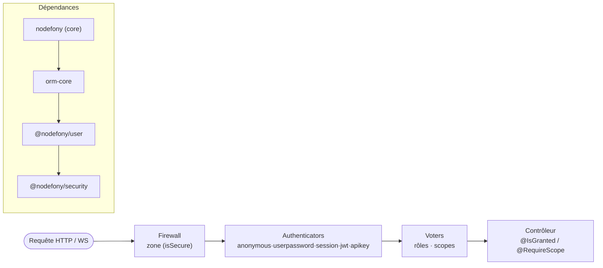

# @nodefony/security — vue du module

> Le pare-feu applicatif de Nodefony : un modèle de sécurité par **zones**, des **authenticators**
> enfichables, des **voters** de droits, et une batterie de briques (JWT, OAuth2, passkeys, 2FA, API
> keys, webhooks, audit, CSRF/CORS/CSP) — le tout partagé entre HTTP et WebSocket, en **Zero Trust**
> par défaut. Cette page est le **point d'entrée** du module : elle récapitule et renvoie aux pages de
> chaque brique. Chaque fait est ancré sur le code.

## Schéma général

## Lexique

| Sigle      | Sens                                                                             |
| ---------- | -------------------------------------------------------------------------------- |
| WAF        | Web Application Firewall : filtre applicatif des requêtes selon des règles.      |
| Zero Trust | « ne rien accorder sans preuve » : aucune requête n'est de confiance par défaut. |
| JWT        | JSON Web Token : jeton signé porté par le client (RFC 7519).                     |
| OAuth 2    | Protocole de délégation d'autorisation (RFC 9700 BCP).                           |
| WebAuthn   | Authentification par passkey/clé (W3C WebAuthn L3).                              |
| TOTP/HOTP  | Codes à usage unique temporels/à compteur — 2FA (RFC 6238 / 4226).               |
| MFA / 2FA  | Authentification à plusieurs / deux facteurs.                                    |
| CSRF       | Cross-Site Request Forgery : requête authentifiée forgée par un site tiers.      |
| CORS       | Cross-Origin Resource Sharing : règles d'appel cross-origine.                    |
| CSP        | Content-Security-Policy : restreint les sources de scripts (anti-XSS).           |
| HSTS       | HTTP Strict Transport Security : force le TLS (RFC 6797).                        |
| RBAC       | Role-Based Access Control : droits selon le rôle.                                |
| Voter      | Composant qui vote « accès accordé/refusé » sur un critère (rôle, scope).        |
| BFF        | Backend-For-Frontend : le serveur gère la session/les jetons pour le front.      |

## Qu'est-ce que c'est — et quelles failles ça couvre

`@nodefony/security` est le **pare-feu applicatif** : il décide, pour chaque requête, si elle passe,
qui est l'utilisateur, et ce qu'il a le droit de faire. Il applique une **défense en profondeur** qui
adresse une large part de l'OWASP Top 10 : contrôle d'accès (A01) via zones + voters, échec
d'authentification (A07) via authenticators + throttling NIST, fraude cross-site (CSRF/CSWSH), en-têtes
de sécurité (CSP/HSTS/COOP…), et journalisation d'audit. Le principe directeur est **Zero Trust** :
sans preuve d'identité valide sur une zone protégée, c'est 401.

## La vision Nodefony

Inspiré du modèle Symfony Security, mais propre au framework : une requête est rattachée à la **zone**
la plus spécifique (`service/firewall.ts:223`), les **authenticators** de la zone sont essayés dans
l'ordre (`first`/`all`, `firewall.ts:918`), et l'autorisation fine passe par des **voters** (rôles,
scopes) et les décorateurs `@IsGranted`/`@RequireScope`. Point clé : **le même firewall protège HTTP
et WebSocket** (un `SessionRealtimeAuthenticator` au handshake + un `frameAuthorizer` par trame,
`firewall.ts:253-331`).

## Les briques du module (→ pages dédiées)

| Brique                      | Rôle                                                            | Page                                      |
| --------------------------- | --------------------------------------------------------------- | ----------------------------------------- |
| Firewall                    | Zones, chaîne de décision Zero Trust, en-têtes de sécurité      | [firewall](./firewall.md)                 |
| Authenticators              | anonymous · userpassword · session · jwt · apikey               | [authenticators](./authenticators.md)     |
| Autorisation (voters/rôles) | RBAC, hiérarchie de rôles, scopes, `@IsGranted`/`@RequireScope` | [authorization](./authorization.md)       |
| CSRF                        | Fetch Metadata + double-submit HMAC                             | [csrf](./csrf.md)                         |
| CORS                        | Preflight, origines, credentials                                | [cors](./cors.md)                         |
| En-têtes de sécurité / CSP  | CSP (nonce), HSTS, COOP/COEP/CORP, Referrer-Policy…             | [security-headers](./security-headers.md) |
| JWT / tokens                | Émission, keystore, rotation, révocation                        | [jwt](./jwt.md)                           |
| OAuth 2                     | Fournisseurs, flux d'autorisation                               | [oauth2](./oauth2.md)                     |
| WebAuthn / passkeys         | Enregistrement + authentification par clé                       | [webauthn](./webauthn.md)                 |
| TOTP / 2FA                  | Second facteur temporel                                         | [totp](./totp.md)                         |
| API keys                    | Clés d'API, scopes, révocation                                  | [api-keys](./api-keys.md)                 |
| Webhooks                    | Signature, dispatcher, retries                                  | [webhooks](./webhooks.md)                 |
| Audit                       | Journal d'événements de sécurité                                | [audit](./audit.md)                       |
| AuthFlow (BFF)              | Login/logout côté serveur, session BFF                          | [authflow](./authflow.md)                 |

## Surface publique

Exports clés (`index.ts`) : services `Firewall`, `AuthFlow`, `TokenService`, `ApiKeyService`,
`Authorization`, `WebAuthnService`, `OAuth2Service`, `AuditService`, `TotpService`, `WebhookService` ;
briques `SecuredArea`, `Csrf`/`CsrfTokenManager`, `Cors`, `SecurityHeaders`, `RoleHierarchyWalker`,
voters `RoleVoter`/`ScopeVoter`, authenticators (`*Authenticator`), stores mémoire
(`MemoryTokenStore`, `MemoryWebAuthnCredentialStore`, `MemoryAuditStore`) + `JwtKeystore`. Les
signatures exactes vivent dans le graphe généré (`jq '.symbols.Firewall' .ai/symbols.json`), jamais
recopiées ici.

## Configuration

Blocs principaux du schéma Zod (`nodefony/config/config.ts`) : `areas` (zones + authenticators),
`cors`, `csrf`, `headers` (HSTS/CSP/COOP/COEP/CORP/Referrer-Policy/Permissions-Policy…),
`loginThrottle` (backoff NIST), + les blocs des briques (`jwt`, `apiKeys`, `totp`, `webhooks`,
`audit`, `passkeys`, `oauth2`). Chaque page de brique détaille son bloc (table dérivée du Zod).

## Normes appliquées

| Domaine                | Normes                                                 |
| ---------------------- | ------------------------------------------------------ |
| Auth / challenge (401) | RFC 7235                                               |
| JWT                    | RFC 7519, 8725 (BCP)                                   |
| OAuth 2                | RFC 9700 (BCP), 8707, 8693, 9449 (DPoP)                |
| Passkeys               | W3C WebAuthn L3, CTAP2                                 |
| TOTP / HOTP            | RFC 6238, 4226                                         |
| Mots de passe / 2FA    | NIST SP 800-63B (throttling, timeouts)                 |
| Cookies                | RFC 6265bis (`SameSite`, `__Host-`)                    |
| CSRF                   | Fetch Metadata (`Sec-Fetch-Site`) + `Origin`/`Referer` |
| En-têtes               | CSP (W3C), HSTS (RFC 6797), COOP/COEP/CORP             |
| Rate limit             | RFC 6585 (429)                                         |
| Général                | OWASP Top 10, OWASP ASVS                               |

## Observabilité — Studio

Le module surface **4 écrans dédiés** (`@nodefony/studio/frontend/src/routes/`) : **Firewall**
(zones, décisions), **ApiKeys**, **Audit** (journal), **Webhooks** (+ pages `Roles`, `Sessions`,
`Login`, `Users`). Data plane admin via `SecurityAdminApi` / `WebhookAdminApi`
(`/nodefony/security/api/*`).

## Tests & couverture

Voir la carte ci-dessous (photo régénérable). Le module est fortement testé (**711 cas sur 62
fichiers**, avec une **red-team par brique** : `*.attack.test.ts` sur csrf, cors, authorization,
webauthn, frameAuthorizer, webhooks/SSRF…) ; `npm run coverage` dans `@nodefony/security` régénère le
rapport. Aucun chiffre n'est figé dans ce Markdown.

## Pièges (symptôme → cause → correction)

| Symptôme                              | Cause                                              | Correction                                                                |
| ------------------------------------- | -------------------------------------------------- | ------------------------------------------------------------------------- |
| `401` partout sur une zone            | Aucune preuve + `anonymous` non listé (Zero Trust) | Ajouter `anonymous` si l'anonymat est voulu                               |
| Une route accessible sans droit       | Zone trop large / motif moins spécifique l'emporte | Affiner le motif de zone (la plus spécifique gagne)                       |
| WS ouvert depuis un site tiers        | Origin non filtrée                                 | Le firewall pose la garde anti-CSWSH — vérifier la config WS              |
| Droit accordé à une machine (clé API) | Voter de scope mal configuré                       | Voir [authorization](./authorization.md) (ScopeVoter)                     |
| Détail d'erreur qui fuit au client    | Message d'auth non uniforme                        | Renvoyer le message uniforme (voir [authenticators](./authenticators.md)) |

## Pour aller plus loin

- Modèle de sécurité transverse → `docs/architecture/modele-securite.md`
- Contrat d'identité → `src/packages/@nodefony/user/docs/`
- Vue d'ensemble du framework → [vue-ensemble](../../docs/architecture/vue-ensemble.md)
