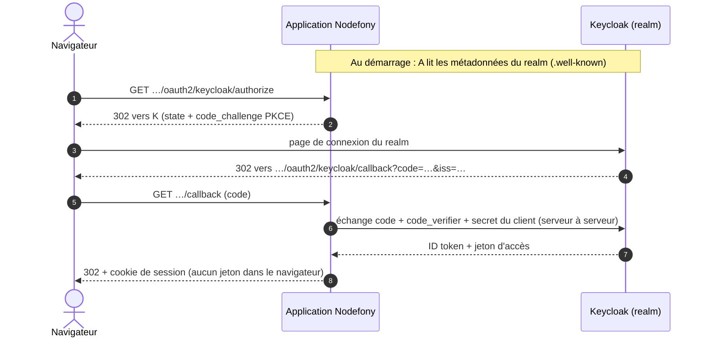

# Keycloak — brancher un annuaire, du realm au premier login

> Ton entreprise tient ses comptes dans un **Keycloak** et tu veux que tes utilisateurs se connectent
> à ton application avec ces comptes, sans que l'application voie jamais un mot de passe. Côté
> Nodefony, il n'y a **aucun code à écrire** : le fournisseur `keycloak` est fourni, et l'adresse
> du realm suffit à le décrire. Le travail se passe surtout dans Keycloak : créer le realm, déclarer
> un client **confidentiel**, enregistrer l'URL de retour au caractère près. Cette page fait le
> chemin entier, puis montre comment le jeton Keycloak de la même personne ouvre aussi ton API, sur
> le **même compte**. Ancré sur le fournisseur `createDiscoveredOidcProvider()` (`oidc.ts:267`) et
> sur `OAuth2Service` (`oauth2.ts:280`).

📍 [Documentation](../../../../../docs/index.md) › [Sécurité](index.md) › **Keycloak**

## 🧠 Schéma général



Le navigateur ne voit passer qu'un `code` à usage unique. Le secret du client et les jetons restent
entre l'application et Keycloak, sur un canal TLS.

## 📖 Lexique

| Terme               | Développé et rôle                                                                                                       |
| ------------------- | ----------------------------------------------------------------------------------------------------------------------- |
| Keycloak            | Serveur d'identité libre, auto-hébergé : il tient les comptes, affiche la page de connexion et délivre les jetons.      |
| Realm               | Espace de comptes isolé dans Keycloak : ses utilisateurs, ses clients, ses clés. Son URL est l'**émetteur**.            |
| Client              | L'application telle que Keycloak la connaît : un identifiant, un secret, des URL de retour autorisées.                  |
| Client confidentiel | Client capable de garder un secret, parce qu'il tourne sur un serveur. Keycloak l'appelle « Client authentication ON ». |
| OIDC                | _OpenID Connect_ : la couche d'identité au-dessus d'OAuth 2.0, qui ajoute l'ID token (qui est l'utilisateur).           |
| Émetteur (`iss`)    | L'identifiant du serveur qui signe les jetons. Pour Keycloak : `https://<hôte>/realms/<realm>`.                         |
| `sub`               | _Subject_ : l'identifiant stable de l'utilisateur **dans son realm**. Unique chez son émetteur, nulle part ailleurs.    |
| PKCE                | _Proof Key for Code Exchange_ (RFC 7636) : rend inutilisable un `code` volé en route.                                   |
| BFF                 | _Backend For Frontend_ : le serveur garde les jetons et ne donne au navigateur qu'un cookie de session.                 |
| Shadow User         | Le compte local que l'application crée au premier login, lié à `(keycloak, sub)`.                                       |
| Audience (`aud`)    | La ressource à laquelle un jeton d'accès est destiné ; ton API refuse un jeton qui ne la nomme pas.                     |

## Qu'est-ce que c'est ?

Keycloak est le **guichet d'accueil d'un immeuble**. Chaque société de l'immeuble (chaque
application) fait confiance au badge qu'il délivre, sans tenir son propre registre de visiteurs. Le
visiteur montre ses papiers une fois, au guichet ; les sociétés ne voient que le badge.

Pour ton application, cela bloque trois risques concrets :

- **Le mot de passe ne transite jamais par l'application** : une faille chez toi ne fait pas fuir
  les identifiants de l'annuaire.
- **Un `code` intercepté ne sert à rien** : sans le `code_verifier` (PKCE) et sans le secret du
  client, Keycloak refuse l'échange.
- **Un départ se gère à un seul endroit** : désactiver le compte dans le realm ferme la porte de
  toutes les applications qui s'y fient, à leur prochaine connexion.

## La vision Nodefony

**Aucun code propre à Keycloak.** Un serveur OpenID Connect publie lui-même ses points d'entrée ;
le fournisseur `keycloak` les **découvre** à partir de l'émetteur, et c'est tout ce qu'il sait faire
(`createDiscoveredOidcProvider()`, `oidc.ts:267`). Changer de realm, c'est changer une URL.

**Une configuration fausse arrête le démarrage.** Le fournisseur `keycloak` est enregistré avec
`requiresIssuer: true` (`oauthProviderRegistry.ts:137`). Au boot, un émetteur absent, ou qui n'est
pas une URL `https` sans requête ni fragment, lève une erreur qui nomme la clé
(`checkProviderIssuer()`, `oauth2.ts:210`). Un Keycloak **éteint**, lui, ne bloque rien : le bouton
disparaît de l'écran de connexion et revient tout seul quand le realm répond à nouveau
(`#isReachable()`, `oauth2.ts:830`).

**L'identité est la paire `(keycloak, sub)`, jamais l'email.** Au premier login, l'application crée
un compte local lié à cette paire (`UserService.provisionOAuthUser()`, `UserService.ts:361`). Un
compte local qui porte déjà le même identifiant sans ce lien n'est **jamais** rattaché en silence :
la connexion est refusée (`UserService.ts:389`).

**Keycloak authentifie, l'application autorise.** Les rôles du realm ne sont pas lus : le compte
reçoit `defaultRoles` à sa création, puis la base locale fait foi. Une élévation se fait dans
l'application, pas dans Keycloak.

## 🚀 Démarrage rapide

### Essayer en deux minutes : le Keycloak du dépôt

Le dépôt fournit un Keycloak 26.8 **déjà configuré** : un realm `nodefony`, un client confidentiel
`nodefony-dev`, ses deux rôles client `admin` et `admin-nodefony`, et trois utilisateurs. Tout est
écrit dans `docker/keycloak/import/realm-nodefony.json`, importé au premier démarrage du conteneur.

| Utilisateur | Mot de passe | Rôles Keycloak (client `nodefony-dev`) | Rôles obtenus dans l'application     |
| ----------- | ------------ | -------------------------------------- | ------------------------------------ |
| `alice`     | `alice-dev`  | aucun                                  | `ROLE_USER`                          |
| `bob`       | `bob-dev`    | `admin`                                | `ROLE_USER`, `ROLE_ADMIN`            |
| `cci`       | `cci-dev`    | `admin`, `admin-nodefony`              | + `ROLE_NODEFONY_ADMIN` (plateforme) |

`cci` doit configurer un **code à usage unique** (TOTP) à sa première connexion
(`"requiredActions": ["CONFIGURE_TOTP"]`) : le compte porte le rôle de plateforme, il exige un second
facteur, et aucune graine n'est écrite dans le fichier.

1. **Démarrer le conteneur** (en `https` sur le port 8444, avec le certificat de l'application) :

   ```bash
   docker compose -f docker/docker-compose.yml --profile keycloak up -d keycloak
   ```

2. **Brancher l'application** : poser dans `.env` (ignoré par git) les trois lignes
   ci-dessous — valeurs publiques, écrites dans le realm importé.

   ```bash
   NF_KEYCLOAK_ISSUER=https://localhost:8444/realms/nodefony
   NF_KEYCLOAK_CLIENT_ID=nodefony-dev
   NF_KEYCLOAK_CLIENT_SECRET=nodefony-dev-keycloak-secret
   ```

   Ces valeurs sont **publiques** : elles n'existent que dans ce décor de développement.

3. **Démarrer l'application**, ouvrir `https://localhost:5152/nodefony/login` : le bouton
   **Keycloak** est là. Se connecter avec `alice` / `alice-dev`.

La console d'administration du realm est sur `https://localhost:8444/admin` (`admin` /
`nodefony-dev`). Les retouches qu'on y fait survivent aux redémarrages ;
`docker compose … down -v` repart du fichier.

### Essayer dans une application générée

Une application créée par `nodefony create app` avec le préréglage `complete` porte déjà le
même décor, **à son nom** : un profil `keycloak` dans son `compose.yaml`, les variables
`NF_KEYCLOAK_*` déclarées dans `env.ts` et le fournisseur conditionnel dans
`nodefony/config/security.ts`. Tant qu'on ne l'allume pas, l'application démarre sans bouton ni
avertissement.

Le realm `docker/keycloak/import/realm.json` (realm et client nommés comme l'application,
utilisateur `alice`) et le thème `docker/keycloak/themes/nodefony/` ne viennent PAS du
générateur : ils sont **livrés par ce paquet** (`nodefony/keycloak/scaffold.ts`, appelé par le point
de contribution `nodefony/scaffold/contribute.ts` déclaré dans
`package.json` sous `nodefony.contribute`), et posés après l'installation. Ce sont de vrais
fichiers, versionnés avec l'application : le thème se retouche à ses couleurs. Ils manquent (création
en `--no-install`, ou fichier supprimé pour reprendre la version du paquet après un `npm update`) :

```bash
npx nodefony scaffold:sync     # pose ce qui manque, ne remplace jamais un fichier présent
```

Le thème couvre les **cinq types** de Keycloak, chacun hérité du thème de Keycloak qu'il habille
(seuls le logo, les couleurs et quelques textes sont posés — les pages restent celles de
Keycloak, donc justes à chaque mise à jour) :

| Type      | Ce qu'il habille                                   | Hérite de     | Choisi par                                           |
| --------- | -------------------------------------------------- | ------------- | ---------------------------------------------------- |
| `login`   | connexion, mot de passe oublié, erreurs            | `keycloak.v2` | le realm (`loginTheme`)                              |
| `account` | console du compte de l'utilisateur                 | `keycloak.v3` | le realm (`accountTheme`)                            |
| `admin`   | console d'administration                           | `keycloak.v2` | le realm (`adminTheme`)                              |
| `email`   | enveloppe HTML de tous les courriels               | `keycloak`    | le realm (`emailTheme`)                              |
| `welcome` | page d'accueil du serveur (avant le premier admin) | `keycloak`    | le SERVEUR : `KC_SPI_THEME__WELCOME_THEME: nodefony` |

**L'habillage de la page `/login` suit jusqu'à Keycloak.** Chaque habillage de
`loginPage.skin` a son thème de connexion Keycloak : `nodefony` pour `frontispiece` (le défaut),
`nodefony-<habillage>` pour les huit autres (`nodefony-blueprint`, `nodefony-horizon`…). Ce sont
des thèmes ENFANTS de `nodefony` : même gabarit, mêmes textes, plus la feuille de l'habillage (copie
conforme de celle du framework) et sa mise en page. Toutes les pages du parcours en héritent —
connexion, code à usage unique, configuration du second facteur, mot de passe oublié. Le compose
monte le dossier `docker/keycloak/themes/` ENTIER, pour que Keycloak les voie tous ; la console les
propose aussi dans _Realm settings › Themes_. Limite : seule l'enveloppe de la page est à Nodefony,
les formulaires restent ceux de Keycloak — `ledger` (colonnes et étapes numérotées) et `horizon`
(bandeau photo dans la carte) n'y portent que leurs couleurs et leur mise en page.

Le compose pose aussi `KC_SPI_THEME__DEFAULT: nodefony` : le realm `master`, que l'import ne touche
pas, prend le même thème — sa connexion et sa console d'administration comprises. Clair et sombre
suivent le réglage du système (`prefers-color-scheme`) ; le réglage _Dark mode_ du realm le coupe.
Le realm `master` n'est **pas importé** (Keycloak le crée au premier démarrage, l'import ne le touche
pas) : il naît sans internationalisation, donc en anglais et sans sélecteur de langue. Le régler une
fois dans sa console — _Realm settings › Localization_ : internationalisation activée, `fr` et `en`,
`fr` par défaut. Le réglage vit dans le volume `keycloak-data` : il survit aux redémarrages, pas à
un `down -v`. Sur sa page de connexion, le bouton « Retour à … » n'apparaît pas : il annule la
connexion, et les consoles de Keycloak lui-même ne savent pas traiter cette annulation.

Les comptes du realm généré reçoivent le rôle `default-roles-<realm>` : un compte importé n'a QUE
les rôles qu'on lui liste, et sans celui-là la console du compte lui refuse son propre profil
(`401`).

Le realm généré ne déclare **aucun serveur d'envoi** de courriels : « mot de passe oublié » reste
coupé tant que l'application n'en branche pas un (console : _Realm settings › Email_). Le dépôt,
lui, en a un de test — Mailpit (`--profile keycloak`, interface `http://localhost:8025`).

1. **Fabriquer le certificat de développement** (une fois — Keycloak le sert en `https`) :

   ```bash
   npx nodefony http:certificates
   ```

2. **Démarrer le conteneur** :

   ```bash
   docker compose --profile keycloak up -d keycloak
   ```

   Sous Linux natif, poser d'abord `export KEYCLOAK_UID=$(id -u)` : sinon la clé privée montée
   est illisible par le conteneur.

3. **Brancher l'application** : décommenter les trois lignes `NF_KEYCLOAK_*` de `.env`. Les trois
   valeurs y sont déjà, alignées sur le realm généré.

4. **Démarrer l'application en lui faisant confiance au certificat de Keycloak**, puis ouvrir
   `https://localhost:5152/nodefony/login` et se connecter avec `alice` / `alice-dev` :

   ```bash
   NODE_EXTRA_CA_CERTS=nodefony/config/certificates/ca/nodefony-root-ca.crt.pem npm run dev
   ```

   Sans `NODE_EXTRA_CA_CERTS`, l'application ne joint pas Keycloak : un WARNING
   `oauth2 provider "keycloak" indisponible` au démarrage, et pas de bouton. Sous Windows, la
   syntaxe `VAR=… commande` n'existe pas : poser la variable dans le shell avant
   (`$env:NODE_EXTRA_CA_CERTS = "…"` en PowerShell, `set NODE_EXTRA_CA_CERTS=…` en `cmd`).

Le realm généré porte aussi, comme celui du dépôt, un client **machine** `<app>-machine` (compte de
service, `client_credentials`). Il ne porte **aucune audience** : l'application née n'a pas de zone
qui accepte les jetons du realm. Quand tu en ouvres une (section « Le jeton Keycloak sur ton API »,
plus bas), `npx nodefony security:keycloak:realm --write` ajoute le mapper qui inscrit sa `resource`
dans les jetons.

Le port de Keycloak (8444) se change par `KEYCLOAK_PORT` au `up` — l'émetteur suit, donc
`NF_KEYCLOAK_ISSUER` aussi. En production, le décor ne sert plus : les trois variables pointent
ton Keycloak, et `NF_OAUTH_REDIRECT_BASE` porte l'URL publique de l'application, base de l'URL de
retour.

### Le realm écrit depuis ta configuration

Les sections 1 et 2 ci-dessous déroulent les réglages à la main. Une fois le fournisseur branché
(section 4), Nodefony sait les écrire lui-même : **`nodefony security:keycloak:realm`** dérive le
realm de la configuration EFFECTIVE de l'application — client, URL de retour, déconnexion par canal
arrière, audience de chaque zone, rôles de `roleMapping`.

```bash
npx nodefony security:keycloak:realm             # affiche le realm
npx nodefony security:keycloak:realm --write     # l'écrit dans docker/keycloak/import/
npx nodefony security:keycloak:realm --check     # sort en 1 s'il ne suit plus la config (CI)
```

- **Il fusionne, il n'écrase pas.** Ce que la configuration dit est réécrit ; ce qu'un humain a
  ajouté survit : comptes, titres, secret du client machine, rôles déjà déclarés, mappers qui ne sont
  pas d'audience, autres clients (`mergeKeycloakRealm`, `nodefony/keycloak/keycloakRealm.ts`).
- **Hors développement, aucun secret n'est écrit** et seules les adresses de `redirectUri` sont
  déclarées : Keycloak génère le secret, tu le copies dans ton gestionnaire.
- **Le thème de connexion suit `loginPage.skin`** (`loginTheme`, `keycloakLoginTheme`,
  `nodefony/keycloak/keycloakRealmInput.ts`) — mais seulement sur un realm déjà habillé par
  Nodefony : un thème propre à l'application n'est jamais remplacé, et l'habillage non appliqué
  s'annonce en avertissement.
- **Keycloak n'importe un realm qu'à sa création.** Un thème se change sur un realm déjà là dans
  **Realm settings** › **Themes** › _Login theme_. Un realm déjà là se met à jour par
  **Realm settings** › **Action** › **Partial import**, clients en « Overwrite » : comptes et seconds
  facteurs restent.

Le client machine suivi est celui qu'on nomme (`--machine <clientId>`), sinon le compte de service
que le fichier déclare déjà. Le canal arrière vise `http://host.docker.internal:<port>` en
développement (Keycloak vit dans un conteneur) ; `--backchannel-origin` le déplace.

### 1. Créer le realm

Dans la console d'administration de **ton** Keycloak :

1. **Create realm** (à côté de _Current realm_), donner un nom — par exemple `mon-entreprise`.
2. Le realm créé devient le realm courant. Ses utilisateurs s'y créent sous **Users**, ou s'y
   importent depuis un annuaire LDAP (**User federation**).

Ne pas travailler dans le realm `master` : il administre Keycloak lui-même.

### 2. Déclarer le client confidentiel

**Clients** › **Create client**, type **OpenID Connect**. Les réglages qui comptent :

| Réglage Keycloak                        | Valeur                                                                             | Pourquoi                                                                                                   |
| --------------------------------------- | ---------------------------------------------------------------------------------- | ---------------------------------------------------------------------------------------------------------- |
| **Client ID**                           | `mon-app`                                                                          | Devient `NF_KEYCLOAK_CLIENT_ID`.                                                                           |
| **Client authentication**               | **ON**                                                                             | Client **confidentiel** : l'application tourne sur un serveur, elle garde un secret. Nodefony en exige un. |
| **Standard flow**                       | coché                                                                              | C'est le flux _Authorization Code_, le seul que Nodefony emploie.                                          |
| **Direct access grants**                | décoché                                                                            | Ce flux fait transiter le mot de passe par l'application — exactement ce qu'on évite.                      |
| **Implicit flow**                       | décoché                                                                            | Retiré par OAuth 2.1 : il livre le jeton dans l'URL.                                                       |
| **PKCE method**                         | `S256`                                                                             | Keycloak **exige** alors PKCE pour ce client ; Nodefony l'envoie toujours.                                 |
| **Valid redirect URIs**                 | `https://app.example.com/nodefony/security/api/oauth2/keycloak/callback`           | Comparée **au caractère près** (RFC 9700). Pas de joker en production.                                     |
| **Valid post logout redirect URIs**     | `https://app.example.com/*`                                                        | Retour du navigateur après la déconnexion initiée par l'application.                                       |
| **Front channel logout**                | **OFF**                                                                            | Il exige une page que l'application n'a pas ; activé, Keycloak n'appelle PAS le canal arrière.             |
| **Backchannel logout URL**              | `https://app.example.com/nodefony/security/api/oauth2/keycloak/backchannel-logout` | Keycloak y prévient l'application quand la session SSO se ferme ailleurs. Joignable **par Keycloak**.      |
| **Backchannel logout session required** | **ON**                                                                             | Le jeton porte le `sid` : seule LA session concernée est fermée, pas toutes celles du compte.              |

Puis l'onglet **Credentials** : copier le **Client secret**. C'est `NF_KEYCLOAK_CLIENT_SECRET`.

> [!WARNING]
> L'URL de retour enregistrée chez Keycloak et celle que l'application envoie doivent être
> **identiques** : schéma, hôte, port, chemin. `localhost` et `127.0.0.1` sont deux hôtes
> différents. Une différence d'un caractère donne `Invalid parameter: redirect_uri` sur la page
> Keycloak, avant même le formulaire de connexion.

### 3. Lire l'émetteur

**Realm settings** › onglet **General** › lien **OpenID Endpoint Configuration**. Le document qui
s'ouvre commence par la valeur à recopier :

```json
{ "issuer": "https://sso.example.com/realms/mon-entreprise", "…": "…" }
```

C'est `NF_KEYCLOAK_ISSUER`, sans barre finale ni `/.well-known/…`. Elle doit être en `https`.

Keycloak calcule cette valeur à partir de son nom d'hôte. Derrière un proxy, ou quand le navigateur
et l'application ne joignent pas Keycloak par la même adresse, fixer `KC_HOSTNAME` à l'URL publique
complète : sinon l'émetteur change selon qui demande, et l'application refuse les jetons.

### 4. Brancher l'application

Les trois valeurs entrent par `env.ts`, seul lecteur des variables d'environnement. Le fournisseur
n'est déclaré que si les trois sont présentes : pas de bouton mort quand une variable manque.

```typescript
// env.ts — SEUL lecteur de process.env (catalogue typé, validé au boot).
// nodefony.config.ts — `ctx.env` EST ce catalogue (typé par le paramètre générique).
import { defineConfig, defineEnv, envString, use } from "nodefony";

export const env = defineEnv({
  // Émetteur = URL du realm, en https (la découverte et le contrôle de `iss` en partent).
  NF_KEYCLOAK_ISSUER: envString({ optional: true }),
  NF_KEYCLOAK_CLIENT_ID: envString({ optional: true }),
  NF_KEYCLOAK_CLIENT_SECRET: envString({ optional: true }),
  // Base des URL de retour : celle que Keycloak a enregistrée, au caractère près.
  NF_OAUTH_REDIRECT_BASE: envString({ default: "https://localhost:5152" }),
});

export default defineConfig<typeof env>((ctx) => ({
  modules: [
    "@nodefony/http",
    "@nodefony/framework",
    use("@nodefony/security", {
      oauth2: {
        // Rôles posés à la CRÉATION du compte local ; ceux du realm ne sont pas lus.
        defaultRoles: ["ROLE_USER"],
        providers: {
          ...(ctx.env.NF_KEYCLOAK_ISSUER &&
          ctx.env.NF_KEYCLOAK_CLIENT_ID &&
          ctx.env.NF_KEYCLOAK_CLIENT_SECRET
            ? {
                keycloak: {
                  issuer: ctx.env.NF_KEYCLOAK_ISSUER,
                  clientId: ctx.env.NF_KEYCLOAK_CLIENT_ID,
                  clientSecret: ctx.env.NF_KEYCLOAK_CLIENT_SECRET,
                  redirectUri: `${ctx.env.NF_OAUTH_REDIRECT_BASE}/nodefony/security/api/oauth2/keycloak/callback`,
                  // Libellé du bouton ; omis, il vaut « Keycloak ».
                  label: "Compte entreprise",
                },
              }
            : {}),
        },
      },
    }),
  ],
}));
```

L'application doit faire **confiance au certificat** de Keycloak, puisqu'elle l'appelle en `https`.
Un certificat d'une autorité publique ne demande rien. Un certificat interne ou de développement
s'ajoute par `NODE_EXTRA_CA_CERTS` au démarrage du processus.

### 5. Le premier login — ce qu'on observe

```bash
# Le bouton est offert à l'écran de connexion :
curl -s https://localhost:5152/nodefony/security/api/oauth2/providers
# {"providers":[{"name":"keycloak","label":"Compte entreprise"}]}
```

Au clic, l'utilisateur passe par la page de connexion du realm, puis revient connecté. Côté
application :

- un **compte local** est créé, identifiant = l'email du realm (ou `keycloak:<sub>` sans email),
  rôles = `defaultRoles`, sans mot de passe local ;
- ce compte porte le lien `(keycloak, sub)` : les connexions suivantes le retrouvent par ce lien,
  même si l'email change dans le realm ;
- la session est une **session BFF** ordinaire, la même qu'après un mot de passe.

Les écrans **Utilisateurs** et **Sessions** de Studio montrent le compte et sa session.

## ⚙️ Configuration

Les clés de `security.oauth2.providers.keycloak` — le schéma complet vit sur la page
[OAuth2](oauth2.md).

| Clé                  | Requise | Effet                                                                                                                                                     |
| -------------------- | :-----: | --------------------------------------------------------------------------------------------------------------------------------------------------------- |
| `issuer`             |   ✅    | URL `https` du realm. Absente ou mal formée : le démarrage est refusé.                                                                                    |
| `clientId`           |   ✅    | **Client ID** du client Keycloak.                                                                                                                         |
| `clientSecret`       |   ✅    | **Client secret** de l'onglet _Credentials_. Jamais journalisé.                                                                                           |
| `redirectUri`        |   ✅    | URL de retour, identique à l'une des **Valid redirect URIs** du client.                                                                                   |
| `clientAuthMethod`   |         | `client_secret_basic` par défaut ; `client_secret_post` si le client Keycloak l'exige.                                                                    |
| `scopes`             |         | Vide = `openid`, `profile`, `email`.                                                                                                                      |
| `defaultRoles`       |         | Rôles du compte à sa création, pour CE fournisseur (sinon la valeur globale `oauth2.defaultRoles`).                                                       |
| `roleMapping`        |         | Rôles Keycloak → rôles de l'application, recalculés à chaque connexion et à chaque jeton. Voir [Rôles](#-rôles--gérer-les-droits-dans-keycloak).          |
| `rolesSource`        |         | Où lire les rôles : `client` (défaut), `realm`, `groups`. Sans `roleMapping`, sans effet.                                                                 |
| `allowPlatformRoles` |         | `true` autorise `roleMapping` à donner un `ROLE_NODEFONY_*`. Omis : démarrage refusé.                                                                     |
| `audiences`          |         | Ressources pour lesquelles ce realm émet des jetons à l'application. Lue par `security:keycloak:realm` seulement. Omis : toutes les zones `external-jwt`. |
| `label`              |         | Libellé du bouton. Omis : « Keycloak ».                                                                                                                   |
| `hidden`             |         | Retire le bouton sans fermer le flux (lien direct, sous-domaine dédié).                                                                                   |

## 🎭 Rôles — gérer les droits dans Keycloak

**L'idée.** Sans réglage, Keycloak dit seulement à l'application **qui** se connecte. Les droits
(`ROLE_ADMIN`…) sont posés à la création du compte, puis gérés dans l'application, à la main.
Une entreprise qui a Keycloak veut souvent l'inverse : promouvoir quelqu'un **une fois**, dans
Keycloak, et que l'application suive. C'est le rôle de la table `roleMapping` — un **dictionnaire
de traduction** : « quand Keycloak dit `admin`, chez moi ça s'appelle `ROLE_ADMIN` ».

**Côté Keycloak**, deux gestes dans la console du realm :

1. **Clients** › ton client › **Roles** › _Create role_ : `admin`. Le rôle appartient au client,
   c'est-à-dire à TON application — pas à tout le realm.
2. **Users** › l'utilisateur › **Role mapping** › _Assign role_ › filtre _client roles_ › `admin`.

Dans un realm importé, c'est le bloc `roles.client` et la clé `clientRoles` de l'utilisateur :

```json
"roles": { "client": { "mon-app": [{ "name": "admin" }] } },
"users": [{ "username": "bob", "clientRoles": { "mon-app": ["admin"] } }]
```

**Côté Nodefony**, la table sur le fournisseur :

```typescript ignore
keycloak: {
  issuer: ctx.env.NF_KEYCLOAK_ISSUER,
  clientId: ctx.env.NF_KEYCLOAK_CLIENT_ID,
  clientSecret: ctx.env.NF_KEYCLOAK_CLIENT_SECRET,
  redirectUri: "https://app.example.com/nodefony/security/api/oauth2/keycloak/callback",
  roleMapping: { admin: "ROLE_ADMIN" },
},
```

**Ce qui se passe à la connexion de bob** :

1. Keycloak rend un jeton d'accès qui porte `"resource_access": { "mon-app": { "roles": ["admin"] } }`
   — c'est là, et seulement là par défaut, que Keycloak met les rôles (ni dans l'ID token, ni
   dans _userinfo_).
2. `mapProviderRoles()` (`providerRoles.ts:87`) traduit `admin` → `ROLE_ADMIN` par la table.
3. Le compte de bob reçoit `ROLE_ADMIN` (`reconcileProviderRoles()`, `user/nodefony/src/providerRoles.ts:112` côté
   `@nodefony/user`).

**Les règles, à connaître avant de l'activer :**

- **Recalcul à chaque connexion ET à chaque jeton d'API.** Un rôle retiré dans Keycloak disparaît
  au login suivant, et dès le jeton suivant sur l'API (`syncOAuthRoles()`, `UserService.ts:453`).
  Une session déjà ouverte garde ses droits jusqu'à la reconnexion.
- **Un rôle Keycloak absent de la table est ignoré**, jamais recopié tel quel : l'annuaire ne
  fabrique pas de droit que l'application n'a pas déclaré.
- **Les rôles donnés à la main survivent.** L'application retient, dans les métadonnées du compte
  (`metadata.providerRoles.keycloak`), ce que Keycloak a accordé : elle ne retire que cela. Seule
  ambiguïté : un rôle à la fois donné à la main ET accordé par Keycloak devient « géré » — le
  retirer dans Keycloak le retire aussi.
- **Aucune écriture en base si rien ne change** : le recalcul tombe sur chaque requête porteuse
  de jeton, il ne coûte une écriture que lorsqu'un rôle bouge.
- **Rôles du realm ou groupes** : `rolesSource: ["realm"]` lit `realm_access.roles`,
  `["groups"]` le claim `groups` (à poser chez Keycloak par un mapper _Group Membership_).
  Plusieurs sources se cumulent.
- **Rôles de plateforme (`ROLE_NODEFONY_*`) refusés par défaut.** Ils ouvrent la console
  d'administration, la génération de code, les secrets : les faire venir de Keycloak fait de
  l'administrateur du realm un administrateur de l'instance. La table qui en contient un refuse
  le démarrage (`config.ts:1181`) — sauf `allowPlatformRoles: true` ÉCRIT sur le fournisseur, que
  chaque démarrage rappelle par un avertissement. Sinon, ce rôle se donne à la main
  (`security:user:add --admin`, console d'administration).

## 🧩 Le jeton Keycloak sur ton API — le même compte

Une fois les humains connectés par le navigateur, un script ou un service veut souvent appeler l'API
avec un **jeton d'accès** du même realm. La page [Jetons d'un émetteur tiers](external-jwt.md)
décrit cette brique en entier ; voici ce que Keycloak y ajoute.

**Côté Keycloak**, le jeton doit nommer ton API dans son audience (`aud`) — par défaut il porte
`account`, que toute zone refuse. `nodefony security:keycloak:realm --write` écrit le mapper pour
chaque ressource listée dans `audiences` du fournisseur, sinon pour la `resource` de chaque zone
`external-jwt`. À la main : dans le client, **Client scopes** › le scope dédié › **Add mapper** ›
_Audience_, avec **Included Custom Audience** = la `resource` de la zone et **Add to access token**
coché.

> [!TIP]
> Écris `audiences` dès qu'une zone `external-jwt` ne doit PAS recevoir les jetons de ce realm (une
> API d'un autre domaine de confiance, une zone de test) : sans la liste, la commande déduit
> l'audience de toutes les zones, et Keycloak imprimerait aussi l'adresse de celle-là.

**Côté Nodefony**, déclarer le realm comme émetteur de confiance et ouvrir une zone qui accepte ses
jetons :

```typescript ignore
use("@nodefony/security", {
  resourceServer: {
    issuers: [
      // Les clés publiques du realm sont découvertes par l'émetteur.
      {
        issuer: "https://sso.example.com/realms/mon-entreprise",
        algorithms: ["RS256"],
      },
    ],
  },
  areas: {
    api: {
      pattern: "^/api",
      authenticators: ["external-jwt"],
      stateless: true,
      // L'audience exigée : celle que le mapper inscrit dans le jeton.
      resource: "https://api.example.com",
    },
  },
});
```

**Le même compte, pas un second.** Quand l'émetteur d'un jeton est celui d'un fournisseur de
connexion déclaré (`oauth2.providers.keycloak.issuer`), l'authenticator cherche d'abord le compte lié
à `(keycloak, sub)` — celui que le login par navigateur a créé (`ExternalJwtAuthenticator.ts:364`).
Sans ce lien, le jeton désignerait un compte distinct, sous l'identifiant `<émetteur>#<sub>`.

## 🔐 Sécurité

- **`https` partout, même en développement.** L'ID token est lu sans vérifier sa signature, ce
  qu'OIDC Core §3.1.3.7 n'admet que parce qu'il arrive du point de jeton par TLS. Un émetteur en
  `http` est refusé au démarrage (`canonicalIssuer()`, `authorizationServer.ts:76`).
- **Client confidentiel obligatoire** : le schéma exige un secret non vide. Un client public ne
  conviendrait qu'à une application sans serveur, ce que n'est pas une application Nodefony.
- **Anti-mix-up** : le paramètre `iss` du retour et le claim `iss` de l'ID token doivent égaler
  l'émetteur découvert (RFC 9207). Un retour venu d'un autre realm est rejeté.
- **Rôles de plateforme hors de portée de l'annuaire**, sauf ouverture écrite
  (`allowPlatformRoles`) : un realm compromis ne donne pas, par défaut, la console
  d'administration. Un rôle Keycloak absent de `roleMapping` ne donne rien.
- **Aucune liaison par email** : un email, même vérifié par le realm, ne donne jamais accès à un
  compte local existant. Le rattachement d'un compte local à un `sub` Keycloak se fait
  explicitement.
- **Déconnexion, dans les deux sens.** Se déconnecter de l'application ferme aussi la session du
  realm : la réponse porte `logoutUrl`, où le navigateur est envoyé avec l'ID token en
  `id_token_hint` — sans page de confirmation, et le clic suivant redemande le mot de passe. À
  l'inverse, une session fermée **chez Keycloak** (console d'administration, autre application du
  SSO) ferme la session de l'application par le **canal arrière** : Keycloak appelle
  `…/oauth2/keycloak/backchannel-logout` avec un jeton signé, que l'application vérifie sur les clés
  du realm avant de détruire quoi que ce soit (détail : [OAuth2 § canal arrière](oauth2.md#déconnexion-demandée-par-le-fournisseur--le-canal-arrière)).

## ⚠️ Pièges

Avant de lire le tableau, **demander le diagnostic** : il éprouve le branchement sans qu'un humain
se connecte, et nomme la cause là où le journal ne montre qu'un `401`.

```bash
npx nodefony security:oauth:doctor               # tous les fournisseurs configurés
npx nodefony security:oauth:doctor -p keycloak   # un seul ; --json pour un script
```

Trois sondes, chacune avec son verdict : **découverte** (émetteur annoncé ≠ émetteur configuré,
RFC 8414 §3.3), **URL de retour** (la requête du bouton, non suivie : Keycloak refuse en 400 une
URL qu'il ne connaît pas), **secret** (un code inventé présenté avec le vrai secret :
`invalid_grant` = secret accepté). Sortie en 1 si une sonde échoue. `nodefony doctor --live` rend
les mêmes échecs (famille « Fournisseurs OAuth »), l'administration les sert sur
`/nodefony/security/api/oauth/diagnosis`. Côté Keycloak, la sonde ouvre une session de connexion
vide, qui expire seule.

| Symptôme                                                                                                                           | Cause                                                                                                                   | Correction                                                                                                                        |
| ---------------------------------------------------------------------------------------------------------------------------------- | ----------------------------------------------------------------------------------------------------------------------- | --------------------------------------------------------------------------------------------------------------------------------- |
| Démarrage refusé : `security.oauth2.providers.keycloak.issuer est requis`                                                          | Les trois variables ne sont pas posées ensemble, ou `issuer` manque à la main                                           | Poser `NF_KEYCLOAK_ISSUER` (`checkProviderIssuer()`, `oauth2.ts:210`)                                                             |
| Démarrage refusé : `émetteur invalide … https`                                                                                     | Émetteur en `http`, ou avec `?…`/`#…`                                                                                   | Recopier l'`issuer` du document _OpenID Endpoint Configuration_                                                                   |
| Pas de bouton + WARNING `oauth2 provider "keycloak" indisponible`                                                                  | Keycloak injoignable, ou certificat non reconnu (`fetch failed`)                                                        | Démarrer Keycloak ; `NODE_EXTRA_CA_CERTS` pour un certificat interne. Retour sous 30 s                                            |
| `Invalid parameter: redirect_uri` sur la page Keycloak                                                                             | `redirectUri` ≠ les **Valid redirect URIs** du client                                                                   | Aligner schéma, hôte (`localhost` ≠ `127.0.0.1`), port et chemin                                                                  |
| Retour sur `failureRedirect` + WARNING `unauthorized_client` (secret faux) ou `invalid_client` (client inconnu)                    | Mauvais secret, client absent du realm, ou client public (_Client authentication OFF_)                                  | Recopier le secret de l'onglet _Credentials_ ; passer le client en ON                                                             |
| Retour sur `failureRedirect` + WARNING `OAuth issuer mismatch`                                                                     | Keycloak joint par deux adresses différentes : l'émetteur varie                                                         | Fixer `KC_HOSTNAME` à l'URL publique complète                                                                                     |
| Retour sur `failureRedirect` + WARNING `local account exists without a keycloak link`                                              | Un compte local porte déjà cet identifiant (`UserService.ts:389`) — typiquement un `sub` changé après réimport du realm | Rattacher le compte explicitement, ou fixer l'`id` des utilisateurs dans l'export du realm                                        |
| API : `401` avec un jeton Keycloak valide                                                                                          | Audience absente du jeton : pas de mapper _Audience_                                                                    | `security:keycloak:realm --write` puis import partiel ; `aud` doit contenir la `resource` de la zone                              |
| Session de l'application vivante après une déconnexion chez Keycloak ; Keycloak journalise `Some clients have not been logged out` | _Front channel logout_ ON, ou **Backchannel logout URL** absente ou injoignable depuis Keycloak                         | _Front channel logout_ OFF ; une URL que Keycloak joint (en développement Linux : serveur à l'écoute au-delà de la boucle locale) |

| Démarrage refusé : `… est un rôle de PLATEFORME` | `roleMapping` traduit vers un `ROLE_NODEFONY_*` | Donner ce rôle à la main, ou écrire `allowPlatformRoles: true` en connaissance de cause |
| Le rôle Keycloak n'apparaît pas dans l'application | Rôle du REALM alors que la source est `client`, ou rôle d'un autre client, ou session ouverte avant le changement | Créer le rôle sur le client de l'application, ou `rolesSource: ["realm"]` ; se reconnecter |

La cause d'un retour sur `failureRedirect` n'est jamais montrée au navigateur ; elle est dans le
journal du serveur, préfixée `oauth2 callback "keycloak"` (`OAuth2Controller.ts:213`).

## 🧪 Tests & couverture

| Type        | Fichier                                                   | Ce qu'il prouve                                                                                                                                                                                                                                                                                                                                                                                                                                                                                                         |
| ----------- | --------------------------------------------------------- | ----------------------------------------------------------------------------------------------------------------------------------------------------------------------------------------------------------------------------------------------------------------------------------------------------------------------------------------------------------------------------------------------------------------------------------------------------------------------------------------------------------------------- |
| Unitaire    | `security/tests/unit/oauth2Service.test.ts`               | Démarrage refusé sur émetteur absent ou mal formé ; bouton retiré puis rendu quand l'émetteur tombe.                                                                                                                                                                                                                                                                                                                                                                                                                    |
| Unitaire    | `security/tests/unit/oauthProviders.test.ts`              | Découverte, refus d'un serveur sans PKCE S256, contrôle des claims de l'ID token.                                                                                                                                                                                                                                                                                                                                                                                                                                       |
| Unitaire    | `security/tests/unit/providerRoles.test.ts`               | Lecture des claims (client, realm, groupes), rôle inconnu ignoré, refus des rôles de plateforme sauf `allowPlatformRoles`, recalcul à la connexion et au jeton, aucune écriture sans changement.                                                                                                                                                                                                                                                                                                                        |
| Unitaire    | `security/tests/unit/keycloakRealmInput.test.ts`          | La configuration de l'application de dev, dérivée puis fusionnée, rend `realm-nodefony.json` octet pour octet ; audiences déduites ou écrites, production sans secret, rôles rangés selon `rolesSource`.                                                                                                                                                                                                                                                                                                                |
| Unitaire    | `security/tests/unit/providerDiagnosis.test.ts`           | Diagnostic : trois verdicts distincts (émetteur, URL de retour, secret) ; un `401` n'accuse le secret que si le client est prouvé connu ; non concluant ≠ échec ; sondes passées par le client du login.                                                                                                                                                                                                                                                                                                                |
| Unitaire    | `security/tests/unit/keycloakRealm.test.ts`               | Fusion : ce que la config dit est réécrit, ce qu'un humain a écrit survit ; mapper d'audience remplacé, jamais doublé.                                                                                                                                                                                                                                                                                                                                                                                                  |
| Unitaire    | `user/tests/unit/providerRoles.test.ts`                   | Rôles gérés contre rôles locaux : retrait, ajout, rôle à la main conservé, profil préservé.                                                                                                                                                                                                                                                                                                                                                                                                                             |
| Intégration | `http/nodefony/tests/integration/oauth2-keycloak.test.ts` | Contre un **vrai** Keycloak : flux complet, même compte entre session et jeton d'API, `invalid_grant` rendu par Keycloak, déconnexion dans les deux sens, jeton de déconnexion forgé refusé ; `bob` obtient puis perd `ROLE_ADMIN` (session et jeton) quand le rôle bouge dans le realm, un rôle local survit ; `cci` obtient `ROLE_NODEFONY_ADMIN` par `allowPlatformRoles` ; le diagnostic rend ses trois verdicts sur des branchements faussés (secret, URL de retour, émetteur `127.0.0.1` au lieu de `localhost`). |

Le banc d'intégration exige le conteneur et les trois variables (décor `KEYCLOAK_GATE` de
`scripts/test/vitest/gates.ts`) ; sans eux il est sauté, et la passe le dit en fin de run. Le cas du canal
arrière constate en plus que le conteneur JOINT l'application (`host.docker.internal`) : un serveur
de développement sous Linux n'écoute que la boucle locale, le cas est alors sauté et le dit.

**Ce qui manque** : aucun test ne joue un Keycloak derrière un proxy (émetteur variable), ni une
rotation des clés du realm pendant une session.

## 🔗 Pour aller plus loin

- ⬆️ **Retour au hub** : [Sécurité — vue d'ensemble](index.md) · [Toute la documentation](../../../../../docs/index.md)
- [OAuth2](oauth2.md) — le flux, le contrat des fournisseurs, les autres fournisseurs (Google, GitHub, tout OIDC).
- [Jetons d'un émetteur tiers](external-jwt.md) — accepter les jetons d'accès du realm sur une API.
- [Authenticators](authenticators.md) — la session BFF qui suit la connexion.
- [`@nodefony/user`](../../user/docs/index.md) — le compte local et ses liens externes.
