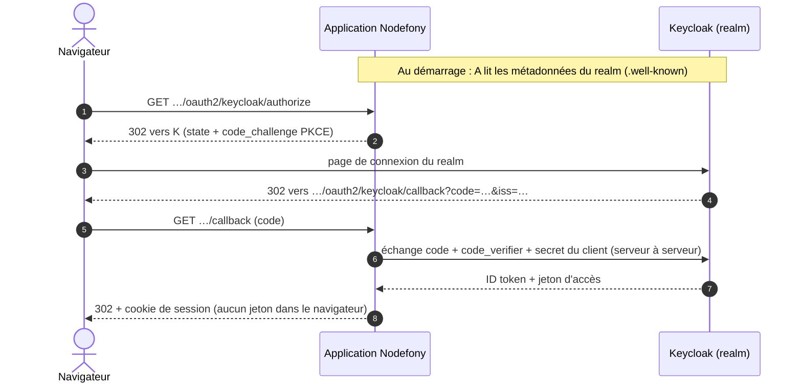

# Keycloak — brancher un annuaire, du realm au premier login

> Ton entreprise tient ses comptes dans un **Keycloak** et tu veux que tes utilisateurs se connectent
> à ton application avec ces comptes, sans que l'application voie jamais un mot de passe. Côté
> Nodefony, il n'y a **aucun code à écrire** : le fournisseur `keycloak` est fourni, et l'adresse
> du realm suffit à le décrire. Le travail se passe surtout dans Keycloak : créer le realm, déclarer
> un client **confidentiel**, enregistrer l'URL de retour au caractère près. Cette page fait le
> chemin entier, puis montre comment le jeton Keycloak de la même personne ouvre aussi ton API, sur
> le **même compte**. Ancré sur le fournisseur `createDiscoveredOidcProvider()` (`oidc.ts:267`) et
> sur `OAuth2Service` (`oauth2.ts:250`).

📍 [Documentation](../../../../../docs/index.md) › [Sécurité](index.md) › **Keycloak**

## 🧠 Schéma général



Le navigateur ne voit passer qu'un `code` à usage unique. Le secret du client et les jetons restent
entre l'application et Keycloak, sur un canal TLS.

## 📖 Lexique

| Terme               | Développé et rôle                                                                                                       |
| ------------------- | ----------------------------------------------------------------------------------------------------------------------- |
| Keycloak            | Serveur d'identité libre, auto-hébergé : il tient les comptes, affiche la page de connexion et délivre les jetons.      |
| Realm               | Espace de comptes isolé dans Keycloak : ses utilisateurs, ses clients, ses clés. Son URL est l'**émetteur**.            |
| Client              | L'application telle que Keycloak la connaît : un identifiant, un secret, des URL de retour autorisées.                  |
| Client confidentiel | Client capable de garder un secret, parce qu'il tourne sur un serveur. Keycloak l'appelle « Client authentication ON ». |
| OIDC                | _OpenID Connect_ : la couche d'identité au-dessus d'OAuth 2.0, qui ajoute l'ID token (qui est l'utilisateur).           |
| Émetteur (`iss`)    | L'identifiant du serveur qui signe les jetons. Pour Keycloak : `https://<hôte>/realms/<realm>`.                         |
| `sub`               | _Subject_ : l'identifiant stable de l'utilisateur **dans son realm**. Unique chez son émetteur, nulle part ailleurs.    |
| PKCE                | _Proof Key for Code Exchange_ (RFC 7636) : rend inutilisable un `code` volé en route.                                   |
| BFF                 | _Backend For Frontend_ : le serveur garde les jetons et ne donne au navigateur qu'un cookie de session.                 |
| Shadow User         | Le compte local que l'application crée au premier login, lié à `(keycloak, sub)`.                                       |
| Audience (`aud`)    | La ressource à laquelle un jeton d'accès est destiné ; ton API refuse un jeton qui ne la nomme pas.                     |

## Qu'est-ce que c'est ?

Keycloak est le **guichet d'accueil d'un immeuble**. Chaque société de l'immeuble (chaque
application) fait confiance au badge qu'il délivre, sans tenir son propre registre de visiteurs. Le
visiteur montre ses papiers une fois, au guichet ; les sociétés ne voient que le badge.

Pour ton application, cela bloque trois risques concrets :

- **Le mot de passe ne transite jamais par l'application** : une faille chez toi ne fait pas fuir
  les identifiants de l'annuaire.
- **Un `code` intercepté ne sert à rien** : sans le `code_verifier` (PKCE) et sans le secret du
  client, Keycloak refuse l'échange.
- **Un départ se gère à un seul endroit** : désactiver le compte dans le realm ferme la porte de
  toutes les applications qui s'y fient, à leur prochaine connexion.

## La vision Nodefony

**Aucun code propre à Keycloak.** Un serveur OpenID Connect publie lui-même ses points d'entrée ;
le fournisseur `keycloak` les **découvre** à partir de l'émetteur, et c'est tout ce qu'il sait faire
(`createDiscoveredOidcProvider()`, `oidc.ts:267`). Changer de realm, c'est changer une URL.

**Une configuration fausse arrête le démarrage.** Le fournisseur `keycloak` est enregistré avec
`requiresIssuer: true` (`oauthProviderRegistry.ts:137`). Au boot, un émetteur absent, ou qui n'est
pas une URL `https` sans requête ni fragment, lève une erreur qui nomme la clé
(`checkProviderIssuer()`, `oauth2.ts:196`). Un Keycloak **éteint**, lui, ne bloque rien : le bouton
disparaît de l'écran de connexion et revient tout seul quand le realm répond à nouveau
(`#isReachable()`, `oauth2.ts:702`).

**L'identité est la paire `(keycloak, sub)`, jamais l'email.** Au premier login, l'application crée
un compte local lié à cette paire (`UserService.provisionOAuthUser()`, `UserService.ts:361`). Un
compte local qui porte déjà le même identifiant sans ce lien n'est **jamais** rattaché en silence :
la connexion est refusée (`UserService.ts:389`).

**Keycloak authentifie, l'application autorise.** Les rôles du realm ne sont pas lus : le compte
reçoit `defaultRoles` à sa création, puis la base locale fait foi. Une élévation se fait dans
l'application, pas dans Keycloak.

## 🚀 Démarrage rapide

### Essayer en deux minutes : le Keycloak du dépôt

Le dépôt fournit un Keycloak 26.8 **déjà configuré** : un realm `nodefony`, un client confidentiel
`nodefony-dev` et un utilisateur `alice`. Tout est écrit dans
`docker/keycloak/import/realm-nodefony.json`, importé au premier démarrage du conteneur.

1. **Démarrer le conteneur** (en `https` sur le port 8444, avec le certificat de l'application) :

   ```bash
   docker compose -f docker/docker-compose.yml --profile keycloak up -d keycloak
   ```

2. **Brancher l'application** : recopier dans `.env.local` (ignoré par git) les trois lignes
   commentées de `.env.development`.

   ```bash
   NF_KEYCLOAK_ISSUER=https://localhost:8444/realms/nodefony
   NF_KEYCLOAK_CLIENT_ID=nodefony-dev
   NF_KEYCLOAK_CLIENT_SECRET=nodefony-dev-keycloak-secret
   ```

   Ces valeurs sont **publiques** : elles n'existent que dans ce décor de développement.

3. **Démarrer l'application**, ouvrir `https://localhost:5152/nodefony/login` : le bouton
   **Keycloak** est là. Se connecter avec `alice` / `alice-dev`.

La console d'administration du realm est sur `https://localhost:8444/admin` (`admin` /
`nodefony-dev`). Les retouches qu'on y fait survivent aux redémarrages ;
`docker compose … down -v` repart du fichier.

### Essayer dans une application générée

Une application créée par `nodefony create app` avec le préréglage `complete` porte déjà le
même décor, **à son nom** : un profil `keycloak` dans son `compose.yaml`, un realm
`docker/keycloak/import/realm.json` (realm et client nommés comme l'application, utilisateur
`alice`), les variables `NF_KEYCLOAK_*` déclarées dans `env.ts` et le fournisseur conditionnel
dans `nodefony/config/security.ts`. Tant qu'on ne l'allume pas, l'application démarre sans bouton
ni avertissement.

1. **Fabriquer le certificat de développement** (une fois — Keycloak le sert en `https`) :

   ```bash
   npx nodefony http:certificates
   ```

2. **Démarrer le conteneur** :

   ```bash
   docker compose --profile keycloak up -d keycloak
   ```

   Sous Linux natif, poser d'abord `export KEYCLOAK_UID=$(id -u)` : sinon la clé privée montée
   est illisible par le conteneur.

3. **Brancher l'application** : décommenter les lignes `NF_KEYCLOAK_ISSUER` et
   `NF_KEYCLOAK_CLIENT_ID` de `.env`, et `NF_KEYCLOAK_CLIENT_SECRET` de `.env.local`. Les trois
   valeurs y sont déjà, alignées sur le realm généré.

4. **Démarrer l'application en lui faisant confiance au certificat de Keycloak**, puis ouvrir
   `https://localhost:5152/nodefony/login` et se connecter avec `alice` / `alice-dev` :

   ```bash
   NODE_EXTRA_CA_CERTS=nodefony/config/certificates/ca/nodefony-root-ca.crt.pem npm run dev
   ```

   Sans `NODE_EXTRA_CA_CERTS`, l'application ne joint pas Keycloak : un WARNING
   `oauth2 provider "keycloak" indisponible` au démarrage, et pas de bouton. Sous Windows, la
   syntaxe `VAR=… commande` n'existe pas : poser la variable dans le shell avant
   (`$env:NODE_EXTRA_CA_CERTS = "…"` en PowerShell, `set NODE_EXTRA_CA_CERTS=…` en `cmd`).

Le realm généré porte aussi, comme celui du dépôt, un client **machine** `<app>-machine` (compte de
service, `client_credentials`) et un mapper d'audience `https://localhost:5152` sur ses deux clients :
un jeton du realm nomme d'office l'application, prêt pour la zone de la section
« Le jeton Keycloak sur ton API », plus bas.

Le port de Keycloak (8444) se change par `KEYCLOAK_PORT` au `up` — l'émetteur suit, donc
`NF_KEYCLOAK_ISSUER` aussi. En production, le décor ne sert plus : les trois variables pointent
ton Keycloak, et `NF_OAUTH_REDIRECT_BASE` porte l'URL publique de l'application, base de l'URL de
retour.

### 1. Créer le realm

Dans la console d'administration de **ton** Keycloak :

1. **Create realm** (à côté de _Current realm_), donner un nom — par exemple `mon-entreprise`.
2. Le realm créé devient le realm courant. Ses utilisateurs s'y créent sous **Users**, ou s'y
   importent depuis un annuaire LDAP (**User federation**).

Ne pas travailler dans le realm `master` : il administre Keycloak lui-même.

### 2. Déclarer le client confidentiel

**Clients** › **Create client**, type **OpenID Connect**. Les réglages qui comptent :

| Réglage Keycloak                        | Valeur                                                                             | Pourquoi                                                                                                   |
| --------------------------------------- | ---------------------------------------------------------------------------------- | ---------------------------------------------------------------------------------------------------------- |
| **Client ID**                           | `mon-app`                                                                          | Devient `NF_KEYCLOAK_CLIENT_ID`.                                                                           |
| **Client authentication**               | **ON**                                                                             | Client **confidentiel** : l'application tourne sur un serveur, elle garde un secret. Nodefony en exige un. |
| **Standard flow**                       | coché                                                                              | C'est le flux _Authorization Code_, le seul que Nodefony emploie.                                          |
| **Direct access grants**                | décoché                                                                            | Ce flux fait transiter le mot de passe par l'application — exactement ce qu'on évite.                      |
| **Implicit flow**                       | décoché                                                                            | Retiré par OAuth 2.1 : il livre le jeton dans l'URL.                                                       |
| **PKCE method**                         | `S256`                                                                             | Keycloak **exige** alors PKCE pour ce client ; Nodefony l'envoie toujours.                                 |
| **Valid redirect URIs**                 | `https://app.example.com/nodefony/security/api/oauth2/keycloak/callback`           | Comparée **au caractère près** (RFC 9700). Pas de joker en production.                                     |
| **Valid post logout redirect URIs**     | `https://app.example.com/*`                                                        | Retour du navigateur après la déconnexion initiée par l'application.                                       |
| **Front channel logout**                | **OFF**                                                                            | Il exige une page que l'application n'a pas ; activé, Keycloak n'appelle PAS le canal arrière.             |
| **Backchannel logout URL**              | `https://app.example.com/nodefony/security/api/oauth2/keycloak/backchannel-logout` | Keycloak y prévient l'application quand la session SSO se ferme ailleurs. Joignable **par Keycloak**.      |
| **Backchannel logout session required** | **ON**                                                                             | Le jeton porte le `sid` : seule LA session concernée est fermée, pas toutes celles du compte.              |

Puis l'onglet **Credentials** : copier le **Client secret**. C'est `NF_KEYCLOAK_CLIENT_SECRET`.

> [!WARNING]
> L'URL de retour enregistrée chez Keycloak et celle que l'application envoie doivent être
> **identiques** : schéma, hôte, port, chemin. `localhost` et `127.0.0.1` sont deux hôtes
> différents. Une différence d'un caractère donne `Invalid parameter: redirect_uri` sur la page
> Keycloak, avant même le formulaire de connexion.

### 3. Lire l'émetteur

**Realm settings** › onglet **General** › lien **OpenID Endpoint Configuration**. Le document qui
s'ouvre commence par la valeur à recopier :

```json
{ "issuer": "https://sso.example.com/realms/mon-entreprise", "…": "…" }
```

C'est `NF_KEYCLOAK_ISSUER`, sans barre finale ni `/.well-known/…`. Elle doit être en `https`.

Keycloak calcule cette valeur à partir de son nom d'hôte. Derrière un proxy, ou quand le navigateur
et l'application ne joignent pas Keycloak par la même adresse, fixer `KC_HOSTNAME` à l'URL publique
complète : sinon l'émetteur change selon qui demande, et l'application refuse les jetons.

### 4. Brancher l'application

Les trois valeurs entrent par `env.ts`, seul lecteur des variables d'environnement. Le fournisseur
n'est déclaré que si les trois sont présentes : pas de bouton mort quand une variable manque.

```typescript
// env.ts — SEUL lecteur de process.env (catalogue typé, validé au boot).
// nodefony.config.ts — `ctx.env` EST ce catalogue (typé par le paramètre générique).
import { defineConfig, defineEnv, envString, use } from "nodefony";

export const env = defineEnv({
  // Émetteur = URL du realm, en https (la découverte et le contrôle de `iss` en partent).
  NF_KEYCLOAK_ISSUER: envString({ optional: true }),
  NF_KEYCLOAK_CLIENT_ID: envString({ optional: true }),
  NF_KEYCLOAK_CLIENT_SECRET: envString({ optional: true }),
  // Base des URL de retour : celle que Keycloak a enregistrée, au caractère près.
  NF_OAUTH_REDIRECT_BASE: envString({ default: "https://localhost:5152" }),
});

export default defineConfig<typeof env>((ctx) => ({
  modules: [
    "@nodefony/http",
    "@nodefony/framework",
    use("@nodefony/security", {
      oauth2: {
        // Rôles posés à la CRÉATION du compte local ; ceux du realm ne sont pas lus.
        defaultRoles: ["ROLE_USER"],
        providers: {
          ...(ctx.env.NF_KEYCLOAK_ISSUER &&
          ctx.env.NF_KEYCLOAK_CLIENT_ID &&
          ctx.env.NF_KEYCLOAK_CLIENT_SECRET
            ? {
                keycloak: {
                  issuer: ctx.env.NF_KEYCLOAK_ISSUER,
                  clientId: ctx.env.NF_KEYCLOAK_CLIENT_ID,
                  clientSecret: ctx.env.NF_KEYCLOAK_CLIENT_SECRET,
                  redirectUri: `${ctx.env.NF_OAUTH_REDIRECT_BASE}/nodefony/security/api/oauth2/keycloak/callback`,
                  // Libellé du bouton ; omis, il vaut « Keycloak ».
                  label: "Compte entreprise",
                },
              }
            : {}),
        },
      },
    }),
  ],
}));
```

L'application doit faire **confiance au certificat** de Keycloak, puisqu'elle l'appelle en `https`.
Un certificat d'une autorité publique ne demande rien. Un certificat interne ou de développement
s'ajoute par `NODE_EXTRA_CA_CERTS` au démarrage du processus.

### 5. Le premier login — ce qu'on observe

```bash
# Le bouton est offert à l'écran de connexion :
curl -s https://localhost:5152/nodefony/security/api/oauth2/providers
# {"providers":[{"name":"keycloak","label":"Compte entreprise"}]}
```

Au clic, l'utilisateur passe par la page de connexion du realm, puis revient connecté. Côté
application :

- un **compte local** est créé, identifiant = l'email du realm (ou `keycloak:<sub>` sans email),
  rôles = `defaultRoles`, sans mot de passe local ;
- ce compte porte le lien `(keycloak, sub)` : les connexions suivantes le retrouvent par ce lien,
  même si l'email change dans le realm ;
- la session est une **session BFF** ordinaire, la même qu'après un mot de passe.

Les écrans **Utilisateurs** et **Sessions** de Studio montrent le compte et sa session.

## ⚙️ Configuration

Les clés de `security.oauth2.providers.keycloak` — le schéma complet vit sur la page
[OAuth2](oauth2.md).

| Clé                | Requise | Effet                                                                                               |
| ------------------ | :-----: | --------------------------------------------------------------------------------------------------- |
| `issuer`           |   ✅    | URL `https` du realm. Absente ou mal formée : le démarrage est refusé.                              |
| `clientId`         |   ✅    | **Client ID** du client Keycloak.                                                                   |
| `clientSecret`     |   ✅    | **Client secret** de l'onglet _Credentials_. Jamais journalisé.                                     |
| `redirectUri`      |   ✅    | URL de retour, identique à l'une des **Valid redirect URIs** du client.                             |
| `clientAuthMethod` |         | `client_secret_basic` par défaut ; `client_secret_post` si le client Keycloak l'exige.              |
| `scopes`           |         | Vide = `openid`, `profile`, `email`.                                                                |
| `defaultRoles`     |         | Rôles du compte à sa création, pour CE fournisseur (sinon la valeur globale `oauth2.defaultRoles`). |
| `label`            |         | Libellé du bouton. Omis : « Keycloak ».                                                             |
| `hidden`           |         | Retire le bouton sans fermer le flux (lien direct, sous-domaine dédié).                             |

## 🧩 Le jeton Keycloak sur ton API — le même compte

Une fois les humains connectés par le navigateur, un script ou un service veut souvent appeler l'API
avec un **jeton d'accès** du même realm. La page [Jetons d'un émetteur tiers](external-jwt.md)
décrit cette brique en entier ; voici ce que Keycloak y ajoute.

**Côté Keycloak**, le jeton doit nommer ton API dans son audience. Dans le client : **Client
scopes** › le scope dédié › **Add mapper** › _Audience_, avec **Included Custom Audience** = l'URL de
ton API et **Add to access token** coché.

**Côté Nodefony**, déclarer le realm comme émetteur de confiance et ouvrir une zone qui accepte ses
jetons :

```typescript ignore
use("@nodefony/security", {
  resourceServer: {
    issuers: [
      // Les clés publiques du realm sont découvertes par l'émetteur.
      {
        issuer: "https://sso.example.com/realms/mon-entreprise",
        algorithms: ["RS256"],
      },
    ],
  },
  areas: {
    api: {
      pattern: "^/api",
      authenticators: ["external-jwt"],
      stateless: true,
      // L'audience exigée : celle que le mapper inscrit dans le jeton.
      resource: "https://api.example.com",
    },
  },
});
```

**Le même compte, pas un second.** Quand l'émetteur d'un jeton est celui d'un fournisseur de
connexion déclaré (`oauth2.providers.keycloak.issuer`), l'authenticator cherche d'abord le compte lié
à `(keycloak, sub)` — celui que le login par navigateur a créé (`ExternalJwtAuthenticator.ts:364`).
Sans ce lien, le jeton désignerait un compte distinct, sous l'identifiant `<émetteur>#<sub>`.

## 🔐 Sécurité

- **`https` partout, même en développement.** L'ID token est lu sans vérifier sa signature, ce
  qu'OIDC Core §3.1.3.7 n'admet que parce qu'il arrive du point de jeton par TLS. Un émetteur en
  `http` est refusé au démarrage (`canonicalIssuer()`, `authorizationServer.ts:76`).
- **Client confidentiel obligatoire** : le schéma exige un secret non vide. Un client public ne
  conviendrait qu'à une application sans serveur, ce que n'est pas une application Nodefony.
- **Anti-mix-up** : le paramètre `iss` du retour et le claim `iss` de l'ID token doivent égaler
  l'émetteur découvert (RFC 9207). Un retour venu d'un autre realm est rejeté.
- **Aucune liaison par email** : un email, même vérifié par le realm, ne donne jamais accès à un
  compte local existant. Le rattachement d'un compte local à un `sub` Keycloak se fait
  explicitement.
- **Déconnexion, dans les deux sens.** Se déconnecter de l'application ferme aussi la session du
  realm : la réponse porte `logoutUrl`, où le navigateur est envoyé avec l'ID token en
  `id_token_hint` — sans page de confirmation, et le clic suivant redemande le mot de passe. À
  l'inverse, une session fermée **chez Keycloak** (console d'administration, autre application du
  SSO) ferme la session de l'application par le **canal arrière** : Keycloak appelle
  `…/oauth2/keycloak/backchannel-logout` avec un jeton signé, que l'application vérifie sur les clés
  du realm avant de détruire quoi que ce soit (détail : [OAuth2 § canal arrière](oauth2.md#déconnexion-demandée-par-le-fournisseur--le-canal-arrière)).

## ⚠️ Pièges

| Symptôme                                                                                                                           | Cause                                                                                                                   | Correction                                                                                                                        |
| ---------------------------------------------------------------------------------------------------------------------------------- | ----------------------------------------------------------------------------------------------------------------------- | --------------------------------------------------------------------------------------------------------------------------------- |
| Démarrage refusé : `security.oauth2.providers.keycloak.issuer est requis`                                                          | Les trois variables ne sont pas posées ensemble, ou `issuer` manque à la main                                           | Poser `NF_KEYCLOAK_ISSUER` (`checkProviderIssuer()`, `oauth2.ts:196`)                                                             |
| Démarrage refusé : `émetteur invalide … https`                                                                                     | Émetteur en `http`, ou avec `?…`/`#…`                                                                                   | Recopier l'`issuer` du document _OpenID Endpoint Configuration_                                                                   |
| Pas de bouton + WARNING `oauth2 provider "keycloak" indisponible`                                                                  | Keycloak injoignable, ou certificat non reconnu (`fetch failed`)                                                        | Démarrer Keycloak ; `NODE_EXTRA_CA_CERTS` pour un certificat interne. Retour sous 30 s                                            |
| `Invalid parameter: redirect_uri` sur la page Keycloak                                                                             | `redirectUri` ≠ les **Valid redirect URIs** du client                                                                   | Aligner schéma, hôte (`localhost` ≠ `127.0.0.1`), port et chemin                                                                  |
| Retour sur `failureRedirect` + WARNING `invalid_client`                                                                            | Mauvais secret, ou client public (_Client authentication OFF_)                                                          | Recopier le secret de l'onglet _Credentials_ ; passer le client en ON                                                             |
| Retour sur `failureRedirect` + WARNING `OAuth issuer mismatch`                                                                     | Keycloak joint par deux adresses différentes : l'émetteur varie                                                         | Fixer `KC_HOSTNAME` à l'URL publique complète                                                                                     |
| Retour sur `failureRedirect` + WARNING `local account exists without a keycloak link`                                              | Un compte local porte déjà cet identifiant (`UserService.ts:389`) — typiquement un `sub` changé après réimport du realm | Rattacher le compte explicitement, ou fixer l'`id` des utilisateurs dans l'export du realm                                        |
| API : `401` avec un jeton Keycloak valide                                                                                          | Audience absente du jeton : pas de mapper _Audience_                                                                    | Ajouter le mapper ; `aud` doit contenir la `resource` de la zone                                                                  |
| Session de l'application vivante après une déconnexion chez Keycloak ; Keycloak journalise `Some clients have not been logged out` | _Front channel logout_ ON, ou **Backchannel logout URL** absente ou injoignable depuis Keycloak                         | _Front channel logout_ OFF ; une URL que Keycloak joint (en développement Linux : serveur à l'écoute au-delà de la boucle locale) |

La cause d'un retour sur `failureRedirect` n'est jamais montrée au navigateur ; elle est dans le
journal du serveur, préfixée `oauth2 callback "keycloak"` (`OAuth2Controller.ts:213`).

## 🧪 Tests & couverture

| Type        | Fichier                                                   | Ce qu'il prouve                                                                                                                                                                              |
| ----------- | --------------------------------------------------------- | -------------------------------------------------------------------------------------------------------------------------------------------------------------------------------------------- |
| Unitaire    | `security/tests/unit/oauth2Service.test.ts`               | Démarrage refusé sur émetteur absent ou mal formé ; bouton retiré puis rendu quand l'émetteur tombe.                                                                                         |
| Unitaire    | `security/tests/unit/oauthProviders.test.ts`              | Découverte, refus d'un serveur sans PKCE S256, contrôle des claims de l'ID token.                                                                                                            |
| Intégration | `http/nodefony/tests/integration/oauth2-keycloak.test.ts` | Contre un **vrai** Keycloak : flux complet, même compte entre session et jeton d'API, `invalid_grant` rendu par Keycloak, déconnexion dans les deux sens, jeton de déconnexion forgé refusé. |

Le banc d'intégration exige le conteneur et les trois variables (décor `KEYCLOAK_GATE` de
`vitest.gates.ts`) ; sans eux il est sauté, et la passe le dit en fin de run. Le cas du canal
arrière constate en plus que le conteneur JOINT l'application (`host.docker.internal`) : un serveur
de développement sous Linux n'écoute que la boucle locale, le cas est alors sauté et le dit.

**Ce qui manque** : aucun test ne joue un Keycloak derrière un proxy (émetteur variable), ni une
rotation des clés du realm pendant une session.

## 🔗 Pour aller plus loin

- ⬆️ **Retour au hub** : [Sécurité — vue d'ensemble](index.md) · [Toute la documentation](../../../../../docs/index.md)
- [OAuth2](oauth2.md) — le flux, le contrat des fournisseurs, les autres fournisseurs (Google, GitHub, tout OIDC).
- [Jetons d'un émetteur tiers](external-jwt.md) — accepter les jetons d'accès du realm sur une API.
- [Authenticators](authenticators.md) — la session BFF qui suit la connexion.
- [`@nodefony/user`](../../user/docs/index.md) — le compte local et ses liens externes.
