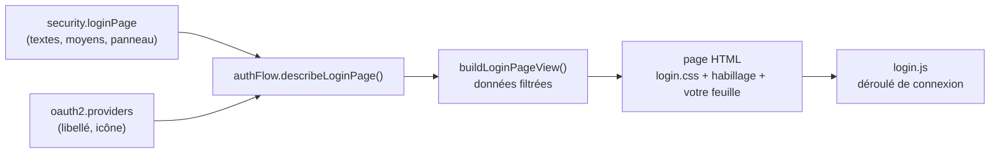
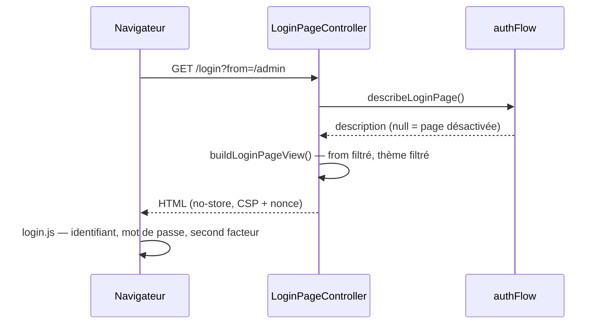

# Page de connexion — la page servie, et comment l'habiller

> Une application qui protège ses routes a besoin d'une page où l'on se connecte. Nodefony en sert
> une, prête à l'emploi, à l'adresse `/login` : identifiant, mot de passe, second facteur, boutons
> des fournisseurs (Keycloak, GitHub…), thème clair et sombre. Vous l'**habillez** par la
> configuration (`security.loginPage`) et une feuille de style — sans copier son balisage. Ancré sur
> `src/packages/@nodefony/security/nodefony/config/config.ts` (la configuration),
> `src/packages/@nodefony/framework/nodefony/src/loginPage.ts` (le rendu) et
> `src/nodefony/src/client/login/mountLoginPage.ts` (le script de la page).

📍 [Documentation](../../../../../docs/index.md) › [Sécurité](index.md) › **Page de connexion**

## 🧠 Le modèle mental — la configuration dit QUOI, la feuille dit COMMENT



La configuration décide de ce que la page **propose et dit** ; l'**habillage** choisi et votre
feuille de style décident de son **apparence** (couleurs, rayons, photo). Le balisage, lui, reste celui du framework :
c'est ce qui vous laisse profiter de ses corrections sans rien recopier.

## 📖 Lexique

| Terme                   | Signification                                                                                                          |
| ----------------------- | ---------------------------------------------------------------------------------------------------------------------- |
| **SSO**                 | _Single Sign-On_ : se connecter avec le compte d'une organisation (Keycloak, Google…) plutôt qu'un mot de passe local. |
| **Fournisseur**         | Un service d'identité configuré dans `oauth2.providers` ; il devient un bouton sur la page.                            |
| **Panneau (`hero`)**    | La moitié illustrée de la mise en page `split`, à côté du formulaire.                                                  |
| **Vitrine**             | Le contenu par défaut du panneau : la présentation de Nodefony.                                                        |
| **CSP**                 | _Content Security Policy_ : liste des sources que le navigateur accepte de charger pour la page.                       |
| **Redirection ouverte** | Faille où une adresse de retour fournie par l'attaquant renvoie la victime vers un autre site (CWE-601).               |
| **`no-store`**          | En-tête qui interdit toute mise en cache de la réponse, y compris par un proxy partagé.                                |

## Qu'est-ce que c'est ?

C'est la porte d'entrée de votre application : l'écran que voit quiconque arrive sur une route
protégée sans session. L'écrire soi-même paraît simple, et c'est là que les failles se logent — une
adresse de retour `?from=` qui renvoie vers un autre site, une page affichable dans le cadre d'un
site tiers (détournement de clic), un mot de passe qui part en clair, un message d'erreur qui dit
si le compte existe. Nodefony sert une page qui ferme ces portes par construction, et vous laisse
la personnaliser là où c'est sans risque : les textes, les couleurs, le contenu du panneau.

## La vision Nodefony

- **Configuration dans `@nodefony/security`, rendu dans `@nodefony/framework`** : le premier décrit
  la page (`AuthFlow.describeLoginPage()`, `authFlow.ts:470`), le second la rend
  (`buildLoginPageView()`, `loginPage.ts:147`) et la sert (`LoginPageController`,
  `LoginPageController.ts:102`). Le contrat entre les deux, `ILoginPageDescription`, vit au cœur
  (`authRoutes.ts:215`).
- **Tout passe par du texte échappé** : aucune valeur de la configuration ni de la requête n'entre
  dans le balisage autrement que par `<%= %>`. L'image du panneau passe par votre feuille de style,
  jamais par une adresse injectée dans le HTML.
- **Un seul déroulé** : le script de la page (`mountLoginPage()`, `mountLoginPage.ts:85`) s'appuie
  sur `NodefonyLogin`, le même client que vos propres écrans peuvent utiliser.

## 🚀 Démarrage rapide

### Dans une app `nodefony create app`, la page est DÉJÀ servie

Rien à écrire : ouvrez `/login`. Le chemin se change par `loginPage.path`, et toutes les
redirections le suivent (échec d'un fournisseur, retour après déconnexion).

### L'habiller : textes, panneau, feuille de style

Dans le fragment de configuration de la sécurité (`nodefony/config/security.ts`, importé par
`nodefony.config.ts` dans `use("@nodefony/security", …)`) :

```typescript
// nodefony/config/security.ts — extrait, compile tel quel
import type { ISecurityConfigInput } from "@nodefony/security";

export const acmeLogin = {
  loginPage: {
    title: "Acme", // nom de l'application, en tête et dans l'onglet
    heading: "Espace client", // titre de la carte
    subtitle: "Votre compte Acme",
    stylesheet: "/assets/acme-login.css", // chargée APRÈS celle du framework
    hero: {
      heading: "Bienvenue chez Acme",
      text: "Vos commandes, vos factures, votre support.",
    },
  },
} satisfies ISecurityConfigInput;
```

La feuille redéfinit les variables `--nf-login-*`. Les couleurs qui changent avec le thème se
redéfinissent pour les deux thèmes (voir « Pièges », plus bas) :

```css
/* /assets/acme-login.css */
:root {
  --nf-login-brand: #b4235a; /* même valeur dans les deux thèmes */
  --nf-login-card-radius: 4px;
  --nf-login-hero-image: url("/assets/acme-hero.jpg");
}
```

### Ce qu'on observe

- `GET /login` rend la page, avec `Cache-Control: no-store` et une CSP
  `frame-ancestors 'none'` (`LoginPageController.ts:112`) ;
- le titre de la carte vaut « Espace client », le panneau affiche votre accroche à la place de la
  vitrine Nodefony ;
- votre feuille arrive en second `<link rel="stylesheet">`, après `login.css` : vos variables
  l'emportent.

## ⚙️ Choisir sa page — quatre situations

### Situation 1 — la page par défaut, à votre nom

`title` et `logo` suffisent. La vitrine Nodefony reste dans le panneau ; `hero: false` la retire
et ne laisse que votre marque sur l'image du panneau.

### Situation 2 — connexion par l'organisation seulement (SSO)

`password: false` retire le formulaire : il ne reste que les boutons des fournisseurs. Chaque
bouton prend son libellé (`oauth2.providers.<nom>.label`) et, si vous la réglez, son image
(`oauth2.providers.<nom>.icon`, sinon la marque GitHub ou une clé) — `listDisplayProviders()`
(`oauth2.ts:422`).

### Situation 3 — le formulaire d'abord

Par défaut, quand des fournisseurs sont proposés, leurs boutons passent avant le formulaire : la
plupart des comptes d'une entreprise sont ceux de son annuaire. `providersFirst: false` inverse
l'ordre (`loginPage.ts:174`).

### Situation 4 — votre propre page

`enabled: false` : le framework ne sert plus rien à ce chemin, et votre application y sert sa
page, construite sur `NodefonyLogin` (voir la doc du client du cœur). Les redirections continuent
d'y mener. `template` (un gabarit `.eta` qui remplace celui du framework) existe aussi, en dernier
recours : un gabarit copié ne suit plus les évolutions du balisage.

## 🎨 Habillages — neuf apparences, un seul balisage

Le framework livre neuf habillages. Chacun est une feuille qui redéfinit les variables
`--nf-login-*` et, au plus, la disposition de sa mise en page : le balisage ne change jamais, donc
vos réglages (`heading`, `hero`, `providersFirst`…) et votre feuille valent pour les neuf.

```typescript
// nodefony/config/security.ts — extrait, compile tel quel
import type { ISecurityConfigInput } from "@nodefony/security";

export const acmeSkin = {
  loginPage: {
    skin: "horizon", // un des neuf ; un nom inconnu arrête le démarrage
    stylesheet: "/brand/login.css", // votre photo et vos couleurs, chargée en dernier
  },
} satisfies ISecurityConfigInput;
```

<!-- prettier-ignore -->
| `skin` | Mise en page | Fond de page | Pour quoi |
| --- | --- | --- | --- |
| `frontispiece` (défaut) | `split` | — | Intranet, application d'entreprise : panneau de marque à bord courbe, les comptes de l'organisation avant le mot de passe local. `login.css` seule. |
| `ledger` | `bare` | — | Outil interne, back-office : feuille en deux colonnes, étapes numérotées, formulaire à droite. |
| `horizon` | `card` | — | Grand public, SaaS : carte postale, la photo en bandeau dans la carte. |
| `console` | `card` | — | Outils, consoles : la signature de la barre de debug, en carte centrée. |
| `blueprint` | `card` | grille de plan | Produits techniques, API, données : fond bleu nuit. |
| `dots` | `card` | trame de points | Applications métier : discret, clair d'abord, ombre légère. |
| `minimal` | `bare` | — | Produit qui veut s'effacer : pas de carte, beaucoup d'air. |
| `enterprise` | `card` | courbes de niveau | Intranet derrière un fournisseur d'identité, palette sarcelle ; à marier avec `providersFirst: true`. |
| `photo-card` | `card` | photo voilée | La photo de l'application en fond de page, la carte reste pleine au-dessus. |

**Trois feuilles, dans cet ordre** : `login.css` (le socle), la feuille de l'habillage
(`/nodefony/security/login/skins/<skin>.css`, aucune pour `frontispiece`), puis la vôtre — vos
variables l'emportent toujours (`loginPage.ts:210`).

**La photo vient de vous.** Aucun habillage n'en publie : une photo par défaut alourdirait chaque
installation et finirait à l'identique dans toutes les applications. Une seule variable suffit,
chaque habillage la place où il veut — le panneau (`frontispiece`), le bandeau (`horizon`), le fond
de page (`photo-card`) — et changer d'habillage la conserve. Sans elle, ces emplacements prennent
une couleur pleine.

```css
/* /brand/login.css — servie par votre application (public/brand/) */
:root {
  --nf-login-hero-image: url("/brand/login-hero.webp");
}
```

**La mise en page suit l'habillage** : sans `layout`, c'est celle pour laquelle il est dessiné ;
un `layout` écrit gagne (`authFlow.ts:495`).

**Keycloak suit le même habillage** : chaque habillage a son thème de connexion Keycloak
(`nodefony-<habillage>`), que `security:keycloak:realm --write` pose dans le realm d'après
`loginPage.skin` — voir [Keycloak](keycloak.md). Seuls `ledger` et `horizon` y perdent leur
structure propre (les formulaires de Keycloak n'ont pas nos classes) et n'y gardent que leurs
couleurs et leur mise en page.

**Comparer sans redémarrer** : en développement, `/login?skin=dots` sert la page sous un autre
habillage, et `&layout=card` force la mise en page — le temps d'une requête, sur vos vrais
réglages. En production ces paramètres sont ignorés (`loginPage.ts:121`) : la page servie est
celle de la configuration, et rien d'autre.

## 🏗️ Architecture interne



- **La route est montée au démarrage** par `mountLoginPage()` du framework, hors firewall
  (`bypassFirewall`, `LoginPageController.ts:156`) — sinon une application qui protège `^/`
  exigerait d'être connecté pour se connecter.
- **Les fournisseurs sont relus à chaque requête** : l'un d'eux peut tomber ou revenir pendant que
  le serveur tourne, et un bouton qui mène à une erreur est retiré de l'offre.
- **La destination `?from=`** repasse par `safeRedirectPath` (`loginPage.ts:151`) : une adresse
  hors de l'origine retombe sur `/`.

## ⚙️ Configuration (schéma Zod `loginPageSchema`, `config.ts:980`)

<!-- prettier-ignore -->
| Option | Type · défaut | Effet |
| --- | --- | --- |
| `enabled` | boolean · `true` | `false` = le framework ne sert pas de page ; la vôtre prend le chemin. |
| `path` | string · `/login` | Chemin local de la page, sans requête ni fragment. |
| `title` | string · nom de l'application | Nom affiché en tête et dans l'onglet. |
| `logo` | string · logo Nodefony | Adresse du logo (chemin servi, ou URL autorisée par la CSP). |
| `heading` | string · « Se connecter » | Titre de la carte et de l'onglet. |
| `subtitle` | string · déduit | Ligne sous le titre ; par défaut, déduite des moyens proposés. |
| `stylesheet` | string · — | Feuille chargée après `login.css` et l'habillage (`config.ts:1018`). |
| `skin` | un des neuf · `frontispiece` | Habillage (`config.ts:1075`) — voir « Habillages ». |
| `layout` | `split` · `card` · `bare` · celle de l'habillage | Mise en page : panneau et formulaire, carte centrée, formulaire seul (`config.ts:1081`). |
| `hero` | `{ heading, text? }` · `false` · vitrine | Contenu du panneau (`config.ts:1045`) ; une clé inconnue est refusée au démarrage. |
| `providersFirst` | boolean · `true` | Fournisseurs avant le formulaire (`config.ts:1039`). |
| `footer` | boolean · `true` | Protections de la session et « Propulsé par Nodefony » (`config.ts:1061`). |
| `password` | boolean · `true` | `false` = fournisseurs seulement. |
| `template` | string · — | Gabarit `.eta` de remplacement — dernier recours. |
| `oauth2.providers.<nom>.icon` | string · icône du framework | Image du bouton du fournisseur (`config.ts:1213`). |

Toute la section est en `z.strictObject` : une clé mal orthographiée interrompt le démarrage en la
nommant, au lieu d'être ignorée.

## 🔒 Sécurité

- **Pas de cache partagé** (`no-store`) ni d'affichage dans un cadre (`frame-ancestors 'none'`) ;
  le script porte le nonce CSP de la requête.
- **Mot de passe en clair refusé en production** : sur une requête qui n'arrive pas en HTTPS, la
  connexion répond 403 avant toute vérification, et la page affiche « doit passer par HTTPS » au
  lieu de « mot de passe incorrect » (`mountLoginPage.ts:150`). Derrière un proxy qui termine TLS,
  déclarez-le dans `trustProxy` ([authenticators](authenticators.md#mot-de-passe-en-clair--refusé-en-production)).
- **Message d'échec uniforme** : un refus d'identifiants affiche un message fixe, jamais le texte du
  serveur — il ne dit pas si le compte existe.
- **Vos adresses** (`logo`, `stylesheet`, `icon`) sont soumises à la CSP de la page : servez-les
  depuis l'application, ou autorisez explicitement leur origine.

## ⚡ Performance & mémoire

- Le gabarit est compilé **une fois par processus**, et un échec de chargement n'est pas mémorisé
  (`keepSuccess()`, `loginPage.ts:94`) : la page ne reste pas en 500 après une correction.
- Feuille et script sont servis en statique, versionnés par leur empreinte (`?v=`) : le navigateur
  les garde en cache jusqu'au prochain changement. Le script pèse 4 Ko.

## ⚠️ Pièges (symptôme → cause → correction)

| Symptôme                                                                    | Cause                                                                                                                                                      | Correction                                                                                                                              |
| --------------------------------------------------------------------------- | ---------------------------------------------------------------------------------------------------------------------------------------------------------- | --------------------------------------------------------------------------------------------------------------------------------------- |
| Ma couleur d'accent ne s'applique qu'en thème sombre                        | Les couleurs qui dépendent du thème (`--nf-login-accent`, `--nf-login-bg`…) sont redéfinies pour le thème clair, avec un sélecteur plus précis que `:root` | Les redéfinir aussi sous `@media (prefers-color-scheme: light) { :root:not([data-theme="dark"]) { … } }` et `:root[data-theme="light"]` |
| Ma feuille ou mon logo ne se charge pas                                     | Adresse d'un autre site, refusée par la CSP                                                                                                                | Servir le fichier depuis l'application                                                                                                  |
| `hero: { image: … }` refuse de démarrer                                     | Le panneau n'accepte que du texte                                                                                                                          | Poser l'image dans la feuille : `--nf-login-hero-image: url(…)`                                                                         |
| Le panneau n'apparaît pas                                                   | `layout: "card"` ou `"bare"` : seul `split` a un panneau                                                                                                   | `layout: "split"`                                                                                                                       |
| Toutes les connexions répondent 403 « doit passer par HTTPS » en production | Pod en HTTP derrière un proxy TLS non déclaré                                                                                                              | Déclarer le proxy dans `trustProxy`                                                                                                     |
| La page répond 404                                                          | `enabled: false`, ou configuration de sécurité invalide (journal CRITIC au démarrage)                                                                      | Réactiver, ou corriger la configuration                                                                                                 |

## 🧪 Tests & couverture

- **unit (framework)** : `tests/unit/loginPage.test.ts` — données du gabarit filtrées, gabarit
  échappé (titres, sous-titre, accroche et adresses hostiles rendus en texte), chaque réglage de la
  page, et le **vrai** script monté sur le HTML rendu jusqu'à l'ouverture de la session ;
- **unit (security)** : `tests/unit/loginPage.test.ts` — la section `loginPage` et sa lecture par
  `describeLoginPage()` ; `oauth2Service.test.ts` — libellé et image des boutons ;
- **unit (cœur)** : `loginSkins.test.ts` — une feuille par habillage et aucune hors catalogue,
  jeu clair écrit deux fois à l'identique, aucune variable lue sans définition ni posée sans
  lecteur, aucune image publiée ; `clientLoginPage.test.ts` — le script de la page : déroulé complet, destination
  hors origine refusée, message fixe, refus du clair reconnu ;
- **intégration live** : `tests/integration/login-page.test.ts` chez `@nodefony/framework` (serveur
  réel : en-têtes, CSP, fichiers servis) ;
- **attaque** : `securedArea.attack.test.ts` — une zone protégée couvre la casse et la barre finale
  que le routeur sert.

Ce qui manque : aucun test de charge dédié à la page (elle est servie hors du chemin chaud).
Couverture : `npm run coverage` dans chaque paquet.

## 🔗 Pour aller plus loin

- ⬆️ **Retour au hub** : [Sécurité — vue d'ensemble](index.md) · [Toute la documentation](../../../../../docs/index.md)
- 🧭 **Pages sœurs** : [Authenticators](authenticators.md) · [OAuth2 et fournisseurs](oauth2.md) · [Keycloak](keycloak.md)

- La décision d'architecture (page servie par le framework) → ADR-0015 dans `docs/adr/`
- Le client de connexion sans interface (`NodefonyLogin`) → doc du client du cœur
- Les en-têtes de sécurité et la CSP → [headers](./headers.md)
