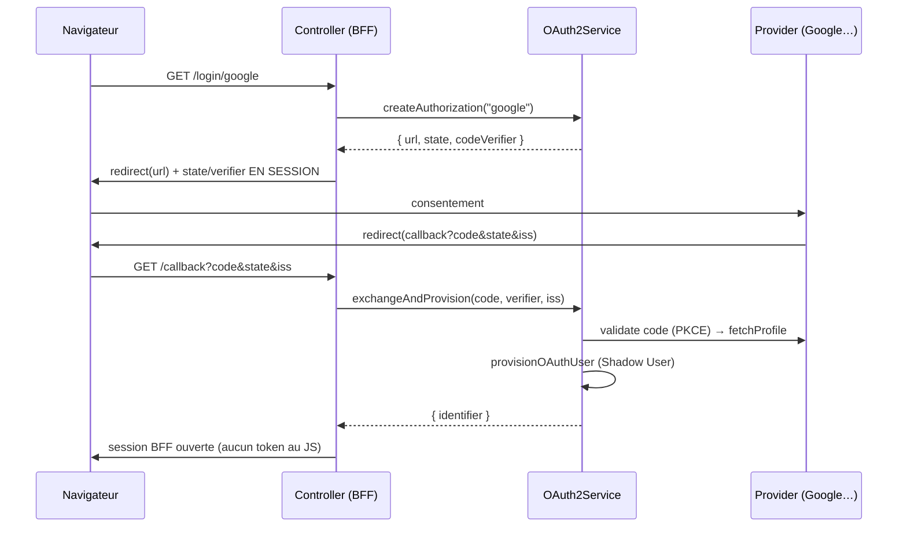

# OAuth 2.0 — social login (Authorization Code + PKCE)

> « Se connecter avec Google/GitHub ». Nodefony orchestre le flux **Authorization Code** avec une
> posture **OAuth 2.1** (RFC 9700) : PKCE, `state` anti-CSRF, `iss` anti-mix-up, et — point clé —
> **aucun jeton n'atteint le navigateur** : le login produit une **session BFF**, pas un token exposé au
> JS. Le service ne touche ni HTTP ni session (testable sans transport). Ancré sur
> `src/packages/@nodefony/security/nodefony/service/oauth2.ts` (au-dessus d'`arctic`).

## Le modèle mental — deux étapes, l'anti-replay en session

## Lexique

| Terme              | Sens                                                                                        |
| ------------------ | ------------------------------------------------------------------------------------------- |
| Authorization Code | Le flux OAuth où le serveur échange un `code` contre des jetons (jamais côté client).       |
| PKCE               | _Proof Key for Code Exchange_ (RFC 7636) : lie la demande et l'échange (anti-interception). |
| `state`            | Jeton anti-CSRF porté A/R, stocké en session (RFC 9700).                                    |
| `iss`              | Émetteur renvoyé au callback ; doit correspondre (anti-mix-up, RFC 9207).                   |
| BFF                | _Backend For Frontend_ : l'identité vit en **session serveur**, pas en token exposé.        |
| Shadow User        | Compte local provisionné à partir du profil OAuth (lien identité externe → user).           |
| Provider           | Un fournisseur (Google, GitHub, Keycloak…) implémentant `IOAuthProvider`.                   |

## Qu'est-ce que ça résout — et les failles fermées

Le social login évite de gérer des mots de passe, mais OAuth mal implémenté ouvre des failles connues :
**vol de token** s'il transite par le navigateur (XSS), **interception du code** sans PKCE, **CSRF de
login** sans `state`, et **mix-up d'IdP** (RFC 9207) où un attaquant fait valider un code d'un fournisseur
par un autre. Nodefony adopte la posture **OAuth 2.1** qui ferme tout ça par construction : Authorization
Code **uniquement** (jamais implicit ni ROPC), PKCE S256 quand le fournisseur le supporte, `state`
obligatoire, `iss` vérifié, et **zéro jeton au navigateur** (`oauth2.ts:36-53`).

## La vision Nodefony — un service sans transport, deux étapes

Le service ne touche **ni HTTP ni session** : il rend à l'appelant (controller + `AuthFlow`) les
éléments à persister, exactement comme le reste du BFF — donc testable sans serveur (`oauth2.ts:51-53`).
`arctic` (la lib OAuth) est **importée paresseusement** au premier login (cold path, jamais au boot ni
par requête, `:234-236`). Au boot, seule la config est validée et les fournisseurs configurés sont
confrontés au registre : **un nom inconnu = WARNING, pas fatal** (`:86-95`).

### Étape 1 — `createAuthorization(provider)`

Génère le `state`, le `code_verifier` PKCE **si le fournisseur le supporte** (`usesPkce`, `:143-145`) et
l'URL d'autorisation. Retourne `{ url, state, codeVerifier }` — le controller redirige vers `url` et
**stocke `state`/`codeVerifier` en session** (anti-replay, `:139-151`).

### Étape 2 — `exchangeAndProvision(provider, code, codeVerifier, iss)`

1. **Anti-mix-up** (RFC 9207) : si le fournisseur émet un `iss`, il **doit** correspondre à
   `expectedIssuer`, sinon rejet (`oauth2.ts:170-174`).
2. Échange le `code` (avec le `codeVerifier` PKCE) → `validateAuthorizationCode`, puis lit le profil
   (`fetchProfile`, `:175-176`).
3. **Provisionne le Shadow User** : `provisionOAuthUser(profile, { defaultRoles, allowSignup })`
   (`:182-185`). Les rôles par défaut sont surchargeables **par fournisseur**, posés **à la création
   seulement** (OAuth = authentification, pas autorisation, `:178-181`).

Retourne `{ identifier }` — le controller ouvre la session BFF pour cet utilisateur.

### Provisioning fail-closed (duck-typing)

Le provisioner est le service `users` **s'il implémente** `IOAuthUserProvisioner` (détecté par
duck-typing, `oauth2.ts:224-231`). S'il ne l'implémente pas → **erreur, pas de signup silencieux** : on
ne crée jamais un compte par accident. `allowSignup` gouverne si un profil inconnu peut créer un compte
ou doit être refusé (lien inconnu + signup interdit = rejet).

## Fournisseurs — pluggables, deux formes de flux

Les fournisseurs sont résolus par un **registre** (`oauthProviderRegistry.ts`) : builtins `google`
(PKCE, `issuer: accounts.google.com`), `github` (sans PKCE — `createAuthorizationURL(state, scopes)`,
pas de `codeVerifier`) et `keycloak`. Une app ajoute le sien avec `registerOAuthProvider("mon-idp", …)`
sans éditer le cœur (`:51`, `:74-107`). Le contrat `IOAuthProvider` expose `usesPkce`, `expectedIssuer`,
`defaultScopes`, `createAuthorizationURL`, `validateAuthorizationCode`, `fetchProfile`
(`IOAuthProvider.ts:21-63`) — c'est le flag `usesPkce` qui dit au service s'il doit générer un verifier.

## Pièges (symptôme → cause → correction)

| Symptôme                                           | Cause (dans le code)                                     | Correction                                                |
| -------------------------------------------------- | -------------------------------------------------------- | --------------------------------------------------------- |
| `OAuth provider "x" inconnu du registre` (WARNING) | Configuré mais `registerOAuthProvider` manquant          | Enregistrer le provider au boot, ou builtin google/github |
| `OAuth issuer mismatch` au callback                | `iss` renvoyé ≠ `expectedIssuer` (anti-mix-up)           | Vérifier la config `issuer` du provider                   |
| Échange de code refusé                             | `state`/`codeVerifier` de session absents ou incohérents | Le controller doit persister l'étape 1 en session         |
| `OAuth provisioning indisponible`                  | `users` n'implémente pas `IOAuthUserProvisioner`         | Implémenter la capability sur le UserService              |
| Profil inconnu refusé                              | `allowSignup:false` + aucun lien existant                | Activer `allowSignup`, ou pré-lier le compte              |
| Token OAuth attendu côté front                     | (par design) aucun token au navigateur — session BFF     | Lire l'identité via la session (`AuthFlow.me()`)          |

## Tests & couverture

Le social login est couvert par **20 cas** : `oauth2Service.test` (9, les deux étapes + anti-mix-up +
provisioning) et `oauthProviders.test` (11, les providers builtin PKCE/non-PKCE). Couverture
`oauth2.ts` ~93 % lignes. Photo régénérée depuis vitest (`npm run coverage` dans `@nodefony/security`).

## Pour aller plus loin

- La session BFF produite par le login → [session](../../http/docs/session.md) · [authenticators](./authenticators.md)
- Le contrat d'identité provisionné (Shadow User) → `src/packages/@nodefony/user/docs/`
- WebAuthn / TOTP (autres facteurs) → [webauthn](./webauthn.md) · [totp](./totp.md)
- Vue d'ensemble sécurité → [index](./index.md)
