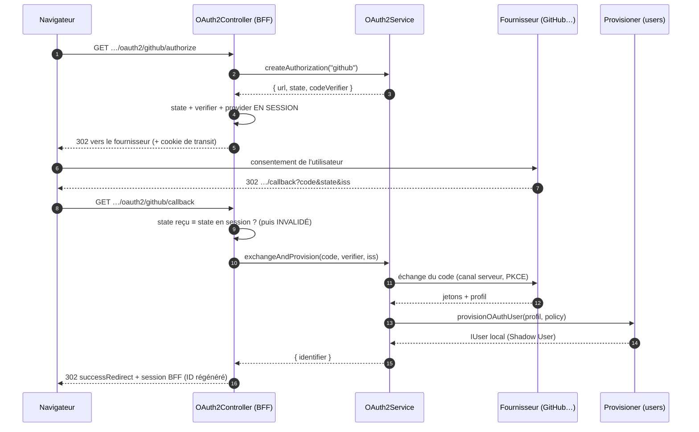

# OAuth 2.0 — social login (« Se connecter avec GitHub »)

> Ton utilisateur clique « Se connecter avec GitHub », part chez GitHub, revient — et se retrouve
> connecté à **ton** application. Nodefony orchestre ce voyage avec la posture **OAuth 2.1**
> (RFC 9700) : Authorization Code, PKCE, `state` anti-CSRF, `iss` anti-mix-up. Point clé :
> **aucun jeton n'atteint le navigateur** — le retour produit une **session BFF**, exactement la même
> qu'un login par mot de passe. Ancré sur `OAuth2Service` (`oauth2.ts:55`) et le controller BFF
> `OAuth2Controller` (`OAuth2Controller.ts:75`).

📍 [Documentation](../../../../../docs/index.md) › [Sécurité](index.md) › **OAuth2**

## 🧠 Le modèle mental — deux allers-retours, un secret qui ne bouge pas

Le social login n'est pas « GitHub nous donne l'utilisateur ». C'est **deux voyages** :

1. le navigateur va **demander un accord** chez le fournisseur et revient avec un **ticket à usage
   unique** (le `code`) ;
2. **ton serveur seul** échange ce ticket contre des jetons, sur un canal serveur-à-serveur.

L'analogie : le `code` est un **ticket de vestiaire** confié au client. Le manteau ne s'échange qu'au
comptoir, sur présentation du ticket **et** du talon que le comptoir avait gardé (le `code_verifier`
PKCE). Voler le ticket dans la poche du client ne suffit pas.



Deux propriétés se lisent sur ce schéma. Le **secret d'échange** (`clientSecret`, `code_verifier`)
ne quitte jamais le serveur. Et le **résultat** n'est pas un jeton exposé au JavaScript : c'est un
cookie de session opaque, révocable côté serveur.

## 📖 Lexique

| Terme              | Sens                                                                                                  |
| ------------------ | ----------------------------------------------------------------------------------------------------- |
| OAuth 2.0          | Protocole de **délégation d'accès** (RFC 6749). Ici détourné pour prouver une identité.               |
| OIDC               | _OpenID Connect_ : couche d'**identité** au-dessus d'OAuth ; ajoute l'**ID token** signé.             |
| IdP                | _Identity Provider_ — le fournisseur qui authentifie (Google, GitHub, Keycloak…).                     |
| Authorization Code | Le flux où le serveur échange un `code` à usage unique contre des jetons. Jamais côté client.         |
| PKCE               | _Proof Key for Code Exchange_ (RFC 7636) : lie la demande et l'échange (anti-interception du `code`). |
| `code_verifier`    | Le secret aléatoire gardé en session ; son empreinte (`code_challenge`) part avec la demande.         |
| `state`            | Jeton anti-CSRF porté à l'aller et au retour, comparé côté serveur (RFC 9700).                        |
| `iss`              | Émetteur renvoyé au callback ; doit correspondre à celui attendu (anti-mix-up, RFC 9207).             |
| Mix-up             | Attaque où un `code` émis par un IdP est présenté au callback d'un **autre** IdP.                     |
| ID token           | JWT signé par l'IdP portant les _claims_ d'identité (`sub`, `email`, `name`…).                        |
| `sub`              | _Subject_ : identifiant **stable** du compte chez le fournisseur (jamais l'e-mail).                   |
| Claim              | Une donnée d'identité attestée par l'IdP (couple clé/valeur dans l'ID token).                         |
| BFF                | _Backend For Frontend_ : l'identité vit en **session serveur**, pas en jeton exposé au JS.            |
| Shadow User        | La ligne **locale** créée à l'image du compte externe — c'est elle qui porte les rôles.               |
| JIT                | _Just In Time_ : le Shadow User est créé **au premier login**, pas par un import préalable.           |
| `arctic`           | La bibliothèque OAuth utilisée (~50 fournisseurs), chargée **paresseusement** au premier login.       |

## Qu'est-ce que c'est ? — et quelles failles ça ferme

Déléguer le login à Google ou GitHub, c'est ne plus stocker de mots de passe : plus de fuite de
hachages, plus de réinitialisation à gérer, un utilisateur qui n'invente pas un énième secret.

Mais OAuth mal implémenté est une **fabrique à comptes usurpés**. Quatre failles classiques, et ce
qui les ferme ici :

- **Vol de jeton via XSS** — si un `access_token` transite par le navigateur, tout script injecté
  peut le lire. _Fermé par construction_ : aucun jeton ne sort du serveur, le résultat est un cookie
  de session opaque (`OAuth2Controller.ts:155`).
- **Interception du `code`** — un `code` capté (log de proxy, historique, redirection ouverte) est
  échangeable par l'attaquant. _Fermé par **PKCE**_ : l'échange exige le `code_verifier` resté en
  session (`OAuth2Service.createAuthorization()`, `oauth2.ts:143-145`).
- **CSRF de login** — un tiers force ta victime à terminer **son** flux à lui : elle se retrouve
  connectée sur le compte de l'attaquant, qui lit ensuite ce qu'elle y dépose. _Fermé par le `state`_
  comparé au retour (`OAuth2Controller.callback()`, `OAuth2Controller.ts:137-145`).
- **Mix-up d'IdP** — un `code` obtenu chez un fournisseur malveillant est présenté au callback d'un
  fournisseur de confiance. _Fermé par la vérification de l'`iss`_ (`oauth2.ts:170-174`) **et** par
  l'exigence « même fournisseur qu'à l'aller » côté controller (`OAuth2Controller.ts:142`).

> [!IMPORTANT]
> Le fournisseur social te dit **qui** est la personne. Il ne te dit **rien** de ses droits.
> Se connecter avec le compte Google d'un administrateur de Google ne rend administrateur de rien
> chez toi. Les rôles viennent de la ligne locale — voir la section Shadow User.

## La vision Nodefony — un service sans transport, une session BFF

Trois partis pris, tous vérifiables au code.

**Le service ne touche ni HTTP ni session.** `OAuth2Service` rend à l'appelant les éléments à
persister (`url`, `state`, `codeVerifier`) et un simple `{ identifier }` en sortie
(`IOAuthAuthorization`, `oauth2.ts:21`). Conséquence pratique : la logique OAuth se teste **sans
serveur**, comme `AuthFlow`. Le transport (cookies, redirections 302) vit dans le controller BFF.

**Le login social finit exactement comme un login classique.** Le callback appelle
`AuthFlow.establishSessionFor()` (`authFlow.ts:215`), qui re-résout l'identité, vérifie que le compte
est actif, **régénère l'ID de session** (anti-fixation, `session.regenerateId()`, `authFlow.ts:388`)
et journalise l'événement
d'audit. Il n'existe **aucun** authenticator `oauth2` dans la chaîne du firewall : après le retour,
c'est l'authenticator `session` qui identifie chaque requête, comme après un mot de passe.

**Coût nul quand on ne s'en sert pas.** `arctic` est importé **paresseusement** au premier login
(`OAuth2Service.#ensureLib()`, `oauth2.ts:234`) — jamais au boot, jamais par requête. Les
fournisseurs sont instanciés une fois puis mémoïsés (`oauth2.ts:191-220`). Les routes ne sont montées
que si le service existe (`framework/index.ts:379`) : sans social login configuré, la surface HTTP
est **404**, pas « désactivée ».

Au boot, la config est validée et les fournisseurs configurés sont confrontés au registre : un nom
inconnu produit un **WARNING, pas un échec fatal** — `OAuth2Service.#build()` confronte les noms
configurés à `listOAuthProviders()` (`oauth2.ts:86-95`) et le
reste de l'application démarre, le bouton correspondant n'apparaît simplement pas.

## 🚀 Démarrage rapide

### Les secrets entrent par `env.ts`, la config les branche

Un fournisseur n'est monté **que si ses deux secrets sont présents** : pas de bouton mort sur l'écran
de login quand la variable manque.

```typescript
// env.ts — SEUL lecteur de process.env (catalogue typé, validé au boot).
// nodefony.config.ts — `ctx.env` EST ce catalogue (typé par le paramètre générique).
import { defineConfig, defineEnv, envString, use } from "nodefony";

export const env = defineEnv({
  GITHUB_CLIENT_ID: envString({ optional: true }),
  GITHUB_CLIENT_SECRET: envString({ optional: true }),
  // Base des callbacks : doit correspondre EXACTEMENT à l'URL enregistrée chez
  // le fournisseur (RFC 9700 — comparaison de chaînes, pas de préfixe).
  OAUTH_REDIRECT_BASE: envString({ default: "https://localhost:5152" }),
});

export default defineConfig<typeof env>((ctx) => ({
  modules: [
    "@nodefony/http",
    "@nodefony/framework",
    use("@nodefony/security", {
      oauth2: {
        // Rôles posés à la CRÉATION du compte local, jamais réécrits ensuite.
        defaultRoles: ["ROLE_USER"],
        allowSignup: true, // false = un compte local déjà lié est exigé
        successRedirect: "/",
        failureRedirect: "/login?error=oauth",
        providers: {
          // Secrets absents → fournisseur non monté, bouton non affiché.
          ...(ctx.env.GITHUB_CLIENT_ID && ctx.env.GITHUB_CLIENT_SECRET
            ? {
                github: {
                  clientId: ctx.env.GITHUB_CLIENT_ID,
                  clientSecret: ctx.env.GITHUB_CLIENT_SECRET,
                  redirectUri: `${ctx.env.OAUTH_REDIRECT_BASE}/nodefony/security/api/oauth2/github/callback`,
                },
              }
            : {}),
        },
      },
    }),
  ],
}));
```

### Les routes sont FOURNIES — tu n'écris aucun controller

`mountOAuth2Routes()` (`OAuth2Controller.ts:185`) monte trois routes sous
`/nodefony/security/api/oauth2` (`OAuth2Controller.ts:187`), et **seulement si** le service `oauth2`
est présent (`framework/index.ts:379`) :

| Route                        | Rôle                                                                  |
| ---------------------------- | --------------------------------------------------------------------- |
| `GET …/providers`            | Noms des fournisseurs **opérationnels** — l'UI n'affiche que ceux-là. |
| `GET …/{provider}/authorize` | Démarre le flux : pose l'état en session, `302` vers le fournisseur.  |
| `GET …/{provider}/callback`  | Valide, échange, provisionne, ouvre la session BFF, `302`.            |

Ton écran de login n'a donc qu'un lien à poser :

```html
<a href="/nodefony/security/api/oauth2/github/authorize"
  >Se connecter avec GitHub</a
>
```

> [!WARNING]
> Ces routes portent `bypassFirewall: true` (`OAuth2Controller.ts:213`) — elles **sont** le mécanisme
> d'authentification : l'utilisateur est anonyme pendant tout l'aller-retour. Les protéger créerait
> un interblocage (il faudrait être connecté pour pouvoir se connecter). La session anonyme ne porte
> que `state`/`code_verifier`, et son ID est **régénéré** à la promotion.

### Ce qu'on observe

```bash
# 1) Démarrage : 302 vers le fournisseur + cookie de transit + state dans l'URL
curl -si -c /tmp/jar http://localhost:5151/nodefony/security/api/oauth2/github/authorize | head -3
# HTTP/1.1 302 Found
# Location: https://github.com/login/oauth/authorize?...&state=8f2c…
# Set-Cookie: nodefony-sessid=…; HttpOnly; SameSite=Lax

# 2) Retour du fournisseur (c'est le NAVIGATEUR qui suit ce lien) → session BFF
curl -si -b /tmp/jar -c /tmp/jar \
  "http://localhost:5151/nodefony/security/api/oauth2/github/callback?code=…&state=8f2c…" | head -2
# HTTP/1.1 302 Found
# Location: /

# 3) L'identité est résolue comme après un login classique
curl -s -b /tmp/jar http://localhost:5151/nodefony/security/api/auth/me
# {"user":{"username":"jane@example.com","roles":["ROLE_USER"]}}

# 4) Ce que l'UI de login interroge pour n'afficher que des boutons vivants
curl -s http://localhost:5151/nodefony/security/api/oauth2/providers
# {"providers":["github"]}
```

Séquence identique prouvée de bout en bout sur serveur réel par `oauth2-flow.test.ts` (6 cas).

## 🏗️ Le flux, étape par étape

### Étape 1 — `createAuthorization(provider)`

`OAuth2Service.createAuthorization()` (`oauth2.ts:139`) fabrique trois choses :

1. un **`state`** aléatoire (anti-CSRF) ;
2. un **`code_verifier`** — **seulement si** le fournisseur pratique PKCE (`usesPkce`,
   `oauth2.ts:143-145`) ; `null` sinon (GitHub) ;
3. l'**URL d'autorisation** construite par l'adaptateur du fournisseur, avec les scopes effectifs
   (ceux de la config, sinon les scopes par défaut du fournisseur, `oauth2.ts:216`).

Le controller pose les trois valeurs en session, **persiste** (`session.save()` — pas seulement en
mémoire, `OAuth2Controller.ts:105-108`), puis redirige en 302.

### Étape 2 — le retour, validé avant tout appel réseau

`OAuth2Controller.callback()` (`OAuth2Controller.ts:113`) travaille dans cet ordre, et l'ordre est la
défense :

1. **lire l'état de session, puis l'invalider immédiatement** (`OAuth2Controller.ts:126-129`) — le
   `state` est à **usage unique** : un rejeu du même retour échoue, même avec le bon cookie ;
2. **comparer** : `code` et `state` présents, `state` reçu ≡ `state` attendu, **et** fournisseur du
   callback ≡ fournisseur démarré (`OAuth2Controller.ts:137-145`). Un seul écart → `302` vers
   `failureRedirect`, **sans jamais contacter le fournisseur** ;
3. seulement ensuite, `exchangeAndProvision()`.

### Étape 3 — `exchangeAndProvision(provider, code, verifier, iss)`

`OAuth2Service.exchangeAndProvision()` (`oauth2.ts:162`) enchaîne :

1. **anti-mix-up** — si le fournisseur annonce un émetteur attendu, l'`iss` reçu doit correspondre,
   et un `iss` **absent** est un rejet, pas une tolérance (`oauth2.ts:170-174`) ;
2. **échange** du `code` sur le canal serveur, avec le `code_verifier`
   (`validateAuthorizationCode`, `oauth2.ts:175`), puis lecture du profil (`fetchProfile`,
   `oauth2.ts:176`) ;
3. **provisionnement** du Shadow User avec la politique effective — rôles par défaut surchargeables
   **par fournisseur** (`oauth2.ts:180-181`), `allowSignup` global (`oauth2.ts:182-185`).

Toute erreur de cette étape est convertie en **échec uniforme** par le controller (`302
failureRedirect`, `OAuth2Controller.ts:157-160`) : le client ne distingue pas un `iss` invalide d'un
échange refusé ou d'un signup interdit.

## 🧑‍⚖️ Le Shadow User — l'identité locale, et pourquoi OAuth n'accorde aucun droit

Nodefony ne « connecte pas un compte Google ». Il crée et retrouve une **ligne locale** liée au
compte externe : le _Shadow User_. C'est cette ligne qui porte l'identifiant, les rôles, l'état
actif/verrouillé — donc **tout** ce dont l'autorisation a besoin.

Le contrat s'appelle `IOAuthUserProvisioner` (`IOAuthUserProvisioner.ts:61`) ; l'implémentation par
défaut est `UserService.provisionOAuthUser()` (`UserService.ts:306`), en **find-or-create** :

| Situation au retour du fournisseur       | Comportement                                                                   |
| ---------------------------------------- | ------------------------------------------------------------------------------ |
| Lien social déjà connu                   | Le compte existant est rendu tel quel — rien n'est créé, rien n'est réécrit.   |
| Lien inconnu, `allowSignup: true`        | Création JIT : `password: null`, rôles = `defaultRoles`, lien social persisté. |
| Lien inconnu, `allowSignup: false`       | **Échec fail-closed** (`UserService.ts:317-322`) — un compte lié est exigé.    |
| E-mail identique à un compte local       | **Aucune liaison automatique** — un compte SÉPARÉ est créé.                    |
| Même `providerId` chez deux fournisseurs | Comptes séparés (le couple `provider` + `providerId` fait la clé).             |

### Pourquoi l'e-mail ne lie jamais automatiquement un compte

C'est le point le plus contre-intuitif, et c'est une décision de sécurité. Si un compte externe dont
l'e-mail vaut `admin@ton-domaine.fr` liait automatiquement l'administrateur local, il suffirait de
créer un compte chez un fournisseur laxiste avec cette adresse pour **prendre le compte admin**. La
liaison par e-mail est donc refusée y compris quand le fournisseur certifie l'adresse
(`emailVerified` reste informatif, `IOAuthUserProvisioner.ts:24`).

Conséquence assumée : l'utilisateur qui avait un mot de passe et clique « avec GitHub » obtient un
**second** compte. Le rattachement d'un compte externe à un compte existant est une action explicite,
faite **utilisateur déjà connecté** — jamais un effet de bord du login.

L'identifiant du compte créé dérive de l'e-mail si le fournisseur en donne un, sinon d'une clé
préfixée `provider:providerId` — jamais de collision entre fournisseurs (`UserService.ts:325-326`).

### Les rôles sont posés à la création, et plus jamais

`defaultRoles` s'applique **au moment du `create`** (`UserService.ts:348`). Un second login
n'écrase rien : promouvoir quelqu'un dans ta base reste effectif, et modifier `defaultRoles` en
config ne repeint pas les comptes existants. C'est la traduction de la règle « OAuth =
authentification, pas autorisation » (`oauth2.ts:178-181`, `config.ts:822-827`).

> [!TIP]
> Un fournisseur social ne doit **jamais** figurer dans le chemin d'obtention d'un rôle privilégié.
> Le schéma de rôles de Nodefony distingue déjà `ROLE_NODEFONY_*` (plateforme) et `ROLE_*`
> (applicatif) — voir [authorization](./authorization.md).

### Brancher sa propre politique

Le provisioner est le service `users` **s'il implémente la capability**, détecté par duck-typing
(`OAuth2Service.#resolveProvisioner()`, `oauth2.ts:224-231`). S'il ne l'implémente pas, le login
**échoue** — jamais de création silencieuse par défaut. Une application qui veut sa propre politique
(quota d'inscriptions, allowlist de domaines e-mail, rattachement à un tenant) implémente
`provisionOAuthUser()` sur son service `users` : le profil normalisé `IOAuthProfile`
(`IOAuthUserProvisioner.ts:12`) lui donne `provider`, `providerId`, `email`, `emailVerified`, `name`
et la charge brute `raw`.

## 🧩 Fournisseurs — catalogue et extension

Un fournisseur est un adaptateur qui implémente `IOAuthProvider` (`IOAuthProvider.ts:21`) : il masque
les divergences (PKCE ou non, profil par ID token ou par appel d'API) derrière un contrat unique.
Trois sont livrés, résolus par nom via le registre `oauthProviderRegistry.ts:45`.

| Nom        | Famille          | PKCE | `iss` vérifié         | Profil lu depuis  | Scopes par défaut            |
| ---------- | ---------------- | :--: | --------------------- | ----------------- | ---------------------------- |
| `google`   | OIDC             |  ✅  | `accounts.google.com` | ID token (claims) | `openid`, `profile`, `email` |
| `keycloak` | OIDC self-hosted |  ✅  | URL du realm (config) | ID token (claims) | `openid`, `profile`, `email` |
| `github`   | OAuth simple     |  ❌  | — (non émis)          | API REST `/user`  | `read:user`, `user:email`    |

### `google` — OIDC, le cas nominal

Construit par le helper générique `createOidcProvider()` (`oidc.ts:48`) : PKCE systématique
(`usesPkce: true`, `oidc.ts:56`), émetteur figé `https://accounts.google.com`
(`oauthProviderRegistry.ts:74`). Le profil se lit dans l'**ID token** — claims standard `sub`,
`email`, `email_verified`, `name` (`oidc.ts:72-89`). Un ID token sans `sub` est refusé : pas
d'identifiant stable, pas d'identité (`oidc.ts:77-80`).

### `keycloak` — OIDC self-hosted, l'émetteur vient de ta config

Même helper, mais l'**issuer** (URL du realm) sert à la fois à construire le client et à valider
l'`iss` (`oauthProviderRegistry.ts:86-105`). Il est donc **obligatoire** : sans lui, la fabrique lève
au premier login avec un message explicite (`oauthProviderRegistry.ts:89-93`).

### `github` — OAuth simple, l'archétype non-OIDC

Pas de PKCE, pas d'ID token, pas d'`iss` (`usesPkce: false`, `expectedIssuer: null`,
`github.ts:43-44`) : ici, la défense anti-CSRF repose **entièrement** sur le `state`. Le profil vient
de l'API REST `/user` (`createGithubProvider()`, `github.ts:34`). Subtilité GitHub : l'e-mail
primaire est souvent privé — l'adaptateur bascule alors sur `/user/emails` et n'accepte
`emailVerified` que si GitHub le certifie (`github.ts:68-77`).

### Enregistrer le sien — sans éditer le cœur

`arctic` couvre une cinquantaine de fournisseurs (Microsoft, Apple, Discord, Auth0, Okta…). Ajouter
l'un d'eux — ou un IdP maison — se fait par `registerOAuthProvider()`
(`oauthProviderRegistry.ts:51`), au chargement de ton module (avant le `onBoot` du service) :

```typescript ignore
import { registerOAuthProvider } from "@nodefony/security";

// Tout fournisseur OIDC : nom + classe arctic + issuer. Rien d'autre à écrire.
registerOAuthProvider("microsoft", (ctx) =>
  createOidcProvider({
    name: "microsoft",
    client: new ctx.arctic.MicrosoftEntraId(
      tenantId,
      ctx.clientId,
      ctx.clientSecret,
      ctx.redirectUri,
    ),
    issuer: `https://login.microsoftonline.com/${tenantId}/v2.0`,
    decodeIdToken: ctx.arctic.decodeIdToken,
  }),
);
```

La fabrique reçoit `IOAuthProviderContext` (`oauthProviderRegistry.ts:23`) : la lib `arctic` déjà
chargée, plus les secrets issus de la config. Aucun import runtime d'`arctic` n'entre par ce chemin.
Exemple réel et sans réseau dans le dépôt : `src/modules/test/nodefony/secure/oauthTestProvider.ts`.

## ⚙️ Configuration

Section `oauth2` du schéma Zod (`config.ts:990`), branchée sur la config du module
(`config.ts:990`). Table dérivée du schéma — les défauts sont ceux du code.

| Option            | Type                 | Défaut          | Effet                                                     |
| ----------------- | -------------------- | --------------- | --------------------------------------------------------- |
| `enabled`         | booléen              | `true`          | Coupe le social login ; les routes ne montent pas.        |
| `defaultRoles`    | liste de rôles       | `["ROLE_USER"]` | Rôles du Shadow User **à la création** (`config.ts:864`). |
| `allowSignup`     | booléen              | `true`          | `false` = compte préexistant lié exigé (`config.ts:890`). |
| `successRedirect` | chemin               | `/`             | Où revient l'utilisateur après succès.                    |
| `failureRedirect` | chemin               | `/login`        | Où il revient après échec (uniforme, sans détail).        |
| `providers`       | dictionnaire par nom | `{}`            | Fournisseurs activés (`config.ts:906`).                   |

Par fournisseur (`oauthProviderSchema`, `config.ts:823`) :

<!-- prettier-ignore -->
| Option | Requis | Effet |
| --- | :---: | --- |
| `clientId` / `clientSecret` | ✅ | Identifiants délivrés par l'IdP. Secrets : par `env.ts`, jamais journalisés. |
| `redirectUri` | ✅ | URL de callback **exacte** (`config.ts:771-776`). |
| `issuer` | OIDC self-hosted | Realm Keycloak ; ignoré par les IdP à endpoints fixes. |
| `scopes` |  | Vide = scopes par défaut du fournisseur. |
| `successRedirect` / `failureRedirect` / `defaultRoles` |  | Surchargent le global **pour ce fournisseur** (`oauth2.ts:124-131`). |

Les surcharges par fournisseur permettent la cohabitation : un IdP de recette garde ses redirections
et ses rôles pendant qu'un IdP de production pointe ailleurs.

## 🔐 Sécurité — jetons du fournisseur, révocation, attaques couvertes

### Les jetons du fournisseur ne sont pas conservés

C'est un choix, et il a des conséquences à connaître. Les jetons obtenus à l'échange vivent dans la
portée locale de l'échange (`validateAuthorizationCode` puis `fetchProfile`, `oauth2.ts:175-176`) :
ils ne sont ni retournés, ni mis en
session, ni persistés. Le profil normalisé qui traverse le système n'en contient aucun
(`IOAuthUserProvisioner.ts:8-10`).

- **Conséquence 1** — la surface d'exposition est minimale : pas de coffre de jetons à protéger, pas
  de fuite possible par la base ni par la session.
- **Conséquence 2** — l'application **ne peut pas** appeler l'API du fournisseur au nom de
  l'utilisateur plus tard (lire ses dépôts, envoyer un mail). Nodefony fait de l'**authentification**,
  pas de la **délégation d'accès**.
- **Si tu as besoin de cette délégation** : le seul endroit où les jetons sont visibles est le
  `fetchProfile()` de ton adaptateur (`IOAuthProvider.ts:63`) — c'est là que ton implémentation les
  capture et les persiste, sous ta responsabilité (chiffrement au repos, rotation, révocation).

### Ce que « révoquer » veut dire ici

| Action                                        | Effet sur ton application                                                       |
| --------------------------------------------- | ------------------------------------------------------------------------------- |
| Déconnexion (`AuthFlow.logout()`)             | Session détruite côté serveur + cookie effacé — immédiat.                       |
| Compte local désactivé/verrouillé             | Rejet à la requête suivante : l'identité est **re-résolue** à chaque requête.   |
| Autorisation révoquée **chez le fournisseur** | **Aucun effet automatique** — la session locale reste valide jusqu'à son terme. |
| `allowSignup: false` après coup               | Bloque les nouveaux comptes, pas les liens existants.                           |

La troisième ligne est le piège courant : une fois la session BFF ouverte, ton application ne
redemande plus rien à GitHub. Pour couper l'accès, il faut agir **localement** (désactiver le compte
ou détruire les sessions), pas chez le fournisseur.

### Attaques couvertes, prouvées par les tests

| Vecteur                                            | Défense                                                 | Preuve                           |
| -------------------------------------------------- | ------------------------------------------------------- | -------------------------------- |
| Rejeu du retour (même `code`, même `state`)        | `state` consommé + session régénérée à la promotion     | `oauth2-attack.test.ts:89` (S5)  |
| `state` valide présenté au callback d'un autre IdP | Fournisseur attendu conservé en session et comparé      | `oauth2-attack.test.ts:115` (S6) |
| `iss` falsifié ou absent                           | Comparaison stricte à `expectedIssuer`                  | `oauth2Service.test.ts:168`      |
| Prise de compte par e-mail collidant un admin      | Aucune liaison auto : compte séparé, admin intact       | `oauth.attack.test.ts:71` (A1)   |
| Élévation de privilège par re-login                | Rôles posés à la création, jamais réécrits              | `oauth.attack.test.ts:123` (A2)  |
| Collision d'identifiants entre fournisseurs        | Clé = `provider` + `providerId`                         | `oauth.attack.test.ts:155` (A3)  |
| Interception du `code`                             | PKCE : `code_verifier` exigé, refus si absent           | `oauthProviders.test.ts:67`      |
| Création de compte non voulue                      | Provisioner absent (`provisionOAuthUser`) → fail-closed | `oauth2Service.test.ts:192`      |

## 📜 Normes appliquées

| Domaine                           | Norme                    | Ancrage                                                                 |
| --------------------------------- | ------------------------ | ----------------------------------------------------------------------- |
| Flux Authorization Code           | RFC 6749                 | `IOAuthProvider.validateAuthorizationCode()` (`IOAuthProvider.ts:53`)   |
| PKCE                              | RFC 7636                 | `usesPkce` (`IOAuthProvider.ts:26`) · `oidc.ts:49-54`                   |
| Sécurité OAuth (BCP 2.1)          | RFC 9700                 | `OAuth2Service` (`oauth2.ts:40`) · `oauth2Schema` (`config.ts:811-814`) |
| Anti-mix-up (`iss`)               | RFC 9207                 | `expectedIssuer` (`IOAuthProvider.ts:34`) · `oauth2.ts:170-174`         |
| Callback en correspondance exacte | RFC 9700 §4              | `redirectUri` (`config.ts:771-776`)                                     |
| Claims d'identité OIDC            | OpenID Connect Core      | `fetchProfile()` du helper OIDC (`oidc.ts:72-89`)                       |
| ID token consommé en code flow    | RFC 8725                 | `createOidcProvider()` (`oidc.ts:46`)                                   |
| Anti-fixation de session          | OWASP Session Management | `session.regenerateId()` au login (`authFlow.ts:388`)                   |

Flux **exclus** par posture 2.1, et donc absents du code : `implicit` (jeton en fragment d'URL) et
`password` / ROPC (l'application verrait le mot de passe du fournisseur).

## 📡 Observabilité — Studio

L'écran de connexion de Studio consomme directement le data plane : il interroge
`/nodefony/security/api/oauth2/providers` (`Login.tsx:341`) et n'affiche **que** les fournisseurs
opérationnels — zéro bouton mort. Le clic déclenche la redirection vers `authorize`
(`Login.tsx:84`).

Côté suivi, chaque login réussi produit un événement d'audit `auth` / `login.success` via
`AuthFlow.establishSessionFor()` (`authFlow.ts:229-236`), consultable dans l'écran **Audit**. La
session ouverte apparaît dans l'écran **Sessions** (IP et agent capturés à l'ouverture) ; le compte
provisionné dans l'écran **Users**, avec ses rôles réels.

> [!NOTE]
> L'événement d'audit du login social porte la raison par défaut `federated`
> (`authFlow.ts:218`) : le controller n'affine pas le facteur. Pour distinguer OAuth de WebAuthn dans
> un filtre d'audit, s'appuyer sur le contexte de la requête plutôt que sur cette seule valeur.

## ⚠️ Pièges (symptôme → cause → correction)

| Symptôme                                          | Cause (dans le code)                                                          | Correction                                                          |
| ------------------------------------------------- | ----------------------------------------------------------------------------- | ------------------------------------------------------------------- |
| `404` sur `…/oauth2/…`                            | Service `oauth2` absent (module non chargé / `enabled: false`)                | Charger `@nodefony/security` et activer `oauth2`                    |
| WARNING « inconnu du registre » au boot           | Nom configuré sans fabrique (`oauth2.ts:86-95`)                               | `registerOAuthProvider()` au chargement du module, ou builtin       |
| `404` « Unknown provider » sur `authorize`        | Le nom n'est pas dans `listProviders()` (`OAuth2Controller.ts:97`)            | Vérifier le nom exact **et** la présence des secrets                |
| Bouton absent de l'écran de login                 | Secrets manquants → fournisseur non monté (spread conditionnel)               | Renseigner `clientId`/`clientSecret` dans l'env                     |
| `redirect_uri_mismatch` chez le fournisseur       | `redirectUri` ≠ URL enregistrée, au caractère près (`config.ts:771-776`)      | Aligner schéma, hôte, port et chemin `/…/{provider}/callback`       |
| Retour systématique sur `failureRedirect`         | `state`/`verifier` absents (cookie perdu entre les deux requêtes)             | Vérifier `SameSite`/domaine du cookie ; un seul hôte en dev         |
| Callback échoue au **deuxième** essai             | `state` à usage unique, consommé (`OAuth2Controller.ts:126-129`)              | Refaire le flux depuis `authorize` — comportement attendu           |
| `OAuth issuer mismatch`                           | `iss` reçu ≠ `expectedIssuer` (`oauth2.ts:170-174`)                           | Corriger `issuer` (Keycloak : URL exacte du realm)                  |
| Keycloak : erreur dès le premier login            | `issuer` absent en config (`oauthProviderRegistry.ts:89-93`)                  | Renseigner l'URL du realm                                           |
| « provisioning indisponible »                     | `users` n'implémente pas la capability (`oauth2.ts:224-231`)                  | Implémenter `provisionOAuthUser()` sur le service `users`           |
| Profil connu refusé                               | `allowSignup: false` sans lien préexistant (`UserService.ts:317-322`)         | Activer `allowSignup` ou lier le compte au préalable                |
| Doublon de compte pour un utilisateur existant    | Aucune liaison auto par e-mail (choix de sécurité)                            | Rattacher explicitement, utilisateur connecté                       |
| Rôle attendu absent après re-login                | Rôles posés à la **création** seulement (`UserService.ts:348`)                | Modifier les rôles en base ; `defaultRoles` ne réécrit rien         |
| Jeton du fournisseur introuvable côté application | `IOAuthProfile` n'en porte aucun, par choix (`IOAuthUserProvisioner.ts:8-10`) | Le capturer dans son propre `fetchProfile()` et le stocker soi-même |

## 🧪 Tests & couverture

Trois familles couvrent le social login — les chiffres exacts vivent dans la carte de l'aperçu
(régénérée depuis vitest, jamais figée ici) :

- **unitaires** — `oauth2Service.test` (boot, introspection, les deux étapes, anti-mix-up,
  provisioning fail-closed), `oauthProviders.test` (registre, helper OIDC, adaptateur GitHub avec
  e-mail public et privé), `oauthProvisioner.test` (find-or-create, JIT, signup interdit, non-liaison
  par e-mail) ;
- **intégration** — `oauth2-flow.test` : le flux complet sur **serveur réel**, du `302` d'`authorize`
  à l'identité résolue par `/me`, avec un fournisseur de test déterministe et sans réseau ;
- **attaque** — `oauth2-attack.test` (rejeu du `state`, mix-up de fournisseur) et
  `oauth.attack.test` (collision d'e-mail avec un admin, élévation par re-login, collision
  d'identifiants entre fournisseurs).

Ce qui **manque** : aucun banc de charge dédié au social login (le flux est un chemin froid, deux
requêtes par connexion), et aucun test contre un IdP réel (impossible à automatiser — le fournisseur
de test couvre la branche PKCE).

Couverture : `npm run coverage` dans `@nodefony/security`. Campagnes d'attaque : skill
`nodefony-security-review` (mode red/blue-team).

## 🔗 Pour aller plus loin

- ⬆️ **Retour au hub** : [Sécurité — vue d'ensemble](index.md) · [Toute la documentation](../../../../../docs/index.md)
- 🧭 **Pages sœurs** : [Authenticators](authenticators.md) · [Jetons](tokens.md)

- La session produite par le login → [session](../../http/docs/session.md) ·
  [authenticators](./authenticators.md)
- Ce qui décide des droits une fois connecté → [authorization](./authorization.md)
- Les autres facteurs sans mot de passe → [webauthn](./webauthn.md) · [totp](./totp.md)
- Jetons d'API pour les machines (le pendant non-humain) → [tokens](./tokens.md)
- Vue d'ensemble du module → [index](./index.md) · Termes transverses → [lexique](./lexique.md)
