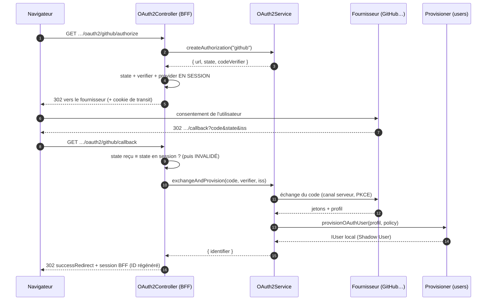

# OAuth 2.0 — social login (« Se connecter avec GitHub »)

> Ton utilisateur clique « Se connecter avec GitHub », part chez GitHub, revient — et se retrouve
> connecté à **ton** application. Nodefony orchestre ce voyage avec la posture **OAuth 2.1**
> (RFC 9700) : Authorization Code, PKCE, `state` anti-CSRF, `iss` anti-mix-up. Point clé :
> **aucun jeton n'atteint le navigateur** — le retour produit une **session BFF**, exactement la même
> qu'un login par mot de passe. Ancré sur `OAuth2Service` (`oauth2.ts:280`) et le controller BFF
> `OAuth2Controller` (`OAuth2Controller.ts:89`).

📍 [Documentation](../../../../../docs/index.md) › [Sécurité](index.md) › **OAuth2**

## 🧠 Le modèle mental — deux allers-retours, un secret qui ne bouge pas

Le social login n'est pas « GitHub nous donne l'utilisateur ». C'est **deux voyages** :

1. le navigateur va **demander un accord** chez le fournisseur et revient avec un **ticket à usage
   unique** (le `code`) ;
2. **ton serveur seul** échange ce ticket contre des jetons, sur un canal serveur-à-serveur.

L'analogie : le `code` est un **ticket de vestiaire** confié au client. Le manteau ne s'échange qu'au
comptoir, sur présentation du ticket **et** du talon que le comptoir avait gardé (le `code_verifier`
PKCE). Voler le ticket dans la poche du client ne suffit pas.


```mermaid
sequenceDiagram
  autonumber
  participant U as Navigateur
  participant C as OAuth2Controller (BFF)
  participant S as OAuth2Service
  participant P as Fournisseur (GitHub…)
  participant D as Provisioner (users)
  U->>C: GET …/oauth2/github/authorize
  C->>S: createAuthorization("github")
  S-->>C: { url, state, codeVerifier }
  C->>C: state + verifier + provider EN SESSION
  C-->>U: 302 vers le fournisseur (+ cookie de transit)
  U->>P: consentement de l'utilisateur
  P-->>U: 302 …/callback?code&state&iss
  U->>C: GET …/oauth2/github/callback
  C->>C: state reçu ≡ state en session ? (puis INVALIDÉ)
  C->>S: exchangeAndProvision(code, verifier, iss)
  S->>P: échange du code (canal serveur, PKCE)
  P-->>S: jetons + profil
  S->>D: provisionOAuthUser(profil, policy)
  D-->>S: IUser local (Shadow User)
  S-->>C: { identifier }
  C-->>U: 302 successRedirect + session BFF (ID régénéré)
```

Deux propriétés se lisent sur ce schéma. Le **secret d'échange** (`clientSecret`, `code_verifier`)
ne quitte jamais le serveur. Et le **résultat** n'est pas un jeton exposé au JavaScript : c'est un
cookie de session opaque, révocable côté serveur.

## 📖 Lexique

| Terme              | Sens                                                                                                    |
| ------------------ | ------------------------------------------------------------------------------------------------------- |
| OAuth 2.0          | Protocole de **délégation d'accès** (RFC 6749). Ici détourné pour prouver une identité.                 |
| OIDC               | _OpenID Connect_ : couche d'**identité** au-dessus d'OAuth ; ajoute l'**ID token** signé.               |
| IdP                | _Identity Provider_ — le fournisseur qui authentifie (Google, GitHub, Keycloak…).                       |
| Authorization Code | Le flux où le serveur échange un `code` à usage unique contre des jetons. Jamais côté client.           |
| PKCE               | _Proof Key for Code Exchange_ (RFC 7636) : lie la demande et l'échange (anti-interception du `code`).   |
| `code_verifier`    | Le secret aléatoire gardé en session ; son empreinte (`code_challenge`) part avec la demande.           |
| `state`            | Jeton anti-CSRF porté à l'aller et au retour, comparé côté serveur (RFC 9700).                          |
| `iss`              | Émetteur renvoyé au callback ; doit correspondre à celui attendu (anti-mix-up, RFC 9207).               |
| Mix-up             | Attaque où un `code` émis par un IdP est présenté au callback d'un **autre** IdP.                       |
| ID token           | JWT signé par l'IdP portant les _claims_ d'identité (`sub`, `email`, `name`…).                          |
| `sub`              | _Subject_ : identifiant **stable** du compte chez le fournisseur (jamais l'e-mail).                     |
| Claim              | Une donnée d'identité attestée par l'IdP (couple clé/valeur dans l'ID token).                           |
| BFF                | _Backend For Frontend_ : l'identité vit en **session serveur**, pas en jeton exposé au JS.              |
| Shadow User        | La ligne **locale** créée à l'image du compte externe — c'est elle qui porte les rôles.                 |
| JIT                | _Just In Time_ : le Shadow User est créé **au premier login**, pas par un import préalable.             |
| Découverte         | L'IdP publie ses points d'entrée (RFC 8414) : son seul émetteur suffit à le décrire, aucune URL en dur. |

## Qu'est-ce que c'est ? — et quelles failles ça ferme

Déléguer le login à Google ou GitHub, c'est ne plus stocker de mots de passe : plus de fuite de
hachages, plus de réinitialisation à gérer, un utilisateur qui n'invente pas un énième secret.

Mais OAuth mal implémenté est une **fabrique à comptes usurpés**. Quatre failles classiques, et ce
qui les ferme ici :

- **Vol de jeton via XSS** — si un `access_token` transite par le navigateur, tout script injecté
  peut le lire. _Fermé par construction_ : aucun jeton ne sort du serveur, le résultat est un cookie
  de session opaque (`OAuth2Controller.ts:192`).
- **Interception du `code`** — un `code` capté (log de proxy, historique, redirection ouverte) est
  échangeable par l'attaquant. _Fermé par **PKCE**_ : l'échange exige le `code_verifier` resté en
  session (`OAuth2Service.createAuthorization()`, `oauth2.ts:455-466`).
- **CSRF de login** — un tiers force ta victime à terminer **son** flux à lui : elle se retrouve
  connectée sur le compte de l'attaquant, qui lit ensuite ce qu'elle y dépose. _Fermé par le `state`_
  comparé au retour (`OAuth2Controller.callback()`, `OAuth2Controller.ts:198-227`).
- **Mix-up d'IdP** — un `code` obtenu chez un fournisseur malveillant est présenté au callback d'un
  fournisseur de confiance. _Fermé par la vérification de l'`iss`_ (`oauth2.ts:402-408`) **et** par
  l'exigence « même fournisseur qu'à l'aller » côté controller (`OAuth2Controller.ts:170`).

> [!IMPORTANT]
> Le fournisseur social te dit **qui** est la personne. Il ne te dit **rien** de ses droits.
> Se connecter avec le compte Google d'un administrateur de Google ne rend administrateur de rien
> chez toi. Les rôles viennent de la ligne locale — voir la section Shadow User.

## La vision Nodefony — un service sans transport, une session BFF

Trois partis pris, tous vérifiables au code.

**Le service ne touche ni HTTP ni session.** `OAuth2Service` rend à l'appelant les éléments à
persister (`url`, `state`, `codeVerifier`) et un simple `{ identifier }` en sortie
(`IOAuthAuthorization`, `oauth2.ts:177`). Conséquence pratique : la logique OAuth se teste **sans
serveur**, comme `AuthFlow`. Le transport (cookies, redirections 302) vit dans le controller BFF.

**Le login social finit exactement comme un login classique.** Le callback appelle
`AuthFlow.establishSessionFor()` (`authFlow.ts:236`), qui re-résout l'identité, vérifie que le compte
est actif, **régénère l'ID de session** (anti-fixation, `session.regenerateId()`, `authFlow.ts:388`)
et journalise l'événement
d'audit. Il n'existe **aucun** authenticator `oauth2` dans la chaîne du firewall : après le retour,
c'est l'authenticator `session` qui identifie chaque requête, comme après un mot de passe.

**Coût nul quand on ne s'en sert pas.** Aucune dépendance tierce : le client OAuth 2.0 est écrit
dans le module (`OAuth2Client`, `oauth2Client.ts:335`), et `jose` — seul recours externe, pour lire les claims de
l'ID token — est importé **paresseusement**. Les fournisseurs sont construits une fois puis
mémoïsés (`OAuth2Service.#resolveProvider()`) : c'est là, une seule fois par processus, que les
points d'entrée d'un émetteur OIDC sont découverts. Un run qui sert (ports ouverts) les construit
dès le boot, sans l'attendre ; une commande console ne touche jamais le réseau.

**Une configuration fausse se montre au démarrage, pas au premier clic.** Au boot, l'`issuer` de
chaque fournisseur est confronté à ce que sa fabrique exige (`checkProviderIssuer()`,
`oauth2.ts`) : absent alors que la fabrique l'a déclaré requis, ou qui n'est pas une URL d'émetteur
valide (https, sans requête ni fragment — RFC 8414 §2), il **interrompt le démarrage** en nommant
la clé (`security.oauth2.providers.<nom>.issuer`). Un émetteur **injoignable**, lui, n'est pas une
faute de configuration : le boot continue, un WARNING le nomme, et son bouton quitte l'écran de
connexion — le flux `authorize` reste ouvert. Une nouvelle tentative part au plus toutes les 30 s
pendant que l'écran est affiché ; le bouton revient dès qu'elle réussit. Les routes sont montées dès
que `@nodefony/security` est chargé (`framework/index.ts:460`) : sans social login configuré,
`…/providers` rend une liste vide, `authorize` rend `404 Unknown provider`, et `authorize`/`callback`
rendent `503 OAuth unavailable` quand `oauth2.enabled` vaut `false`.

Au boot, la config est validée et les fournisseurs configurés sont confrontés au registre : un nom
inconnu produit un **WARNING, pas un échec fatal** — `OAuth2Service.#build()` confronte les noms
configurés à `listOAuthProviders()` (`oauth2.ts:280`) et le
reste de l'application démarre, le bouton correspondant n'apparaît simplement pas.

## 🚀 Démarrage rapide

### Les secrets entrent par `env.ts`, la config les branche

Un fournisseur n'est monté **que si ses deux secrets sont présents** : pas de bouton mort sur l'écran
de login quand la variable manque.

> **Pourquoi ces deux noms n'ont pas de préfixe `NF_`, contrairement à la règle.** Le préfixe dit à
> qui appartient la valeur, pas qui la lit — et `GITHUB_CLIENT_ID` vous est **délivré par GitHub**.
> Son nom est celui que la documentation du fournisseur, Auth.js et Passport emploient déjà : si
> votre application en a une, Nodefony la lit telle quelle plutôt que de vous faire recopier la même
> valeur sous un second nom, qui finirait par diverger. La base des callbacks, elle, n'est émise par
> personne : c'est un réglage que votre application se donne, donc `NF_OAUTH_REDIRECT_BASE`.

```typescript
// env.ts — SEUL lecteur de process.env (catalogue typé, validé au boot).
// nodefony.config.ts — `ctx.env` EST ce catalogue (typé par le paramètre générique).
import { defineConfig, defineEnv, envString, use } from "nodefony";

export const env = defineEnv({
  GITHUB_CLIENT_ID: envString({ optional: true }),
  GITHUB_CLIENT_SECRET: envString({ optional: true }),
  // Base des callbacks : doit correspondre EXACTEMENT à l'URL enregistrée chez
  // le fournisseur (RFC 9700 — comparaison de chaînes, pas de préfixe).
  NF_OAUTH_REDIRECT_BASE: envString({ default: "https://localhost:5152" }),
});

export default defineConfig<typeof env>((ctx) => ({
  modules: [
    "@nodefony/http",
    "@nodefony/framework",
    use("@nodefony/security", {
      oauth2: {
        // Rôles posés à la CRÉATION du compte local, jamais réécrits ensuite.
        defaultRoles: ["ROLE_USER"],
        allowSignup: true, // false = un compte local déjà lié est exigé
        successRedirect: "/",
        failureRedirect: "/login?error=oauth",
        providers: {
          // Secrets absents → fournisseur non monté, bouton non affiché.
          ...(ctx.env.GITHUB_CLIENT_ID && ctx.env.GITHUB_CLIENT_SECRET
            ? {
                github: {
                  clientId: ctx.env.GITHUB_CLIENT_ID,
                  clientSecret: ctx.env.GITHUB_CLIENT_SECRET,
                  redirectUri: `${ctx.env.NF_OAUTH_REDIRECT_BASE}/nodefony/security/api/oauth2/github/callback`,
                },
              }
            : {}),
        },
      },
    }),
  ],
}));
```

### Les routes sont FOURNIES — tu n'écris aucun controller

`mountOAuth2Routes()` (`OAuth2Controller.ts:373`) monte quatre routes sous
`/nodefony/security/api/oauth2` (`OAuth2Controller.ts:373`) dès que le service `oauth2` est
enregistré, c'est-à-dire dès que `@nodefony/security` est chargé (`framework/index.ts:460`) :

| Route                                  | Rôle                                                                                                                                              |
| -------------------------------------- | ------------------------------------------------------------------------------------------------------------------------------------------------- |
| `GET …/providers`                      | Noms des fournisseurs **opérationnels** — l'UI n'affiche que ceux-là.                                                                             |
| `GET …/{provider}/authorize`           | Démarre le flux : pose l'état en session, `302` vers le fournisseur.                                                                              |
| `GET …/{provider}/callback`            | Valide, échange, provisionne, ouvre la session BFF, `302`.                                                                                        |
| `POST …/{provider}/backchannel-logout` | Canal arrière : le fournisseur demande de fermer des sessions (cf [§ canal arrière](#déconnexion-demandée-par-le-fournisseur--le-canal-arrière)). |

Ton écran de login n'a donc qu'un lien à poser :

```html
<a href="/nodefony/security/api/oauth2/github/authorize"
  >Se connecter avec GitHub</a
>
```

> [!WARNING]
> Ces routes portent `bypassFirewall: true` (`OAuth2Controller.ts:407`) — elles **sont** le mécanisme
> d'authentification : l'utilisateur est anonyme pendant tout l'aller-retour. Les protéger créerait
> un interblocage (il faudrait être connecté pour pouvoir se connecter). La session anonyme ne porte
> que `state`/`code_verifier`, et son ID est **régénéré** à la promotion. Le canal arrière, lui,
> est appelé **serveur à serveur** : ni cookie, ni session, ni jeton CSRF — la signature du jeton de
> déconnexion est sa seule authentification.

### Ce qu'on observe

```bash
# 1) Démarrage : 302 vers le fournisseur + cookie de transit + state dans l'URL
curl -si -c /tmp/jar http://localhost:5151/nodefony/security/api/oauth2/github/authorize | head -3
# HTTP/1.1 302 Found
# Location: https://github.com/login/oauth/authorize?...&state=8f2c…
# Set-Cookie: nodefony-sessid=…; HttpOnly; SameSite=Lax

# 2) Retour du fournisseur (c'est le NAVIGATEUR qui suit ce lien) → session BFF
curl -si -b /tmp/jar -c /tmp/jar \
  "http://localhost:5151/nodefony/security/api/oauth2/github/callback?code=…&state=8f2c…" | head -2
# HTTP/1.1 302 Found
# Location: /

# 3) L'identité est résolue comme après un login classique
curl -s -b /tmp/jar http://localhost:5151/nodefony/security/api/auth/me
# {"user":{"username":"jane@example.com","roles":["ROLE_USER"]}}

# 4) Ce que l'UI de login interroge pour n'afficher que des boutons vivants
curl -s http://localhost:5151/nodefony/security/api/oauth2/providers
# {"providers":[{"name":"github","label":"GitHub"}]}
```

Séquence identique prouvée de bout en bout sur serveur réel par `oauth2-flow.test.ts` (6 cas).

## 🏗️ Le flux, étape par étape

### Étape 1 — `createAuthorization(provider)`

`OAuth2Service.createAuthorization()` (`oauth2.ts:467`) fabrique trois choses :

1. un **`state`** aléatoire (anti-CSRF) ;
2. un **`code_verifier`** — **seulement si** le fournisseur pratique PKCE (`usesPkce`,
   `oauth2.ts:458-460`) ; `null` sinon (GitHub) ;
3. l'**URL d'autorisation** construite par l'adaptateur du fournisseur, avec les scopes effectifs
   (ceux de la config, sinon les scopes par défaut du fournisseur, `oauth2.ts:576`).

Le controller pose les trois valeurs en session, **persiste** (`session.save()` — pas seulement en
mémoire, `OAuth2Controller.ts:55`), puis redirige en 302.

### Étape 2 — le retour, validé avant tout appel réseau

`OAuth2Controller.callback()` (`OAuth2Controller.ts:213`) travaille dans cet ordre, et l'ordre est la
défense :

1. **lire l'état de session, puis l'invalider immédiatement** (`OAuth2Controller.ts:158-166`) — le
   `state` est à **usage unique** : un rejeu du même retour échoue, même avec le bon cookie ;
2. **comparer** : `code` et `state` présents, `state` reçu ≡ `state` attendu, **et** fournisseur du
   callback ≡ fournisseur démarré (`OAuth2Controller.ts:231-241`). Un seul écart → `302` vers
   `failureRedirect`, **sans jamais contacter le fournisseur** ;
3. seulement ensuite, `exchangeAndProvision()`.

### Étape 3 — `exchangeAndProvision(provider, code, verifier, iss)`

`OAuth2Service.exchangeAndProvision()` (`oauth2.ts:489`) enchaîne :

1. **anti-mix-up** — si le fournisseur annonce un émetteur attendu, l'`iss` reçu doit correspondre,
   et un `iss` **absent** est un rejet, pas une tolérance (`oauth2.ts:402-408`) ;
2. **échange** du `code` sur le canal serveur, avec le `code_verifier`
   (`validateAuthorizationCode`, `oauth2.ts:479`), puis lecture du profil (`fetchProfile`,
   `oauth2.ts:501`) ;
3. **provisionnement** du Shadow User avec la politique effective — rôles par défaut surchargeables
   **par fournisseur** (`oauth2.ts:417-418`), `allowSignup` global (`oauth2.ts:524`).

Toute erreur de cette étape est convertie en **échec uniforme** par le controller (`302
failureRedirect`, `OAuth2Controller.ts:198-209`) : le client ne distingue pas un `iss` invalide d'un
échange refusé ou d'un signup interdit.

## 🧑‍⚖️ Le Shadow User — l'identité locale, et pourquoi OAuth n'accorde aucun droit

Nodefony ne « connecte pas un compte Google ». Il crée et retrouve une **ligne locale** liée au
compte externe : le _Shadow User_. C'est cette ligne qui porte l'identifiant, les rôles, l'état
actif/verrouillé — donc **tout** ce dont l'autorisation a besoin.

Le contrat s'appelle `IOAuthUserProvisioner` (`IOAuthUserProvisioner.ts:61`) ; l'implémentation par
défaut est `UserService.provisionOAuthUser()` (`UserService.ts:363`), en **find-or-create** :

| Situation au retour du fournisseur       | Comportement                                                                   |
| ---------------------------------------- | ------------------------------------------------------------------------------ |
| Lien social déjà connu                   | Le compte existant est rendu tel quel — rien n'est créé, rien n'est réécrit.   |
| Lien inconnu, `allowSignup: true`        | Création JIT : `password: null`, rôles = `defaultRoles`, lien social persisté. |
| Lien inconnu, `allowSignup: false`       | **Échec fail-closed** (`UserService.ts:374`) — un compte lié est exigé.        |
| E-mail identique à un compte local       | **Aucune liaison automatique** — un compte SÉPARÉ est créé.                    |
| Même `providerId` chez deux fournisseurs | Comptes séparés (le couple `provider` + `providerId` fait la clé).             |

⚠️ **`allowSignup: true` (le défaut) + une zone sans `roles` = une zone ouverte à tout compte du
fournisseur.** Une zone qui n'exige aucun rôle laisse passer toute identité authentifiée ; avec la
création à la volée, cela veut dire quiconque obtient un compte chez Google ou GitHub. Le pare-feu le
signale au démarrage (`WARNING`), dans la console (`openToSignup` de la zone) et dans
`nodefony doctor --live` — c'est un constat, pas une faute (`findZonesOpenToSignup`,
`openToSignup.ts:40`). Deux gestes le soldent : `roles: ["ROLE_USER"]` sur la zone, qui ne change
rien au comportement mais **écrit** l'intention, ou `allowSignup: false`, qui exige un compte
préexistant.

### Pourquoi l'e-mail ne lie jamais automatiquement un compte

C'est le point le plus contre-intuitif, et c'est une décision de sécurité. Si un compte externe dont
l'e-mail vaut `admin@ton-domaine.fr` liait automatiquement l'administrateur local, il suffirait de
créer un compte chez un fournisseur laxiste avec cette adresse pour **prendre le compte admin**. La
liaison par e-mail est donc refusée y compris quand le fournisseur certifie l'adresse
(`emailVerified` reste informatif, `IOAuthUserProvisioner.ts:24`).

Conséquence assumée : l'utilisateur qui avait un mot de passe et clique « avec GitHub » obtient un
**second** compte. Le rattachement d'un compte externe à un compte existant est une action explicite,
faite **utilisateur déjà connecté** — jamais un effet de bord du login.

L'identifiant du compte créé dérive de l'e-mail si le fournisseur en donne un, sinon d'une clé
préfixée `provider:providerId` — jamais de collision entre fournisseurs (`UserService.ts:382-383`).

### Les rôles sont posés à la création, et plus jamais

`defaultRoles` s'applique **au moment du `create`** (`UserService.ts:405`). Un second login
n'écrase rien : promouvoir quelqu'un dans ta base reste effectif, et modifier `defaultRoles` en
config ne repeint pas les comptes existants. C'est la traduction de la règle « OAuth =
authentification, pas autorisation » (`oauth2.ts:414-418`, `config.ts:1059-1064`).

> [!TIP]
> Un fournisseur social ne doit **jamais** figurer dans le chemin d'obtention d'un rôle privilégié.
> Le schéma de rôles de Nodefony distingue déjà `ROLE_NODEFONY_*` (plateforme) et `ROLE_*`
> (applicatif) — voir [authorization](./authorization.md).

### Brancher sa propre politique

Le provisioner est le service `users` **s'il implémente la capability**, détecté par duck-typing
(`OAuth2Service.#resolveProvisioner()`, `oauth2.ts:849-857`). S'il ne l'implémente pas, le login
**échoue** — jamais de création silencieuse par défaut. Une application qui veut sa propre politique
(quota d'inscriptions, allowlist de domaines e-mail, rattachement à un tenant) implémente
`provisionOAuthUser()` sur son service `users` : le profil normalisé `IOAuthProfile`
(`IOAuthUserProvisioner.ts:12`) lui donne `provider`, `providerId`, `email`, `emailVerified`, `name`
et la charge brute `raw`.

## 🧩 Fournisseurs — catalogue et extension

Un fournisseur est un adaptateur qui implémente `IOAuthProvider` (`IOAuthProvider.ts:67`) : il masque
les divergences (PKCE ou non, profil par ID token ou par appel d'API) derrière un contrat unique.
Quatre sont livrés, résolus par nom via le registre `oauthProviderRegistry.ts:62`.

| Nom        | Famille          | PKCE | `iss` vérifié         | Profil lu depuis  | Scopes par défaut            |
| ---------- | ---------------- | :--: | --------------------- | ----------------- | ---------------------------- |
| `google`   | OIDC             |  ✅  | `accounts.google.com` | ID token (claims) | `openid`, `profile`, `email` |
| `keycloak` | OIDC self-hosted |  ✅  | URL du realm (config) | ID token (claims) | `openid`, `profile`, `email` |
| `oidc`     | OIDC générique   |  ✅  | émetteur (config)     | ID token (claims) | `openid`, `profile`, `email` |
| `github`   | OAuth simple     |  ❌  | — (non émis)          | API REST `/user`  | `read:user`, `user:email`    |

### `google` — OIDC, le cas nominal

Construit par le helper générique `createOidcProvider()` (`oidc.ts:177`) : PKCE systématique
(`usesPkce: true`, `oidc.ts:114`), émetteur figé `https://accounts.google.com`
(`oauthProviderRegistry.ts:129`). Ses points d'entrée ne sont **pas** écrits en dur : ils sont
demandés à l'émetteur (RFC 8414, cf. « Découverte » plus bas). Le profil se lit dans l'**ID token** —
claims standard `sub`, `email`, `email_verified`, `name` (`oidc.ts:217`), après les contrôles
obligatoires d'OpenID Connect Core §3.1.3.7 : `iss`, `aud`, `exp`, et un `sub` non vide
(`assertIdTokenClaims()`, `oidc.ts:143`). Pas d'identifiant stable, pas d'identité.

### `keycloak` — OIDC self-hosted, l'émetteur vient de ta config

Même helper, mais l'**issuer** (URL du realm) sert à la fois à découvrir les points d'entrée et à
valider l'`iss`. Il est donc **obligatoire**, et déclaré comme tel au registre
(`requiresIssuer: true`) : sans lui, le démarrage est refusé en nommant la clé.
Créer le realm et le client, lire l'émetteur, réussir le premier login : la page
[Keycloak](keycloak.md) fait le chemin entier.

### `oidc` — n'importe quel serveur OpenID Connect

La même mécanique, sans nom de marque : l'entrée `oidc` (`oauthProviderRegistry.ts:142`) prend
l'émetteur de sa configuration et n'a besoin de rien d'autre. C'est elle qui rend inutile une classe
par fournisseur.

### Le paramètre `iss` — une règle à TROIS états, pas deux

La RFC 9207 ajoute un paramètre `iss` à la réponse d'autorisation, pour qu'un client branché sur
plusieurs fournisseurs ne confonde pas leurs réponses. Mais elle ne l'impose pas à tous : son §2.4
demande au client d'extraire `iss` **« if the parameter is present »**, et son §2.3 fait ANNONCER ce
support par les métadonnées de l'émetteur (`authorization_response_iss_parameter_supported`).

D'où trois cas, et non deux :

| Le serveur l'annonce | `iss` reçu            | Verdict                                  |
| :------------------: | --------------------- | ---------------------------------------- |
|         oui          | absent                | **refus** — il a promis, il n'a pas tenu |
|      oui ou non      | présent et discordant | **refus**                                |
|         non          | absent                | on continue — le serveur est conforme    |

Exiger `iss` d'un serveur qui n'a jamais promis de l'émettre reviendrait à refuser un serveur
conforme (Microsoft Entra n'annonce pas ce support). Ce n'est pas un relâchement : la défense
anti-mix-up **principale** est ailleurs — chaque fournisseur a son URL de redirection propre
(`…/{provider}/callback`) et le flux vérifie que le fournisseur de retour est celui qui a démarré,
ce que la RFC 9700 §4.4.2.2 donne comme la protection de référence. `iss` est la seconde ceinture.

La politique est portée par le fournisseur (`issuerPolicy`, `IOAuthProvider.ts:79`) et remplie par
la découverte ; elle vaut `null` pour un fournisseur non-OIDC, qui ne relève pas de cette défense.

### Découverte des points d'entrée (RFC 8414)

Aucune URL de fournisseur n'est écrite en dur — sauf GitHub, qui ne publie pas de métadonnées. Les
points d'entrée sont demandés à l'émetteur, une seule fois par processus, au premier login.

**Cette règle n'est pas réécrite ici** : la normalisation de l'émetteur, l'ordre normatif des URL
bien connues (§3.1 : insertion oauth → insertion oidc → ajout oidc) et l'égalité stricte du §3.3
vivent dans le cœur (`nodefony` → `src/oauth/authorizationServer.ts`), qui s'en sert aussi pour
PUBLIER nos propres métadonnées. `metadata.ts` n'ajoute que le transport : requête bornée, sans
redirection suivie, avec un délai d'attente (`discoverAuthorizationServer()`, `metadata.ts:180`).

Deux refus valent d'être connus. Un document dont l'`issuer` diffère de celui demandé est rejeté
**sans se rabattre** sur l'URL suivante — se rabattre masquerait un document hostile derrière un 404.
Et un émetteur qui annonce ses méthodes PKCE sans y mettre `S256` est refusé : lui envoyer un défi
donnerait l'illusion de PKCE.

> [!NOTE]
> **Microsoft Entra** : un locataire nommé (`…/{tenant-id}/v2.0`) se découvre normalement. Les
> points d'entrée **`common`** et **`organizations`**, eux, publient un `issuer` contenant le
> gabarit littéral `{tenantid}` — l'égalité du §3.3 le refuse, à raison. Le multi-locataire demande
> donc un adaptateur dédié, pas le builtin.

### `github` — OAuth simple, l'archétype non-OIDC

Pas de PKCE, pas d'ID token, pas d'`iss` (`usesPkce: false`, `issuerPolicy: null`,
`github.ts:68-69`) : ici, la défense anti-CSRF repose **entièrement** sur le `state`. Le profil vient
de l'API REST `/user` (`createGithubProvider()`, `github.ts:78`). Subtilité GitHub : l'e-mail
primaire est souvent privé — l'adaptateur bascule alors sur `/user/emails` et n'accepte
`emailVerified` que si GitHub le certifie (`github.ts:127-136`).

### Enregistrer le sien — sans éditer le cœur

**Tout serveur OpenID Connect conforme est déjà supporté** — Auth0, Okta, Authentik, Entra
mono-locataire… — sans une ligne de code propre. Le builtin `oidc` suffit quand il n'y en a qu'un ;
pour en nommer plusieurs, `registerOAuthProvider()` au chargement de ton module (avant le
`onBoot` du service) :

```typescript ignore
import {
  registerOAuthProvider,
  createDiscoveredOidcProvider,
} from "@nodefony/security";

// Le nom sert de clé de configuration ET de `provider` du Shadow User ;
// l'émetteur vient de la config (`oauth2.providers.microsoft.issuer`).
registerOAuthProvider(
  "microsoft",
  (ctx) => createDiscoveredOidcProvider("microsoft", ctx),
  // Déclarer l'émetteur requis : son oubli refuse le démarrage au lieu
  // d'échouer au premier clic.
  { requiresIssuer: true },
);
```

La fabrique reçoit `IOAuthProviderContext` (`oauthProviderRegistry.ts:24`) : les secrets et l'URL de
callback issus de la config, rien d'autre. Elle peut être **asynchrone** — découvrir un émetteur est
une opération de construction, faite une fois par processus.

Un fournisseur qui n'est **pas** OIDC (pas de métadonnées, pas d'ID token) demande un adaptateur : le
protocole vient de `OAuth2Client`, la fabrique ne fait que lire le profil. C'est une centaine de
lignes — `github.ts` en est le modèle.

Un fournisseur qui n'est pas OIDC (pas d'ID token, profil lu à son API) s'écrit comme GitHub
(`createGithubProvider()`, `github.ts:78`) : `OAuth2Client` porte le protocole, la fabrique ne fait
que le mapping du profil. Exemple sans réseau dans le dépôt :
`src/modules/test/nodefony/secure/oauthTestProvider.ts`.

## ⚙️ Configuration

Schéma Zod `oauth2Schema` (`config.ts:1197`), branché sur la section `oauth2` de la config du module
(`config.ts:1312`). Table dérivée du schéma — les défauts sont ceux du code.

| Option            | Type                 | Défaut                      | Effet                                                                                                                |
| ----------------- | -------------------- | --------------------------- | -------------------------------------------------------------------------------------------------------------------- |
| `enabled`         | booléen              | `true`                      | Coupe le social login : `authorize`/`callback` rendent 503.                                                          |
| `defaultRoles`    | liste de rôles       | `["ROLE_USER"]`             | Rôles du Shadow User **à la création** (`config.ts:1098`).                                                           |
| `allowSignup`     | booléen              | `true`                      | `false` = compte préexistant lié exigé (`config.ts:1211`).                                                           |
| `successRedirect` | chemin               | `/`                         | Où revient l'utilisateur après succès.                                                                               |
| `failureRedirect` | chemin               | `loginPage.path` (`/login`) | Où il revient après échec (uniforme, sans détail). Omis = la page de connexion, qu'il suit si elle change de chemin. |
| `providers`       | dictionnaire par nom | `{}`                        | Fournisseurs activés (`config.ts:1227`).                                                                             |

Par fournisseur (`oauthProviderSchema`, `config.ts:1035`) :

<!-- prettier-ignore -->
| Option | Requis | Effet |
| --- | :---: | --- |
| `clientId` / `clientSecret` | ✅ | Identifiants délivrés par l'IdP. Secrets : par `env.ts`, jamais journalisés. |
| `redirectUri` | ✅ | URL de callback **exacte** (`config.ts:1056`). |
| `issuer` | OIDC self-hosted | Realm Keycloak ; ignoré par les IdP à endpoints fixes. |
| `clientAuthMethod` |  | Comment le client s'authentifie au point de jeton (RFC 6749 §2.3). Omis = `client_secret_basic`, ce que la RFC demande de préférer. Poser `client_secret_post` quand le serveur l'EXIGE — il le publie dans `token_endpoint_auth_methods_supported`. |
| `scopes` |  | Vide = scopes par défaut du fournisseur. |
| `successRedirect` / `failureRedirect` / `defaultRoles` |  | Surchargent le global **pour ce fournisseur** (`oauth2.ts:507-524`). |
| `postLogoutRedirectUri` |  | Adresse **absolue** où le fournisseur renvoie le navigateur après la déconnexion, enregistrée chez lui. Omis = la page de connexion (`failureRedirect` sans sa query) résolue contre `redirectUri`. Sans effet pour un fournisseur qui ne publie pas de point de déconnexion. |

Les surcharges par fournisseur permettent la cohabitation : un IdP de recette garde ses redirections
et ses rôles pendant qu'un IdP de production pointe ailleurs.

## 🔐 Sécurité — jetons du fournisseur, révocation, attaques couvertes

### Les jetons du fournisseur ne sont pas conservés

C'est un choix, et il a des conséquences à connaître. Les jetons obtenus à l'échange vivent dans la
portée locale de l'échange (`validateAuthorizationCode` puis `fetchProfile`, `oauth2.ts:500-501`) :
ils ne sont ni retournés, ni mis en
session, ni persistés. Le profil normalisé qui traverse le système n'en contient aucun
(`IOAuthUserProvisioner.ts:8-10`).

- **Conséquence 1** — la surface d'exposition est minimale : pas de coffre de jetons à protéger, pas
  de fuite possible par la base ni par la session.
- **Conséquence 2** — l'application **ne peut pas** appeler l'API du fournisseur au nom de
  l'utilisateur plus tard (lire ses dépôts, envoyer un mail). Nodefony fait de l'**authentification**,
  pas de la **délégation d'accès**.
- **Si tu as besoin de cette délégation** : le seul endroit où les jetons sont visibles est le
  `fetchProfile()` de ton adaptateur (`IOAuthProvider.ts:106`) — c'est là que ton implémentation les
  capture et les persiste, sous ta responsabilité (chiffrement au repos, rotation, révocation).

**Une exception, et une seule : l'ID token d'un fournisseur qui sait déconnecter.** Quand le
fournisseur publie un point de déconnexion (`end_session_endpoint`, lu par la découverte — Keycloak
le fait), la session BFF retient, **côté serveur**, le nom du fournisseur, l'ID token et le claim
`sid`. La console d'administration des sessions n'en montre rien. Le navigateur ne le voit qu'**une
fois**, à la déconnexion, dans l'adresse `logoutUrl` (`id_token_hint`) : RP-Initiated Logout passe
par une redirection du navigateur, la norme ne laisse pas d'autre chemin — la session locale est
alors déjà détruite. Pourquoi : à la déconnexion, l'ID token est rejoué en `id_token_hint` — il désigne la session à
fermer chez le fournisseur, qui sans lui demanderait une confirmation à chaque fois. Il n'ouvre
**aucun** accès : ni l'API du fournisseur, ni un rafraîchissement. Le jeton d'accès et le jeton de
rafraîchissement restent jetés. GitHub, ou un serveur OIDC sans point de déconnexion : rien n'est
retenu.

Pour que le fournisseur puisse, à l'inverse, fermer lui-même ces sessions, le login retient aussi
un **index** — fournisseur et `sid`, **sans** l'ID token — dans les métadonnées de la session
(`oauth2.ts:544`). Il est là parce que l'énumération des sessions efface les attributs, dans tous
les stores : c'est la seule partie que le canal arrière peut lire en parcourant le parc. L'écran
**Sessions** ne l'affiche pas (résumé construit par liste blanche).

### Déconnexion demandée par le fournisseur — le canal arrière

Quand l'utilisateur se déconnecte **ailleurs** — la console d'administration de Keycloak, une autre
application du même SSO —, le fournisseur appelle l'application : `POST
…/oauth2/{provider}/backchannel-logout`, avec un paramètre `logout_token` (OpenID Connect
Back-Channel Logout 1.0). Le contrôleur (`OAuth2Controller.ts:314`) délègue au service
(`OAuth2Service.backchannelLogout()`, `oauth2.ts:612`) :

1. **La signature d'abord.** Le jeton est vérifié par `RemoteJwtVerifier` (`verifyClaims`,
   `RemoteJwtVerifier.ts:251`), avec les clés publiques du fournisseur découvertes à son `jwks_uri` :
   émetteur exact, audience = le `clientId`, `iat`, `exp` et `jti` exigés
   (`oidc.ts:303`). Les algorithmes sont ceux des ID tokens annoncés par le fournisseur, **sans**
   ceux à secret partagé (`oidc.ts:293`) — Keycloak annonce `HS256`, qui ferait d'une clé publique un
   secret de signature.
2. **Le sens ensuite** (`readLogoutTokenClaims()`, `oidc.ts:93`) : `sub` ou `sid` présent ; `events`
   qui le déclare jeton de déconnexion ; **aucun** `nonce`. C'est ce qui empêche un ID token, signé
   par la même clé, de passer pour un jeton de déconnexion.
3. **Pas de rejeu** : un `jti` déjà vu est refusé (`oauth2.ts:696`).
4. **Les sessions désignées** sont détruites par `SessionsService.destroyWhere()`
   (`sessions-service.ts:788`) : celles ouvertes par **ce** fournisseur et qui portent le `sid` du
   jeton ; sans `sid`, toutes celles du compte lié au `sub`. Une session ouverte par mot de passe ou
   par un autre fournisseur n'est **jamais** touchée : le fournisseur ne ferme que ce qu'il a ouvert.

Réponses (norme §2.8) : `200` quand la déconnexion a eu lieu — ou n'avait plus lieu d'être ; `400`
`invalid_request` pour un jeton refusé **comme** pour une déconnexion impossible (jeu de clés
injoignable), la cause n'allant qu'au journal ; `404` fournisseur inconnu ; `501` fournisseur qui
n'émet pas de jeton de déconnexion (GitHub). Toujours `Cache-Control: no-store`.

Les **WebSockets** portées par une session détruite se ferment au tick de revalidation du hub temps
réel, au plus 30 secondes plus tard (`RealtimeHub.ts:112`), code `4001`.

> [!NOTE]
> L'anti-rejeu vit **dans le processus**. Plusieurs exemplaires : un jeton rejoué sur un autre
> exemplaire passe — et ne ferme que des sessions que le fournisseur a déjà déclarées closes. La
> borne est la durée de vie du jeton, que la norme recommande courte (§4).

### Ce que « révoquer » veut dire ici

| Action                                 | Effet sur ton application                                                                                                                                                                                                                                                                                                                            |
| -------------------------------------- | ---------------------------------------------------------------------------------------------------------------------------------------------------------------------------------------------------------------------------------------------------------------------------------------------------------------------------------------------------- |
| Déconnexion (`POST …/auth/logout`)     | Session détruite côté serveur + cookie effacé — immédiat. Si la session vient d'un fournisseur qui publie un point de déconnexion, la réponse porte `logoutUrl` : le client y envoie le navigateur, qui ferme **aussi** la session du fournisseur. Sans ce détour, le clic suivant sur « Continuer avec Keycloak » reconnecte **sans mot de passe**. |
| Compte local désactivé/verrouillé      | Rejet à la requête suivante : l'identité est **re-résolue** à chaque requête.                                                                                                                                                                                                                                                                        |
| Session fermée **chez le fournisseur** | Fournisseur OpenID Connect qui appelle le canal arrière (Keycloak, client configuré) : les sessions qu'il a ouvertes sont détruites. Sinon (GitHub, fournisseur non configuré pour ce canal) : **aucun effet** — la session locale reste valide jusqu'à son terme.                                                                                   |
| `allowSignup: false` après coup        | Bloque les nouveaux comptes, pas les liens existants.                                                                                                                                                                                                                                                                                                |

La troisième ligne est le piège courant : une fois la session BFF ouverte, ton application ne
redemande plus rien à GitHub — et Keycloak ne prévient que s'il connaît l'adresse du canal arrière. Pour couper l'accès, il faut agir **localement** (désactiver le compte
ou détruire les sessions), pas chez le fournisseur.

### Attaques couvertes, prouvées par les tests

| Vecteur                                               | Défense                                                 | Preuve                                               |
| ----------------------------------------------------- | ------------------------------------------------------- | ---------------------------------------------------- |
| Rejeu du retour (même `code`, même `state`)           | `state` consommé + session régénérée à la promotion     | `oauth2-attack.test.ts:89` (S5)                      |
| `state` valide présenté au callback d'un autre IdP    | Fournisseur attendu conservé en session et comparé      | `oauth2-attack.test.ts:115` (S6)                     |
| `iss` falsifié                                        | Comparaison stricte à l'émetteur de la politique        | `oauth2Service.test.ts:170`                          |
| Prise de compte par e-mail collidant un admin         | Aucune liaison auto : compte séparé, admin intact       | `oauth.attack.test.ts:71` (A1)                       |
| Élévation de privilège par re-login                   | Rôles posés à la création, jamais réécrits              | `oauth.attack.test.ts:123` (A2)                      |
| Collision d'identifiants entre fournisseurs           | Clé = `provider` + `providerId`                         | `oauth.attack.test.ts:155` (A3)                      |
| Interception du `code`                                | PKCE : `code_verifier` exigé, refus si absent           | `oauthProviders.test.ts:79`                          |
| Création de compte non voulue                         | Provisioner absent (`provisionOAuthUser`) → fail-closed | `oauth2Service.test.ts:56`                           |
| Jeton de déconnexion forgé ou signé par une autre clé | Signature vérifiée sur le jeu de clés de l'émetteur     | `oauthProviders.test.ts` · `oauth2-keycloak.test.ts` |
| ID token présenté comme jeton de déconnexion          | `events` exigé, `nonce` interdit                        | `oauthProviders.test.ts`                             |
| Rejeu d'un jeton de déconnexion                       | `jti` déjà vu → refusé                                  | `oauth2Service.test.ts`                              |

## 📜 Normes appliquées

| Domaine                               | Norme                                  | Ancrage                                                                                  |
| ------------------------------------- | -------------------------------------- | ---------------------------------------------------------------------------------------- |
| Flux Authorization Code               | RFC 6749                               | `IOAuthProvider.validateAuthorizationCode()` (`IOAuthProvider.ts:99`)                    |
| PKCE                                  | RFC 7636                               | `usesPkce` (`IOAuthProvider.ts:72`) · `oidc.ts:104-111`                                  |
| Sécurité OAuth (BCP 2.1)              | RFC 9700                               | `OAuth2Service` (`oauth2.ts:280`) · `oauth2Schema` (`config.ts:1197`)                    |
| Anti-mix-up (`iss`)                   | RFC 9207                               | `issuerPolicy` (`IOAuthProvider.ts:79`) · `oauth2.ts:402-408`                            |
| Callback en correspondance exacte     | RFC 9700 §4                            | `redirectUri` (`config.ts:1056`)                                                         |
| Claims d'identité OIDC                | OpenID Connect Core                    | `fetchProfile()` du helper OIDC (`oidc.ts:205-220`)                                      |
| ID token consommé en code flow        | OIDC Core §3.1.3.7                     | `assertIdTokenClaims()` (`oidc.ts:143`)                                                  |
| Anti-fixation de session              | OWASP Session Management               | `session.regenerateId()` au login (`authFlow.ts:388`)                                    |
| Déconnexion initiée par l'application | OpenID Connect RP-Initiated Logout 1.0 | `createLogoutURL` (`oidc.ts:224`) · `end_session_endpoint` découvert (`metadata.ts:215`) |
| Déconnexion par le fournisseur        | OpenID Connect Back-Channel Logout 1.0 | `verifyLogoutToken` (`oidc.ts:240`) · `backchannelLogout()` (`oauth2.ts:612`)            |

Flux **exclus** par posture 2.1, et donc absents du code : `implicit` (jeton en fragment d'URL) et
`password` / ROPC (l'application verrait le mot de passe du fournisseur).

## 📡 Observabilité — Studio

L'écran de connexion de Studio consomme directement le data plane : il interroge
`/nodefony/security/api/oauth2/providers` et affiche **tout** ce que cette route lui rend — zéro
bouton mort, et zéro fournisseur légitime masqué. Le clic déclenche la redirection vers `authorize`.

C'est le SERVEUR qui décide de la liste et des libellés, parce qu'il est le seul à lire la
configuration. L'écran ne connaît que des icônes de marque, pour l'esthétique : un fournisseur
qu'il ne reconnaît pas reçoit une icône neutre et reste affiché. Filtrer côté écran sur une table
de marques masquerait précisément les fournisseurs qu'une application enregistre elle-même —
Keycloak, ou un OIDC d'entreprise.

**Retirer un bouton sans fermer le flux** — `hidden: true` sur un fournisseur :

```ts
providers: {
  "test-oidc": { /* … */ hidden: true },   // absent de l'écran…
}
```

…mais `/authorize` continue de répondre `302` : **masquer n'est pas désactiver**. Les deux usages
sont une fixture de développement qui pointe vers un serveur fictif (le bouton serait mort), et un
fournisseur réservé à un point d'entrée particulier. Pour le désactiver vraiment, il faut le
retirer de la configuration.

**Le libellé** vient de `label`, sinon il est dérivé du nom de la clé (`keycloak` → « Keycloak »,
`oidc` → « OIDC », `mon-idp` → « Mon Idp ») : un écran de connexion ne montre jamais un identifiant
technique brut.

Côté suivi, chaque login réussi produit un événement d'audit `auth` / `login.success` via
`AuthFlow.establishSessionFor()` (`authFlow.ts:245-271`), consultable dans l'écran **Audit**. La
session ouverte apparaît dans l'écran **Sessions** (IP et agent capturés à l'ouverture) ; le compte
provisionné dans l'écran **Users**, avec ses rôles réels.

> [!NOTE]
> L'événement d'audit du login social porte la raison `oauth` : le controller la passe à
> `AuthFlow.establishSessionFor()` (`OAuth2Controller.ts:65`), comme WebAuthn passe `webauthn`.
> `federated` n'est que la valeur par défaut d'un appelant qui n'a pas nommé son facteur
> (`authFlow.ts:239`).

## ⚠️ Pièges (symptôme → cause → correction)

| Symptôme                                             | Cause (dans le code)                                                                                     | Correction                                                                      |
| ---------------------------------------------------- | -------------------------------------------------------------------------------------------------------- | ------------------------------------------------------------------------------- |
| `404` sur `…/oauth2/…`                               | Module `@nodefony/security` non chargé, ou nom de fournisseur inconnu                                    | Charger `@nodefony/security` ; vérifier le nom du fournisseur                   |
| `503 OAuth unavailable`                              | `oauth2.enabled: false`, ou boot du service échoué                                                       | Activer `oauth2` ; lire le WARNING de boot                                      |
| WARNING « inconnu du registre » au boot              | Nom configuré sans fabrique (`OAuth2Service.#build()`)                                                   | `registerOAuthProvider()` au chargement du module, ou builtin                   |
| `404` « Unknown provider » sur `authorize`           | Le nom n'est pas dans `listProviders()` (`OAuth2Controller.ts:14`)                                       | Vérifier le nom exact **et** la présence des secrets                            |
| Bouton absent de l'écran de login                    | Secrets manquants → fournisseur non monté (spread conditionnel)                                          | Renseigner `clientId`/`clientSecret` dans l'env                                 |
| Bouton absent + WARNING « indisponible » au boot     | Émetteur injoignable à la construction (`OAuth2Service.#resolveProvider()`)                              | Démarrer le serveur d'autorisation ; le bouton revient sous 30 s                |
| `redirect_uri_mismatch` chez le fournisseur          | `redirectUri` ≠ URL enregistrée, au caractère près (`config.ts:1056`)                                    | Aligner schéma, hôte, port et chemin `/…/{provider}/callback`                   |
| Retour systématique sur `failureRedirect`            | `state`/`verifier` absents (cookie perdu entre les deux requêtes)                                        | Vérifier `SameSite`/domaine du cookie ; un seul hôte en dev                     |
| Callback échoue au **deuxième** essai                | `state` à usage unique, consommé (`OAuth2Controller.ts:163-165`)                                         | Refaire le flux depuis `authorize` — comportement attendu                       |
| `OAuth issuer mismatch`                              | `iss` reçu ≠ l'émetteur attendu (`oauth2.ts:402-408`)                                                    | Corriger `issuer` (Keycloak : URL exacte du realm)                              |
| Boot refusé : `….providers.<nom>.issuer`             | Émetteur absent (fabrique `requiresIssuer`) ou mal formé (`checkProviderIssuer()`)                       | Renseigner l'URL https du realm / de l'émetteur                                 |
| « provisioning indisponible »                        | `users` n'implémente pas la capability (`oauth2.ts:849-857`)                                             | Implémenter `provisionOAuthUser()` sur le service `users`                       |
| Profil connu refusé                                  | `allowSignup: false` sans lien préexistant (`UserService.ts:374`)                                        | Activer `allowSignup` ou lier le compte au préalable                            |
| Doublon de compte pour un utilisateur existant       | Aucune liaison auto par e-mail (choix de sécurité)                                                       | Rattacher explicitement, utilisateur connecté                                   |
| Rôle attendu absent après re-login                   | Rôles posés à la **création** seulement (`provisionOAuthUser`, `UserService.ts:366`), sauf `roleMapping` | Modifier les rôles en base, ou déclarer `roleMapping` ([Keycloak](keycloak.md)) |
| Jeton du fournisseur introuvable côté application    | `IOAuthProfile` n'en porte aucun, par choix (`IOAuthUserProvisioner.ts:8-10`)                            | Le capturer dans son propre `fetchProfile()` et le stocker soi-même             |
| Keycloak : « Some clients have not been logged out » | Canal arrière injoignable, ou client en _Front channel logout_ ON                                        | Adresse joignable par Keycloak ; _Front channel logout_ OFF                     |
| Canal arrière : `0 session(s) fermée(s)` au journal  | Session ouverte avant la mise en place de l'index fédéré, ou `sid` différent                             | Se reconnecter ; vérifier _Backchannel logout session required_                 |

## 🧪 Tests & couverture

Trois familles couvrent le social login — les chiffres exacts vivent dans la carte de l'aperçu
(régénérée depuis vitest, jamais figée ici) :

- **unitaires** — `oauth2Service.test` (boot, introspection, les deux étapes, anti-mix-up,
  provisioning fail-closed), `oauthProviders.test` (registre, helper OIDC, adaptateur GitHub avec
  e-mail public et privé), `oauthProvisioner.test` (find-or-create, JIT, signup interdit, non-liaison
  par e-mail) ;
- **intégration** — `oauth2-flow.test` : le flux complet sur **serveur réel**, du `302` d'`authorize`
  à l'identité résolue par `/me`, avec un fournisseur de test déterministe et sans réseau ;
  `oauth2-keycloak.test` : le même flux contre un **vrai** Keycloak, déconnexions comprises (les
  deux sens) ;
- **attaque** — `oauth2-attack.test` (rejeu du `state`, mix-up de fournisseur) et
  `oauth.attack.test` (collision d'e-mail avec un admin, élévation par re-login, collision
  d'identifiants entre fournisseurs).

Ce qui **manque** : aucun banc de charge dédié au social login (le flux est un chemin froid, deux
requêtes par connexion), et aucun test contre un fournisseur réel autre que Keycloak.

Couverture : `npm run coverage` dans `@nodefony/security`. Campagnes d'attaque : skill
`nodefony-security-review` (mode red/blue-team).

## 🔗 Pour aller plus loin

- ⬆️ **Retour au hub** : [Sécurité — vue d'ensemble](index.md) · [Toute la documentation](../../../../../docs/index.md)
- 🧭 **Pages sœurs** : [Authenticators](authenticators.md) · [Jetons](tokens.md)

- La session produite par le login → [session](../../http/docs/session.md) ·
  [authenticators](./authenticators.md)
- Ce qui décide des droits une fois connecté → [authorization](./authorization.md)
- Les autres facteurs sans mot de passe → [webauthn](./webauthn.md) · [totp](./totp.md)
- Jetons d'API pour les machines (le pendant non-humain) → [tokens](./tokens.md)
- Vue d'ensemble du module → [index](./index.md) · Termes transverses → [lexique](./lexique.md)
