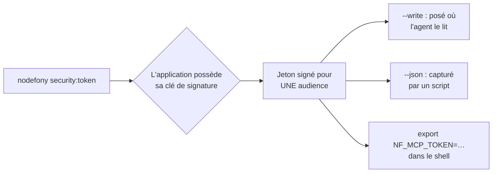

# Obtenir un jeton — hors bande, sans serveur ni mot de passe

> [tokens](tokens.md) décrit l'**émission par la porte HTTP** : un client présente un credential,
> l'application répond un couple access/refresh. Cette page décrit l'autre voie, celle dont un
> client MCP ou un script d'exploitation a besoin : **l'application signe elle-même un jeton, en
> ligne de commande**, sans qu'aucun serveur n'écoute et sans qu'aucun mot de passe ne transite.
> Ancré sur `src/packages/@nodefony/security/nodefony/command/security-token.ts`.

📍 [Documentation](../../../../../docs/index.md) › [Sécurité](index.md) › **Obtenir un jeton**

## 🧠 Le modèle mental — qui signe, pour quelle porte, pour combien de temps

Trois questions, et une seule commande y répond.



**Aucun serveur n'est en marche.** La commande démarre le noyau jusqu'à `onReady` — services prêts,
aucune écoute réseau (`security-token.ts:36`). C'est ce qui la rend utilisable quand l'application
ne tourne pas, en intégration continue, ou dans un conteneur d'amorçage.

**Le jeton vise une porte, et une seule.** L'audience est celle de la porte visée — la porte MCP par
défaut, `/nodefony/mcp` (`src/nodefony/src/mcp/protocol.ts:95`). Un jeton d'une autre audience est
refusé, et c'est toute la raison d'être de la liaison d'audience
([RFC 8707](https://www.rfc-editor.org/rfc/rfc8707.html)).

## 📖 Lexique

- **MCP** — _Model Context Protocol_ : le protocole par lequel un agent d'intelligence artificielle
  appelle les outils d'un logiciel. Sa porte est une route de votre application, pas un processus à
  lancer.
- **Hors bande** — obtenu par un canal qui n'est pas celui qu'on va ensuite utiliser. Ici : le
  jeton s'obtient au clavier, il servira sur HTTP.
- **Audience** — la ressource pour laquelle un jeton est valable. Déclarée par l'émetteur ; un
  porteur ne choisit pas la sienne.
- **Scope** — un pouvoir nommé, porté par le jeton. `admin:read` lit, `admin:write` mute
  (`src/nodefony/src/kernel/adminPlane/adminCaller.ts:53`).

## Qu'est-ce que ça résout — la faille du `curl` avec mot de passe

Le jeton s'obtenait par un appel au grant : trouver l'URL, composer un JSON, y mettre un mot de
passe **en clair dans l'historique du shell**, et surtout avoir un serveur en marche. Trois défauts,
et le troisième suffit à tout bloquer : dans une application neuve, on veut le jeton **avant** que
quoi que ce soit ne réponde.

L'application possède sa clé de signature ; elle n'a personne à qui demander. Donc : pas de serveur,
pas de mot de passe, pas de réseau — et rien à effacer d'un historique.

## 🚀 Démarrage rapide

```bash
# 1) Le jeton, pour la porte MCP de cette application
npx nodefony security:token

# 2) Le poser là où l'agent le lit — jamais dans un fichier suivi par git
npx nodefony security:token --write

# 3) Pour un script : la sortie machine
npx nodefony security:token --json
# {
#   "access_token": "eyJ…",
#   "resource": "http://localhost:5151/nodefony/mcp",
#   "scopes": ["admin:read"],
#   "requested": ["admin:read"],
#   "expires_in": 900
# }
```

Sans `--write` et dans un terminal, la commande **propose** de poser la valeur : un jeton de quatre
cents caractères ne se recopie pas à la main.

### Déclarer l'audience de la porte — le préalable

Un émetteur ne signe pas pour n'importe quelle ressource : les audiences sont une **liste blanche**
([RFC 8707](https://www.rfc-editor.org/rfc/rfc8707.html)). Sans cette déclaration, la commande
refuse — c'est le premier refus qu'on rencontre dans une application neuve.

```typescript
// nodefony.config.ts (extrait) — la porte pour laquelle cette application signe
use("@nodefony/security", {
  jwt: {
    // L'URI COMPLÈTE de la porte, pas seulement l'hôte : c'est elle que le
    // porteur présentera, et c'est elle qui sera comparée.
    audiences: ["http://localhost:5151/nodefony/mcp"],
  },
});
```

Puis `npm run build` — le runtime lit le `dist`, pas la source.

### Les options, et ce que chacune décide

| Option                 | Défaut                        | Ce qu'elle change                                        |
| ---------------------- | ----------------------------- | -------------------------------------------------------- |
| `[identifier]`         | `admin`                       | le compte porteur du jeton                               |
| `-s, --scope <liste>`  | `admin:read`                  | les pouvoirs demandés — ajouter `admin:write` pour muter |
| `-r, --resource <uri>` | la porte MCP de l'application | viser une **autre** audience                             |
| `-a, --agent <noms>`   | ceux détectés                 | quels agents servir — `none` pour aucun                  |
| `-t, --ttl <minutes>`  | celle de la config (15 min)   | la durée de validité, **bornée à 30 jours**              |
| `-w, --write`          | proposé en terminal           | poser `NF_MCP_TOKEN` chez les agents présents            |
| `-j, --json`           | —                             | sortie machine, sans invite                              |

Le plafond de `--ttl` n'est pas décoratif : un jeton posé dans un fichier **est une clé**, et une
clé se remplace (`security-token.ts:52`, `security-token.ts:64-79`).

### Où `--write` pose la valeur

La variable est `NF_MCP_TOKEN` (`src/nodefony/src/cli/aiMcpReport.ts:32`). La commande ne sert que
les agents dont la présence est **constatée** dans le projet — on ne crée pas la configuration d'un
outil que personne n'utilise ici. La table des cibles vit au cœur
(`src/nodefony/src/cli/agentTargets.ts:239`) : Claude, Gemini, Vibe, Codex.

Deux garanties qui ne se négocient pas :

- **jamais dans un fichier suivi par git** — un jeton commité est un jeton publié, et c'est la seule
  faute de cette commande qui serait irrattrapable ;
- **jamais par-dessus une valeur existante** — une rotation est un geste explicite, pas un effet de
  bord.

Si aucun agent n'est reconnu, la commande le dit et donne le geste qui vaut pour tous :

```bash
export NF_MCP_TOKEN=<le jeton>
```

Vibe et Codex prennent le **nom** de la variable, pas le secret — la porte se déclare une fois :

```bash
vibe mcp add nodefony --transport streamable-http \
  --url http://localhost:5151/nodefony/mcp --api-key-env NF_MCP_TOKEN
codex mcp add nodefony --url http://localhost:5151/nodefony/mcp \
  --bearer-token-env-var NF_MCP_TOKEN
```

Pour câbler `.mcp.json` d'un seul geste : `npx nodefony ai:mcp --auth`. La déclaration de la porte
appartient à [devkit](../../devkit/docs/index.md) ; cette page ne fait qu'émettre le porteur.

## 🔄 Renouveler — c'est réémettre, pas rafraîchir

Il n'y a pas de refresh token ici : ce jeton est signé hors bande, pour une porte, avec une durée
courte. Le renouveler, c'est **relancer la commande**. Et comme `--write` ne remplace jamais une
valeur en place, une rotation se demande :

```bash
# 1) retirer l'ancienne valeur là où elle est posée (le fichier est nommé par la commande)
# 2) réémettre
npx nodefony security:token --write --ttl 1440
```

Le flux de rotation **avec détection de rejeu** est celui des refresh tokens de la porte HTTP — il
est décrit dans [tokens](tokens.md), pas ici.

## ⚠️ Pièges (symptôme → cause → correction)

| Symptôme                                                              | Cause                                                                                                                                    | Correction                                                                                     |
| --------------------------------------------------------------------- | ---------------------------------------------------------------------------------------------------------------------------------------- | ---------------------------------------------------------------------------------------------- |
| `impossible d'émettre un jeton pour cette porte ici`                  | **en développement** : l'audience n'est pas déclarée à l'émetteur — c'est une liste blanche, pas un défaut ouvert                        | `use("@nodefony/security", { jwt: { audiences: ["<la porte>"] } })`, puis `npm run build`      |
| Le même message, mais l'environnement affiché n'est pas `development` | la porte MCP est servie par un module `policy: "dev"` : **elle n'existe pas** dans cet environnement                                     | `NODE_ENV=development npx nodefony security:token`, ou viser une autre porte avec `--resource` |
| Le jeton est émis, mais avec **moins** de scopes que demandé          | l'émetteur retire ceux que ce porteur ne peut pas obtenir, et il le dit ([RFC 6749](https://datatracker.ietf.org/doc/html/rfc6749) §3.3) | lire le champ `scopes` de la sortie — c'est celui qui fait foi (`security-token.ts:494`)       |
| L'agent reçoit `401` alors que le jeton vient d'être posé             | la valeur a été écrite dans un dossier que **cet** agent ne lit pas                                                                      | `--agent <nom>` pour viser explicitement, ou l'`export` dans le shell qui lance l'agent        |
| `--write` ne fait rien et n'écrit aucun fichier                       | aucun agent n'est **constaté** dans ce projet                                                                                            | la commande liste alors les emplacements connus et donne la ligne d'`export`                   |

> 🔴 **Le premier réflexe est faux.** Devant un refus, on cherche un serveur éteint — la commande
> n'en utilise aucun. Le message écarte cette fausse piste dès sa deuxième ligne
> (`security-token.ts:456-484`) ; il a lui-même été corrigé pour cesser d'accuser une cause unique
> qu'il ne constatait pas.

## 🧪 Tests & couverture

- **unit** : `securityCommands.test.ts` couvre les deux règles pures de la commande — un jeton
  **mort-né** doit s'annoncer avant d'être copié, et `--ttl` doit s'écrire en minutes, refuser une
  valeur aberrante et se borner à 30 jours (`ttlSeconds` est exportée pour cela).
- **manque assumé** : l'écriture chez les agents (`--write`) n'a pas de banc de bout en bout — sa
  garantie la plus forte, « jamais dans un fichier suivi par git », repose sur `git check-ignore` et
  `git ls-files`, constatés à l'exécution et non simulés.

Les chiffres exacts vivent dans la carte de l'aperçu, régénérée depuis vitest — jamais figés ici.
Les bancs sur serveur réel se **skippent sans leurs variables d'infra**, et un skip compte comme
vert : lire ce que la suite déclare ne pas avoir exercé.

## 🔗 Pour aller plus loin

- ⬆️ **Retour au hub** : [Sécurité — vue d'ensemble](index.md) · [Toute la documentation](../../../../../docs/index.md)
- 🧭 **Pages sœurs** : [tokens](tokens.md) · [api-keys](api-keys.md) · [oauth2](oauth2.md)

- L'émission par la porte HTTP, la rotation et la révocation → [tokens](tokens.md)
- Les jetons opaques pour machines, montrés une seule fois → [api-keys](api-keys.md)
- La vérification du porteur et les zones qui l'exigent → [authenticators](authenticators.md) · [firewall](firewall.md)
- Ce qu'un scope autorise → [authorization](authorization.md)
- Déclarer la porte MCP et lui ajouter vos outils → [devkit](../../devkit/docs/index.md)
