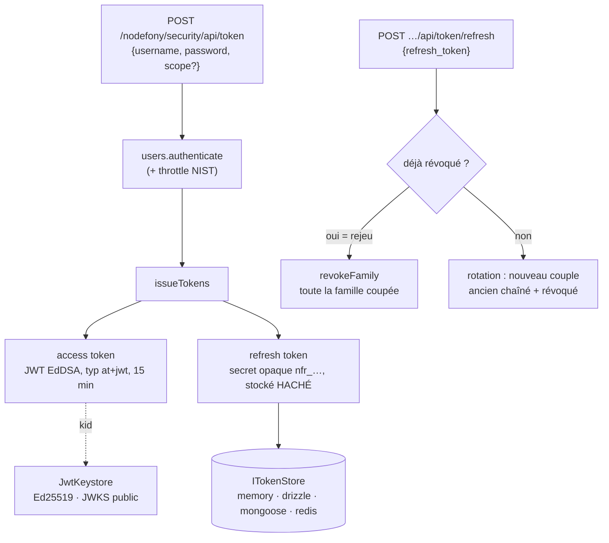

# Tokens — émission, clés, rotation et révocation

> Les authenticators _vérifient_ des jetons ; cette page décrit leur **face émission** : comment
> Nodefony signe un access token JWT, gère la **clé** (keystore Ed25519 + JWKS), fait **tourner** les
> refresh tokens avec détection de rejeu (RFC 9700), et **révoque** — au-dessus d'un `ITokenStore`
> pluggable (memory/drizzle/mongoose/redis) désormais **paginé** pour l'admin. Ancré sur
> `src/packages/@nodefony/security/nodefony/service/tokenService.ts` et `nodefony/src/token/`.

📍 [Documentation](../../../../../docs/index.md) › [Sécurité](index.md) › **Jetons**

## 🧠 Le modèle mental — émission, rotation, révocation



## 📖 Lexique

| Terme           | Sens                                                                                                |
| --------------- | --------------------------------------------------------------------------------------------------- |
| Access token    | JWT court (15 min) signé EdDSA, porté en `Authorization: Bearer` — jamais en cookie/URL.            |
| Refresh token   | Secret opaque longue durée (`nfr_…`), stocké **haché**, échangé contre un nouvel access.            |
| PAT             | _Personal Access Token_ (clé API) — même store, autre page ([authenticators](./authenticators.md)). |
| Grant           | Échange d'un credential (identifiant/mot de passe) contre un couple access+refresh.                 |
| Keystore        | Gestionnaire des clés de signature Ed25519 + du JWKS public.                                        |
| JWKS            | _JSON Web Key Set_ : les clés **publiques** exposées pour vérifier les signatures.                  |
| `kid`           | Identifiant de clé (empreinte) posé dans l'en-tête du JWT → sélection de la bonne clé.              |
| `jti`           | Identifiant unique d'un JWT — clé de la denylist de révocation ciblée.                              |
| Rotation        | Émettre un nouveau refresh à chaque usage et révoquer l'ancien (RFC 9700).                          |
| Famille         | Chaîne de refresh liés par rotation ; un rejeu coupe toute la famille.                              |
| Downscoping     | Les scopes ne **montent** jamais le long d'une chaîne de refresh.                                   |
| `invalidBefore` | Seuil par porteur : tout access émis avant cet instant est rejeté (révocation en masse).            |

## Qu'est-ce que ce système résout — la faille

Un JWT est **auto-porté** : le serveur peut le vérifier sans état. Génial pour la scalabilité,
dangereux pour la révocation — un jeton volé reste valide jusqu'à son expiration si rien ne le suit
côté serveur. Deux attaques concrètes :

- le **vol de refresh token** — l'attaquant le rejoue pour obtenir des access frais indéfiniment ;
- l'**absence de révocation** — bannir un compte ne coupe pas ses jetons déjà émis.

Nodefony répond par un **store de vérité côté serveur** (denylist `jti` + `invalidBefore` + rotation
avec détection de rejeu) et une **gestion de clé** qui ne génère jamais de secret en clair « par
défaut » en prod.

## La vision Nodefony — un service propriétaire, des endpoints minces

`TokenService` est **propriétaire** du store et du keystore : à `TokenService.#build()`
(`tokenService.ts:93`), si `jwt.enabled` ou `apiKeys.enabled`, il résout le store pluggable, pose
`tokenStore` au container (`tokenService.ts:163`) puis crée le keystore et pose `jwtKeystore`
(`tokenService.ts:167-173`) — consommés par le `JwtAuthenticator` et les endpoints. Il arme un
**gc** via `GcScheduler` (timer `unref` + **jitter** de phase pour étaler les balayages entre pods,
`tokenService.ts:175-181`).

Les endpoints HTTP sont des **adaptateurs minces** portés par `@nodefony/framework`, couplés **par
nom de service** via le contrat structurel `ITokenIssuer` — framework n'importe jamais security
(`TokenAuthController.ts:11-22`).

Constat clé de cohérence : `iss`/`aud`/`ttl` sont dérivés **une seule fois** par
`resolveJwtRuntime()` (`jwtRuntime.ts:30-41`) et **partagés** entre l'émetteur et le vérificateur —
une divergence ferait tout rejeter. Fonction pure : les deux côtés obtiennent la même valeur sans la
partager par référence. `issuer` omis → `"nodefony"` (`jwtRuntime.ts:31`), à surcharger en prod.

## 🚀 Démarrage rapide

### Les endpoints d'émission sont FOURNIS

Dans une app `nodefony create app`, dès que le module security est chargé avec `jwt.enabled` (défaut),
le framework monte deux routes (`mountTokenAuthRoutes()`, `TokenAuthController.ts:132-147`) :

- `POST /nodefony/security/api/token` — body `{username, password, scope?}` → couple access/refresh ;
- `POST /nodefony/security/api/token/refresh` — body `{refresh_token}` → rotation.

> [!IMPORTANT]
> Ces routes n'existent **que si** le service `tokenService` est présent — sinon 404, zéro surface
> (`TokenAuthController.ts:46-48`). Elles sont `bypassFirewall: true` (`TokenAuthController.ts:145`) :
> elles SONT le mécanisme d'émission — protégées, obtenir un token exigerait d'être déjà
> authentifié (deadlock). Le JWT part en **réponse JSON** (Bearer), jamais en cookie ni en URL.

### La config : une zone protégée par `jwt` + une clé qui survit au redémarrage

```typescript
// nodefony.config.ts (extrait) — la zone API machine + la source de clé
use("@nodefony/security", {
  jwt: {
    // dev/VPS : persiste la clé Ed25519 (sinon clé ÉPHÉMÈRE + warning au boot).
    // prod cloud : préférer keystore.keySetJson injecté depuis l'env (même clé
    // sur tous les pods) — voir la section keystore.
    keystore: { dir: "./config/jwt" },
  },
  areas: {
    // Le firewall vérifie le Bearer JWT sur CHAQUE requête de la zone.
    api: { pattern: "^/api/v1", authenticators: ["jwt"] },
  },
});
```

### Ce que TU écris : le controller scopé

```typescript
// nodefony/controllers/OrdersController.ts — complet, compile tel quel
import {
  controller,
  Controller,
  Get,
  RequireScope,
  CurrentUser,
} from "@nodefony/framework";
import type { IUser } from "@nodefony/user";

@controller("/api/v1/orders")
class OrdersController extends Controller {
  // Zone `api` : le firewall a déjà validé le JWT (signature, exp, aud/iss,
  // denylist, sujet actif). @RequireScope borne ce que la CLÉ a le droit de
  // faire — un token émis sans `orders:read` reçoit 403, même sujet valide.
  @RequireScope("orders:read")
  @Get("/list")
  async list(@CurrentUser() user: IUser) {
    return this.renderJson({ subject: user.identifier, orders: [] });
  }
}

export default OrdersController;
```

### Ce qu'on observe

```bash
# 0) Un compte (mot de passe demandé MASQUÉ — jamais en dur dans un script)
npx nodefony security:user:add ci-bot

# 1) Grant : credential → couple access/refresh (réponse RFC 6749 §5.1)
curl -s -H 'Content-Type: application/json' \
  -d "{\"username\":\"ci-bot\",\"password\":\"$NF_PASS\",\"scope\":\"orders:read\"}" \
  http://localhost:5151/nodefony/security/api/token
# {"access_token":"eyJ…","refresh_token":"nfr_…","token_type":"Bearer",
#  "expires_in":900,"scope":"orders:read"}

# 2) L'access token en Bearer → 200 (zone api, scope vérifié)
curl -s -H "Authorization: Bearer $ACCESS" \
  http://localhost:5151/api/v1/orders/list
# {"subject":"ci-bot","orders":[]}

# 3) Rotation : le refresh → NOUVEAU couple (l'ancien refresh est révoqué)
curl -s -H 'Content-Type: application/json' \
  -d "{\"refresh_token\":\"$REFRESH\"}" \
  http://localhost:5151/nodefony/security/api/token/refresh

# 4) Rejouer l'ANCIEN refresh → 401 {"error":"invalid_grant"} + famille coupée
```

Erreurs mappées par duck-typing dans `#renderAuthError()` (`TokenAuthController.ts:108-120`) :
401 message uniforme `invalid_grant` (anti-énumération), 429 avec `Retry-After` du throttler NIST.
Émission indisponible (JWT désactivé, store absent) → 503 `isEnabled()`
(`TokenAuthController.ts:67-69`).

## 🏗️ Architecture interne — la vie d'un couple access/refresh

### Émission (grant M2M/CLI)

`issueForCredentials()` (`tokenService.ts:237-276`) vérifie l'identifiant/mot de passe via le
service `users`, avec le **throttling NIST partagé** — `ThrottledError` avant tout hachage
(`tokenService.ts:260-267`). Chaque tentative échouée est auditée `login.failure`/`login.throttled`
par `#auditGrant()` (`tokenService.ts:281-293`). Puis `issueTokens()` (`tokenService.ts:296`)
produit :

- un **access token** : JWT signé EdDSA, en-tête `typ:"at+jwt"` + `kid`, claims
  `iss`/`sub`/`aud`/`exp` (15 min) + `jti` — `#signAccess()` (`tokenService.ts:402-415`) ;
- un **refresh token** : secret opaque haute entropie `nfr_<32 octets base64url>`, **stocké haché**
  `sha256` (le clair n'existe qu'en réponse, jamais au repos) — `#buildRefresh()`
  (`tokenService.ts:418-452`).

La réponse suit RFC 6749 §5.1 — `ITokenResponse` (`tokenService.ts:43-51`). Tout succès est audité
`token.issued` via `recordAudit` avec le `tokenId` corrélable (`tokenService.ts:312-318`).

### Rotation & détection de rejeu (RFC 9700 §4.14)

`refresh()` (`tokenService.ts:335`) est le cœur défensif, dans l'ordre :

1. Lookup par hash — `findByHash`, refus uniforme si inconnu/mauvais type (`tokenService.ts:341-343`).
2. **Détection de rejeu** : refresh **déjà révoqué** re-présenté → `revokeFamily` coupe toute la
   famille + audit `token.reuse_detected`, signal d'attaque fort (`tokenService.ts:345-361`).
3. Expiration `expiresAt` vérifiée (`tokenService.ts:363-368`).
4. **Sujet revérifié** — compte disparu/inactif/verrouillé rejeté sans attendre l'exp,
   `#resolveUserForRefresh()` (`tokenService.ts:488-499`).
5. **Downscoping** : les `scopes` du nouveau couple sont ceux de l'ancien, jamais plus
   (`tokenService.ts:369-370`).
6. **Rotation** : nouveau refresh (même famille), l'ancien chaîné `replacedBy` + révoqué
   `"rotated"` (`tokenService.ts:383-390`). Si `rotateRefresh` est désactivé, l'access est réémis
   et le refresh courant reste valide (`tokenService.ts:373-381`).

### Mise en situation — ton refresh token a été volé

Besoin vécu : le refresh d'un poste compromis est exfiltré. Rotation active (défaut) — voici ce que
chacun vit, requête par requête :

| #   | Qui présente quoi               | Ce que fait `refresh()`                                     | Résultat client                     |
| --- | ------------------------------- | ----------------------------------------------------------- | ----------------------------------- |
| 1   | Client légitime → refresh R1    | rotation : R2 émis, R1 révoqué `rotated`                    | 200, nouveau couple                 |
| 2   | Voleur → R1 (volé, déjà tourné) | R1 révoqué re-présenté = **rejeu** → famille entière coupée | 401 `invalid_grant`                 |
| 3   | Client légitime → R2            | famille coupée : R2 est révoqué aussi                       | 401 → se reconnecte (nouveau grant) |

Si le **voleur joue en premier**, la rotation lui répond normalement (le serveur ne peut pas encore
le distinguer) — mais dès que le légitime rejoue son vieux refresh, le rejeu est détecté et le
voleur perd aussi son couple. Dans les deux ordres, **l'attaque est bornée à une fenêtre courte** et
la victime est déconnectée (signal visible) au lieu d'un vol silencieux indéfini.

## 🔐 Le keystore Ed25519 — la clé ne fuit pas, pas de secret « par défaut » en prod

`JwtKeystore.#load()` résout la source de clé par **priorité** (`JwtKeystore.ts:97-128`), pensée
pour ne jamais auto-générer une clé en clair silencieusement en prod :

1. **env** — `keySetJson` (JWK Set injecté depuis le catalogue d'env) : prod cloud, secret géré
   hors-app, même clé sur tous les pods (`JwtKeystore.ts:100-106`).
2. **fichier** — `dir/keyset.json`, généré si absent, écriture atomique tmp+rename en mode 600 —
   `#writeAtomic()` (`JwtKeystore.ts:208-217`) : opt-in dev/VPS mono-machine.
3. **mémoire** — aucune source → clé **éphémère + WARNING** explicite : perdue au redémarrage =
   refresh invalidés, incohérente en cluster (`JwtKeystore.ts:121-127`).

Le JWKS servi par `getPublicJWKS()` (`JwtKeystore.ts:87-90`) est **public** : la composante privée
`d` est retirée à l'import par `#importKeyset()` (`JwtKeystore.ts:156-158`, RFC 8037/7517) — c'est
lui qu'utilise le vérificateur local (`createLocalJWKSet`, `JwtAuthenticator.ts:157-158`), jamais
une clé venue du token. Le chargement est mémoïsé — `#ensureLoaded()` (`JwtKeystore.ts:93-95`).

> [!WARNING]
> **Race au 1ᵉʳ boot d'un cluster sans clé pré-provisionnée** : deux workers peuvent générer des
> clés différentes — le dernier `rename` gagne (`JwtKeystore.ts:61-64`). En prod, provisionner
> `keySetJson` hors-bande élimine ce cas : c'est la source recommandée.

## 🧩 Le store pluggable — durable par défaut, jamais de faux durable silencieux

### Le contrat et l'enregistrement

Le `tokenStore` héberge **trois structures** : les records (refresh + PAT), la denylist `jti` et le
seuil `invalidBefore` par porteur (`ITokenStore.ts:11-15`). Les backends s'enregistrent par
fabrique — `registerTokenStore()` (`tokenStoreRegistry.ts:41-46`) : les adapters lourds importent
`import type { ITokenStore }` (effacé à la compilation), zéro couplage runtime.

Sa résolution au boot (`tokenService.ts:112-163`) suit la doctrine `store:"auto"` du framework :

- `auto` (défaut) → suit l'infra database déclarée via `resolveAutoStore` — **borné aux backends
  réellement enregistrés**, repli memory **annoncé** (`tokenService.ts:116-124`) ;
- store explicite **inconnu** → en prod, **boot avorté** (fail-loud) ; en dev, brique désactivée et
  annoncée avec la liste `listTokenStores()` (`tokenService.ts:127-138`) — jamais de fallback
  memory silencieux pour du durable ;
- store `memory` **en prod** → `WARNING` nommant l'impact : denylist/refresh/clés API per-pod et
  volatils, révocation non partagée (`tokenService.ts:142-149`).

La décision (configuré → résolu, raison) est publiée au kernel par `registerStoreResolution()`
(`tokenService.ts:151-160`) — visible dans Studio.

### Mise en situation — quel store pour quelle app ?

| Ta situation                                        | Store            | Pourquoi                                                              |
| --------------------------------------------------- | ---------------- | --------------------------------------------------------------------- |
| Dev / tests mono-process                            | `memory` (auto)  | 0 dépendance ; volatil — un redémarrage déconnecte tout le monde      |
| Prod, base SQL déclarée (`NF_DATABASE_URL`)         | `auto` → drizzle | durable + partagé entre pods : révocation et rejeu vus PARTOUT        |
| Prod, MongoDB                                       | `mongoose`       | même contrat, même banc, sur Mongo                                    |
| Flotte de pods, Redis déjà présent, denylist chaude | `redis`          | TTL natif, lecture O(1) ; listing par curseur SCAN (capacité réduite) |
| Prod **sans** infra durable                         | ❌ `memory`      | ça boote, mais WARNING mérité : la révocation ne traverse pas un pod  |

### Les backends (catalogue)

### `memory` — la référence 0 dépendance

- Builtin, enregistré à l'import du module via `registerTokenStore` (`tokenStoreRegistry.ts:63-68`).
- `listPage` : tri `createdAt` DESC + tiebreaker `id`, déterministe pour l'offset — parité SQL
  (`MemoryTokenStore.ts:122-142`).
- Denylist bornée : purge **amortie** tous les 256 ajouts — `#maybeSweep()`
  (`MemoryTokenStore.ts:331-341`) + expiration paresseuse à la lecture. Pas de minuterie, pas de fuite.
- `snapshot()`/`restore()` sérialisables — base d'une persistance fichier, index reconstruits
  (`MemoryTokenStore.ts:253-283`).
- Volatil, par-process : dev/tests. Pilote le banc de contrat commun.

### `drizzle` — SQL, le défaut durable

- Enregistré par le module drizzle (`drizzle/nodefony/registerStores.ts:220`).
- Élu par `store:"auto"` dès qu'une infra database SQL est déclarée ; sinon sqlite local si drizzle
  est chargé (`config.ts:394-399`).
- Pagination **offset + total** (helper `paginate()` d'orm-core) ; e2e sur PostgreSQL et MySQL réels.

### `mongoose` — MongoDB

- Enregistré par le module mongoose (`mongoose/nodefony/registerStores.ts:119`).
- Pagination **offset + total** via `listPage` (`MongooseTokenStore.ts:163-173`).
- Purge par `gc()` explicite sur `expiresAt` (`MongooseTokenStore.ts:290-296`).

### `redis` — cluster, TTL natif

- Enregistré par le module redis (`redis/nodefony/registerStores.ts:49`).
- TTL natif : `expire()` posé à l'écriture du record (`RedisTokenStore.ts:254`) — l'expiration ne
  dépend pas du gc.
- Listing par `SCAN` : curseur opaque `skip:scanCursor`, `decodeCursor()`
  (`RedisTokenStore.ts:35-44`) — sans ordre global ni total, capacité réduite **assumée**.
- `countTokens()` renvoie `-1` : un comptage exact exigerait un SCAN complet O(N), refusé
  (`RedisTokenStore.ts:396-404`).

### Le record — une seule table pour PAT et refresh

`IAccessTokenRecord` (`ITokenStore.ts:69`) est **single-table** : un même schéma porte PAT et
refresh, champs non pertinents à `null`, horodatages epoch ms (`ITokenStore.ts:60-64`). Deux
constats de design :

- `subjectId` est une **référence logique souple, PAS une FK SQL** : porteur polymorphe
  (user/service), store multi-backend, découplage des modules — intégrité assurée à l'usage
  (`ITokenStore.ts:80-95`) ;
- slots prêts sans migration : `resources` (permissions fine-grained façon GitHub) et `cnf`
  (sender-constrained DPoP/mTLS) (`ITokenStore.ts:101-119`).

Les colonnes par dialecte vivent dans la doc de chaque adapter (règle anti-triple-vérité).

### Lister pour l'admin — pagination native

- `listPage()` ne matérialise **jamais** plus d'une page (`ITokenStore.ts:195-204`) — capacité par
  backend : **offset + total** (SQL/Mongo/mémoire) ou **curseur** (`nextCursor`, Redis).
- `countTokens()` donne le `total` ; Redis répond `-1` (`ITokenStore.ts:205-209`).
- Filtres portables `ITokenListQuery` : `subjectId`, `kind`, `revoked` (`ITokenStore.ts:154-161`) —
  prédicat partagé `matchesTokenQuery()` (`MemoryTokenStore.ts:11-26`).
- `listAll()` reste réservé au **dump d'incident** cross-porteur, cold-path admin
  (`ITokenStore.ts:183-193`).
- Consommateur type : le data plane des clés API — `ApiKeyService.listPagePat()`
  (`apiKeys.ts:186-188`), jamais un listAll matérialisé.

### Révoquer — trois portées

- **Un access** avant son `exp` : denylist `denyJti()`/`isJtiDenied()` (`ITokenStore.ts:217-224`).
- **Un refresh/PAT** : `revoke()` idempotent, `revokeFamily()` pour la chaîne de rotation
  (`ITokenStore.ts:212-215`).
- **Tout un porteur** (logout global, ban) : seuil `revokeAllForSubject()` — tout access dont
  `iat < invalidBefore` est rejeté (`ITokenStore.ts:226-234`) ; le seuil est **monotone**, deux
  logouts successifs ne le reculent pas (`MemoryTokenStore.ts:200-207`).

### La maintenance (gc)

Le `gc()` du store purge la `denylist` expirée, les records à terme, les PAT révoqués au-delà de
la rétention (`ITokenStore.ts:237-251`). Orchestré par le `GcScheduler` du service ; `runGc()` reste public pour
un futur worker cron — poser alors `gcIntervalS: 0` (`tokenService.ts:200-226`).

> [!TIP]
> Un refresh révoqué **par rotation** n'est PAS purgé tout de suite : il est conservé jusqu'à son
> `expiresAt` — c'est la **fenêtre de détection de rejeu** — puis tombe au gc, `#isPurgeable()`
> (`MemoryTokenStore.ts:239-248`). Un store **local** (memory) est par-process : seul SON process
> peut le purger → ne déléguez le gc au cron QUE pour un store partagé.

## ⚙️ Configuration

Tables dérivées du schéma Zod — `jwtSchema` (`config.ts:334-390`) et `tokenStoreSchema`
(`config.ts:392-425`), défauts inclus.

### `jwt.*`

| Option                | Type               | Défaut   | Effet                                                                                    |
| --------------------- | ------------------ | -------- | ---------------------------------------------------------------------------------------- |
| `enabled`             | boolean            | `true`   | Active signature + refresh (`config.ts:317`)                                             |
| `alg`                 | `EdDSA` \| `RS256` | `EdDSA`  | `RS256` = slot non câblé (`jwtRuntime.ts:21`)                                            |
| `accessTtlS`          | number (s)         | `900`    | TTL de l'access token — 15 min (`config.ts:338-342`)                                     |
| `refreshTtlS`         | number (s)         | `604800` | TTL du refresh — 7 jours (`config.ts:343-347`)                                           |
| `rotateRefresh`       | boolean            | `true`   | Rotation du refresh à chaque usage, OWASP (`config.ts:348-351`)                          |
| `jwks`                | boolean            | `true`   | Expose JWKS + `kid` — rotation de clés (`config.ts:352-355`)                             |
| `audiences`           | string[]           | `[]`     | `aud` acceptées (RFC 8707) ; vide = `[issuer]` (`config.ts:356-361`)                     |
| `issuer`              | string?            | —        | Claim `iss`, **STABLE** après émission (`config.ts:362-367`) ; omis → repli `"nodefony"` |
| `keystore.keySetJson` | string?            | —        | JWK Set privé injecté depuis l'env — source prod, SECRET (`config.ts:370-375`)           |
| `keystore.dir`        | string?            | —        | Dossier `keyset.json` chmod 600 — source dev/VPS (`config.ts:376-381`)                   |

### `tokenStore.*`

| Option                 | Type       | Défaut   | Effet                                                                                     |
| ---------------------- | ---------- | -------- | ----------------------------------------------------------------------------------------- |
| `store`                | string     | `"auto"` | `auto`\|`memory`\|`drizzle`\|`mongoose`\|`redis` — pluggable (`config.ts:394-399`)        |
| `gcIntervalS`          | number (s) | `600`    | Purge périodique ; `0` = désactivé — chaque process purge SON store (`config.ts:400-407`) |
| `gcJitter`             | boolean    | `true`   | Étale le gc d'un délai aléatoire par process — cluster (`config.ts:408-413`)              |
| `retentionRevokedDays` | number (j) | `30`     | Rétention d'un PAT révoqué SANS expiration avant purge (`config.ts:414-421`)              |

## 📜 Normes appliquées

| Domaine                          | Norme           | Ancrage                                                    |
| -------------------------------- | --------------- | ---------------------------------------------------------- |
| Réponse d'émission               | RFC 6749 §5.1   | `ITokenResponse` (`tokenService.ts:43-51`)                 |
| Rotation + détection de rejeu    | RFC 9700 §4.14  | `refresh()` (`tokenService.ts:345-390`)                    |
| Profil access token `typ:at+jwt` | RFC 9068        | `#signAccess()` (`tokenService.ts:402-415`)                |
| Claims JWT (`iss/sub/aud/exp`)   | RFC 7519        | `#signAccess()` (`tokenService.ts:406-414`)                |
| Ed25519 / JWK / JWKS public      | RFC 8037 · 7517 | `#importKeyset()` (`JwtKeystore.ts:156-158`)               |
| Audiences liées à la ressource   | RFC 8707        | `audience` du record (`ITokenStore.ts:104-105`)            |
| 429 + `Retry-After`              | RFC 6585        | `#renderAuthError()` (`TokenAuthController.ts:108-115`)    |
| Backoff de login                 | NIST SP 800-63B | `ThrottledError` avant hachage (`tokenService.ts:260-267`) |

## ⚡ Performance & mémoire

- **`jose` importé lazy** (dep lourde) : `#ensureJose()` au premier usage (`tokenService.ts:462-464`)
  — le boot ne paie rien si le JWT n'est jamais sollicité ; keystore mémoïsé pareil.
- **Rien sur le hot path requête** : émission et rotation sont des endpoints cold-path ; la
  vérification (hot path) vit chez le `JwtAuthenticator`.
- **Timers civilisés** : `GcScheduler` `unref` (n'empêche pas l'arrêt) + jitter anti-balayages
  simultanés (`tokenService.ts:175-181`) ; denylist mémoire bornée par purge amortie
  (`MemoryTokenStore.ts:331-341`).
- **Jamais N en RAM** : `listPage()` borne toute lecture admin à une page (`ITokenStore.ts:195-204`).

## 📡 Observabilité — Studio

- **Écran Stores** (`StoresView.tsx`) : la résolution du store de jetons (configuré → résolu +
  raison) publiée par `registerStoreResolution()` (`tokenService.ts:151-160`).
- **Écran Audit** : événements `token.issued`, `token.reuse_detected` (signal d'attaque),
  `login.failure`/`login.throttled` du grant — corrélables par `tokenId`.
- **Écran ApiKeys** : le même store côté PAT, listing paginé serveur.

## ⚠️ Pièges (symptôme → cause → correction)

| Symptôme                                      | Cause (dans le code)                                           | Correction                                               |
| --------------------------------------------- | -------------------------------------------------------------- | -------------------------------------------------------- |
| 404 sur `/nodefony/security/api/token`        | Routes montées seulement si `tokenService` existe              | Charger `@nodefony/security` + `jwt.enabled: true`       |
| 503 « Token issuance unavailable »            | Service non initialisé (JWT désactivé, store indisponible)     | Vérifier config `jwt`/`tokenStore` + logs de boot        |
| Refresh tokens invalidés à chaque redémarrage | Keystore en mémoire (aucune source configurée)                 | `jwt.keystore.keySetJson` (prod) ou `dir` (dev)          |
| JWT rejeté après un déploiement multi-pod     | Clés différentes par pod (pas de clé partagée)                 | Provisionner `keySetJson` hors-bande (même clé partout)  |
| Tout rejeté après changement de config        | `issuer`/`audiences` divergents entre émission et vérification | `issuer` STABLE — ne pas le changer après émission       |
| Révocation sans effet entre pods              | `tokenStore:"memory"` en prod (per-pod)                        | Store durable (`NF_DATABASE_URL` → drizzle, ou redis)    |
| Reconnexion forcée inattendue                 | Détection de rejeu : un vieux refresh révoqué a été rejoué     | Attendu (anti-vol) — la famille est coupée               |
| Boot avorté « token store inconnu »           | `tokenStore.store` explicite introuvable (fail-loud prod)      | Corriger le nom / enregistrer le store                   |
| Scopes qui n'augmentent pas au refresh        | Downscoping volontaire                                         | Réémettre via un nouveau grant pour élargir              |
| Listing admin sans `total` sur Redis          | `countTokens()` = `-1` (comptage O(N) refusé), curseur SCAN    | Attendu — capacité réduite annoncée, paginer par curseur |

## 🧪 Tests & couverture

Cinq familles couvrent la brique — les **chiffres exacts vivent dans la carte de l'aperçu**
(régénérée par `gen-counters.mjs` depuis vitest, jamais figée ici) :

- **unit** : `tokenService` (émission, rotation, rejeu, downscoping), `tokenStore` (révocation,
  denylist, gc, rétention), `jwtKeystore` (les 3 priorités de source), `jwtPipeline` (bout en bout
  signature → vérification), `tokenPagination` (le banc de contrat piloté par le store mémoire) ;
- **banc de contrat** : `tokenPaginationContract` — invariants `listPage`/`countTokens` tenus par
  **tous** les backends (tri, offset, filtres, curseur) ;
- **intégration adapters** : token-store + token-pagination chez drizzle (sqlite), mongoose et
  redis — le MÊME banc rejoué sur chaque backend ;
- **e2e base réelle** : drizzle sur PostgreSQL et MySQL ;
- **manque assumé** : pas de banc d'attaque dédié à l'émission (le rejeu est couvert en unit) ni de
  test de charge sur le grant.

Les bancs sur serveur réel se **skippent sans leurs variables d'infra** — un skip compte comme
vert : lire le bloc gates (`vitest.gates.ts`, affiché en fin de run) avant de conclure.
Couverture : `npm run coverage` dans `@nodefony/security`.

## 🔗 Pour aller plus loin

- ⬆️ **Retour au hub** : [Sécurité — vue d'ensemble](index.md) · [Toute la documentation](../../../../../docs/index.md)
- 🧭 **Pages sœurs** : [api-keys](api-keys.md) · [Authenticators](authenticators.md)

- La vérification de ces jetons (JWT/PAT) → [authenticators](./authenticators.md)
- Le firewall qui applique la zone → [firewall](./firewall.md) · L'autorisation par scopes → [authorization](./authorization.md)
- La doctrine `store:"auto"` → [configuration](../../../../../docs/architecture/configuration.md)
- Vue d'ensemble sécurité → [index](./index.md)
