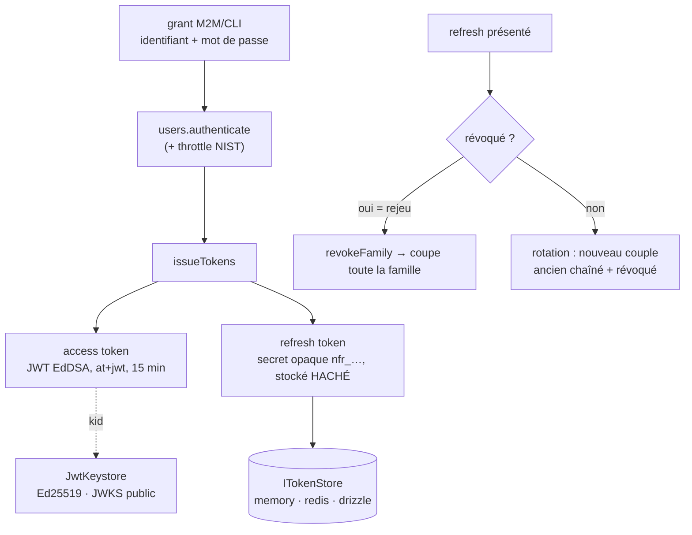

# Tokens — émission, clés, rotation et révocation

> Les authenticators _vérifient_ des jetons ; cette page décrit leur **face émission** : comment
> Nodefony signe un access token JWT, gère la **clé** (keystore Ed25519 + JWKS), fait **tourner** les
> refresh tokens avec détection de rejeu (RFC 9700), et **révoque** — le tout au-dessus d'un
> `ITokenStore` pluggable (memory/redis/drizzle). Ancré sur
> `src/packages/@nodefony/security/nodefony/service/tokenService.ts` et `src/token/`.

## Le modèle mental — émission, rotation, révocation

## Lexique

| Terme         | Sens                                                                                                |
| ------------- | --------------------------------------------------------------------------------------------------- |
| Access token  | JWT court (15 min) signé EdDSA, porté en `Authorization: Bearer` — jamais en cookie/URL.            |
| Refresh token | Secret opaque longue durée (`nfr_…`), stocké **haché**, échangé contre un nouvel access.            |
| PAT           | _Personal Access Token_ (clé API) — même store, autre page ([authenticators](./authenticators.md)). |
| Keystore      | Gestionnaire des clés de signature Ed25519 + du JWKS public.                                        |
| JWKS          | _JSON Web Key Set_ : les clés **publiques** exposées pour vérifier les signatures.                  |
| `kid`         | Identifiant de clé (empreinte) posé dans l'en-tête du JWT → sélection de la bonne clé.              |
| Rotation      | Émettre un nouveau refresh à chaque usage et révoquer l'ancien (RFC 9700).                          |
| Famille       | Chaîne de refresh liés ; un rejeu coupe toute la famille.                                           |
| Downscoping   | Les scopes ne **montent** jamais le long d'une chaîne de refresh.                                   |

## Qu'est-ce que ce système résout — la faille

Un JWT est **auto-porté** : le serveur peut le vérifier sans état. Génial pour la scalabilité, dangereux
pour la révocation — un jeton volé reste valide jusqu'à son expiration si rien ne le suit côté serveur.
Deux attaques concrètes : le **vol de refresh token** (l'attaquant le rejoue pour obtenir des access
frais indéfiniment) et l'**absence de révocation** (bannir un compte ne coupe pas ses jetons). Nodefony
répond par un **store de vérité côté serveur** (denylist `jti` + `invalidBefore` + rotation avec
détection de rejeu) et une **gestion de clé** qui ne génère jamais de secret en clair « par défaut » en
prod.

## La vision Nodefony — un service propriétaire, une clé partagée

`TokenService` est **propriétaire** du store et du keystore : au boot (si `jwt.enabled` ou
`apiKeys.enabled`) il résout le store pluggable, crée le keystore Ed25519, les **pose au container**
(`tokenStore` / `jwtKeystore`, `tokenService.ts:150-173`) — consommés ensuite par le `JwtAuthenticator`
et les endpoints. Il arme aussi un **gc** (timer `unref` + **jitter** de phase pour étaler les balayages
entre pods d'un cluster, `:175-181`).

Constat clé de cohérence : les paramètres `iss`/`aud`/`ttl` sont dérivés **une seule fois** par
`resolveJwtRuntime` (`jwtRuntime.ts:30`) et **partagés** entre l'émetteur et le vérificateur — une
divergence ferait tout rejeter. La fonction est pure : les deux côtés obtiennent la même valeur sans la
partager par référence.

## Émission (grant M2M/CLI)

`issueForCredentials` vérifie l'identifiant/mot de passe via le service `users` (avec le **throttling
NIST partagé**, `tokenService.ts:260-274`) puis `issueTokens` (`:296`) produit :

- un **access token** : JWT signé EdDSA, en-tête `typ:"at+jwt"` + `kid`, claims `iss`/`sub`/`aud`/`exp`
  (15 min) + `jti` (`#signAccess`, `:402-415`) ;
- un **refresh token** : secret opaque haute entropie `nfr_<32 octets base64url>`, **stocké haché**
  SHA-256 (le secret en clair n'existe qu'en réponse, jamais au repos, `#buildRefresh`, `:418-452`).

Réponse au format RFC 6749 §5.1 (`access_token`/`refresh_token`/`token_type:"Bearer"`/`expires_in`/
`scope`, `:43-51`). Tout succès est audité (`token.issued`, `:312-318`).

## Rotation & détection de rejeu (RFC 9700 §4.14)

`refresh(rawRefresh)` (`tokenService.ts:335`) est le cœur défensif :

1. Lookup par **hash** ; refus uniforme si inconnu/mauvais type (`:341-343`).
2. **Détection de rejeu** : si le refresh présenté est **déjà révoqué**, c'est qu'un voleur le rejoue →
   `revokeFamily(...)` coupe **toute la famille** (voleur _et_ victime — la victime devra se reconnecter),
   audit `token.reuse_detected` (signal d'attaque fort), refus (`:345-362`).
3. Expiration + **sujet revérifié** (compte banni/supprimé rejeté sans attendre l'exp, `:363-368`).
4. **Downscoping** : les scopes du nouveau token sont ceux de l'ancien — ils ne **montent jamais**
   (`:369-371`).
5. **Rotation** (si activée) : nouveau refresh dans la même famille, l'ancien est chaîné (`replacedBy`) et
   révoqué (`revokedReason:"rotated"`, `:383-390`). Si la rotation est désactivée, l'access est réémis et
   le refresh courant reste valide (`:373-382`).

## Le keystore Ed25519 — la clé ne fuit pas, et pas de secret « par défaut » en prod

`JwtKeystore` résout la clé de signature par **priorité** (`JwtKeystore.ts:44-65`), pensée pour ne
**jamais** auto-générer une clé en clair silencieusement en prod :

1. **env** — `jwt.keystore.keySetJson` (JWK Set injecté depuis le catalogue d'env) : prod cloud, secret
   géré hors-app, **même clé sur tous les pods** (`:99-106`).
2. **fichier** — `jwt.keystore.dir/keyset.json`, généré si absent, **écriture atomique (tmp+rename) en
   mode 600** (`:207-217`) : opt-in dev/VPS mono-machine.
3. **mémoire** — aucune source → clé **éphémère + WARNING** explicite (perdue au redémarrage = refresh
   invalidés, incohérente en cluster, `:120-127`).

Le JWKS exposé est **public** : la composante privée `d` est retirée à l'import (`:156-157`, RFC
8037/7517). `jose` est importé **lazy** (dep lourde). Le chargement est mémoïsé (une seule résolution).

> [!WARNING]
> **Race au 1ᵉʳ boot d'un cluster sans clé pré-provisionnée** (`JwtKeystore.ts:61-64`) : deux workers
> peuvent générer des clés différentes (le dernier `rename` gagne). En prod, provisionner
> `keySetJson`/SecretProvider hors-bande élimine ce cas — c'est la source recommandée.

## Le store pluggable — durable par défaut, jamais de faux durable silencieux

Le `tokenStore` héberge refresh tokens ET clés API (PAT). Sa résolution (`tokenService.ts:112-160`) suit
la doctrine `store:"auto"` du framework :

- `auto` (défaut) → suit l'infra database déclarée, **borné aux backends réellement enregistrés**, repli
  memory **annoncé** (`:116-124`) ;
- store **explicitement** configuré mais **inconnu** → en **prod, boot avorté** (fail-loud) ; en dev,
  brique désactivée et **annoncée** — jamais de fallback memory silencieux pour du durable (`:127-139`) ;
- store `memory` **en prod** → `WARNING` nommant l'impact (denylist/refresh/clés API per-pod et volatils,
  révocation non partagée, `:142-149`).

Le store porte la **révocation** (denylist `jti`, `invalidBefore` par sujet, `revokeFamily`) et son `gc()`
purge les expirés — orchestré par le `GcScheduler` ; ⚠️ un store **local** (memory/file) est par-process,
seul son process peut le purger, donc le timer in-process reste indispensable (`:200-226`).

## Pièges (symptôme → cause → correction)

| Symptôme                                      | Cause (dans le code)                                       | Correction                                                 |
| --------------------------------------------- | ---------------------------------------------------------- | ---------------------------------------------------------- |
| Refresh tokens invalidés à chaque redémarrage | Keystore en mémoire (aucune source configurée)             | Configurer `jwt.keystore.keySetJson` (prod) ou `dir` (dev) |
| JWT rejeté après un déploiement multi-pod     | Clés différentes par pod (pas de clé partagée)             | Provisionner `keySetJson` hors-bande (même clé partout)    |
| Révocation sans effet entre pods              | `tokenStore:"memory"` en prod (per-pod)                    | Store durable (`NF_DATABASE_URL` → drizzle, ou redis)      |
| Reconnexion forcée inattendue                 | Détection de rejeu : un vieux refresh révoqué a été rejoué | Attendu (anti-vol) — la famille est coupée                 |
| Boot avorté « token store inconnu »           | `tokenStore.store` explicite introuvable                   | Corriger le nom / enregistrer le store                     |
| Scopes qui n'augmentent pas au refresh        | Downscoping volontaire                                     | Réémettre via un nouveau grant pour élargir                |

## Tests & couverture

L'émission est couverte par **45 cas unit + 11 bancs de contrat** : `tokenService` (11, émission/rotation/
rejeu), `tokenStore` (22, révocation/gc/denylist), `jwtKeystore` (5, les 3 priorités de clé), `jwtPipeline`
(7, bout en bout signature→vérif), plus `tokenPaginationContract` (11, invariants tenus par **tous** les
stores). Couverture élevée (`tokenService` ~85 %, `JwtKeystore` ~94 %, `jwtRuntime`/`tokenStoreRegistry`
**100 %**). Photo régénérée depuis vitest (`npm run coverage` dans `@nodefony/security`).

## Pour aller plus loin

- La vérification de ces jetons (JWT/PAT) → [authenticators](./authenticators.md)
- Le firewall qui applique la zone → [firewall](./firewall.md) · L'autorisation par scopes → [authorization](./authorization.md)
- La doctrine `store:"auto"` → [configuration](../../../docs/architecture/configuration.md)
- Vue d'ensemble sécurité → [index](./index.md)
