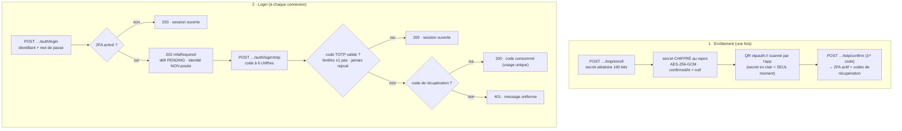
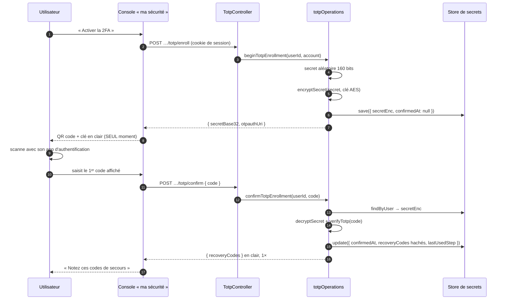
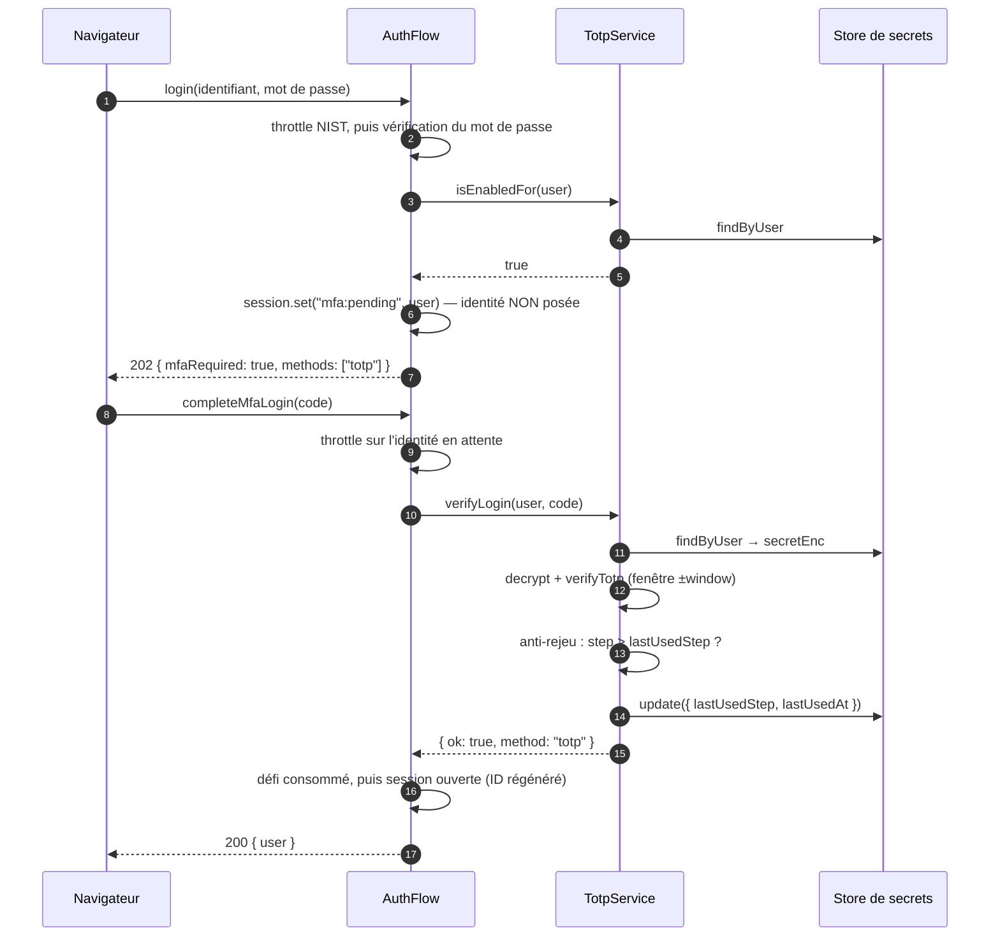

# TOTP — le second facteur à 6 chiffres

> Un mot de passe volé suffit à se connecter. Le TOTP ajoute une **deuxième preuve** : un code à
> 6 chiffres qui change toutes les 30 secondes, calculé **des deux côtés** (serveur + application
> d'authentification) à partir d'un secret partagé et de l'horloge — aucun code ne circule sur le
> réseau. Nodefony l'implémente selon la **RFC 6238**, avec le secret **chiffré au repos** (jamais
> haché : le serveur doit le relire), un **anti-rejeu**, et des **codes de récupération** pour le jour
> où le téléphone tombe dans l'eau.

📍 [Documentation](../../../../../docs/index.md) › [Sécurité](index.md) › **TOTP**

## 🧠 Le modèle mental — un secret partagé, une horloge commune

Le serveur et le téléphone ne se parlent **jamais** après l'enrôlement. Ils partagent un secret `K`,
regardent la même horloge, et calculent le même code chacun de leur côté. Se connecter, c'est prouver
qu'on détient `K` — sans jamais le transmettre.



Tant que le second facteur n'est pas validé, **l'identité n'est pas établie** : `session.user` reste
vide et le Zero Trust du firewall répond 401 sur tout le reste (`AuthFlow.login()`,
`authFlow.ts:170`).

## 📖 Lexique

| Terme                    | Sens                                                                                                        |
| ------------------------ | ----------------------------------------------------------------------------------------------------------- |
| **TOTP**                 | _Time-based One-Time Password_ (RFC 6238) : code dérivé d'un secret **et** du temps.                        |
| **HOTP**                 | _HMAC-based One-Time Password_ (RFC 4226) : la brique sous TOTP (compteur au lieu du temps).                |
| **2FA / MFA**            | Authentification à deux (ou plusieurs) facteurs : ce que je sais **+** ce que je détiens.                   |
| **Secret partagé `K`**   | Les 20 octets aléatoires communs au serveur et à l'application d'authentification.                          |
| **Pas / tranche `T`**    | Le numéro de la période de 30 s en cours — `T = ⌊epoch / 30⌋`. C'est le compteur HOTP.                      |
| **Fenêtre de dérive**    | Tolérance d'horloge : ±1 pas (±30 s) de part et d'autre.                                                    |
| **Anti-rejeu**           | Un code déjà accepté ne peut plus resservir, même dans sa fenêtre de validité.                              |
| **Step-up**              | Le second facteur est demandé **au login** (pas à chaque requête) — élévation depuis un 1ᵉʳ facteur validé. |
| **Code de récupération** | Code de secours à usage unique, imprimé une fois, pour un appareil perdu.                                   |
| **HKDF**                 | _HMAC-based Key Derivation Function_ (RFC 5869) : fabrique une clé AES à partir d'un secret de config.      |
| **AES-256-GCM**          | Chiffrement **authentifié** : confidentialité + détection de toute altération.                              |
| **base32**               | Encodage RFC 4648 du secret — lisible, saisissable à la main, compris par toutes les apps.                  |
| **`otpauth://`**         | Format d'URI (_Key Uri Format_) encodé dans le QR code d'enrôlement.                                        |

## Qu'est-ce que le TOTP — et quelle faille il bloque

**La faille.** Un mot de passe est un secret **statique** : phishing, fuite de base, réutilisation
d'un mot de passe compromis ailleurs — une fois volé, il ouvre la porte, et personne ne le remarque.

**La parade.** Exiger une **seconde preuve d'une autre nature** : non plus « ce que je sais » mais
« ce que je détiens ». L'attaquant qui a le mot de passe n'a pas le téléphone.

**Pourquoi TOTP plutôt qu'un SMS.** Le code se calcule **hors ligne**, sur l'appareil :

- pas de SMS interceptable (SIM swap, réseau SS7) — le NIST déconseille le SMS comme facteur ;
- pas de dépendance à un opérateur ni à une connexion réseau ;
- interopérable avec toutes les applications existantes (Google Authenticator, Authy, 1Password,
  Bitwarden…) via l'URI `otpauth://`.

**Ce que le TOTP ne fait PAS.** Il n'est **pas résistant au phishing** : un site miroir qui demande
le code en temps réel peut le rejouer dans les 30 secondes. Pour cette menace-là, la réponse est
[WebAuthn / passkeys](webauthn.md), où la preuve est liée cryptographiquement au domaine. Le TOTP
reste le second facteur **universel** — celui qui marche sans matériel dédié.

## La vision Nodefony — coquille fine, logique pure, secret chiffré

Trois partis pris, tous vérifiables dans le code.

**1. La logique est PURE, le service n'est qu'une prise de courant.** `TotpService` (`totp.ts:71`)
résout au boot deux choses seulement : le **store** de secrets et la **clé de chiffrement**
(`TotpService.#build()`, `totp.ts:89`). Tout le reste — enrôler, confirmer, vérifier — vit dans des
fonctions sans I/O ni container (`totpOperations.ts`), qui reçoivent leurs dépendances en argument
(`ITotpDeps`, `totpOperations.ts:22`). Conséquence directe : la logique critique se teste **sans
serveur, sans base, avec une horloge injectée** — et c'est pour ça qu'elle est couverte à ~100 %.

**2. Le secret est CHIFFRÉ, jamais haché.** Un mot de passe se hache (à sens unique) parce que le
serveur n'a qu'à le **comparer**. Un secret TOTP, lui, doit être **relu en clair** à chaque
vérification pour recalculer le code → il est **chiffré** en AES-256-GCM
(`ITotpSecret.secretEnc`, `ITotpSecret.ts:18`). C'est la différence de nature qui commande la
différence de traitement, pas une négligence.

**3. Le TOTP n'est pas un authenticator du firewall — c'est un step-up de login.** Il n'apparaît
jamais dans `area.authenticators` : il s'insère **dans le flux de session BFF**, entre le mot de
passe et l'ouverture de session (`AuthFlow.completeMfaLogin()`, `authFlow.ts:254`). Même dessin que
WebAuthn et OAuth : le firewall n'a qu'un seul mécanisme à connaître, la **session**.

> [!IMPORTANT]
> Le couplage est fait **par nom de service**, jamais par import : `AuthFlow` ne connaît du 2FA
> qu'une interface locale de trois méthodes (`ITotpLoginVerifier`, `authFlow.ts:44`). 2FA désactivé
> ⇒ service absent ⇒ le login nominal **ne paie strictement rien** (`AuthFlow.#resolveTotp()`,
> `authFlow.ts:455`).

## 🚀 Démarrage rapide

**Le besoin.** Ton application a des comptes à mot de passe. Tu veux que chaque utilisateur puisse
activer un second facteur depuis sa page « ma sécurité », et que le login l'exige ensuite.

### 1. Générer la clé de chiffrement

Le secret TOTP est chiffré au repos → il faut une clé **stable** (sinon les secrets deviennent
illisibles au redémarrage). La commande la génère et te dit exactement où la coller
(`nodefony security:secrets`, `security-secrets.ts:36`) :

```bash
npx nodefony security:secrets --write
# 🔐 Secrets security — 3 étapes, 3 FICHIERS
# 1. Fichier .env.local — les valeurs
#    ✓ écrit dans .env.local (NF_TOTP_KEY, NF_WEBHOOK_KEY, NF_CSRF_SECRET)
# 2. Fichier env.ts — la déclaration typée
# 3. Fichier nodefony.config.ts — le câblage vers le module security
```

Elle produit 32 octets aléatoires en base64 (`randomBytes(32)`, `security-secrets.ts:91`) et
**n'écrase jamais** une valeur existante — une rotation reste un geste manuel et conscient.

### 2. Déclarer puis câbler la clé

```typescript
// env.ts — SEUL lecteur de process.env (catalogue typé, validé au boot).
// nodefony.config.ts — `ctx.env` EST ce catalogue (typé par le paramètre générique).
import { defineConfig, defineEnv, envString, use } from "nodefony";

export const env = defineEnv({
  // Clé de chiffrement du secret 2FA au repos — générée par `nodefony security:secrets`.
  NF_TOTP_KEY: envString({ optional: true }),
});

export default defineConfig<typeof env>((ctx) => ({
  modules: [
    "@nodefony/http",
    "@nodefony/framework",
    // La persistance des secrets 2FA passe par un backend durable : charger
    // l'adapter suffit, il s'enregistre tout seul (`store: "auto"` le trouve).
    "@nodefony/drizzle",
    use("@nodefony/security", {
      totp: {
        // Nom affiché dans l'app d'authentification (label du QR). Omis = nom de l'app.
        issuer: "Mon App",
        // Absente en production = 2FA DÉSACTIVÉ (fail-closed, jamais une clé jetable).
        encryptionKey: ctx.env.NF_TOTP_KEY,
      },
    }),
  ],
}));
```

### 3. Les endpoints sont FOURNIS — tu n'écris aucun controller

`mountTotpRoutes()` (`TotpController.ts:154`) monte quatre routes self-service, **et seulement si**
le service `totp` existe (security chargé + 2FA activé) — sinon zéro surface, 404 :

| Route                                      | Corps      | Réponse                                        |
| ------------------------------------------ | ---------- | ---------------------------------------------- |
| `POST /nodefony/security/api/totp/enroll`  | —          | `{ secretBase32, otpauthUri }` — affichés 1×   |
| `POST /nodefony/security/api/totp/confirm` | `{ code }` | `{ recoveryCodes }` — affichés 1×              |
| `POST /nodefony/security/api/totp/disable` | —          | `{ ok: true }`                                 |
| `GET /nodefony/security/api/totp/status`   | —          | `{ enabled, pending, recoveryCodesRemaining }` |

Et côté login, deux routes du flux de session BFF (`mountSessionAuthRoutes()`,
`SessionAuthController.ts:166`) :

| Route                                         | Corps                    | Réponse                                    |
| --------------------------------------------- | ------------------------ | ------------------------------------------ |
| `POST /nodefony/security/api/auth/login`      | `{ username, password }` | `200` + identité, **ou** `202 mfaRequired` |
| `POST /nodefony/security/api/auth/login/totp` | `{ code }`               | `200` + identité, `401`, ou `429`          |

> [!WARNING]
> Les routes `totp/*` **n'ont pas** `bypassFirewall` (`TotpController.ts:52`) : elles vivent dans la
> zone data plane et exigent une session BFF. Le sujet est **toujours** l'utilisateur courant, lu
> depuis la session (`TotpController.#currentSubject()`, `TotpController.ts:138`) — jamais un
> paramètre : on n'active ni ne désactive le 2FA d'autrui (anti-IDOR).

### 4. Ce qu'on observe

```bash
# 1) ENRÔLEMENT — session BFF requise. Le secret n'apparaît QU'ICI.
curl -s -b /tmp/jar -X POST http://localhost:5151/nodefony/security/api/totp/enroll
# {"secretBase32":"JBSWY3DPEHPK3PXPJBSWY3DP",
#  "otpauthUri":"otpauth://totp/Mon%20App:alice?secret=JBSWY3DPEHPK3PXPJBSWY3DP&issuer=Mon+App&algorithm=SHA1&digits=6&period=30"}
#  ↑ c'est cette URI que l'UI transforme en QR code. Le 2FA n'est PAS encore actif.

# 2) CONFIRMATION — le 1ᵉʳ code lu dans l'app prouve que le scan a marché.
curl -s -b /tmp/jar -H 'Content-Type: application/json' \
  -d '{"code":"492039"}' http://localhost:5151/nodefony/security/api/totp/confirm
# {"recoveryCodes":["K7M2P-9XQ4R","T3VBN-2HJKD", … 10 au total …]}
#  ↑ affichés UNE seule fois : au repos, seuls leurs condensats sont gardés.

curl -s -b /tmp/jar http://localhost:5151/nodefony/security/api/totp/status
# {"enabled":true,"pending":false,"recoveryCodesRemaining":10}
```

```bash
# 3) LOGIN — le mot de passe ne suffit plus : 202, pas 200.
curl -si -c /tmp/jar2 -H 'Content-Type: application/json' \
  -d '{"username":"alice","password":"…"}' \
  http://localhost:5151/nodefony/security/api/auth/login
# HTTP/1.1 202 Accepted
# {"mfaRequired":true,"methods":["totp"]}

# 4) L'identité n'est PAS établie tant que le code n'est pas donné.
curl -s -o /dev/null -w '%{http_code}\n' -b /tmp/jar2 \
  http://localhost:5151/nodefony/security/api/auth/me
# 401

# 5) Le second facteur ouvre la session.
curl -si -b /tmp/jar2 -c /tmp/jar2 -H 'Content-Type: application/json' \
  -d '{"code":"492039"}' \
  http://localhost:5151/nodefony/security/api/auth/login/totp | head -1
# HTTP/1.1 200 OK
```

## 🏗️ Les deux cérémonies — enrôlement, puis vérification

### L'enrôlement se fait en deux temps (et c'est volontaire)

Générer un secret ne suffit pas : il faut **prouver que l'utilisateur l'a bien enregistré** avant
d'exiger le second facteur — sinon on l'enferme dehors dès la prochaine connexion.



Ce que le code garantit à chaque étape :

- **`beginTotpEnrollment()`** (`totpOperations.ts:72`) écrit le secret **déjà chiffré** avec
  `confirmedAt: null` — l'état « en attente ». Il est **idempotent** : rappeler l'enrôlement écrase
  simplement le précédent non confirmé (l'utilisateur qui a raté son scan recommence, sans support).
- **`confirmTotpEnrollment()`** (`totpOperations.ts:112`) refuse si aucun enrôlement n'est en cours
  ou s'il est déjà confirmé, et **reste en attente** si le code est faux — aucun état intermédiaire
  bancal.
- Le pas qui a servi à confirmer est marqué **consommé** (`lastUsedStep: res.step`,
  `totpOperations.ts:142`) : le code de confirmation n'est pas rejouable comme premier code de login.

> [!TIP]
> Le HTTP ne laisse jamais fuir le détail : code faux, enrôlement absent, ou déjà confirmé donnent
> tous le **même** `400 Invalid or expired code` (`TotpController.confirm()`, `TotpController.ts:97`).
> La cause fine reste côté serveur.

### La vérification au login



Trois propriétés à retenir de `AuthFlow.completeMfaLogin()` (`authFlow.ts:254`) :

1. **Le défi vit en session, pas dans l'URL ni dans un jeton client** — clé `mfa:pending`
   (`authFlow.ts:18`), posée par le login, **consommée** avant l'ouverture de session
   (`authFlow.ts:298`).
2. **Le code à 6 chiffres est throttlé** comme un mot de passe — même backoff partagé
   (`AuthFlow.#resolveThrottler()`, `authFlow.ts:264`) : 10⁶ combinaisons se forcent brute en
   quelques minutes sans lui. Trop de tentatives → `429` + `Retry-After`.
3. **Un échec ne détruit pas le défi** — l'utilisateur qui s'est trompé de chiffre ressaisit ; il
   n'a pas à refaire son mot de passe.

### La fenêtre de dérive et l'anti-rejeu

Les deux horloges ne sont jamais parfaitement synchrones. `verifyTotp()` (`totpCrypto.ts:207`)
balaie donc les tranches `T-window … T+window` et compare **en temps constant**
(`timingSafeEqual`, `totpCrypto.ts:227`) — une comparaison naïve fuirait le préfixe correct par le
temps de réponse.

| `window` | Tolérance réelle | Codes acceptés simultanément | Verdict                                  |
| -------- | ---------------- | ---------------------------- | ---------------------------------------- |
| `0`      | aucune           | 1                            | Casse dès quelques secondes de dérive.   |
| `1`      | ±30 s            | 3                            | **Défaut** — la valeur de la RFC 6238.   |
| `2`      | ±60 s            | 5                            | Surface d'attaque ×1,7 pour peu de gain. |

Le contrepoids obligatoire, c'est l'**anti-rejeu** : la tranche qui a validé est mémorisée
(`ITotpSecret.lastUsedStep`, `ITotpSecret.ts:36`), et tout code d'une tranche **≤** à la dernière
consommée est refusé par la garde `lastUsedStep` (`totpOperations.ts:173`). Un code intercepté —
épaule, proxy, phishing en temps réel — est donc **mort dès qu'il a servi une fois**.

> [!WARNING]
> La fenêtre tolère la dérive d'horloge, elle ne la corrige pas. Un serveur sans NTP finit par
> dériver au-delà de ±30 s et **tous** les codes sont refusés, sans message explicite.

## 🔐 Le secret au repos — HKDF puis AES-256-GCM

### Pourquoi une dérivation de clé plutôt que la clé de config directement

La valeur de `totp.encryptionKey` est une chaîne d'application : passphrase, hex, base64, longueur
quelconque. AES-256 exige exactement **32 octets de haute entropie**. `deriveKey()`
(`secretCipher.ts:54`) passe donc le matériel dans **HKDF-SHA256** (RFC 5869) :

- **Déterministe** — tous les pods d'un cluster dérivent la **même** clé du même secret : un secret
  écrit par un pod se relit par les autres, sans réplication de clé.
- **Séparation de domaine** — chaque brique dérive avec un `salt`/`info` distinct. Le contexte TOTP
  est figé (`TOTP_DERIVATION`, `totpCipher.ts:23`) : un blob de webhook ne se déchiffre **jamais**
  avec la clé TOTP, par construction, même si la clé maître de config est la même.
- **Longueur libre en entrée** — une passphrase courte ne devient jamais une clé AES faible.

### Le format du blob

`encryptSecret()` (`secretCipher.ts:77`) produit une chaîne opaque, préfixée par sa version :

```
gcm1.<base64url( iv‖tag‖ciphertext )>
      └ 12 o ┘└16 o┘
```

- **IV de 12 octets tiré à chaque chiffrement** (`secretCipher.ts:30`) — deux enrôlements du même
  secret donnent deux blobs différents.
- **GCM = chiffrement authentifié** : le tag de 16 octets fait échouer `decryptSecret()`
  (`secretCipher.ts:90`) si le blob a été altéré **ou** si la clé est la mauvaise. GCM ne distingue
  pas les deux cas, par construction — toute manipulation du secret stocké est donc détectée.
- **Préfixe versionné `gcm1`** : une rotation d'algorithme future pourra cohabiter avec les secrets
  existants.

Le store, lui, ne voit que des octets : il ne déchiffre jamais rien (`ITotpSecret.secretEnc`,
`ITotpSecret.ts:18`).

### La politique de clé — bruyante en dev, fail-closed en production

`TotpService.#resolveKey()` (`totp.ts:204`) tranche au boot :

| Situation                    | Environnement | Comportement                                                 |
| ---------------------------- | ------------- | ------------------------------------------------------------ |
| `totp.encryptionKey` fournie | tous          | Clé dérivée HKDF — cas nominal (`totp.ts:207`).              |
| Clé absente                  | dev / test    | Clé **éphémère** + `WARNING` (`totp.ts:221`).                |
| Clé absente                  | production    | `CRITIC` + **2FA désactivé** (`totp.ts:212`).                |
| `store: "memory"` en prod    | production    | `WARNING` — secrets volatils, comptes verrouillés au reboot. |

Le refus en production est délibéré : une clé éphémère chiffrerait des secrets **illisibles au
redémarrage suivant** et sur les autres pods — les utilisateurs seraient enfermés dehors, sans
message. Mieux vaut un 2FA absent et bruyant qu'un 2FA qui casse silencieusement en pleine nuit.

> [!CAUTION]
> Ne **jamais** modifier `TOTP_DERIVATION` (`totpCipher.ts:23`). Changer son sel ou son `info` rend
> illisibles **tous** les secrets déjà stockés — chaque utilisateur devra ré-enrôler.

## Les codes de récupération — perdre son téléphone

Un second facteur crée un risque neuf : **s'enfermer dehors**. Les codes de récupération sont la
sortie de secours — le NIST les classe comme _look-up secrets_ (SP 800-63B §5.1.2).

**Comment ils sont fabriqués** (`generateRecoveryCodes()`, `totpCrypto.ts:330`) :

- 10 codes par défaut (`totp.recoveryCodes`), au format lisible `XXXXX-XXXXX` ;
- alphabet **sans caractères ambigus** — ni `I`, ni `L`, ni `O`, ni `U` (`totpCrypto.ts:269`) : on les
  recopie à la main, souvent sous stress ;
- ~50 bits d'aléa chacun — non devinable, mais ce n'est **pas** un mot de passe humain.

**Comment ils sont stockés** : en condensat `sha256` (`hashRecoveryCode()`, `totpCrypto.ts:347`),
jamais en clair. Un `sha256` simple suffit ici, précisément parce que l'entrée est **aléatoire** (une
attaque par dictionnaire n'a rien à mordre) — contrairement à un mot de passe, qui exige Argon2id.

**Comment ils sont consommés** : au login, si le code présenté n'est pas un TOTP valide,
`verifyTotpLogin()` cherche une correspondance parmi les condensats — **en temps constant sur chaque
entrée**, et sans court-circuit à la première trouvaille (`matchRecoveryCode()`,
`totpCrypto.ts:356`). Le code trouvé est **retiré de la liste** (`totpOperations.ts:186`) : usage
unique, strictement.

La saisie est tolérante — casse et tirets ignorés à la normalisation (`totpCrypto.ts:272`) :
`k7m2p9xq4r` vaut `K7M2P-9XQ4R`.

> [!TIP]
> `recoveryCodesRemaining` (route `…/totp/status`) est l'indicateur qui compte : c'est lui qui dit
> **qui va se verrouiller** au prochain changement d'appareil. Il est exposé jusque dans la vue
> admin, sans jamais exposer les condensats.

## ⚙️ Configuration et mises en situation

La section `totp` du schéma Zod (`config.ts:982`) — validée au boot, donc une valeur hors bornes
échoue **au démarrage**, pas au premier login :

| Option          | Type                         | Défaut | Effet                                                             |
| --------------- | ---------------------------- | ------ | ----------------------------------------------------------------- |
| `enabled`       | `boolean`                    | `true` | Coupe le 2FA : service inerte, routes non montées (`totp.ts:98`). |
| `issuer`        | `string?`                    | —      | Nom affiché dans l'app d'authentification. Omis = nom de l'app.   |
| `algorithm`     | `"SHA1"\|"SHA256"\|"SHA512"` | `SHA1` | Fonction HMAC. `SHA1` = compat maximale (`config.ts:537`).        |
| `digits`        | `int` 6–8                    | `6`    | Longueur du code (RFC 4226 §5.3 : 6 minimum).                     |
| `period`        | `int` > 0                    | `30`   | Durée de vie d'un code, en secondes.                              |
| `window`        | `int` ≥ 0                    | `1`    | Tolérance de dérive, en pas (`config.ts:538`).                    |
| `recoveryCodes` | `int` > 0                    | `10`   | Nombre de codes générés à l'activation (`config.ts:546`).         |
| `encryptionKey` | `string?`                    | —      | Clé de chiffrement du secret au repos (`config.ts:574`).          |
| `store`         | `string`                     | `auto` | Backend de persistance du secret (`config.ts:580`).               |

### Situation 1 — un utilisateur active la 2FA sur son compte

C'est le cas nominal, et il ne demande **aucune configuration** au-delà de la clé : les routes
self-service sont déjà là, la console Studio les consomme déjà (`/nodefony/profile`).

```typescript
use("@nodefony/security", {
  totp: { encryptionKey: process.env.NF_TOTP_KEY },
});
```

| L'utilisateur fait…              | Ce qu'il observe                                                     |
| -------------------------------- | -------------------------------------------------------------------- |
| clique « Activer »               | QR code + clé base32 copiable, 2FA **pas encore actif**              |
| saisit le 1ᵉʳ code               | 10 codes de récupération à noter, badge « 2FA active »               |
| se déconnecte puis se reconnecte | après le mot de passe : écran « code à 6 chiffres » (réponse `202`)  |
| quitte la page sans confirmer    | rien n'est armé — un `enroll` suivant écrase simplement le brouillon |

### Situation 2 — exiger une re-vérification avant une action sensible

Le second facteur validé au login ne dit rien de **qui est devant l'écran dix minutes plus tard**
(poste laissé ouvert, session volée). Pour une suppression de compte ou une rotation de clés, on
redemande le code : c'est le _sudo mode_.

Nodefony fournit le step-up **de login** ; la re-vérification en cours de session, elle, se compose
dans ton controller à partir du service public `TotpService.verifyLogin()` (`totp.ts:262`) :

```typescript
import { controller, Controller, Post } from "@nodefony/framework";
import type { TotpService } from "@nodefony/security";

@controller("/api/secure/account")
class DangerController extends Controller {
  @Post("/delete")
  async remove() {
    const totp = this.get<TotpService>("totp");
    const code = (this.queryPost as { code?: unknown }).code;
    // Zone protégée : le firewall a déjà authentifié. On exige la PREUVE FRAÎCHE.
    if (!totp?.isEnabled() || typeof code !== "string") {
      return this.renderJson({ error: "2FA required" }, 403);
    }
    const proof = await totp.verifyLogin(this.context.user as string, code);
    if (!proof.ok) {
      return this.renderJson({ error: "Invalid code" }, 403);
    }
    // … l'action destructrice ici …
    return this.renderJson({ ok: true });
  }
}
```

L'anti-rejeu joue en ta faveur : le code utilisé pour cette action ne pourra plus être rejoué pour
une autre. Variante **sans** TOTP, purement déclarative, si la re-saisie du mot de passe te suffit :
une zone firewall en `mode: "all"` avec `["session", "userpassword"]` — voir
[firewall](firewall.md).

### Situation 3 — le contre-exemple piégeux : « durcir » les paramètres

La tentation est grande de monter `digits: 8` et `algorithm: "SHA512"` pour « renforcer ». C'est un
piège d'interopérabilité :

```typescript
totp: { algorithm: "SHA1", digits: 6 },     // ✅ lu par toutes les apps
totp: { algorithm: "SHA512", digits: 8 },   // ❌ Google Authenticator ignore ces paramètres
```

L'URI `otpauth://` transporte bien `algorithm` et `digits` (`buildOtpauthUri()`,
`totpCrypto.ts:253`), mais plusieurs applications grand public les **ignorent** et calculent en
`SHA1`/6 chiffres. Résultat : le QR est scanné, l'app affiche un code… systématiquement refusé, sans
que rien ne semble anormal. Le gain de sécurité réel est par ailleurs nul — l'anti-rejeu et le
throttle bornent déjà les tentatives bien avant l'espace des codes.

## L'entité de persistance — un secret par utilisateur

Le modèle est volontairement minimal : **clé naturelle = `userId`**, `save` est un upsert
(`ITotpSecretStore`, `ITotpSecretStore.ts:69`). Pas d'identifiant de ligne, pas d'index secondaire —
tout accès passe par la clé primaire.

Spécification logique de la table (`TOTP_SECRET_TABLE_SPEC`, `totpSecretEntity.ts:36`), déclinée par
dialecte via le colKit :

| Colonne         | Rôle                                            | SQLite             | PostgreSQL | MySQL / MariaDB |
| --------------- | ----------------------------------------------- | ------------------ | ---------- | --------------- |
| `userId` **PK** | Propriétaire (clé naturelle)                    | `text`             | `text`     | `varchar(512)`  |
| `secretEnc`     | Secret `K` **chiffré** (blob opaque)            | `text`             | `text`     | `text`          |
| `algorithm`     | `SHA1` / `SHA256` / `SHA512`                    | `text`             | `text`     | `text`          |
| `digits`        | Longueur du code                                | `integer`          | `integer`  | `int`           |
| `period`        | Durée d'un code (s)                             | `integer`          | `integer`  | `int`           |
| `recoveryCodes` | Condensats des codes **non consommés**          | `text` (mode json) | `jsonb`    | `json`          |
| `confirmedAt`   | Activation (epoch ms) ou `null` = en attente    | `integer`          | `bigint`   | `bigint`        |
| `lastUsedStep`  | Dernière tranche `T` validée (**pas** une date) | `integer`          | `integer`  | `int`           |
| `createdAt`     | Création (epoch ms)                             | `integer`          | `bigint`   | `bigint`        |
| `lastUsedAt`    | Dernier usage réussi (epoch ms) ou `null`       | `integer`          | `bigint`   | `bigint`        |

Deux pièges de lecture, signalés dans l'entité elle-même :

- `lastUsedStep` est un **numéro de tranche RFC 6238**, pas un horodatage — d'où le type `int`
  partout, quand les vraies dates sont en `epochMs` (`totpSecretEntity.ts:53`).
- Un epoch en millisecondes **déborde** un `integer` 32 bits → `bigint` en PostgreSQL et MySQL
  (SQLite, lui, a des INTEGER 64 bits).

### Les backends disponibles — et ceux qui manquent

| Backend    | Enregistré par                                | Durabilité                          | État                 |
| ---------- | --------------------------------------------- | ----------------------------------- | -------------------- |
| `memory`   | builtin (`totpSecretStoreRegistry.ts:54`)     | **volatile** — perdu au redémarrage | ✅ dev / tests       |
| `drizzle`  | `@nodefony/drizzle` (`registerStores.ts:279`) | durable, partagé entre pods         | ✅ 3 dialectes SQL   |
| `mongoose` | —                                             | —                                   | ⏳ manquant, à venir |
| `redis`    | —                                             | —                                   | ⏳ manquant, à venir |

Ces deux absences sont des **manques**, pas des choix de périmètre (`MIGRATION_STATUS.md`, P7.11) —
mais elles se comblent à deux régimes différents.

`redis` le portera **en opt-in explicite, jamais choisi par `auto`** — exactement le régime des
passkeys qu'il porte déjà. Un secret TOTP est de la même famille qu'un credential passkey : une
petite valeur, durable, relue à chaque authentification, dont la perte verrouille l'utilisateur
dehors. Porter l'un et refuser l'autre au nom du « cache évincible » serait incohérent : le risque
est identique, et il est déjà assumé, avec son avertissement — sur Redis, la persistance devient la
responsabilité de l'exploitant (AOF, pas d'éviction sur ces clés).

`mongoose` le portera **au régime normal** : une application choisit son ORM, elle ne choisit pas de
se passer du 2FA — l'objectif est de pouvoir tourner entièrement sur Mongo, sans drizzle. Aujourd'hui, une application MongoDB qui active le 2FA **retombe sur `memory`** (avec la
raison annoncée dans les journaux de boot, et un avertissement en production) : ses secrets ne
survivent pas au redémarrage, et ses utilisateurs se retrouvent verrouillés hors de leur second
facteur. **En attendant** : charger `@nodefony/drizzle` à côté de Mongo — même en SQLite local — suffit
à rendre le store durable, les deux modules cohabitent sans conflit.

Côté `drizzle`, les **trois dialectes** sont portés — `TOTP_PORTED` vaut l'ensemble des dialectes
(`registerStores.ts:92`) : SQLite, PostgreSQL, MySQL/MariaDB. Le store n'écrit **aucun SQL natif**,
tout passe par le contrat `IRepository` (`DrizzleTotpSecretStore`, `DrizzleTotpSecretStore.ts:38`)
— c'est ce qui rend la portabilité gratuite.

**Comment le backend est choisi.** `store: "auto"` (le défaut) suit l'infra déclarée puis les
adapters réellement chargés (`TotpService.#resolveStore()`, `totp.ts:134`) :

1. `NF_STORE` (override global de banc de charge), s'il est enregistré ici ;
2. infra base de données déclarée (`NF_DATABASE_URL`) → `drizzle` ;
3. sinon, backend local persistant chargé → `drizzle` (SQLite) ;
4. sinon **repli `memory`, annoncé** — jamais silencieux.

Un `store` **explicite** introuvable, en revanche, ne se replie pas : `CRITIC` en dev, boot avorté en
production (`totp.ts:167`). Une faute de frappe ne dégrade jamais la sécurité en douce.

## Le listing paginé des enrôlements

Question d'exploitation : « quelle est la **couverture** 2FA, et qui est resté bloqué en attente de
confirmation ? » Un secret jamais confirmé ne protège personne, et c'est invisible depuis la fiche
d'un seul utilisateur.

`ITotpSecretStore.listPage()` (`ITotpSecretStore.ts:85`) répond, avec trois garanties :

- **pagination native au store** — jamais de parcours complet en mémoire ; l'ordre est contractuel
  (`createdAt` DESC, départagé par `userId` ASC) ;
- **filtres appliqués côté backend** — `confirmed` (activés / en attente) et `q` (préfixe d'`userId`,
  donc indexable : le critère `$like` est **ancré à gauche**, `DrizzleTotpSecretStore.ts:153`) ;
- **la vue ne peut pas porter de secret** — `ITotpEnrollmentSummary` (`ITotpSecretStore.ts:16`)
  n'a ni `secretEnc` ni les condensats de récupération, seulement leur **nombre**
  (`recoveryCodesLeft`).

Ce dernier point est une garantie **de contrat**, pas une redaction faite à l'affichage : quel que
soit le backend, ces champs ne peuvent pas remonter par ce chemin, même si un appelant les demandait
(`toTotpEnrollment()`, `MemoryTotpSecretStore.ts:18`). C'est ce qu'exerce le banc de contrat partagé.

`countEnrollments()` (`ITotpSecretStore.ts:90`) donne le KPI de couverture sans énumérer une seule
ligne.

## 🧰 API publique

Tout est exporté depuis `@nodefony/security` — signatures complètes dans `.ai/symbols.json`.

**Le service** (`TotpService`, `totp.ts:71`), résolu par nom dans le container (`"totp"`) :

| Méthode                             | Rôle                                                         |
| ----------------------------------- | ------------------------------------------------------------ |
| `isEnabled()` (`totp.ts:247`)       | 2FA opérationnel (activé en config **et** boot réussi).      |
| `beginEnrollment()` (`totp.ts:252`) | Démarre l'enrôlement → secret + URI `otpauth://`, 1×.        |
| `confirmEnrollment()` (`:257`)      | Confirme par un 1ᵉʳ code → active + codes de récupération.   |
| `verifyLogin()` (`totp.ts:262`)     | Vérifie un code TOTP **ou** de récupération. Ne lève jamais. |
| `disable()` (`totp.ts:267`)         | Retire secret et codes.                                      |
| `status()` (`totp.ts:272`)          | `{ enabled, pending, recoveryCodesRemaining }`.              |
| `isEnabledFor()` (`totp.ts:299`)    | Raccourci du flux de login (`false` si le 2FA est inerte).   |
| `listPage()` (`totp.ts:283`)        | Page d'enrôlements (data plane admin).                       |
| `countEnrollments()` (`:294`)       | Compte filtré, sans énumération.                             |

**Les opérations pures**, si tu veux le 2FA **sans** le service (test, script, autre transport) —
elles prennent leurs dépendances en argument : `beginTotpEnrollment()`, `confirmTotpEnrollment()`,
`verifyTotpLogin()`, `disableTotp()`, `totpStatus()` (`totpOperations.ts:72`).

**Les primitives crypto**, pour écrire un client ou un banc de test : `totpCode()`
(`totpCrypto.ts:174`), `base32Decode()` (`totpCrypto.ts:81`), `deriveTotpKey()`
(`totpCipher.ts:33`).

```typescript
// Calculer le code attendu côté « application d'authentification » — exactement
// ce que fait le banc e2e drizzle pour piloter un vrai login.
import { totpCode, base32Decode } from "@nodefony/security";
const code = totpCode(base32Decode(secretBase32), { epochMs: Date.now() });
```

## 🧩 Extension — brancher son propre store

Le registre découple le cœur du backend : implémente `ITotpSecretStore`
(`ITotpSecretStore.ts:69`), enregistre la fabrique, sélectionne-la en config.

```typescript
import { registerTotpStore, type ITotpSecretStore } from "@nodefony/security";

registerTotpStore("mon-backend", ({ container, config }) => {
  return new MonTotpStore(container, config.totp.period);
});
// puis : use("@nodefony/security", { totp: { store: "mon-backend" } })
```

Six méthodes à tenir : `findByUser`, `save` (upsert), `update` (patch **partiel** — un champ absent
ne doit **pas** être écrasé à `null`), `delete`, `listPage`, `countEnrollments`. Le contrat de
listing se prouve en branchant le banc partagé sur ton store (voir la section Tests) — c'est lui qui
vérifie que ta projection n'expose ni secret ni condensat.

## 📜 Normes appliquées

| Domaine                     | Norme                    | Ancrage dans le code                                   |
| --------------------------- | ------------------------ | ------------------------------------------------------ |
| TOTP (algorithme)           | RFC 6238 §4              | `totpCode()` (`totpCrypto.ts:174`)                     |
| HOTP + troncature dynamique | RFC 4226 §5.3            | `hotp()` (`totpCrypto.ts:129`), masque `0x7f` (`:141`) |
| Taille du secret (≥ 128 b)  | RFC 4226 R6              | `TOTP_DEFAULTS.secretBytes` = 20 (`totpCrypto.ts:33`)  |
| Fenêtre de dérive           | RFC 6238 §5.2            | `verifyTotp()` (`totpCrypto.ts:207`)                   |
| Anti-rejeu du code          | RFC 6238 §5.2            | garde `lastUsedStep` (`totpOperations.ts:173`)         |
| Encodage du secret          | RFC 4648 (base32)        | `base32Encode()` (`totpCrypto.ts:58`)                  |
| Dérivation de clé           | RFC 5869 (HKDF)          | `deriveKey()` (`secretCipher.ts:54`)                   |
| Nonce GCM 96 bits           | NIST SP 800-38D §5.2.1.1 | `IV_BYTES` (`secretCipher.ts:30`)                      |
| Codes de secours            | NIST SP 800-63B §5.1.2   | `generateRecoveryCodes()` (`totpCrypto.ts:330`)        |
| Backoff des tentatives      | NIST SP 800-63B          | `AuthFlow.completeMfaLogin()` (`authFlow.ts:264`)      |
| Rate limit (429)            | RFC 6585                 | `429` + `Retry-After` (`SessionAuthController.ts:145`) |

Les **vecteurs de test de la RFC 6238 (Appendix B)** sont rejoués en test sur les trois fonctions de
hachage — c'est la preuve d'interopérabilité, pas une auto-évaluation.

## ⚡ Performance & mémoire

Le 2FA est un chemin **froid** : il ne coûte rien tant qu'on ne se connecte pas.

- **Sur le login nominal** (2FA absent ou désactivé) : `AuthFlow.#resolveTotp()` (`authFlow.ts:455`)
  résout le service **une seule fois** puis met le résultat en cache. Service absent ⇒ `null` ⇒
  **zéro accès au store**, zéro allocation par login.
- **Aucun coût par requête** : le TOTP n'est pas un authenticator du firewall, il ne s'exécute donc
  jamais dans le pipeline HTTP/WS.
- **Allocation paresseuse du store** : la `Map` de `MemoryTotpSecretStore`
  (`MemoryTotpSecretStore.ts:62`) n'existe que si le 2FA est activé — le service ne construit rien
  quand `totp.enabled` est `false` (`totp.ts:98`).
- **Le coût réel d'une vérification** : ≤ `2·window + 1` HMAC (3 par défaut) + un déchiffrement
  AES-GCM. De l'ordre de la microseconde — négligeable devant le hachage Argon2id du mot de passe
  qui l'a précédé.
- **Arrêt propre** : si le store sait se vider sur disque, `TotpService.#shutdown()` (`totp.ts:234`)
  le déclenche à `onTerminate` — aucune écriture en attente perdue.

## 📡 Observabilité — Studio

| Écran                                 | Ce qu'il montre                                                                   |
| ------------------------------------- | --------------------------------------------------------------------------------- |
| **Profil** `/nodefony/profile`        | Carte 2FA self-service : statut, activation par QR, désactivation.                |
| **Utilisateur** `/nodefony/users/:id` | Vue admin : statut 2FA + **réinitialisation** (appareil perdu). Pas d'enrôlement. |
| **Stores** `/nodefony/stores`         | Backend résolu pour la brique `totp` + emplacement physique.                      |
| **Login** `/nodefony/login`           | La phase « code à 6 chiffres » du step-up (réponse `202`).                        |

Le data plane admin correspondant, gardé par `ROLE_NODEFONY_ADMIN` :

- `GET /nodefony/security/api/totp/list` — couverture 2FA paginée (`SecurityAdminApi.ts:606`).
  Réponse **honnête** si le 2FA est désactivé : `{ enabled: false, items: [] }`, jamais une erreur —
  la console doit pouvoir afficher « 2FA désactivé ».
- `GET /nodefony/security/api/users/{id}/totp` — statut d'un utilisateur (`SecurityAdminApi.ts:658`).
- `POST /nodefony/security/api/users/{id}/totp/disable` — reset admin, **audité**
  (`SecurityAdminApi.ts:683`).

L'admin peut **désactiver**, jamais **activer** pour autrui : le secret se scanne sur l'appareil de
l'utilisateur, lui seul peut l'armer.

Côté journal d'audit, quatre actions tracent le cycle : `login.mfa_required` (`authFlow.ts:177`),
`login.success` avec `reason: "totp"` ou `"recovery"` (`authFlow.ts:299`), `login.failure` avec
`reason: "mfa_invalid"` (`authFlow.ts:291`), et `user.totp_disabled` côté admin
(`SecurityAdminApi.ts:707`).

## ⚠️ Pièges (symptôme → cause → correction)

| Symptôme                                          | Cause (dans le code)                                                 | Correction                                                         |
| ------------------------------------------------- | -------------------------------------------------------------------- | ------------------------------------------------------------------ |
| 2FA inactif en production, `CRITIC` au boot       | `totp.encryptionKey` absente — fail-closed (`totp.ts:212`)           | `npx nodefony security:secrets`, puis câbler `ctx.env.NF_TOTP_KEY` |
| Tous les secrets illisibles après déploiement     | Clé éphémère (dev) ou `TOTP_DERIVATION` modifié                      | Clé **stable** partagée ; ne jamais toucher au contexte HKDF       |
| Secrets perdus à chaque redémarrage               | Store résolu en `memory` (aucun adapter durable chargé)              | Charger `@nodefony/drizzle` ou déclarer `NF_DATABASE_URL`          |
| Code « juste » systématiquement refusé            | Horloge décalée de plus d'un pas (fenêtre = ±30 s)                   | Synchroniser NTP serveur **et** téléphone                          |
| Le QR est scanné mais aucun code ne passe         | `digits`/`algorithm` non standard, ignorés par l'app                 | Rester en `SHA1` / 6 chiffres                                      |
| `202` au login au lieu de `200`                   | Comportement **attendu** : second facteur requis                     | Enchaîner sur `POST …/auth/login/totp`                             |
| `401` sur `…/auth/me` juste après le mot de passe | L'identité n'est posée qu'après le 2ᵉ facteur (`authFlow.ts:170`)    | Terminer le step-up                                                |
| `429` pendant la saisie du code                   | Throttle NIST dans `AuthFlow.completeMfaLogin()` (`authFlow.ts:264`) | Respecter `Retry-After` — attendu sous attaque                     |
| `503 2FA unavailable` sur `…/totp/*`              | Service absent ou `isEnabled()` faux (`TotpController.ts:128`)       | Vérifier `totp.enabled` + la clé + les logs de boot                |
| Utilisateur bloqué, plus aucun code               | Codes de récupération épuisés                                        | Reset admin via `…/users/{id}/totp/disable`, puis ré-enrôlement    |
| Même code accepté deux fois                       | Impossible — anti-rejeu `lastUsedStep` (`totpOperations.ts:173`)     | —                                                                  |
| Code de récupération réutilisable                 | Impossible — retiré du stock à l'usage (`totpOperations.ts:186`)     | Régénérer un lot en ré-enrôlant si le stock est bas                |

## 🧪 Tests & couverture

Quatre familles couvrent la brique — les **chiffres exacts vivent dans la carte de l'aperçu**
(régénérée par `gen-counters.mjs` depuis vitest, jamais figée ici) :

- **unitaires** — `totpCrypto` (vecteurs RFC 6238 Appendix B sur SHA1/256/512, troncature, base32,
  fenêtre, format `otpauth://`, codes de récupération), `totpOperations` (enrôlement, confirmation,
  anti-rejeu, récupération, statut), `totpCipher` (round-trip AES-GCM, altération détectée,
  dérivation HKDF), `totpSecretStore` (CRUD par `userId`, snapshot/restore), `mfaStepUp` (le
  step-up de login : défi PENDING, identité non posée, throttle) ;
- **banc de contrat** — `totpPaginationContract` (`tests/support/totpPaginationContract.ts`) :
  seed déterministe de 10 enrôlements, exécuté à l'identique sur **tous** les backends. Il porte une
  exigence de **sécurité**, pas seulement de pagination : un backend qui élargirait sa projection
  (secret ou condensats) échoue ici ;
- **intégration** — `totp-store-sqlite` : le même banc branché sur `DrizzleTotpSecretStore` ;
- **E2E base réelle** — `totp-flow-e2e` rejoue le **flux complet** (enrôlement → confirmation →
  login anti-rejeu → code de récupération → désactivation) sur le store Drizzle, pas un CRUD isolé ;
  `totp-store-postgres.e2e` et `totp-store-mysql.e2e` rejouent le contrat sur PostgreSQL et
  MySQL/MariaDB réels (gatés par `NF_PG_URL` / `NF_MYSQL_URL` — sans eux, ces suites **se skippent**,
  et un skip compte comme vert).

**Ce qui manque, dit franchement** : aucun test d'**attaque** dédié (`*.attack.test.ts`) sur le
TOTP — brute-force du code sous throttle, énumération par la latence, rejeu inter-pod — et aucun
test de **charge/mémoire** propre à la brique. La coquille de boot `service/totp.ts` (I/O de
câblage) n'est pas couverte en unitaire ; c'est le banc e2e qui l'exerce indirectement.

Skills utiles : `nodefony-security-review` (mode red-team, pour combler les tests d'attaque),
`nodefony-load-test` (charge). Couverture : `npm run coverage` dans `@nodefony/security`.

## 🔗 Pour aller plus loin

- ⬆️ **Retour au hub** : [Sécurité — vue d'ensemble](index.md) · [Toute la documentation](../../../../../docs/index.md)
- Le facteur **résistant au phishing**, la suite logique → [WebAuthn / passkeys](webauthn.md)
- Où le step-up s'insère (zones, Zero Trust, `mode: "all"`) → [Firewall](firewall.md)
- Le 1ᵉʳ facteur : mot de passe, Basic, throttle NIST → [Authenticators](authenticators.md)
- Ce que l'audit enregistre du cycle 2FA → [Autorisation](authorization.md)
- Termes croisés (facteur, step-up, BFF, Zero Trust) → [Lexique](lexique.md)
