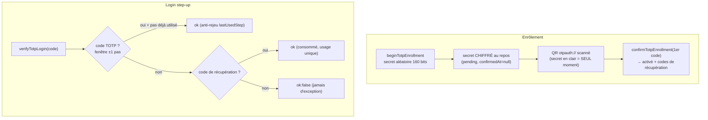

# TOTP — le code à 6 chiffres (2FA)

> Le TOTP ajoute un **second facteur** : un code à 6 chiffres qui change toutes les 30 s, calculé de
> part et d'autre (serveur + appli d'authentification) à partir d'un **secret partagé** et de l'horloge —
> aucun échange réseau par code. Nodefony l'implémente selon la **RFC 6238** (sur HOTP RFC 4226), avec le
> secret **chiffré au repos** (jamais haché, car le serveur doit le relire) et des **codes de
> récupération**. Ancré sur `service/totp.ts` + `src/totp/` (logique pure).

## Le modèle mental — enrôler une fois, présenter à chaque login

## Lexique

| Terme                | Sens                                                                              |
| -------------------- | --------------------------------------------------------------------------------- |
| TOTP                 | _Time-based OTP_ (RFC 6238) : code dérivé du secret + du temps.                   |
| HOTP                 | _HMAC-based OTP_ (RFC 4226) : la base de TOTP (compteur au lieu du temps).        |
| Step-up              | Facteur présenté **au login** seulement (pas à chaque requête).                   |
| Secret partagé       | La clé `K` (160 bits) commune au serveur et à l'appli d'authentification.         |
| Fenêtre de dérive    | Tolérance d'horloge : ±1 pas (30 s) de part et d'autre (RFC 6238 §5.2).           |
| Code de récupération | Code de secours à usage unique, si l'appareil 2FA est perdu.                      |
| HKDF                 | Dérivation de clé (RFC 5869) — produit la clé AES à partir du matériel de config. |

## Qu'est-ce que ça résout — la faille

Un mot de passe volé (phishing, fuite, réutilisation) suffit à se connecter. Le 2FA casse ça : sans le
**second facteur**, le mot de passe seul ne donne rien. Le TOTP est le facteur le plus répandu (Google
Authenticator, Authy, 1Password) car il fonctionne **hors ligne** — pas de SMS interceptable, pas de
dépendance réseau. Nodefony le pose comme un **step-up de login** (calqué sur WebAuthn/OAuth) : tant que
le second facteur n'est pas validé, `session.user` n'est **pas** posé, et le Zero Trust 401 protège tout
le reste (`totp.ts:56-60`).

## La vision Nodefony — coquille fine, logique pure, secret chiffré

Le service est une **coquille fine** : au boot (si `totp.enabled`) il résout le store de secrets
pluggable + la **clé de chiffrement AES-256-GCM**, puis délègue **toute la logique** aux opérations
**pures** `totpOperations` (testables sans kernel ni serveur, `totp.ts:56-58`). D'où la couverture : la
logique critique est à ~100 %, la coquille d'I/O à part.

Constat de sûreté central — **chiffré, pas haché** : le secret TOTP doit être **relu en clair** par le
serveur à chaque vérification → il est **chiffré** (AES-256-GCM), jamais haché (`totp.ts:62-73`). La clé
vient de `totp.encryptionKey` via **HKDF-SHA256** (RFC 5869, `totpCipher.ts:29-34`) — déterministe donc
lisible **cross-pod**. Politique de clé (calquée sur l'idempotence Redis) : absente → en **dev** clé
**éphémère + WARNING** (secrets perdus au redémarrage) ; en **production** c'est **fatal**, 2FA désactivé
(une clé éphémère rendrait les secrets illisibles après redémarrage ou sur les autres pods). Le contexte
HKDF (`salt: "nodefony.totp.hkdf.v1"`) est **figé** : le changer rendrait illisibles tous les secrets
déjà stockés (`totpCipher.ts:21-24`).

## L'enrôlement — deux temps

- **`beginTotpEnrollment`** : génère un secret aléatoire (160 bits, RFC 4226 R6), le **chiffre au repos**
  et l'enregistre `pending` (`confirmedAt: null`). Retourne le secret **en clair** (base32 + URI
  `otpauth://`) — **seul moment** où il est exposé. **Idempotent** : un nouvel appel écrase un enrôlement
  non confirmé (re-scan du QR, `totpOperations.ts:67-87`).
- **`confirmTotpEnrollment`** : vérifie un **premier code** généré par l'appli, **active** le 2FA et
  génère les **codes de récupération** (retournés clairs **1×**, **hachés au repos**). Le pas de
  confirmation est marqué **consommé** → non rejouable au 1ᵉʳ login (`:107-145`).

## Le login — vérification, dérive, anti-rejeu

`verifyTotpLogin` (`totpOperations.ts:149-193`) essaie d'abord un **code TOTP** : `verifyTotp` balaie la
**fenêtre ±window** (RFC 6238 §5.2, défaut ±1 pas, `totpCrypto.ts:223`) en comparaison **à temps
constant** (`timingSafeEqual`, `:227`), et **refuse tout rejeu** dans la même fenêtre via `lastUsedStep`
(`:192`). À défaut, un **code de récupération** : recherché en timing-safe, **consommé** (usage unique,
retiré de la liste, `:183-189`). Sur le chemin d'authentification, la fonction retourne `ok:false` —
**jamais d'exception**.

## La crypto — RFC 6238 / 4226, en clair

`totpCrypto.ts` est le cœur **pur** (aucun I/O, partagé émetteur/vérificateur). Le code applique :
troncature dynamique RFC 4226 §5.3 (offset des 4 bits de poids faible, masque `0x7f` pour lever
l'ambiguïté signé/non-signé inter-processeur, `code = bin31 mod 10^digits`, `:19-22`), secret ≥ 128 bits
/ recommandé 160 (= taille de bloc HMAC-SHA-1, `:24-26`), encodage **base32 RFC 4648 sans padding**
(tolérant à la saisie manuelle : espaces/tirets/casse ignorés, `:77-89`). Défauts interopérables Google
Authenticator (`step: 30`, `digits: 6`, `window: 1`, `:33-48`).

## Pièges (symptôme → cause → correction)

| Symptôme                                 | Cause (dans le code)                                 | Correction                                            |
| ---------------------------------------- | ---------------------------------------------------- | ----------------------------------------------------- |
| 2FA désactivé au boot en prod            | `totp.encryptionKey` absente (fatal en prod)         | Fournir `totp.encryptionKey` (secret stable, partagé) |
| Secrets illisibles après un déploiement  | Clé éphémère (dev) ou `salt` HKDF modifié            | Clé stable ; **ne jamais** changer `TOTP_DERIVATION`  |
| Code refusé alors que « juste »          | Horloge du téléphone/serveur trop décalée (> ±1 pas) | Synchroniser l'horloge ; la fenêtre est ±30 s         |
| Même code accepté deux fois              | (impossible) : anti-rejeu `lastUsedStep`             | —                                                     |
| Code de récupération réutilisé           | (impossible) : usage unique, consommé                | Régénérer un lot si épuisé                            |
| Code de confirmation rejoué au 1ᵉʳ login | (impossible) : pas de confirmation marqué consommé   | —                                                     |

## Tests & couverture

TOTP est couvert par **61 cas unit + 9 bancs de contrat** : `totpCrypto` (20, HOTP/troncature/base32),
`totpOperations` (15, enrôlement/login/récupération), `totpCipher` (9, AES-GCM + HKDF), `totpSecretStore`
(8), `mfaStepUp` (9, le step-up de login) et `totpPaginationContract` (9). La **logique pure** est à
~100 % (`totpOperations` 100 %, `totpCipher` 100 %, `totpCrypto` ~99 %, store mémoire 100 %) ; la coquille
de boot `service/totp.ts` (I/O de câblage) n'est pas unit-testée. Photo régénérée depuis vitest.

## Pour aller plus loin

- WebAuthn (facteur phishing-resistant) → [webauthn](./webauthn.md) · Mot de passe → [authenticators](./authenticators.md)
- Le chiffrement de secret générique (HKDF + AES-GCM) réutilisé → `src/crypto/secretCipher`
- Vue d'ensemble sécurité → [index](./index.md)
