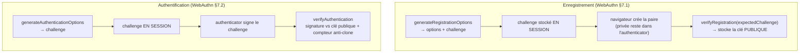

# WebAuthn / passkeys — l'authentification qui ne se phishe pas

> Un passkey remplace (ou renforce) le mot de passe par une **paire de clés** dont la privée **ne quitte
> jamais** l'authenticator (Touch ID, Windows Hello, clé FIDO). Le serveur ne manipule que des **clés
> publiques** et vérifie des **signatures** : impossible à hameçonner, à rejouer, ou à voler dans une
> base. Nodefony orchestre les deux cérémonies FIDO2 au-dessus de `@simplewebauthn/server`. Ancré sur
> `src/packages/@nodefony/security/nodefony/service/webAuthn.ts`.

## Le modèle mental — deux cérémonies, le challenge en session

## Lexique

| Terme             | Sens                                                                                 |
| ----------------- | ------------------------------------------------------------------------------------ |
| Passkey           | Une paire de clés FIDO2 ; la privée vit dans l'authenticator, jamais sur le serveur. |
| Cérémonie         | La séquence normalisée d'un enregistrement (§7.1) ou d'une authentification (§7.2).  |
| RP                | _Relying Party_ : votre app (identifiée par `rpID` = un domaine enregistrable).      |
| Challenge         | Aléa émis par le serveur, signé par l'authenticator (anti-rejeu).                    |
| `signCount`       | Compteur incrémenté par l'authenticator — une régression trahit un **clone**.        |
| User Verification | L'authenticator a vérifié l'utilisateur (biométrie/PIN) — exigible (`required`).     |
| userHandle        | Identifiant opaque de l'utilisateur côté authenticator (= l'id applicatif stable).   |

## Qu'est-ce que ça résout — les failles fermées

Le mot de passe est _phishable_ (un faux site le capture) et _rejouable_ (une base volée compromet tout).
WebAuthn ferme les deux par construction : (1) la signature est **liée à l'origine** (`rpID`/origin) → un
faux domaine ne peut pas obtenir une signature valide (**anti-phishing**) ; (2) le serveur ne stocke que
des **clés publiques** → une fuite de base ne donne rien ; (3) le **challenge** à usage unique rend le
rejeu impossible ; (4) le **compteur** détecte un authenticator cloné. C'est le facteur d'authentification
le plus fort disponible aujourd'hui.

## La vision Nodefony — le serveur ne détient jamais de secret

Le service **ne manipule que des clés publiques** et délègue toute la crypto (parsing CBOR/COSE,
signatures ES256/RS256/EdDSA) à `@simplewebauthn/server`, une **lib auditée** de l'écosystème, **importée
paresseusement** au 1ᵉʳ usage (cold path — l'enregistrement/login n'est pas le hot path, `webAuthn.ts:72-90`).
Au boot (si `passkeys.enabled`) : résolution du RP (rpID/rpName/origines depuis la config sinon le domaine
de l'app ; **rpID doit être un domaine enregistrable ou `localhost`**, `:128-130`) + du store de
credentials pluggable, posé au container.

Constat anti-rejeu majeur : **le challenge est porté HORS du service** (en session BFF par le controller,
`webAuthn.ts:88-90`). Chaque `verify*` reçoit le `expectedChallenge` qu'il a émis → un challenge n'est
**jamais réutilisable**, et le service reste sans état de session (testable sans transport).

## Les deux cérémonies

### Enregistrement — `generateRegistrationOptions` / `verifyRegistration`

Génère les options (dont `residentKey`, `userVerification`, `:262-263`) + un challenge à stocker en
session. `verifyRegistration(expectedChallenge, requestOrigin)` vérifie **challenge, origine, rpIdHash,
flags, signature** (`:274-304`), applique un **plafond `passkeys.maxPerUser`** → **409** si atteint
(`:315`), et stocke la **clé publique** + `signCount` initial. Message uniforme en cas d'échec
(anti-oracle, `:304`).

### Authentification — `generateAuthenticationOptions` / `verifyAuthentication`

Émet un challenge ; `verifyAuthentication(expectedChallenge)` vérifie la signature **contre la clé
publique stockée** (§7.2) puis **applique l'état** : `signCount → newCounter`, `backupState`,
`uvInitialized`, `lastUsedAt` (`:405-414`). La **monotonie du `signCount`** est le garde anti-clone : un
compteur qui régresse trahit un authenticator dupliqué (vérifié par la lib).

## Anti-phishing — la résolution d'origine

`#expectedOrigin` (`webAuthn.ts:476-497`) : la **liste blanche de config** prime (prod). À défaut,
l'origine de la requête n'est acceptée **que si son hostname == rpID** (dev : `localhost:port` quel que
soit le port, **sans jamais ouvrir à un domaine tiers**) ; dernier recours `https://{rpID}`. C'est cette
liaison origine↔rpID qui rend la signature inutilisable sur un faux domaine.

## Anti-IDOR — suppression self-service

`removeUserCredential(userId, credentialId)` ne supprime que si le credential **appartient** à `userId`,
sinon `false` → **404 indiscernable** côté client : on ne révèle jamais l'existence d'un credential
d'autrui (`webAuthn.ts:455-461`). Le data plane admin a sa vue transverse séparée (`listCredentialsPage`,
projection **sans clé publique**, `:432-444`).

## Store pluggable

Les credentials vivent dans un `IWebAuthnCredentialStore` pluggable (builtin mémoire, ou ORM via le
registre `webAuthnCredentialStoreRegistry`). Un store `file` sait se **flusher à l'arrêt** (`isFlushable`
→ `flushNow`, `:44-50`, `:218`). La pagination admin est garantie par un **banc de contrat** tenu par
tous les stores.

## Pièges (symptôme → cause → correction)

| Symptôme                                    | Cause (dans le code)                                 | Correction                                                     |
| ------------------------------------------- | ---------------------------------------------------- | -------------------------------------------------------------- |
| Enregistrement refusé en `409`              | Plafond `passkeys.maxPerUser` atteint                | Révoquer un appareil, ou augmenter `maxPerUser`                |
| Vérification échoue en prod                 | Origine non whitelistée / rpID ≠ domaine             | Configurer `passkeys.origins` + `rpId` (domaine enregistrable) |
| Passkey KO en dev sur `localhost:5173`      | rpID ≠ `localhost`                                   | rpID = `localhost` (le port est ignoré)                        |
| Login rejeté après restauration d'un backup | `signCount` régresse (clone suspecté)                | Comportement voulu (anti-clone) — ré-enrôler                   |
| Challenge « invalide »                      | `expectedChallenge` non stocké/retrouvé en session   | Le controller doit persister le challenge de l'étape 1         |
| Suppression du passkey d'autrui             | (impossible) : ownership vérifié → 404 indiscernable | —                                                              |

## Tests & couverture

WebAuthn est couvert par **20 cas unit + 4 tests d'attaque + 14 bancs de contrat** :
`webAuthnCredentialStore` (6), `webAuthnCredentialOwnership` (4, anti-IDOR), `webAuthnEnrollmentLimit`
(6, le plafond), `webauthn.attack` (4, la red-team) et `webauthnPaginationContract` (14, invariants tenus
par tous les stores). La couverture du service (`webAuthn.ts` ~45 %) est **volontairement partielle** : le
cœur cryptographique des cérémonies est délégué à `@simplewebauthn/server` (lib auditée, non re-testée
ici) ; ce sont les **gardes applicatives** (ownership, plafond, origine, pagination) qui sont éprouvées.
Le store mémoire est à ~83 %. Photo régénérée depuis vitest (`npm run coverage`).

## Pour aller plus loin

- TOTP (autre second facteur) → [totp](./totp.md) · Mot de passe → [authenticators](./authenticators.md)
- La session BFF qui porte le challenge → [session](../../http/docs/session.md)
- Vue d'ensemble sécurité → [index](./index.md)
