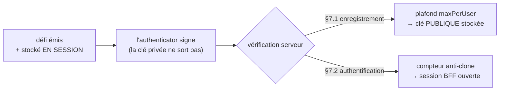
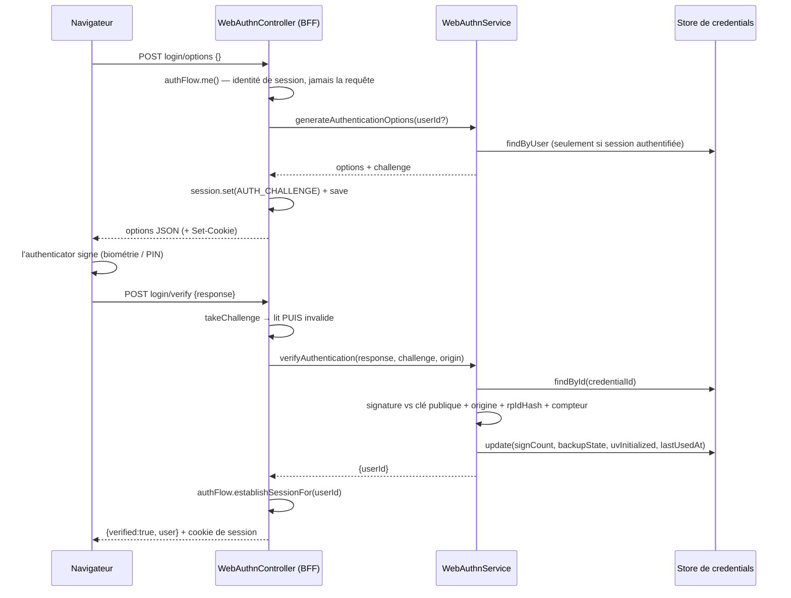

# WebAuthn / passkeys — l'authentification qui ne se phishe pas

> Une passkey remplace le mot de passe par une **paire de clés** dont la privée **ne quitte jamais**
> l'authenticator (Touch ID, Windows Hello, clé FIDO). Le serveur ne détient que des **clés
> publiques** et ne fait que **vérifier des signatures** : rien à hameçonner, rien à rejouer, rien à
> voler dans la base. Nodefony orchestre les deux cérémonies FIDO2 dans `WebAuthnService`
> (`webAuthn.ts:92`) et fournit les endpoints BFF prêts à l'emploi — tu n'écris que l'appel
> navigateur.

📍 [Documentation](../../../../../docs/index.md) › [Sécurité](index.md) › **WebAuthn / Passkeys**

## 🧠 Le modèle mental — deux cérémonies, un défi jamais rejoué

Une passkey ne se transmet pas : elle **signe un défi**. Le serveur émet un aléa, l'authenticator le
signe, le serveur vérifie la signature contre la clé publique qu'il a stockée. Deux cérémonies, la
même mécanique.



Le défi vit **hors du service**, en session BFF, posé par le controller
(`WebAuthnController.registerOptions()`, `WebAuthnController.ts:100`). Chaque `verify*` reçoit
l'`expectedChallenge` qu'il a émis, et le controller **l'invalide dès sa lecture**
(`WebAuthnController.#takeChallenge()`, `WebAuthnController.ts:277`) : un défi ne sert qu'une fois.

## 📖 Lexique

| Terme                  | Sens                                                                                             |
| ---------------------- | ------------------------------------------------------------------------------------------------ |
| Passkey                | Paire de clés FIDO2 ; la privée vit dans l'authenticator, jamais sur le serveur.                 |
| Authenticator          | Le matériel qui garde la clé : Touch ID / Windows Hello (`platform`) ou clé USB/NFC, téléphone.  |
| Cérémonie              | Séquence normalisée d'un enregistrement (§7.1) ou d'une authentification (§7.2).                 |
| RP                     | _Relying Party_ : ton application, identifiée par un `rpId` (un domaine enregistrable).          |
| `rpId`                 | Le domaine auquel la passkey est **liée** — la signature ne vaut que pour lui.                   |
| Challenge (défi)       | Aléa émis par le serveur, signé par l'authenticator — anti-rejeu.                                |
| Assertion              | La réponse signée d'une authentification (§7.2).                                                 |
| Attestation            | La réponse d'un enregistrement (§7.1), éventuellement accompagnée d'un certificat fabricant.     |
| `signCount`            | Compteur incrémenté par l'authenticator — une régression trahit un **clone** (§6.1.1).           |
| UV                     | _User Verification_ : l'authenticator a vérifié l'humain (biométrie/PIN), pas juste sa présence. |
| BE / BS                | _Backup Eligible_ / _Backup State_ : la passkey **peut** être synchronisée / **l'est** (§6.1.3). |
| Découvrable (resident) | Passkey que l'authenticator sait proposer seul → login **sans saisir d'identifiant**.            |
| `userHandle`           | Identifiant opaque du porteur côté authenticator — ici l'identifiant applicatif (username).      |
| COSE                   | _CBOR Object Signing and Encryption_ (RFC 8152) : le format de la clé publique stockée.          |
| CTAP2                  | Le protocole entre le navigateur et un authenticator externe (volet FIDO2 de WebAuthn).          |
| BFF                    | _Backend-For-Frontend_ : le serveur porte la session et le défi pour le front web.               |

## Qu'est-ce qu'une passkey — et quelles failles elle ferme

Un mot de passe est un **secret partagé** : il se tape, donc il se hameçonne ; il se stocke, donc il
fuit ; il se rejoue. Une passkey supprime le secret partagé — il n'y a plus rien à donner à un faux
site.

Quatre failles fermées **par construction** :

1. **Hameçonnage** — la signature est liée à l'origine et au `rpId`. Un faux domaine ne peut pas
   obtenir de signature valide : le navigateur refuse de la produire.
2. **Fuite de base** — le serveur ne stocke que des clés **publiques** (`IWebAuthnCredential.publicKey`,
   `IWebAuthnCredential.ts:16`). Une base volée ne donne aucun accès.
3. **Rejeu** — le défi est à usage unique, invalidé en session dès sa lecture
   (`WebAuthnController.#takeChallenge()`, `WebAuthnController.ts:251`).
4. **Clonage d'authenticator** — le `signCount` doit croître ; une régression signale une copie
   (`IWebAuthnCredential.signCount`, `IWebAuthnCredential.ts:22`).

C'est le facteur d'authentification le plus fort disponible aujourd'hui (NIST AAL2, AAL3 avec une clé
matérielle attestée).

## La vision Nodefony — le serveur ne détient aucun secret

`WebAuthnService` (`webAuthn.ts:92`) **orchestre**, il ne fait pas de cryptographie : le parsing
CBOR/COSE et la vérification des signatures (ES256/RS256/EdDSA) sont délégués à
`@simplewebauthn/server`, une bibliothèque auditée de l'écosystème, **importée paresseusement** au
premier usage (`WebAuthnService.#ensureLib()`, `webAuthn.ts:540`) — l'enrôlement et le login sont des
chemins froids, ils ne doivent rien coûter aux requêtes ordinaires.

Trois partis pris assumés :

- **Le service est sans état de session.** Le défi est porté par le controller BFF ; le service reçoit
  toujours l'`expectedChallenge` en paramètre (`WebAuthnService.verifyRegistration()`,
  `webAuthn.ts:317`). Conséquence pratique : le service se teste sans transport, et un défi n'est
  jamais « oublié » quelque part côté serveur.
- **Le stockage est pluggable** (`IWebAuthnCredentialStore`, `IWebAuthnCredentialStore.ts:75`) :
  mémoire par défaut, ORM ou Redis en production, avec le **même banc de contrat** pour tous.
- **Les endpoints sont fournis**, pas à réécrire (`mountWebAuthnRoutes()`,
  `WebAuthnController.ts:308`) : c'est là que vivent les gardes délicates (session du défi, usage
  unique, messages uniformes, anti-IDOR).

## 🚀 Démarrage rapide

### 1. Les passkeys sont déjà actives — la config utile

`passkeys.enabled` vaut `true` par défaut (`config.ts:1106`). Ce que tu déclares vraiment, c'est **ton
domaine** : sans `rpId`, le service prend le domaine de l'app, et bascule sur `localhost` si c'est une
adresse IP (un navigateur refuse une IP comme `rpId`, `webAuthn.ts:134`).

```typescript
// nodefony.config.ts (extrait) — activer les passkeys pour TON domaine
import { defineConfig, use } from "nodefony";

export default defineConfig(() => ({
  modules: [
    use("@nodefony/security", {
      passkeys: {
        // Le domaine auquel les passkeys seront LIÉES. Domaine enregistrable
        // ou "localhost" — jamais une IP, jamais un domaine avec port.
        rpId: "app.example.com",
        rpName: "Ma boutique",
        // Liste blanche des origines acceptées (prod) : sans elle, seule
        // l'origine dont le hostname == rpId est tolérée.
        origins: ["https://app.example.com"],
        // Exiger la biométrie/PIN, pas la simple présence → AAL2.
        userVerification: "required",
        // "any" = le navigateur peut aussi proposer un téléphone par QR.
        authenticatorAttachment: "any",
        maxPerUser: 10,
      },
    }),
    "@nodefony/framework",
  ],
}));
```

### 2. Les endpoints BFF sont FOURNIS

Dès que `@nodefony/security` est chargé, le framework monte six routes
(`mountWebAuthnRoutes()`, `WebAuthnController.ts:308`) :

| Route (`POST` sauf mention)                        | Rôle                                          | Firewall                  |
| -------------------------------------------------- | --------------------------------------------- | ------------------------- |
| `/nodefony/security/api/webauthn/register/options` | Défi d'enrôlement (session requise)           | `bypassFirewall` + `me()` |
| `/nodefony/security/api/webauthn/register/verify`  | Vérifie l'attestation, stocke la clé publique | `bypassFirewall` + `me()` |
| `/nodefony/security/api/webauthn/login/options`    | Défi d'authentification                       | `bypassFirewall`          |
| `/nodefony/security/api/webauthn/login/verify`     | Vérifie l'assertion **et ouvre la session**   | `bypassFirewall`          |
| `GET …/webauthn/credentials`                       | « Mes appareils » du porteur courant          | zone protégée             |
| `DELETE …/webauthn/credentials/{id}`               | Révoquer **sa** passkey                       | zone protégée             |

> [!IMPORTANT]
> Les quatre routes de cérémonie sont `bypassFirewall: true` (`WebAuthnController.ts:365`) : elles
> **sont** le mécanisme d'authentification — les protéger exigerait d'être déjà connecté pour se
> connecter. Le contrôle d'accès de `register/*` est fait **dans le controller**
> (`flow.me()` → 401, `WebAuthnController.ts:106`). Les deux routes self-service, elles, restent dans
> la zone protégée (`security.webauthn.credentials.list`, `WebAuthnController.ts:314`).

### 3. Ce que TU écris : l'appel navigateur

Seule la moitié cliente te revient. `startRegistration()` / `startAuthentication()` de
`@simplewebauthn/browser` encapsulent `navigator.credentials.create()` / `.get()` et la conversion
base64url des options JSON.

```typescript
// src/passkeys.ts (navigateur) — l'appel qui déclenche Touch ID / Windows Hello
import {
  startAuthentication,
  startRegistration,
  type PublicKeyCredentialCreationOptionsJSON,
  type PublicKeyCredentialRequestOptionsJSON,
} from "@simplewebauthn/browser";

const BASE = "/nodefony/security/api/webauthn";

async function postJson<T>(path: string, body: unknown): Promise<T> {
  const res = await fetch(`${BASE}${path}`, {
    method: "POST",
    headers: { "content-type": "application/json" },
    // Le cookie de session porte le DÉFI entre `options` et `verify`.
    credentials: "same-origin",
    body: JSON.stringify(body),
  });
  if (!res.ok) throw new Error(`${path} → ${res.status}`);
  return (await res.json()) as T;
}

/** Enrôler : l'utilisateur est DÉJÀ connecté (session BFF ouverte). */
export async function enrollPasskey(): Promise<string> {
  const optionsJSON = await postJson<PublicKeyCredentialCreationOptionsJSON>(
    "/register/options",
    {},
  );
  // La paire est créée DANS l'authenticator ; la privée n'en sort jamais.
  const attestation = await startRegistration({ optionsJSON });
  const out = await postJson<{ verified: boolean; credentialId: string }>(
    "/register/verify",
    { response: attestation },
  );
  return out.credentialId;
}

/** Se connecter sans mot de passe. `username` omis = passkey découvrable. */
export async function loginWithPasskey(
  username?: string,
): Promise<{ username: string }> {
  const optionsJSON = await postJson<PublicKeyCredentialRequestOptionsJSON>(
    "/login/options",
    username ? { username } : {},
  );
  const assertion = await startAuthentication({ optionsJSON });
  const out = await postJson<{ verified: boolean; user: { username: string } }>(
    "/login/verify",
    { response: assertion },
  );
  return out.user; // la session BFF est ouverte : le cookie est posé
}
```

Référence vivante dans le dépôt : Studio fait exactement ces deux appels —
`AuthService.loginWithPasskey()` (`AuthService.ts:108`) et `AuthService.registerPasskey()`
(`AuthService.ts:130`).

### 4. Ce qu'on observe

```bash
WA=https://localhost:5152/nodefony/security/api/webauthn

# 1) Enrôler sans session → 401 (register exige d'être connecté)
curl -sk -o /dev/null -w '%{http_code}\n' -X POST $WA/register/options   # 401

# 2) Défi de login en anonyme → 200 + un cookie de session qui PORTE le défi
curl -sk -i -X POST -H 'Content-Type: application/json' -d '{}' $WA/login/options
# HTTP/2 200 … set-cookie: … ; {"challenge":"…","rpId":"localhost","timeout":60000, …}

# 3) Rejouer ce cookie sur un verify bidon → 401 (défi trouvé, crypto KO),
#    puis 400 au 2e essai : le défi a été CONSOMMÉ.
```

## 🏗️ Architecture interne — les deux cérémonies, pas à pas



### Enrôler une passkey sur un compte existant

`WebAuthnService.generateRegistrationOptions()` (`webAuthn.ts:276`) construit le défi et les
contraintes. **`excludeCredentials`** y liste les passkeys déjà enrôlées (`webAuthn.ts:291`) : le même
authenticator ne peut pas s'inscrire deux fois. Dans `authenticatorSelection` (`webAuthn.ts:261`),
`authenticatorAttachment` n'est transmis **que** s'il vaut autre chose que `"any"` — `"any"` rend la
main au navigateur, téléphone par QR compris.

`WebAuthnService.verifyRegistration()` (`webAuthn.ts:317`) enchaîne dans cet ordre :

1. **Vérification déléguée** à `verifyRegistrationResponse` — défi, origine, rpIdHash, flags,
   attestation (`webAuthn.ts:330`). Tout échec devient un message uniforme
   `WebAuthn registration failed` (`webAuthn.ts:305`).
2. **Plafond d'enrôlement** — `countByUser`, refus `409` si `maxPerUser` est atteint
   (`webAuthn.ts:313`). Volontairement **après** la cryptographie et **avant** le `save` : un client
   peut poster `register/verify` sans jamais appeler `register/options` — c'est l'écriture qu'il faut
   garder, pas la génération du défi.
3. **Persistance** de la clé publique + l'état initial (`webAuthn.ts:359`) — `backupEligible` dérive
   de `credentialDeviceType === "multiDevice"` (`webAuthn.ts:359`).

### Se connecter sans mot de passe

`WebAuthnService.generateAuthenticationOptions()` a deux régimes : **sans `userId`**,
`allowCredentials` est omis et l'authenticator propose ses passkeys découvrables — l'expérience
« usernameless » ; **avec `userId`**, la liste est calculée depuis `findByUser` pour cibler un
porteur précis.

**C'est le controller qui choisit le régime, et il ne se fie jamais à la requête** :
`WebAuthnController.loginOptions()` cible depuis l'identité de la **session** quand il y en a une
(ré-authentification), et sert un défi découvrable sinon. Le `username` que poste un client anonyme
est ignoré.

> [!IMPORTANT]
> **Un `allowCredentials` peuplé pour un anonyme dit deux choses de trop** : que ce compte porte une
> passkey, et **lesquelles**. W3C WebAuthn L3 (« Privacy leak via credential IDs ») rappelle qu'un
> `credentialId` est un identifiant corrélable : exposé, il permet de dés-anonymiser un utilisateur
> d'un site à l'autre et de confirmer une hypothèse d'identité avec un accès momentané à son
> authenticator. Les deux remèdes de la spec sont ceux appliqués ici : credentials découvrables, ou
> authentification préalable. Conséquence de configuration : `passkeys.residentKey: "discouraged"`
> produit des credentials non découvrables — leurs porteurs ne pourront plus se connecter, et le
> service l'avertit au boot.

`WebAuthnService.verifyAuthentication()` (`webAuthn.ts:415`) résout le credential par son id
(`webAuthn.ts:415`), vérifie la signature contre la clé publique stockée, puis **applique l'état** :
`signCount`, `backupState`, `uvInitialized` (jamais rétrogradé), `lastUsedAt` (`webAuthn.ts:455`). Le
controller ouvre alors la session BFF avec `authFlow.establishSessionFor()`
(`WebAuthnController.ts:64`).

> [!IMPORTANT]
> **La détection de clone est ici, pas dans le store.** La monotonie du `signCount` est vérifiée
> pendant la cérémonie ; le store, lui, écrit ce qu'on lui donne — une régression 5→1 y passe sans
> broncher, et c'est prouvé exprès (cas A3 de `webauthn.attack.test.ts`). Un store n'est pas un
> arbitre de sécurité.

### Perdre son téléphone — révoquer une passkey

Deux chemins, deux portées :

- **Self-service** : `DELETE …/webauthn/credentials/{id}` → `WebAuthnService.removeUserCredential()`
  (`webAuthn.ts:461`). La suppression n'aboutit que si le credential **appartient** au demandeur
  (`webAuthn.ts:467`) ; sinon **404 indiscernable** (`WebAuthnController.ts:207`) — on ne révèle
  jamais l'existence de la passkey d'autrui.
- **Reset administrateur** : `DELETE /nodefony/security/api/users/{id}/passkeys/{credentialId}`
  (`SecurityAdminApi.ts:560`) — audité, et **404 identique** si la passkey n'appartient pas à
  l'utilisateur visé, même pour un admin.

Une passkey **non sauvegardée** (`backupState: false`) meurt avec son appareil — d'où le filtre
`backedUp` du listing admin (`IWebAuthnListQuery`, `IWebAuthnCredentialStore.ts:47`), qui liste
exactement les porteurs à risque de verrouillage.

## ⚙️ Configuration

Table dérivée du schéma Zod `passkeysSchema` (`config.ts:447`), monté sous la clé `passkeys`
(`config.ts:1106`).

| Option                    | Type                                       | Défaut       | Effet                                                                          |
| ------------------------- | ------------------------------------------ | ------------ | ------------------------------------------------------------------------------ |
| `enabled`                 | boolean                                    | `true`       | Active les cérémonies ; `false` → endpoints en 503 (`config.ts:449`)           |
| `rpId`                    | string?                                    | domaine app  | Domaine de liaison des passkeys ; IP → `localhost` (`config.ts:455`)           |
| `rpName`                  | string?                                    | `"Nodefony"` | Nom affiché dans l'invite OS/navigateur (`config.ts:459`)                      |
| `origins`                 | string[]                                   | `[]`         | Liste blanche d'origines ; vide = déduction depuis `rpId` (`config.ts:463`)    |
| `userVerification`        | `required` \| `preferred` \| `discouraged` | `preferred`  | Exiger biométrie/PIN — `required` = AAL2 (`config.ts:469`)                     |
| `residentKey`             | `required` \| `preferred` \| `discouraged` | `preferred`  | Passkey découvrable → login sans identifiant (`config.ts:483`)                 |
| `authenticatorAttachment` | `platform` \| `cross-platform` \| `any`    | `platform`   | Biométrie intégrée / clé externe / les deux (`config.ts:481`)                  |
| `attestation`             | `none` \| `direct` \| `enterprise`         | `none`       | Conveyance du certificat fabricant (`config.ts:487`)                           |
| `timeoutMs`               | number (ms)                                | `60000`      | Délai laissé à l'utilisateur pour la cérémonie (`config.ts:493`)               |
| `maxPerUser`              | number                                     | `20`         | Plafond de passkeys par porteur, `409` au-delà (`config.ts:501`)               |
| `challengeTtlS`           | number (s)                                 | `300`        | **RÉSERVÉ, non câblé** : le défi suit la session (`config.ts:509`)             |
| `store`                   | string                                     | `"auto"`     | `auto`\|`memory`\|`drizzle`\|`mongoose`\|`redis` — pluggable (`config.ts:514`) |

### Mise en situation — trois politiques, trois publics

**Situation 1 — grand public, zéro friction (le défaut).** Tes utilisateurs sont sur leur téléphone ou
leur portable : une empreinte suffit, et la passkey se synchronise (iCloud, Google) pour qu'un
changement d'appareil ne les enferme pas dehors. Rien à écrire, ce sont les défauts — l'OS propose
Touch ID / Windows Hello sans QR (`authenticatorAttachment: "platform"`) et les passkeys arrivent
avec `backupEligible: true`.

**Situation 2 — comptes sensibles, clé matérielle imposée.** Administrateurs, production : tu veux une
clé physique séparée et la certitude d'une vérification humaine.

```typescript
passkeys: {
  authenticatorAttachment: "cross-platform", // YubiKey & co, pas la biométrie du portable
  userVerification: "required",              // PIN/biométrie obligatoire → AAL2
  attestation: "direct",                     // demande le certificat fabricant
  maxPerUser: 5,
},
```

> [!WARNING]
> `attestation: "direct"` **récupère** le certificat, il ne le **valide pas** : Nodefony ne vérifie ni
> l'AAGUID ni la chaîne contre la MDS FIDO (`config.ts:487`). Tant que cette vérification n'est pas
> faite dans ton application, tu as la donnée, pas la garantie AAL3 — et tu paies un coût de vie
> privée (l'attestation identifie le modèle d'authenticator).

**Situation 3 — login sans identifiant (usernameless).** Tu veux un bouton « Se connecter » unique,
sans champ à remplir.

```typescript
passkeys: { residentKey: "required" }, // la passkey DOIT être découvrable
```

Et côté client, **n'envoie pas** `username` à `login/options` : `allowCredentials` est alors omis et
le navigateur propose les comptes qu'il connaît. C'est aussi la variante la plus sobre côté vie
privée — voir la section suivante.

| Ce que le client envoie à `login/options` | Ce que renvoie le serveur                       | Conséquence                                      |
| ----------------------------------------- | ----------------------------------------------- | ------------------------------------------------ |
| `{}`                                      | défi seul, **sans** `allowCredentials`          | l'authenticator propose ses comptes              |
| `{"username":"alice"}` (alice a 3 clés)   | défi + `allowCredentials` de **3** identifiants | ciblage — mais l'anonyme apprend qu'ils existent |
| `{"username":"fantome"}`                  | défi + `allowCredentials: []` (200, jamais 404) | pas d'erreur révélatrice — mais liste vide       |

## 🛡️ `rpId` et origines — l'ancre anti-phishing

Le `rpId` est ce à quoi la passkey est **soudée**. Le navigateur refuse de signer pour un autre
domaine : c'est ce lien, et pas une vérification côté serveur, qui rend l'hameçonnage impossible.

Résolution au boot (`WebAuthnService.#build()`, `webAuthn.ts:113`) : `passkeys.rpId` sinon le domaine
de l'app ; une **adresse IP ou une adresse IPv6 bascule sur `localhost`** (`webAuthn.ts:134`), seul
host non-domaine que la spécification autorise. En développement, accède donc au serveur par
`https://localhost:5152`, jamais par `127.0.0.1`.

L'origine attendue est calculée par `WebAuthnService.#expectedOrigin()` (`webAuthn.ts:523`) en trois
temps : la **liste blanche `passkeys.origins`** si elle est non vide (`webAuthn.ts:484`, la voie de
production) ; sinon **l'origine de la requête, mais seulement si son hostname est exactement le
`rpId`** (`webAuthn.ts:134` — en dev, `localhost:5173` et `localhost:5152` passent tous deux, le port
est ignoré, sans jamais ouvrir à un domaine tiers) ; en dernier recours `https://{rpId}`
(`webAuthn.ts:537`).

> [!WARNING]
> **Un seul `rpId` par instance.** Il est résolu une fois au boot et stocké dans le service ; il n'y a
> **aucune** résolution par en-tête `Host`. Un déploiement multi-domaine (`a.example.com` et
> `b.example.com`) doit choisir un `rpId` parent commun (`example.com`) — sinon les passkeys enrôlées
> sur l'un ne fonctionneront pas sur l'autre.

## 🔐 Le point à ne pas rater — plafond d'enrôlement et `login/options` ouvert

`login/options` est **accessible à un anonyme** (`bypassFirewall`) et accepte un `username`
(`WebAuthnController.ts:146`). C'est nécessaire — on ne peut pas exiger d'être connecté pour se
connecter — mais cela ouvre deux surfaces qu'il faut regarder en face.

### Amplification : bornée par le plafond, pas par une pagination

Avec un `username`, le serveur charge **toutes** les passkeys du porteur pour construire
`allowCredentials` (`webAuthn.ts:394`). Cet appel `findByUser` est **volontairement non paginé** —
`allowCredentials` doit être complet ou il est faux : un authenticator absent de la liste ne peut pas
répondre, et le protocole n'offre aucune « page suivante » (`IWebAuthnCredentialStore.ts:88`).

Ce qui borne donc cette lecture, c'est **`passkeys.maxPerUser`** (défaut 20, `config.ts:509`) :

- le refus est un `409` porté par `WebAuthnError` (`WebAuthnError.ts:15`), rendu **tel quel** au
  client parce qu'il est authentifié — rien à énumérer, et il doit comprendre qu'il faut retirer un
  appareil (`WebAuthnController.ts:264`) ;
- le comptage est **natif** (`countByUser`, `IWebAuthnCredentialStore.ts:97`) : `COUNT` / `SCARD`,
  jamais un `findByUser().length` — `webAuthnEnrollmentLimit.test.ts` le prouve avec un store espion
  (3 comptages, 0 chargement) ;
- retirer un appareil **libère une place** : le plafond est une borne, pas un compteur qui dérive.

### Énumération : le statut est uniforme, la liste ne l'est pas

Un compte inexistant reçoit **200 + un défi**, exactement comme un compte réel — le test d'attaque E3
(`webauthn-attack.test.ts`) verrouille ce point. Aucun 404, aucun message différencié, aucune latence
de recherche de mot de passe.

Mais `allowCredentials` reflète la réalité : **vide** pour un identifiant sans passkey, **peuplé** (et
portant les identifiants de credentials) pour un porteur enrôlé. Un anonyme peut donc distinguer
« cet identifiant a au moins une passkey » de « il n'en a pas ».

> [!WARNING]
> C'est le comportement standard d'un `login/options` avec identifiant, et la parade est
> architecturale : **ne transmets pas `username`**. Avec `residentKey: "required"` et un client qui
> poste `{}`, `allowCredentials` est omis, aucun état de compte ne transparaît, et l'appel ne touche
> même pas le store. Si ton UX exige la saisie d'un identifiant, place un rate-limit devant
> `login/options` — le firewall ne le protège pas, c'est une route en `bypassFirewall`.

Les autres gardes de cette surface, toutes couvertes par des tests d'attaque :

| Vecteur                                   | Garde                                                                                              |
| ----------------------------------------- | -------------------------------------------------------------------------------------------------- |
| Rejeu d'un défi                           | Invalidé à la lecture, avant la crypto (`WebAuthnController.ts:251`) — E1/E1bis                    |
| Défi d'enrôlement réutilisé pour un login | Clés de session **disjointes** (`WebAuthnController.ts:68`) — E2                                   |
| Lecture de la cause d'échec               | Message uniforme `WebAuthn verification failed` (`WebAuthnController.ts:262`) — E4                 |
| Suppression de la passkey d'autrui        | Ownership vérifié → 404 indiscernable (`webAuthn.ts:467`)                                          |
| Réassignation du porteur via `update`     | Le patch ne porte que l'état mutable (`WebAuthnAuthUpdate`, `IWebAuthnCredentialStore.ts:58`) — A1 |

## Entité de persistance — ce qui est écrit, et en quels types

Un credential (`IWebAuthnCredential`, `IWebAuthnCredential.ts:10`) ne contient **aucun secret** : la
clé privée n'existe que dans l'authenticator.

| Champ            | Sens                                                 | SQL (`colKit`)      | Mongoose         | Redis (HASH)            |
| ---------------- | ---------------------------------------------------- | ------------------- | ---------------- | ----------------------- |
| `id`             | Identifiant du credential, base64url — clé naturelle | `text` PK           | `_id: String`    | clé `nf:wac:cred:<id>`  |
| `userId`         | Porteur (= identifiant applicatif / `userHandle`)    | `text` notNull, idx | `String` indexé  | champ + SET `user:<id>` |
| `publicKey`      | Clé publique **COSE**, base64url                     | `text` notNull      | `String` requis  | champ                   |
| `signCount`      | Compteur anti-clone (§6.1.1)                         | `int` notNull       | `Number` requis  | champ                   |
| `transports`     | `usb`\|`nfc`\|`ble`\|`internal`\|`hybrid`            | `json` notNull      | `[String]`       | champ JSON              |
| `backupEligible` | BE flag — fixé à l'enrôlement, **immuable**          | `bool` notNull      | `Boolean` requis | `"1"`/`"0"`             |
| `backupState`    | BS flag — la passkey **est** sauvegardée             | `bool` notNull      | `Boolean` requis | `"1"`/`"0"`             |
| `uvInitialized`  | Une vérification humaine a déjà eu lieu              | `bool` notNull      | `Boolean` requis | `"1"`/`"0"`             |
| `nickname`       | Surnom d'appareil, optionnel                         | `text` nullable     | `String` (null)  | champ absent si vide    |
| `createdAt`      | Enrôlement (epoch ms)                                | `epochMs` notNull   | `Number` requis  | champ                   |
| `lastUsedAt`     | Dernière authentification réussie, ou `null`         | `epochMs` nullable  | `Number` (null)  | champ absent si null    |

Spécification SQL : `webAuthnCredentialEntity.ts:28`, index sur `userId`
(`drizzle/nodefony/entity/webAuthnCredentialEntity.ts:54`). Schéma documentaire :
`mongoose/nodefony/entity/webAuthnCredentialEntity.ts:25` — `_id` **est** le credentialId (String, pas
un ObjectId), les horodatages sont des `Number` epoch ms.

Trois constats de conception : **aucun TTL ni `gc`** — une passkey est permanente jusqu'à révocation
explicite, `IWebAuthnCredentialStore` n'a pas de maintenance (`IWebAuthnCredentialStore.ts:75`) ;
**`nickname` est
stocké et rendu, jamais écrit par le framework** — aucune API publique ne le renseigne, le champ
existe pour une UX « renommer cet appareil » côté application ; **`userId` est l'identifiant
applicatif** (`me.username`, figé à l'enrôlement, `WebAuthnController.ts:109`) — renommer un compte
orphelinise donc ses passkeys.

## 🧩 Backends de stockage — quatre enregistrés, et comment brancher le tien

Le contrat `IWebAuthnCredentialStore` (`IWebAuthnCredentialStore.ts:75`) est résolu au boot
(`webAuthn.ts:141`) : un adapter déjà posé au container gagne, sinon la fabrique nommée par
`passkeys.store` est appelée via le registre (`registerWebAuthnStore()`,
`webAuthnCredentialStoreRegistry.ts:30`).

| Ta situation                                | Store              | Ce que tu gagnes / perds                                                     |
| ------------------------------------------- | ------------------ | ---------------------------------------------------------------------------- |
| Dev, tests, mono-process                    | `memory` (builtin) | 0 dépendance — **volatil** : toutes les passkeys perdues au redémarrage      |
| Prod, base SQL déclarée (`NF_DATABASE_URL`) | `auto` → `drizzle` | durable + partagé entre pods ; pagination offset + `total` exact             |
| Prod, MongoDB                               | `mongoose`         | même contrat, même banc, sur Mongo                                           |
| Flotte de pods, Redis déjà présent          | `redis`            | O(1) par credential ; listing **par curseur**, sans total (capacité réduite) |

**`store: "auto"` (défaut)** suit l'infra déclarée, borné aux backends réellement enregistrés
(`webAuthn.ts:155`) — la décision (configuré → résolu, raison) est publiée au kernel et visible dans
Studio (`webAuthn.ts:195`). Deux garde-fous de production :

- un store **explicitement** configuré mais inconnu **avorte le boot en production**
  (`webAuthn.ts:176`) — jamais de repli silencieux vers un store volatil ;
- `memory` **en production** déclenche un `WARNING` qui nomme l'impact : passkeys perdues au
  redémarrage, utilisateurs verrouillés hors de leur compte (`webAuthn.ts:183`).

### Les backends, en détail

### `memory` — la référence, 0 dépendance

- Builtin, enregistré à l'import du module (`webAuthnCredentialStoreRegistry.ts:53`). Deux index :
  `#byId` (vérité) et `#idsByUser` (`allowCredentials`) — `MemoryWebAuthnCredentialStore.ts:47`.
- `listPage` trie `createdAt` DESC avec `id` en départage → offset déterministe, parité SQL
  (`MemoryWebAuthnCredentialStore.ts:131`). C'est lui qui pilote le banc de contrat partagé.
- `snapshot()` / `restore()` sérialisables (`MemoryWebAuthnCredentialStore.ts:153`) ; le service
  déclenche un `flushNow()` à l'arrêt si le store sait le faire (`webAuthn.ts:254`).

### `drizzle` — SQL, le durable par défaut

- Enregistré par le module drizzle (`drizzle/nodefony/registerStores.ts:262`) ;
  `DrizzleWebAuthnCredentialStore` (`DrizzleWebAuthnCredentialStore.ts:37`) est **100 % portable** —
  aucune requête SQL native, tout passe par `IRepository` d'`orm-core`.
- Trois dialectes sur le même banc : **sqlite** (toujours, `:memory:`), **postgres** et **mysql**
  (gatés par l'infra). Pagination offset + `total` (`DrizzleWebAuthnCredentialStore.ts:188`).

### `mongoose` — MongoDB

- Enregistré par le module mongoose (`mongoose/nodefony/registerStores.ts:139`) ;
  `MongooseWebAuthnCredentialStore` (`MongooseWebAuthnCredentialStore.ts:36`) partage le helper
  `paginate()` — offset + `total`, départage sur `_id` (`MongooseWebAuthnCredentialStore.ts:158`).

### `redis` — cluster, lecture O(1)

- Enregistré par le module redis (`redis/nodefony/registerStores.ts:62`) ;
  `RedisWebAuthnCredentialStore` (`RedisWebAuthnCredentialStore.ts:93`) stocke un **HASH** par
  credential + un **SET** d'ids par porteur — `update` réécrit 1 à 4 champs sans relire
  l'enregistrement (`RedisWebAuthnCredentialStore.ts:219`).
- Listing par `SCAN`, curseur composite `skip:scanCursor` (`RedisWebAuthnCredentialStore.ts:257`) :
  **ni ordre global ni total**, pages de taille variable — capacité réduite **déclarée**, pas un
  défaut. `countCredentials()` renvoie `-1` (`RedisWebAuthnCredentialStore.ts:330`).

### Brancher son propre store

Une fabrique suffit — le cœur n'apprend jamais le nom d'un backend :

```typescript
import { registerWebAuthnStore } from "@nodefony/security";
import type { IWebAuthnCredentialStore } from "@nodefony/security";

registerWebAuthnStore("mon-backend", ({ container, config }) => {
  // Implémenter IWebAuthnCredentialStore : findById / findByUser / countByUser /
  // save / update / delete / listPage / countCredentials.
  return new MyWebAuthnStore(container, config) as IWebAuthnCredentialStore;
});
```

Puis `passkeys: { store: "mon-backend" }`. Ton implémentation doit passer le **banc de contrat**
(`webauthnPaginationContract.ts`) : il vérifie la borne `limit`, l'ordre, les filtres, et surtout que
la vue admin **ne porte jamais la clé publique**.

## 🧰 API publique

Le point d'entrée est le service `webauthn` du container ; les signatures vivent dans le graphe
symbolique (`.ai/symbols.json`).

| Méthode                           | Quand tu l'appelles                                                      |
| --------------------------------- | ------------------------------------------------------------------------ |
| `isEnabled()`                     | Savoir si les cérémonies sont opérationnelles (`webAuthn.ts:262`)        |
| `generateRegistrationOptions()`   | Défi d'enrôlement pour un porteur (`webAuthn.ts:276`)                    |
| `verifyRegistration()`            | Vérifier + stocker, plafond appliqué (`webAuthn.ts:317`)                 |
| `generateAuthenticationOptions()` | Défi de login, ciblé ou découvrable (`webAuthn.ts:384`)                  |
| `verifyAuthentication()`          | Vérifier l'assertion + appliquer l'état (`webAuthn.ts:415`)              |
| `listUserCredentials()`           | « Mes appareils » — chemin chaud, non paginé (`webAuthn.ts:461`)         |
| `listCredentialsPage()`           | Vue **transverse** admin, paginée, sans clé publique (`webAuthn.ts:474`) |
| `countCredentials()`              | Total filtré, ou `-1` si le backend ne compte pas (`webAuthn.ts:485`)    |
| `removeUserCredential()`          | Révocation self-service, owner-scopée (`webAuthn.ts:502`)                |
| `removeCredential()`              | Révocation inconditionnelle, usage admin (`webAuthn.ts:491`)             |

Types publics ré-exportés par `@nodefony/security` : `IWebAuthnCredential`,
`IWebAuthnCredentialStore`, `IWebAuthnCredentialSummary`, `IWebAuthnListQuery`,
`MemoryWebAuthnCredentialStore`, `registerWebAuthnStore`.

> [!TIP]
> `listUserCredentials()` et `listCredentialsPage()` ne se remplacent pas. Le premier sert la fiche
> d'**un** porteur (borné par `maxPerUser`) et le login ; le second est le chemin **froid** d'une
> console d'administration, qui ne matérialise jamais plus d'une page et dont la projection exclut la
> clé publique par construction (`IWebAuthnCredentialSummary`, `IWebAuthnCredentialStore.ts:16`).

## 📡 Observabilité — Studio

Le data plane admin du module expose trois routes (`SecurityAdminApi.ts:301`), toutes en
`ROLE_NODEFONY_ADMIN` :

<!-- prettier-ignore -->
| Route | Ce qu'elle montre |
| --- | --- |
| `GET /nodefony/security/api/webauthn/list` | Vue **transverse** paginée : quels appareils portent des passkeys, lesquelles meurent avec leur appareil (`SecurityAdminApi.ts:473`) |
| `GET /nodefony/security/api/users/{id}/passkeys` | Les passkeys d'un porteur (`SecurityAdminApi.ts:528`) |
| `DELETE /nodefony/security/api/users/{id}/passkeys/{credentialId}` | Reset administrateur, audité (`SecurityAdminApi.ts:560`) |

Deux comportements à connaître : la **redaction est par construction** — la vue admin omet la clé
publique et le `userId` déjà présent dans le chemin (`toCredentialView()`, `SecurityAdminApi.ts:267`),
et ce n'est pas un masquage tardif, le contrat de store ne la produit jamais ; la **lecture est
défensive** — passkeys désactivées → `{ enabled: false, items: [] }` et non une erreur, la console
doit afficher « passkeys désactivées », pas un 503 (`SecurityAdminApi.ts:501`). `total: -1` signale un
backend sans comptage (Redis).

Côté UI, l'écran **Profil** de Studio porte l'enrôlement self-service et l'écran de login le bouton
passkey (`AuthStore.ts:209`).

## 📜 Normes appliquées

| Domaine                             | Norme                              | Ancrage                                                            |
| ----------------------------------- | ---------------------------------- | ------------------------------------------------------------------ |
| Cérémonie d'enregistrement          | W3C WebAuthn L3 §7.1               | `WebAuthnService.verifyRegistration()` (`webAuthn.ts:317`)         |
| Cérémonie d'authentification        | W3C WebAuthn L3 §7.2               | `WebAuthnService.verifyAuthentication()` (`webAuthn.ts:415`)       |
| Compteur anti-clone                 | W3C WebAuthn §6.1.1                | `IWebAuthnCredential.signCount` (`IWebAuthnCredential.ts:22`)      |
| Flags de sauvegarde (BE/BS)         | W3C WebAuthn §6.1.3                | `IWebAuthnCredential.backupEligible` (`IWebAuthnCredential.ts:29`) |
| Liaison à l'origine (anti-phishing) | W3C WebAuthn §13.4.8               | `WebAuthnService.#expectedOrigin()` (`webAuthn.ts:523`)            |
| Clé publique COSE                   | RFC 8152 / RFC 9052                | `IWebAuthnCredential.publicKey` (`IWebAuthnCredential.ts:16`)      |
| FIDO2 / CTAP2                       | plafond `maxCredentialCountInList` | `passkeys.maxPerUser` (`config.ts:509`)                            |
| Assurance d'authentification        | NIST SP 800-63B (AAL2)             | `passkeys.userVerification` (`config.ts:449`)                      |
| Contrôle d'accès (IDOR)             | OWASP A01                          | `WebAuthnService.removeUserCredential()` (`webAuthn.ts:502`)       |

La conformité cryptographique fine (parsing CBOR, formats d'attestation, vérification des signatures
ES256/RS256/EdDSA) est portée par `@simplewebauthn/server` — Nodefony fournit et prouve les
**invariants qui l'entourent**.

## ⚡ Performance & mémoire

Les cérémonies sont un **chemin froid** : quelques appels par utilisateur et par appareil, jamais par
requête. Le code en tire trois conséquences.

- **Import paresseux de la bibliothèque** : `@simplewebauthn/server` n'est chargé qu'au premier usage
  réel (`WebAuthnService.#ensureLib()`, `webAuthn.ts:540`) — une app qui n'enrôle personne ne paie
  jamais son coût de parse.
- **Rien d'alloué quand c'est désactivé** : `passkeys.enabled: false` sort de `#build()` immédiatement
  (`webAuthn.ts:122`) — pas de store, pas de `Map`.
- **Le listing admin ne matérialise jamais plus d'une page** : `listPage` applique les filtres au
  store (`IWebAuthnCredentialStore.ts:114`). Le seul appel non paginé, `findByUser`, est borné par
  `maxPerUser` — par conception (`IWebAuthnCredentialStore.ts:88`).

## ⚠️ Pièges (symptôme → cause → correction)

| Symptôme                                             | Cause (dans le code)                                                       | Correction                                                     |
| ---------------------------------------------------- | -------------------------------------------------------------------------- | -------------------------------------------------------------- |
| `409` à l'enrôlement                                 | Plafond `passkeys.maxPerUser` atteint (`webAuthn.ts:313`)                  | Retirer un appareil, ou relever `maxPerUser`                   |
| `400 No challenge` au `verify`                       | Défi absent : déjà consommé, ou pas de cookie renvoyé                      | Un défi = un `verify` ; envoyer le cookie (`credentials`)      |
| `401` systématique en production                     | Origine hors liste blanche, ou `rpId` ≠ domaine servi                      | Renseigner `passkeys.origins` + `rpId` enregistrable           |
| Passkey KO en dev sur `127.0.0.1`                    | Une IP n'est pas un `rpId` valide → repli `localhost`                      | Accéder par `https://localhost:<port>`                         |
| Passkeys d'un sous-domaine inutilisables sur l'autre | `rpId` unique, résolu au boot, pas de résolution par `Host`                | Choisir un `rpId` parent commun (`example.com`)                |
| Login refusé après restauration d'une sauvegarde     | `signCount` régressif → clone suspecté (§6.1.1)                            | Comportement voulu — ré-enrôler l'appareil                     |
| Tout le monde verrouillé dehors après un déploiement | `store` resté en `memory` : credentials volatils (`webAuthn.ts:183`)       | Déclarer une infra durable ; le `WARNING` boot le disait       |
| `503 WebAuthn unavailable`                           | `passkeys.enabled: false` ou boot du service échoué                        | Activer `passkeys` ; vérifier le store configuré               |
| Un anonyme distingue les comptes à passkey           | `allowCredentials` peuplé vs vide sur `login/options`                      | Ne pas envoyer `username` (usernameless) ; rate-limit la route |
| `total` absent du listing admin                      | Backend curseur (Redis) → `countCredentials()` rend `-1`                   | Paginer par `nextCursor`, ne pas afficher de total             |
| Passkeys orphelines après renommage d'un compte      | `userId` = `me.username` figé à l'enrôlement (`WebAuthnController.ts:109`) | Ne pas renommer, ou ré-enrôler après renommage                 |

## 🧪 Tests & couverture

Cinq familles couvrent la brique — les **chiffres exacts vivent dans la carte de l'aperçu**
(régénérée par `gen-counters.mjs`, jamais figée ici) :

- **unit** — `webAuthnCredentialStore` (matrice fonctionnelle), `webAuthnCredentialOwnership`
  (anti-IDOR), `webAuthnEnrollmentLimit` (le plafond : refus, tenue au-delà du seuil, portée par
  utilisateur, libération d'une place, comptage natif), `webauthnPagination` ;
- **intégration** — `webauthn-bff` (serveur réel : Zero Trust sur `register`, persistance du défi,
  `authenticatorAttachment` renvoyé) + les bancs de store `drizzle` / `mongoose` / `redis` ;
- **e2e (base réelle)** — `webauthn-store-postgres.e2e` et `webauthn-store-mysql.e2e`, gatés par
  l'infra : sans variables de base ils se **skippent**, et un skip compte comme vert ;
- **bancs de contrat** — `webauthnPaginationContract` : les invariants du listing tenus par **tous**
  les backends, en deux capacités (`offset` et `cursor`), dont la projection sans clé publique ;
- **attaque** — `webauthn.attack` au niveau store (A1 anti-takeover par `update`, A2 isolation
  `findByUser`, A3 le store n'arbitre pas l'anti-clone, A4 collision d'index) et `webauthn-attack` au
  niveau câblage (E1/E1bis rejeu de défi, E2 confusion de cérémonie, E3 anti-énumération, E4 message
  uniforme).

**Ce qui manque** : aucun test de **charge** ni de mémoire dédié — cohérent avec un chemin froid, mais
un pic d'enrôlement n'est pas caractérisé. La cryptographie n'est pas re-testée ici : elle est
déléguée à une bibliothèque auditée, et les tests **doublent** volontairement cette dépendance pour
n'éprouver que la politique Nodefony.

Skills utiles : `nodefony-security-review` (mode red/blue-team), `nodefony-load-test` pour
caractériser un pic d'enrôlement. Couverture : `npm run coverage` dans `@nodefony/security`.

## 🔗 Pour aller plus loin

- ⬆️ **Retour au hub** : [Sécurité — vue d'ensemble](index.md) · [Toute la documentation](../../../../../docs/index.md)
- 🧭 **Pages sœurs** : [Authenticators](authenticators.md) · [totp](totp.md)

- Autre second facteur → [totp](./totp.md) · Mot de passe et autres preuves → [authenticators](./authenticators.md)
- Le firewall qui protège tes routes une fois la session ouverte → [firewall](./firewall.md)
- La session BFF qui porte le défi → [session](../../http/docs/session.md)
- Identité fédérée (Google, GitHub…) → [oauth2](./oauth2.md)
- Vue d'ensemble du module → [index](./index.md)
