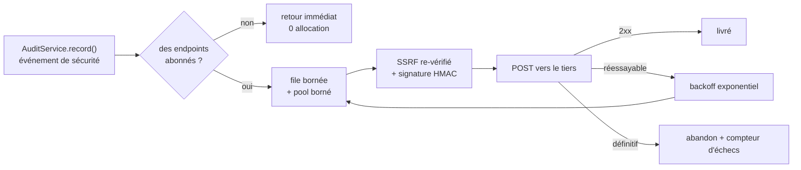
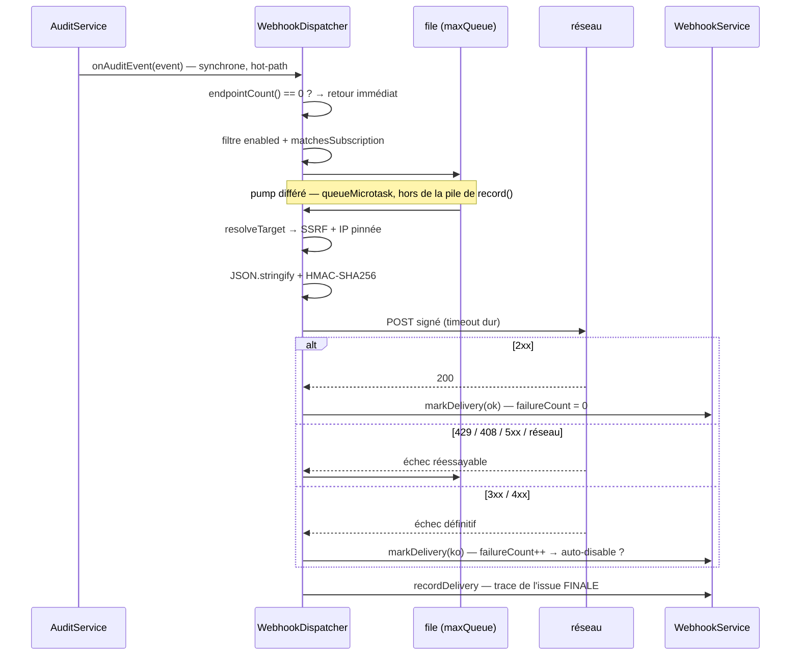

# Webhooks — notifier un système tiers, signé et borné

> Un webhook, c'est **ton serveur qui appelle celui de quelqu'un d'autre** pour dire « il vient de se
> passer quelque chose ». L'inversion est totale par rapport à une API : ce n'est plus le tiers qui
> interroge, c'est toi qui pousses. Deux dangers naissent de cette inversion — le destinataire doit
> pouvoir **prouver** que le message vient bien de toi (signature HMAC), et l'URL de destination,
> fournie par un humain, ne doit jamais devenir un **levier vers ton réseau interne** (SSRF). Ancré
> sur `src/packages/@nodefony/security/nodefony/service/webhooks.ts`,
> `nodefony/src/webhook/` et `nodefony/src/net/ssrfGuard.ts`.

📍 [Documentation](../../../../../docs/index.md) › [Sécurité](index.md) › **Webhooks**

## 🧠 Le modèle mental — un abonné du journal d'audit

Nodefony n'a pas de « bus d'événements métier » derrière ses webhooks. Le dispatcher est **un abonné
du journal d'audit de sécurité** : ce qui part est exactement ce que l'audit enregistre (login,
refus d'accès, jeton révoqué, session ouverte…), rien d'autre.



Deux frontières décident de tout : **`WebhookDispatcher.onAuditEvent()`**
(`WebhookDispatcher.ts:132`) qui filtre sans jamais bloquer l'émetteur, et
**`WebhookDispatcher.#process()`** (`WebhookDispatcher.ts:189`) qui signe, livre et classe l'issue.
Le détail de chaque étape est plus bas, dans **Architecture interne**.

### À quoi ça sert, concrètement

Trois usages courants, tous branchés sur des événements que Nodefony émet déjà :

| Ce que tu veux                                                             | Tu abonnes                           | Le tiers qui reçoit                |
| -------------------------------------------------------------------------- | ------------------------------------ | ---------------------------------- |
| Être prévenu quand quelqu'un s'acharne sur un compte                       | `login.failure`                      | un canal Slack, un SMS d'astreinte |
| Garder une trace inviolable des accès, hors de l'application               | `*`                                  | un SIEM, un bucket d'archives      |
| Couper l'accès d'un salarié partout ailleurs quand sa session est révoquée | `token.revoked`, `session.destroyed` | ton annuaire, ton outil de tickets |

Le premier, en entier — un serveur qui prévient une équipe quand un compte est attaqué :

```bash
# 1. On s'abonne aux échecs de connexion. Le secret n'est montré QU'ICI.
curl -sk -b /tmp/jar -X POST https://localhost:5152/nodefony/security/api/webhooks \
  -H 'content-type: application/json' \
  -d '{"url":"https://alertes.exemple.com/nodefony","events":["login.failure"],
       "description":"Alerte tentatives de connexion"}'
# → {"endpoint":{"id":"wh_9Xq2…"},"secret":"whsec_Zm9vYmFy…"}
```

À la cinquième tentative ratée d'« alice », le serveur d'alertes reçoit ceci — et **rien d'autre** ne
part (les autres événements ne sont pas souscrits) :

```json
{
  "id": "msg_7Yb1kQ2pR8sT",
  "type": "login.failure",
  "data": {
    "actor": "alice",
    "outcome": "failure",
    "reason": "invalid_credentials"
  }
}
```

> [!NOTE]
> Ce qui peut partir est **ce que le journal d'audit de sécurité enregistre** : connexions, refus
> d'accès, jetons, sessions, passkeys. Tes propres événements applicatifs — « commande payée »,
> « stock épuisé » — ne passent pas par là : il n'existe pas encore de bus d'événements métier dans
> Nodefony. C'est une limite, pas un oubli, et elle est répétée plus bas.

## 📖 Lexique

| Terme                  | Sens                                                                                                                                   |
| ---------------------- | -------------------------------------------------------------------------------------------------------------------------------------- |
| Webhook                | Notification HTTP sortante : ton serveur `POST` un événement vers l'URL d'un tiers.                                                    |
| Endpoint               | Une **destination** enregistrée : URL + secret de signature + liste d'événements souscrits.                                            |
| Standard Webhooks      | Convention publique de signature de webhook (`webhook-id`, `webhook-timestamp`, `webhook-signature`) — standardwebhooks.com.           |
| HMAC                   | _Hash-based Message Authentication Code_ (RFC 2104) : empreinte calculée avec un secret partagé — prouve l'émetteur.                   |
| SSRF                   | _Server-Side Request Forgery_ : faire émettre au serveur une requête vers une cible **interne** (loopback, `10.x`, métadonnées cloud). |
| DNS rebinding          | Le DNS répond une IP publique au contrôle, puis une IP privée à la connexion — d'où le **pin** de l'IP validée.                        |
| Backoff exponentiel    | Délai de réessai qui double à chaque tentative, jusqu'à un plafond.                                                                    |
| Anti-rejeu             | Refuser un message déjà vu / trop ancien — ici via `webhook-id` + `webhook-timestamp`, **couverts par la signature**.                  |
| Auto-désactivation     | Un endpoint qui échoue N fois d'affilée est désactivé automatiquement (façon GitHub).                                                  |
| PAT / secret `whsec_…` | Le secret de signature partagé avec le destinataire ; **chiffré au repos**, jamais haché (le serveur doit le relire).                  |

## Qu'est-ce que c'est ? — et quelles failles ça ferme

Le mécanisme est banal : un `POST` JSON. Ce qui est difficile, c'est le contexte hostile des **deux
côtés de la ligne**.

**Côté destinataire — « qui m'écrit ? »** Une URL de webhook est publique par construction :
n'importe qui peut la découvrir et lui envoyer un faux « paiement validé ». Sans preuve
cryptographique, le destinataire ne peut pas distinguer ton serveur d'un attaquant. La signature
HMAC ferme cette faille : seul le porteur du secret partagé peut produire l'empreinte du corps exact.

**Côté émetteur — « où est-ce que j'écris ? »** L'URL de destination est saisie par un administrateur
dans une console. Si le serveur l'appelle sans contrôle, un administrateur (ou un compte compromis)
peut le transformer en proxy vers `http://169.254.169.254/` — l'endpoint de métadonnées d'une VM
cloud, qui livre les **credentials IAM** de la machine. C'est la faille **SSRF** (OWASP A10:2021),
et elle est bien plus grave qu'elle n'en a l'air : elle traverse le pare-feu réseau par définition,
puisque c'est ton propre serveur qui fait l'appel.

**Côté framework — « et si le destinataire est mort ? »** Un endpoint qui ne répond jamais tient une
socket ouverte. Multiplié par un pic d'événements, c'est une saturation de descripteurs de fichiers
et une croissance mémoire illimitée : un tiers défaillant devient un **déni de service sur ton
propre serveur**.

## La vision Nodefony — honnête sur la source, dur sur les bornes

Trois partis pris, tous vérifiables dans le code :

1. **La source est le journal d'audit, pas un bus métier.** `WebhookService.#attachDispatcher()`
   (`webhooks.ts:185`) s'abonne au service `auditService` et à lui seul. Si l'audit est absent, le
   dispatcher n'existe pas — le CRUD d'endpoints reste disponible, mais **rien ne part**. C'est une
   limite assumée : les webhooks notifient des **événements de sécurité**.
2. **Le secret est chiffré, jamais haché.** Contrairement à une clé d'API (qu'on vérifie donc qu'on
   peut hacher), le serveur doit **relire** le secret pour signer chaque livraison → AES-256-GCM avec
   une clé dérivée HKDF propre au domaine webhook (`deriveWebhookKey()`, `webhookCipher.ts:30`).
3. **Le tiers ne peut pas nuire au framework.** File bornée, concurrence bornée, historique borné,
   abandon annoncé : le dispatcher est écrit pour qu'un endpoint mort coûte un log, pas une panne
   (`WebhookDispatcher.#enqueue()`, `WebhookDispatcher.ts:146`).

## 🚀 Démarrage rapide

### 1. Activer les webhooks et poser la clé de chiffrement

Les webhooks sont **actifs par défaut** (`enabled: true` dans le schéma Zod, `security/nodefony/config/config.ts:654`).
La seule chose que tu dois vraiment fournir, c'est la **clé de chiffrement des secrets de signature** :
sans elle, une clé éphémère est générée en dev (avec un WARNING), et en production les webhooks sont
**désactivés** — un secret chiffré par une clé perdue au redémarrage serait illisible
(`WebhookService.#resolveKey()`, `webhooks.ts:299`).

```bash
# Génère les clés du module security et guide le câblage en 3 fichiers.
npx nodefony security:secrets --write   # écrit NF_WEBHOOK_KEY dans .env.local
```

```typescript
// env.ts — SEUL lecteur de process.env (catalogue typé, validé au boot).
// nodefony.config.ts — `ctx.env` EST ce catalogue (typé par le paramètre générique).
import { defineConfig, defineEnv, envString, use } from "nodefony";

export const env = defineEnv({
  // Clé de chiffrement des secrets de signature — `nodefony security:secrets`.
  NF_WEBHOOK_KEY: envString({ optional: true }),
});

export default defineConfig<typeof env>((ctx) => ({
  modules: [
    use("@nodefony/security", {
      webhooks: {
        // Clé AES (32 octets base64) — depuis l'environnement, JAMAIS en dur.
        encryptionKey: ctx.env.NF_WEBHOOK_KEY,
        // Registre des endpoints : "auto" suit l'infra database déclarée
        // (repli memory ANNONCÉ) ; "drizzle"/"mongoose" pour un choix explicite.
        store: "auto",
        // En dev seulement : viser un récepteur local en http://127.0.0.1.
        // En prod, ces deux défauts stricts protègent du SSRF.
        denyPrivateIps: ctx.isProd,
        allowHttp: !ctx.isProd,
      },
    }),
    "@nodefony/framework",
  ],
}));
```

> [!WARNING]
> `denyPrivateIps: false` **désactive tout le contrôle d'IP** : le garde retourne immédiatement sur
> `allowPrivate`, sans résoudre le DNS ni comparer quoi que ce soit (`ssrfGuard.ts:153`). C'est un
> réglage de poste de développement, à ne jamais laisser fuiter en production.

### 2. Enregistrer un abonnement (API d'administration)

Il n'y a **pas de déclaration d'endpoint en config** : un abonnement est une donnée, créée à
l'exécution via le data plane admin `/nodefony/security/api/webhooks`, gardé
`ROLE_NODEFONY_ADMIN` (`webhookAdminEndpoints()`, `WebhookAdminApi.ts:205`).

```bash
# Session admin (le BFF de login pose le cookie)
curl -sk -c /tmp/jar -H 'Content-Type: application/json' \
  -d '{"username":"admin","password":"admin"}' \
  https://localhost:5152/nodefony/security/api/auth/login > /dev/null

# Créer l'abonnement : URL + actions souscrites ("*" = toutes)
curl -sk -b /tmp/jar -H 'Content-Type: application/json' \
  -d '{"url":"https://hooks.example.com/nodefony",
       "events":["login.success","login.failure","access.denied"],
       "description":"SIEM"}' \
  https://localhost:5152/nodefony/security/api/webhooks
```

```json
{
  "endpoint": { "id": "wh_9Xq2…", "url": "https://hooks.example.com/nodefony", "enabled": true, "failureCount": 0, … },
  "secret": "whsec_5m1n…"
}
```

> [!IMPORTANT]
> Le champ `secret` n'apparaît **qu'ici**, une seule fois. C'est lui qu'on colle dans la
> configuration du destinataire. Perdu, il ne se retrouve pas : il se **fait révéler** par un admin
> (`POST …/webhooks/{id}/reveal`, audité) ou il se **remplace** par une rotation.

### 3. Le récepteur — le strict minimum d'abord

C'est la moitié que **tu** écris, côté destinataire. Voici la version courte : elle tient en une
vingtaine de lignes et fait le seul geste indispensable — **recalculer l'empreinte sur les octets
reçus**.

```typescript
// nodefony/controller/HookMiniController.ts — récepteur minimal
import { createHmac, timingSafeEqual } from "node:crypto";
import { Buffer } from "node:buffer";
// prettier-ignore
import { Controller, controller, Post, Body, Headers, BypassFirewall } from "@nodefony/framework";

const SECRET = (process.env.NODEFONY_HOOK_SECRET ?? "").replace(/^whsec_/, "");

@controller("/hooks")
class HookMiniController extends Controller {
  @BypassFirewall // une livraison arrive sans session : c'est la signature qui authentifie
  @Post("/mini")
  async receive(
    @Body({ stream: true }) stream: NodeJS.ReadableStream,
    @Headers() h: Record<string, string | string[] | undefined>,
  ) {
    const chunks: Buffer[] = [];
    for await (const c of stream) chunks.push(Buffer.from(c as Buffer));
    const raw = Buffer.concat(chunks).toString("utf8");

    const got = Buffer.from(String(h["webhook-signature"] ?? "").slice(3)); // après "v1,"
    const want = Buffer.from(
      createHmac("sha256", Buffer.from(SECRET, "base64"))
        .update(`${h["webhook-id"]}.${h["webhook-timestamp"]}.${raw}`)
        .digest("base64"),
    );
    if (got.length !== want.length || !timingSafeEqual(got, want)) {
      return this.renderJson({ error: "bad signature" }, 401);
    }
    this.log(`reçu : ${(JSON.parse(raw) as { type: string }).type}`, "INFO");
    return this.renderJson({ ok: true });
  }
}

export default HookMiniController;
```

> [!WARNING]
> **Pourquoi le corps est lu en flux (`@Body({ stream: true })`) même dans la version minimale** :
> l'empreinte porte sur les **octets exacts** envoyés. Un corps parsé puis re-sérialisé
> (`JSON.stringify`) change d'espaces ou d'ordre de clés et **toutes** les signatures deviennent
> invalides — c'est l'erreur n°1 des intégrations de webhooks. Le `timingSafeEqual` n'est pas
> négociable non plus : comparer avec `===` laisse fuiter la signature attendue, caractère par
> caractère, par le temps de réponse.
>
> Ce récepteur minimal ne fait **que** vérifier l'empreinte. Il ne refuse pas un message rejoué ni
> un message vieux d'un mois. Pour la production, prends la version complète ci-dessous.

### La version complète — anti-rejeu, multi-signature, déduplication

Trois règles s'ajoutent : refuser un horodatage hors fenêtre (**anti-rejeu**), accepter une
signature parmi **plusieurs** (le temps d'une rotation de secret), et **dédupliquer** par
`webhook-id` avant d'agir — un réessai rejoue le même identifiant, et livrer deux fois une commande
n'est pas la même chose que la livrer une fois.

```typescript
// nodefony/controller/HookController.ts — récepteur complet, compile tel quel
import { createHmac, timingSafeEqual } from "node:crypto";
import { Buffer } from "node:buffer";
// prettier-ignore
import { Controller, controller, Post, Body, Headers, BypassFirewall } from "@nodefony/framework";

/** Secret `whsec_…` donné par l'émetteur — via l'environnement, jamais en dur. */
const SECRET = process.env.NODEFONY_HOOK_SECRET ?? "";
/** Fenêtre anti-rejeu (s) : un message plus vieux est refusé. */
const TOLERANCE_S = 300;

/** Premier élément d'un en-tête possiblement multi-valué. */
const one = (v: string | string[] | undefined): string =>
  (Array.isArray(v) ? v[0] : v) ?? "";

/** Comparaison en temps constant — jamais `===` sur une signature. */
function safeEqual(a: string, b: string): boolean {
  const [x, y] = [Buffer.from(a), Buffer.from(b)];
  return x.length === y.length && timingSafeEqual(x, y);
}

@controller("/hooks")
class HookController extends Controller {
  // Route PUBLIQUE : une livraison arrive sans session ni bearer.
  // C'est la signature qui authentifie, pas le firewall.
  @BypassFirewall
  @Post("/nodefony")
  async receive(
    @Body({ stream: true }) stream: NodeJS.ReadableStream,
    @Headers() headers: Record<string, string | string[] | undefined>,
  ) {
    // 1. Octets EXACTS reçus — le HMAC ne survit pas à un re-JSON.stringify.
    const chunks: Buffer[] = [];
    for await (const c of stream) {
      chunks.push(Buffer.isBuffer(c) ? c : Buffer.from(c as string, "utf8"));
    }
    const raw = Buffer.concat(chunks).toString("utf8");
    const id = one(headers["webhook-id"]);
    const ts = one(headers["webhook-timestamp"]);
    const sig = one(headers["webhook-signature"]);
    if (!id || !ts || !sig) return this.renderJson({ error: "unsigned" }, 400);

    // 2. Anti-rejeu. L'horodatage étant COUVERT par la signature, un attaquant
    //    ne peut pas le rajeunir pour rentrer dans la fenêtre.
    const age = Math.abs(Math.floor(Date.now() / 1000) - Number(ts));
    if (!Number.isFinite(age) || age > TOLERANCE_S) {
      return this.renderJson({ error: "stale" }, 400);
    }

    // 3. Recalculer le HMAC sur `{id}.{timestamp}.{body}`. L'en-tête peut porter
    //    PLUSIEURS signatures séparées par un espace : accepter si l'une matche.
    const b64 = SECRET.startsWith("whsec_") ? SECRET.slice(6) : SECRET;
    const expected = createHmac("sha256", Buffer.from(b64, "base64"))
      .update(`${id}.${ts}.${raw}`)
      .digest("base64");
    const ok = sig.split(" ").some((p) => {
      const c = p.indexOf(",");
      return (
        c > 0 && p.slice(0, c) === "v1" && safeEqual(p.slice(c + 1), expected)
      );
    });
    if (!ok) return this.renderJson({ error: "bad signature" }, 401);

    // 4. Dédupliquer par `webhook-id` AVANT d'agir (un retry rejoue le MÊME id),
    //    puis répondre 2xx vite : le travail long part en tâche de fond.
    const event = JSON.parse(raw) as { id: string; type: string };
    this.log(`webhook ${event.id} — ${event.type}`, "INFO");
    return this.renderJson({ ok: true });
  }
}

export default HookController;
```

### 4. Ce qu'on observe

Sur le réseau, une livraison ressemble à ceci — trois en-têtes de signature, un corps enveloppé :

```http
POST /nodefony HTTP/1.1
content-type: application/json
user-agent: Nodefony-Webhooks/1.0
webhook-id: msg_7Yb1kQ2pR8sT
webhook-timestamp: 1795000000
webhook-signature: v1,K9c0Zq8m…=

{"id":"msg_7Yb1kQ2pR8sT","timestamp":"2026-07-19T10:00:00.000Z",
 "type":"login.failure",
 "data":{"id":"a-3f","ts":1795000000000,"category":"auth","action":"login.failure",
         "outcome":"failure","actor":"alice","reason":"invalid_credentials"}}
```

Et côté serveur, l'historique des dernières livraisons se relit par l'API d'admin :

```bash
curl -sk -b /tmp/jar https://localhost:5152/nodefony/security/api/webhooks/wh_9Xq2…/deliveries
# {"deliveries":[{"ts":…,"messageId":"msg_7Yb1…","type":"login.failure","attempt":0,
#                 "ok":false,"status":500,"error":"HTTP 500","durationMs":42, …}]}
```

Un `attempt` supérieur à 0 signale que la trace enregistrée est celle d'une **issue finale après
retries** : les tentatives intermédiaires ne sont pas tracées, seule l'issue passe par
`recordDelivery()` (`WebhookDispatcher.ts:247`).

## Quels événements partent en webhook ?

Réponse honnête et vérifiable : **les actions du journal d'audit de sécurité, et rien d'autre**. Le
dispatcher est branché sur `AuditService.subscribe()` (`auditService.ts:205`), appelé dans le
fire-and-forget de `AuditService.record()` (`auditService.ts:180`). Aucun autre point d'émission
n'existe dans le code.

Les catégories d'audit disponibles (`AuditCategory`, `IAuditEvent.ts:16`) donnent la surface réelle :

| Catégorie  | Ce qu'elle trace (exemples d'`action`)                                     |
| ---------- | -------------------------------------------------------------------------- |
| `auth`     | Login/logout, chaîne d'authentification (`login.success`, `login.failure`) |
| `authz`    | Accès accordé/refusé, voters, `@IsGranted` (`access.denied`)               |
| `token`    | Jetons longue durée émis/révoqués — JWT refresh, PAT (`token.revoked`)     |
| `session`  | Cycle de vie de session (`session.opened`)                                 |
| `oauth`    | Login social : authorize, callback, provisioning JIT                       |
| `webauthn` | Passkeys : enregistrement, assertion                                       |
| `csrf`     | Défense CSRF déclenchée                                                    |
| `cors`     | Preflight rejeté                                                           |
| `ws`       | Verrou de frame WebSocket (`api.request` / `subscribe`)                    |
| `webhook`  | Vie des webhooks eux-mêmes (`webhook.created`, `webhook.disabled`)         |
| `config`   | Mutation de config runtime depuis Studio                                   |

### La syntaxe d'abonnement

Le champ `events` d'un endpoint accepte trois formes, résolues par `matchesSubscription()`
(`WebhookDispatcher.ts:30`) :

| Motif             | Matche                                                | Usage typique                   |
| ----------------- | ----------------------------------------------------- | ------------------------------- |
| `"*"`             | **toutes** les actions                                | un SIEM qui veut tout           |
| `"login.success"` | l'action exacte, et elle seule                        | une alerte ciblée               |
| `"login.*"`       | toute action **préfixée** `login.` (`login.failure`…) | suivre une famille d'événements |

> [!CAUTION]
> Les événements de catégorie `webhook` **ne déclenchent jamais de livraison**
> (`WebhookDispatcher.ts:136`), même avec un abonnement `"*"`. C'est une garde anti-amplification :
> sans elle, un échec de livraison auditerait `webhook.disabled`, qui déclencherait une livraison,
> qui échouerait… Un banc d'attaque le prouve (`webhookDispatch.attack.test.ts`).

## 🔐 La signature — Standard Webhooks v1

Nodefony implémente le schéma **Standard Webhooks v1** (standardwebhooks.com) plutôt que RFC 9421
(_HTTP Message Signatures_, trop lourd pour un webhook) ou un HMAC maison façon GitHub/Stripe. La
raison est la friction consommateur : une bibliothèque cliente existe déjà dans la plupart des
langages.

### Ce qui est signé, exactement

```
base signée = {webhook-id}.{webhook-timestamp}.{corps JSON}
signature   = "v1," + base64( HMAC-SHA256( secret, base ) )
```

`buildSignatureBase()` (`webhookSignature.ts:30`) construit la base,
`signStandardWebhook()` (`webhookSignature.ts:47`) produit la valeur d'en-tête. Trois conséquences
qui comptent :

- **L'identifiant du message est couvert** → un attaquant ne peut pas rejouer un corps valide sous
  un nouvel `id` pour contourner la déduplication du destinataire.
- **L'horodatage est couvert** → il ne peut pas être rajeuni pour échapper à la fenêtre anti-rejeu.
  La fenêtre elle-même est **appliquée par le récepteur**, c'est lui qui la fait respecter.
- **Le corps exact est couvert** → toute altération d'un octet invalide la signature
  (`webhookSignature.test.ts` couvre ce cas).

### Les trois en-têtes posés

`webhookSignatureHeaders()` (`webhookSignature.ts:60`) retourne :

| En-tête             | Contenu                     | Rôle côté récepteur                  |
| ------------------- | --------------------------- | ------------------------------------ |
| `webhook-id`        | `msg_<aléatoire base64url>` | clé de **déduplication** des retries |
| `webhook-timestamp` | epoch **secondes**          | fenêtre **anti-rejeu**               |
| `webhook-signature` | `v1,<base64(HMAC-SHA256)>`  | preuve de l'émetteur                 |

Le secret est un `whsec_<base64 de 256 bits>` généré par `generateSecret()` (`webhooks.ts:108`) ;
`parseWebhookSecret()` (`webhookSignature.ts:22`) décode la partie base64 — le préfixe n'entre pas
dans la clé HMAC, et un secret déjà sans préfixe est toléré.

### Le secret au repos — chiffré, pas haché

Une clé d'API se **hache** (on la vérifie, on ne la relit jamais). Un secret de signature doit être
**relu à chaque livraison** pour recalculer le HMAC → il est chiffré en AES-256-GCM, avec une clé
dérivée par HKDF-SHA256 (RFC 5869) sur un contexte **propre au domaine webhook**
(`WEBHOOK_DERIVATION`, `webhookCipher.ts:21`).

Ce cloisonnement n'est pas cosmétique : un blob webhook ne se déchiffre **pas** avec la clé TOTP, et
réciproquement — un banc d'attaque vérifie cette confusion de domaine, ainsi que le refus des blobs
tronqués et du downgrade de version de format (`webhookSsrf.attack.test.ts`).

> [!WARNING]
> Ne modifie **jamais** `WEBHOOK_DERIVATION` : tous les secrets déjà stockés deviendraient
> illisibles, et toutes les livraisons partiraient avec une signature que personne ne peut vérifier.

### Faire tourner le secret

Le besoin arrive vite : le secret a fuité dans un ticket, ou la politique impose une rotation
annuelle.

```bash
curl -sk -b /tmp/jar -X POST \
  https://localhost:5152/nodefony/security/api/webhooks/wh_9Xq2…/rotate
# {"endpoint":{…}, "secret":"whsec_NOUVEAU…"}
```

`WebhookService.rotateSecret()` (`webhooks.ts:553`) régénère et rechiffre. Comportement à connaître
**avant** de cliquer :

- l'ancien secret cesse d'être valide **immédiatement** — il n'y a pas de fenêtre de recouvrement
  côté émetteur (une seule signature est posée par livraison) ;
- la séquence sans coupure est donc : **désactiver** l'endpoint (`PATCH … {"enabled":false}`) →
  **tourner** → déployer le nouveau secret chez le destinataire → **réactiver** ;
- le récepteur, lui, peut accepter deux secrets pendant la bascule — c'est pour cela que l'exemple
  de récepteur ci-dessus itère sur les signatures de l'en-tête.

## 🛡️ Défenses SSRF — ce qu'une URL de destination ne peut pas être

C'est la partie la plus attaquée de la brique, et celle qui porte le plus de tests
(`webhookSsrf.attack.test.ts`). Le contrôle vit dans `assertPublicUrl()` (`ssrfGuard.ts:128`),
appliqué **deux fois** : à l'enregistrement, et **à nouveau juste avant chaque livraison**.

### Ce qui est refusé

| Ce que l'attaquant tente                            | Exemple                                     | Défense                                                                                          |
| --------------------------------------------------- | ------------------------------------------- | ------------------------------------------------------------------------------------------------ |
| Schéma exotique (Gopher, Redis, `file`…)            | `redis://1.1.1.1:6379/`                     | allowlist stricte `https:` (+ `http:` si `allowHttp`) — `ssrfGuard.ts:139`                       |
| Identifiants embarqués pour masquer l'hôte réel     | `https://trusted.com@169.254.169.254/`      | refus de `username`/`password` dans l'URL (`SsrfError`, `ssrfGuard.ts:145`)                      |
| IP littérale interne                                | `https://127.0.0.1/`                        | 15 plages IPv4 bloquées (`BLOCKED_V4`, `ssrfGuard.ts:22`)                                        |
| Métadonnées cloud (credentials IAM)                 | `http://169.254.169.254/`                   | plage `169.254.0.0/16` bloquée                                                                   |
| IPv6 interne, ULA, link-local, NAT64, 6to4          | `https://[fe80::1%25eth0]/`                 | 9 plages IPv6 bloquées (`BLOCKED_V6`, `ssrfGuard.ts:41`)                                         |
| IPv4-mapped IPv6 sous toutes ses notations          | `::ffff:7f00:1`, `0:0:0:0:0:ffff:127.0.0.1` | rabattu nativement sur les règles IPv4 par `BlockList` (`isBlockedAddress()`, `ssrfGuard.ts:79`) |
| IP encodée en dword/hex/octal dans le nom d'hôte    | `http://2130706433/`                        | on passe l'IP **résolue** à `isBlockedAddress()`, jamais la chaîne d'hôte (`ssrfGuard.ts:171`)   |
| Nom DNS public qui **résout** vers du privé         | `hook.evil.com → 10.0.0.5`                  | toutes les IP résolues sont contrôlées, une seule interne = refus                                |
| **DNS rebinding** entre le contrôle et la connexion | —                                           | l'IP validée est **pinnée** à la connexion TCP (`webhookDelivery.ts:75`)                         |
| **Redirection** `302 → 169.254.169.254`             | —                                           | `node:http(s)` ne suit **jamais** les 3xx ; le 3xx est rendu tel quel                            |

### Les deux subtilités qui font la différence

**Le pin d'IP.** Valider puis se reconnecter, c'est laisser une fenêtre : le DNS peut répondre une IP
publique au contrôle et une IP privée 50 ms plus tard. `deliverWebhook()` (`webhookDelivery.ts:52`)
installe un `lookup` qui force la connexion vers l'IP **déjà validée**, tout en conservant le nom
d'hôte pour le SNI/TLS et l'en-tête `Host`. Le second contrôle SSRF avant livraison —
`resolveTarget()` (`WebhookDispatcher.ts:209`) — sert exactement à produire ces adresses ; s'il échoue, la livraison est
**abandonnée sans retry** (une cible devenue interne ne redeviendra pas légitime au réessai).

**Le non-suivi des redirections.** `fetch()` suit les 3xx par défaut — ce qui annulerait tout le
travail précédent. Le choix de `node:http(s)` natif n'est donc pas seulement une économie de
dépendance : c'est une **propriété de sécurité**, couverte par un test dédié
(`webhookDelivery.test.ts`, « 302 vers 169.254.169.254 → rendu tel quel, JAMAIS suivi »).

> [!CAUTION]
> `assertPublicUrl()` fait un `Fail-closed` sur l'inconnu : une adresse syntaxiquement invalide est
> considérée **bloquée**, et un hôte non résolvable lève. Une intégration qui « marchait avant » et
> se met à rendre 422 pointe presque toujours un DNS cassé ou une cible qui a migré en interne.

## 🏗️ Architecture interne — le parcours d'un événement



### Le hot-path est protégé par construction

`onAuditEvent()` est appelé **dans** la boucle de notification de `AuditService.record()` — trois
gardes empêchent le journal d'audit de payer le prix des webhooks :

1. **Court-circuit à coût nul** — `endpointCount()` (`webhooks.ts:648`) lit la taille d'une `Map` :
   zéro endpoint = retour immédiat, aucune allocation (le cas dominant).
2. **Travail lourd différé** — JSON, HMAC et réseau partent dans un `queueMicrotask` coalescé
   (`#schedulePump()`, `WebhookDispatcher.ts:163`), jamais dans la pile de l'appelant.
3. **Zéro E/S pour router** — `getSnapshot()` lit un **cache mémoire**, jamais le store : aucune
   requête n'est faite pour décider qui doit recevoir un événement. Le cache est chargé au boot
   (`#reloadSnapshot()`), tenu à jour par chaque écriture CRUD **du même pod**, et **rechargé quand
   il a passé sa date de fraîcheur** — voir ci-dessous.

### À plusieurs pods : ce que vous voyez, et quand

Le store est partagé, le cache ne l'est pas : **un endpoint créé sur un pod n'existe pour les autres
qu'après relecture.** C'est la conséquence directe du point 3 — le prix du « zéro E/S pour router ».

La fraîcheur est donc **bornée** par `security.webhooks.snapshotTtlS` (défaut **30 s**). Passé ce
délai, le premier événement d'audit déclenche une relecture **en arrière-plan** : l'événement en
cours est routé avec le cache courant, les suivants voient l'état frais. Il n'y a **aucun timer** —
un pod sans trafic ne lit rien.

> [!IMPORTANT]
> La propagation entre pods est **éventuelle, pas immédiate**. Un webhook créé à l'instant peut ne
> pas recevoir les événements des ~30 premières secondes sur les pods qui ne l'ont pas encore relu.
> Idem dans l'autre sens : une désactivation (manuelle, ou automatique après échecs répétés) met le
> même délai à s'appliquer partout. Baissez `snapshotTtlS` pour propager plus vite — au prix d'une
> lecture du store plus fréquente ; montez-le si vos endpoints changent rarement.

```typescript
use("@nodefony/security", {
  webhooks: {
    // Un pod voit au plus 5 s de retard sur les créations/désactivations des autres.
    snapshotTtlS: 5,
  },
});
```

Le cas qui rendait ce réglage indispensable est le plus banal : des pods démarrés **avant** toute
création de webhook ont un cache vide, court-circuitent sur `endpointCount() === 0`… et ne
rechargeaient jamais. Ils ne livraient donc rien, indéfiniment. Verrouillé par
`tests/unit/webhookMultiPod.test.ts` (deux services sur le même store), qui prouve aussi qu'une
rafale d'événements ne déclenche **qu'une** relecture, et qu'un store en panne n'est pas mitraillé.

### Politique de retry — ce qui est réessayé, et pendant combien de temps

`classifyDelivery()` (`WebhookDispatcher.ts:45`) tranche en trois catégories :

| Issue de la tentative                    | Verdict             | Pourquoi                                                  |
| ---------------------------------------- | ------------------- | --------------------------------------------------------- |
| `2xx`                                    | **succès**          | livré ; `failureCount` remis à 0                          |
| erreur réseau / timeout (`status: null`) | **retry**           | panne transitoire probable                                |
| `429`, `408`, `5xx`                      | **retry**           | le destinataire dit lui-même « plus tard » / est en panne |
| `3xx`                                    | **échec définitif** | redirection non suivie = configuration cliente à corriger |
| `4xx` (hors 408/429)                     | **échec définitif** | erreur cliente : réessayer ne changera rien               |

Le délai suit un **backoff exponentiel déterministe** — `backoffMs()` (`WebhookDispatcher.ts:55`) :
`5 s × 2^tentative`, plafonné à 5 min (`MAX_BACKOFF_MS`, `WebhookDispatcher.ts:26`).

| Tentative | 0   | 1    | 2    | 3    | 4    | 5     | 6+          |
| --------- | --- | ---- | ---- | ---- | ---- | ----- | ----------- |
| Délai     | 5 s | 10 s | 20 s | 40 s | 80 s | 160 s | 300 s (max) |

Avec le défaut `maxRetries: 5`, une livraison est tentée **6 fois** sur environ 4 min 15 avant
abandon. Chaque retry **repasse par la file bornée** (`#scheduleRetry()`,
`WebhookDispatcher.ts:264`) : un pic de retries ne peut pas contourner le plafond mémoire.

> [!NOTE]
> Le backoff est **déterministe, sans jitter**. Sur un seul pod c'est sans conséquence ; sur N pods
> qui échouent simultanément, les réessais se synchronisent. La désynchronisation cross-pod dépend
> d'une file de livraison partagée — le registre d'endpoints, lui, est déjà partagé.

### Auto-désactivation d'un endpoint mort

Chaque issue finale passe par `WebhookService.markDelivery()` (`webhooks.ts:680`) : succès →
`failureCount = 0` ; échec → incrément. Au-delà de `autoDisableThreshold` (défaut **20**), l'endpoint
est **désactivé** et un unique événement d'audit `webhook.disabled` est émis — **un par endpoint qui
meurt**, jamais un par échec (le volume resterait ingérable). Mettre le seuil à `0` désactive
complètement ce mécanisme.

### Le destinataire est tombé — que devient l'événement ?

Le scénario vécu, du début à la fin :

1. **Tentative 1** → `ECONNREFUSED`. Classé `retry` ; rien n'est encore écrit en base.
2. **Tentatives 2 à 6** sur ~4 min. Toujours rien de persisté (seule l'issue finale l'est).
3. **Abandon.** `markDelivery` écrit `lastDeliveryStatus: null`, `lastDeliveryError`, et incrémente
   `failureCount`. Une trace part dans l'historique RAM (`#recordDelivery()`, `webhooks.ts:605`).
4. **L'événement est PERDU.** Il n'y a pas de file persistée : un webhook est **best-effort**. Rien
   ne sera rejoué quand le destinataire reviendra.
5. **Après 20 échecs consécutifs**, l'endpoint passe `enabled: false` et cesse de consommer des
   ressources. Le réactiver est une action admin explicite (`PATCH … {"enabled":true}`).

> [!IMPORTANT]
> **Un webhook n'est pas un transport fiable.** Si la perte d'un événement est inacceptable, le
> destinataire doit pouvoir **réconcilier** (interroger périodiquement l'API d'audit) — la notification
> sert à réagir vite, pas à garantir la complétude.

### Arrêt propre

`WebhookService.#shutdown()` (`webhooks.ts:221`) se désabonne de l'audit puis appelle
`WebhookDispatcher.shutdown()` (`WebhookDispatcher.ts:280`) : admission stoppée, **tous les timers de
retry annulés**, file relâchée. Aucun timer orphelin ne retient le process — et les timers de retry
sont `unref()` (`webhooks.ts:209`), donc ils n'empêchent jamais Node de sortir.

## ⚙️ Configuration

Section `webhooks` du schéma Zod (`webhooksSchema`, `security/nodefony/config/config.ts:777`), lue via
`use("@nodefony/security", { webhooks: … })`.

| Option                 | Type       | Défaut     | Effet                                                                                                       |
| ---------------------- | ---------- | ---------- | ----------------------------------------------------------------------------------------------------------- |
| `enabled`              | `boolean`  | `true`     | Coupe la brique entière (le service reste inerte, aucun store ni clé résolus).                              |
| `store`                | `string`   | `"auto"`   | Registre des endpoints : `auto` suit l'infra database déclarée, sinon `memory`/`drizzle`/`mongoose`.        |
| `encryptionKey`        | `string?`  | _(aucune)_ | Matériel de clé des secrets au repos. **Absente en prod = webhooks OFF** ; en dev = clé éphémère + WARNING. |
| `signAlg`              | `"sha256"` | `"sha256"` | Schéma de signature Standard Webhooks v1 (seule valeur admise ; slot Ed25519 réservé).                      |
| `timestampToleranceS`  | `int > 0`  | `300`      | Fenêtre anti-rejeu **recommandée au récepteur** (voir la note ci-dessous).                                  |
| `maxRetries`           | `int ≥ 0`  | `5`        | Réessais après la 1ʳᵉ tentative → 6 envois au total.                                                        |
| `autoDisableThreshold` | `int ≥ 0`  | `20`       | Échecs consécutifs avant désactivation automatique. `0` = jamais.                                           |
| `deliveryTimeoutMs`    | `int > 0`  | `10000`    | Délai dur d'une tentative ; au-delà, `req.destroy()` (`webhookDelivery.ts:136`).                            |
| `maxConcurrent`        | `int > 0`  | `8`        | Livraisons simultanées : borne les sockets/FD qu'un endpoint lent peut immobiliser.                         |
| `maxQueue`             | `int > 0`  | `1000`     | File d'attente ; au-delà, **abandon** annoncé par log (best-effort, mémoire bornée).                        |
| `denyPrivateIps`       | `boolean`  | `true`     | Contrôle SSRF. `false` **saute entièrement** la résolution et le contrôle d'IP (dev only).                  |
| `allowHttp`            | `boolean`  | `false`    | Autorise `http://`. Prod : `https://` obligatoire.                                                          |

> [!NOTE]
> `timestampToleranceS` est **transporté** dans la politique de livraison
> (`getDeliveryPolicy()`, `webhooks.ts:660`) mais l'émetteur ne l'applique jamais : la fenêtre
> anti-rejeu est par nature un contrôle du **récepteur**. Traite cette valeur comme la tolérance que
> tu documentes à tes destinataires — c'est celle du récepteur qui protège.

## Entité de persistance — le registre d'endpoints

Un endpoint est une **configuration durable**, pas un cache : il survit aux redémarrages et se
partage entre pods. Les colonnes suivent `IWebhookEndpoint` (`IWebhookEndpoint.ts:10`), plat et
« tout `| null` ».

<!-- prettier-ignore -->
| Colonne | Sens | SQL (sqlite · postgres · mysql) | MongoDB |
| --- | --- | --- | --- |
| `id` (PK) | `wh_<aléatoire base64url>` | `text` · `text` · `varchar(512)` | `_id: String` |
| `url` | destination validée anti-SSRF | `text` | `String` |
| `secretEnc` | secret **chiffré** (`gcm1.…`), jamais clair | `text` | `String` |
| `events` | actions souscrites | `text mode:json` · `jsonb` · `json` | `[String]` |
| `enabled` | actif ? | `integer mode:bool` · `boolean` · `boolean` | `Boolean` |
| `description` | libellé console | `text` | `String` |
| `tenantId` | slot multi-tenant (réservé) | `text` | `String` |
| `createdBy` | admin créateur (traçabilité) | `text` | `String` |
| `createdAt` / `updatedAt` | epoch **ms** | `integer` · `bigint` · `bigint` | `Number` |
| `lastDeliveryAt` | dernière tentative (epoch ms) | `integer` · `bigint` · `bigint` | `Number` |
| `lastDeliveryStatus` | code HTTP de la dernière livraison | `integer` | `Number` |
| `lastDeliveryError` | message d'erreur | `text` | `String` |
| `failureCount` | échecs consécutifs | `integer` | `Number` |
| `metadata` | extras applicatifs (jamais de secret) | `text mode:json` · `jsonb` · `json` | `Object` |

Côté SQL, la table est décrite **une seule fois** en spec logique
(`WEBHOOK_ENDPOINT_TABLE_SPEC`, `drizzle/nodefony/entity/webhookEndpointEntity.ts:28`) puis déclinée
par dialecte via le `colKit`. Côté documentaire, le schéma force `_id: String` — l'identifiant
`wh_…` **est** la clé primaire, pas un `ObjectId` généré
(`webhookEndpointSchema`, `mongoose/nodefony/entity/webhookEndpointEntity.ts:23`).

Ce qui **n'est pas** persisté : l'historique des livraisons. Il vit en RAM, borné à 20 entrées par
endpoint (`MAX_DELIVERIES_PER_ENDPOINT`, `webhooks.ts:54`), corps de requête tronqué à 8 Ko, corps
de réponse à 2 Ko (`RESPONSE_BODY_CAP`, `webhookDelivery.ts:21`) — et il est **par pod**. C'est de
l'observabilité éphémère de mise au point, pas un journal d'audit.

## Backends pris en charge — trois enregistrés, un exclu volontairement

| Backend    | Enregistrement                                               | Durable | Partagé multi-pod | Usage                          |
| ---------- | ------------------------------------------------------------ | :-----: | :---------------: | ------------------------------ |
| `memory`   | intégré, à l'import (`webhookStoreRegistry.ts:55`)           |   ❌    |        ❌         | dev, tests                     |
| `drizzle`  | auto-register de l'adapter (SQLite/PostgreSQL/MySQL/MariaDB) |   ✅    |        ✅         | production SQL                 |
| `mongoose` | auto-register de l'adapter                                   |   ✅    |        ✅         | production documentaire        |
| `redis`    | **volontairement absent**                                    |    —    |         —         | un registre n'est pas un cache |

Redis n'est pas une omission : un endpoint est de la **configuration durable**, sa place n'est pas
dans un magasin volatil (`IWebhookStore.ts:29`).

La résolution est explicite et **annoncée**. `WebhookService.#resolveStore()` (`webhooks.ts:231`)
privilégie un adapter déjà posé au container, puis résout `auto` d'après l'infra déclarée, et
**enregistre sa décision** (visible dans Studio). Deux garde-fous :

- un `store` explicite **inconnu** avorte le boot en production, et désactive la brique en dev avec
  un log `CRITIC` — jamais de dégradation silencieuse ;
- `store: "memory"` en production émet un `WARNING` explicite : abonnements volatils et **par pod**.

### Pagination du registre

`WebhookService.listPage()` (`webhooks.ts:126`) délègue au store — la console n'a **jamais** tout le
registre en RAM. Ce contrat est vérifié par un **banc unique** rejoué sur tous les backends
(`webhookPaginationContract.ts`) : mêmes 12 endpoints de seed, mêmes assertions.

- Ordre par défaut : `createdAt` DESC, départagé par `id` ASC — sans ce tiebreaker, deux endpoints
  créés dans la même milliseconde pourraient changer de page et l'un ne jamais apparaître.
- Tri demandable, mais **sur un vocabulaire déclaré** : `createdAt`, `updatedAt`, `url`, `enabled`,
  `failureCount`, `id` (`WEBHOOK_SORTABLE_FIELDS`, `webhookSort.ts:32`). Un champ hors liste est
  refusé, pas ignoré — et le store publie ce qu'il sait trier (`ISortableSource.sortableFields`,
  `IWebhookStore.ts:50`), plutôt que de laisser le front le deviner. Les colonnes **nullables** en
  sont volontairement absentes : PostgreSQL range les `NULL` en tête d'un `DESC` là où
  SQLite/MySQL/mémoire les rangent en queue — un tri dont l'ordre dépend de la base configurée ne
  vaut pas mieux qu'un tri absent.
- Filtres appliqués **au store**, jamais après un chargement complet : `enabled`, `event`
  (appartenance au tableau JSON — « qui écoute `user.created` ? »), `failing` (au moins un échec
  consécutif courant — « qu'est-ce qui casse ? », `IWebhookStore.ts:35`), `q` (sous-chaîne
  insensible à la casse sur `url` **ou** `description`).
- Mode unique **offset** : tous les backends d'endpoints savent le faire, aucune capacité n'est donc
  à déclarer (`MemoryWebhookStore.listPage()`, `MemoryWebhookStore.ts:69` ;
  `DrizzleWebhookStore.ts:159` ; `MongooseWebhookStore.ts:188`).
- **Les compteurs suivent la recherche.** `GET webhooks/stats` déclare `search`
  (`WebhookAdminApi.ts:307`) et descend le même `q` jusqu'au store : un terme sans correspondance
  vide les cartes autant que le tableau. Sans cela, la console afficherait « 12 endpoints » au-dessus
  d'une liste filtrée à 2 — un chiffre qui ne répond plus à la question posée à l'écran.

`IWebhookStore.listAll()` (`IWebhookStore.ts:57`) existe toujours, mais il est **réservé au snapshot
du dispatcher** : celui-ci doit connaître tous les abonnements pour ne rater aucune livraison. C'est
un cold-path (boot + après écriture CRUD), jamais un chemin d'affichage.

## 🧰 API publique

### Le service `webhooks`

Résolu depuis le container (`container.get("webhooks")`), toutes les méthodes sont asynchrones sauf
mention.

| Méthode                       | Rôle                                                               | Ancrage           |
| ----------------------------- | ------------------------------------------------------------------ | ----------------- |
| `register(input)`             | Crée un endpoint (SSRF validé) → endpoint **+ secret en clair**    | `webhooks.ts:434` |
| `listPage(query)`             | Page d'endpoints (vue publique, sans secret)                       | `webhooks.ts:468` |
| `countEndpoints(query)`       | `COUNT` natif ; `-1` si le backend ne sait pas compter             | `webhooks.ts:456` |
| `getEndpoint(id)`             | Un endpoint (vue publique) ou `null`                               | `webhooks.ts:510` |
| `update(id, patch)`           | `url`/`events`/`enabled`/`description`/`metadata` ; URL re-validée | `webhooks.ts:414` |
| `setEnabled(id, bool)`        | Révocation douce                                                   | `webhooks.ts:542` |
| `rotateSecret(id)`            | Nouveau secret ; l'ancien meurt immédiatement                      | `webhooks.ts:553` |
| `revealSecret(id)`            | Secret en clair (action sensible, à auditer par l'appelant)        | `webhooks.ts:572` |
| `delete(id)`                  | Supprime ; `false` si absent                                       | `webhooks.ts:580` |
| `listDeliveries(id)` _(sync)_ | Historique RAM des dernières livraisons                            | `webhooks.ts:595` |
| `isReady()` _(sync)_          | Activé **et** store **et** clé résolus                             | `webhooks.ts:407` |

Types et briques réutilisables exportés par `@nodefony/security` : `IWebhookEndpoint`,
`WebhookEndpointSummary`, `IWebhookStore`, `IWebhookListQuery`, `MemoryWebhookStore`,
`registerWebhookStore` — et, utilisables **hors webhooks**, `assertPublicUrl` / `isBlockedAddress` /
`SsrfError` pour valider n'importe quelle URL sortante de ton application.

### Le data plane d'administration

Huit endpoints sous `/nodefony/security/api/webhooks`, tous `ROLE_NODEFONY_ADMIN`, composés dans le
producteur `security` — ils héritent gratuitement du RBAC fail-closed du broker, de l'audit et de la
porte d'idempotence sur les mutations.

| Méthode + chemin               | Rôle                                                      | Audit              |
| ------------------------------ | --------------------------------------------------------- | ------------------ |
| `GET webhooks`                 | Page d'endpoints + driver du store. **Jamais de secret.** | —                  |
| `POST webhooks`                | Crée ; secret renvoyé **une seule fois** ; `422` si SSRF  | `webhook.created`  |
| `GET webhooks/{id}`            | Un endpoint (vue publique), `404` sinon                   | —                  |
| `GET webhooks/{id}/deliveries` | Historique RAM des livraisons de cet endpoint             | —                  |
| `PATCH webhooks/{id}`          | Met à jour ; nouvelle URL re-validée anti-SSRF            | `webhook.updated`  |
| `DELETE webhooks/{id}`         | Supprime                                                  | `webhook.deleted`  |
| `POST webhooks/{id}/rotate`    | Rotation du secret                                        | `webhook.rotated`  |
| `POST webhooks/{id}/reveal`    | Révèle le secret en clair                                 | `webhook.revealed` |

Deux détails de conception qui se voient à l'usage :

- **`reveal` est un `POST`, pas un `GET`** (`WebhookAdminApi.ts:569`) : un secret n'a rien à faire
  dans une URL, donc ni dans un journal d'accès, ni dans un `Referer`. Le `POST` impose en prime la
  protection CSRF.
- **La lecture est défensive, jamais `503`** : webhooks désactivés → la console affiche un badge
  honnête (`enabled: false`) et une liste vide, plutôt qu'une erreur. Les **mutations**, elles,
  rendent bien `503` si le service n'est pas prêt.
- **Le listing est borné** : `limit` par défaut 50, plafond dur **200**
  (`parseWebhookListQuery()`, `WebhookAdminApi.ts:147`) — un client ne peut pas demander « tout ».

## 🧩 Extension — brancher son propre registre

Le registre de stores est un simple `Map` nom → fabrique (`registerWebhookStore()`,
`webhookStoreRegistry.ts:35`). Implémenter `IWebhookStore` (6 méthodes) suffit ; aucun couplage au
cœur.

```typescript ignore
import { registerWebhookStore, type IWebhookStore } from "@nodefony/security";

registerWebhookStore("mon-backend", ({ container, config }) => {
  return new MonWebhookStore(container) satisfies IWebhookStore;
});
// puis : use("@nodefony/security", { webhooks: { store: "mon-backend" } })
```

L'enregistrement se fait depuis **ton** module, avec `import type` pour le contrat → zéro dépendance
runtime, zéro cycle. Pour valider ton implémentation, importe le banc de contrat de pagination
(`tests/support/webhookPaginationContract.ts`) et branche-le sur ton store : les invariants d'ordre,
de filtres et de bornes sont alors prouvés, pas supposés.

## 📜 Normes appliquées

| Domaine                 | Norme / référence                     | Ancrage                                                            |
| ----------------------- | ------------------------------------- | ------------------------------------------------------------------ |
| HMAC                    | RFC 2104 (via `node:crypto`)          | `signStandardWebhook()` (`webhookSignature.ts:47`)                 |
| Schéma de signature     | Standard Webhooks v1                  | `webhookSignatureHeaders()` (`webhookSignature.ts:60`)             |
| Dérivation de clé       | RFC 5869 (HKDF-SHA256)                | `deriveWebhookKey()` (`webhookCipher.ts:30`)                       |
| Chiffrement au repos    | AES-256-GCM (chiffrement authentifié) | `secretCipher.ts:77`                                               |
| SSRF                    | OWASP A10:2021, CAPEC-664             | `assertPublicUrl()` (`ssrfGuard.ts:128`)                           |
| Plages non routables    | RFC 1918, 6598, 3927, 7526            | `BLOCKED_V4` (`ssrfGuard.ts:22`), `BLOCKED_V6` (`ssrfGuard.ts:41`) |
| Réessai sur `429`/`408` | RFC 6585, RFC 9110                    | `classifyDelivery()` (`WebhookDispatcher.ts:45`)                   |
| Comparaison de secret   | temps constant                        | `timingSafeEqual` côté récepteur (`WebhookSinkController.ts:94`)   |

## ⚡ Performance & mémoire

Le principe est simple : **le coût est nul tant qu'aucun endpoint n'est enregistré**, et borné dès
qu'il y en a.

<!-- prettier-ignore -->
| Mécanisme | Borne | Ancrage |
| --- | --- | --- |
| Court-circuit hot-path | 0 allocation si `endpointCount() == 0` | `WebhookDispatcher.ts:137` |
| File d'attente | `maxQueue` (1000) puis **abandon** + log | `WebhookDispatcher.ts:149` |
| Sockets / FD simultanés | `maxConcurrent` (8) | `WebhookDispatcher.#pump()` (`WebhookDispatcher.ts:173`) |
| Durée d'une tentative | 10 s puis `req.destroy()` | `webhookDelivery.ts:136` |
| Historique par endpoint | 20 entrées, corps requête 8 Ko, réponse 2 Ko | `webhooks.ts:54` |
| Allocations paresseuses | file, `Set` de timers, historique : `null` tant qu'inutilisés | `WebhookDispatcher.ts:114` |

La preuve n'est pas déclarative : un banc d'attaque envoie **5000 événements vers un endpoint mort**
et vérifie que 4000 livraisons sont abandonnées (file plafonnée) et que le pic de connexions
simultanées ne dépasse jamais 8 (`webhookDispatch.attack.test.ts`).

Deux propriétés complètent le tableau : les timers de retry sont `unref()` (ils n'empêchent jamais
le process de sortir), et l'arrêt annule tout (`WebhookDispatcher.shutdown()`,
`WebhookDispatcher.ts:280`) — aucun listener ni timer orphelin.

## 📡 Observabilité — Studio

L'écran **Webhooks** (`/nodefony/webhooks`, `Webhooks.tsx`) est la console de la brique. Il consomme
exactement le data plane décrit plus haut (`WEBHOOKS_ENDPOINT`, `webhooksModel.ts:112`) :

- **table paginée côté serveur** — URL, abonnements, état, dernière livraison, compteur d'échecs ;
- **formulaire de création/édition** avec validation d'URL avant envoi (`WebhookFormModal.tsx`) ;
- **révélation de secret** en modale dédiée, à la création comme à la rotation
  (`SecretRevealModal.tsx`) ;
- **panneau des livraisons récentes** — ce qui a été envoyé et ce que le destinataire a répondu
  (`DeliveriesPanel.tsx`) ;
- **badge « où on écrit »** : `memory` ou `orm`, dérivé du nom de classe réel du store
  (`webhookStoreDriver()`, `WebhookAdminApi.ts:101`) — un store tiers inconnu affiche `null` plutôt
  qu'un driver inventé.

En développement, le module `test` fournit un **récepteur local** à demeure — le remplaçant
non-jetable de webhook.site. Il capture les en-têtes de signature, vérifie le HMAC si on lui passe le
secret, et sait **simuler des pannes** pour observer retries et auto-désactivation
(`WebhookSinkController.ts:99`) :

| Route                                             | Ce qu'elle fait                                        |
| ------------------------------------------------- | ------------------------------------------------------ |
| `POST /nodefony/test/webhooks/sink?secret=…`      | Réception nominale (200) + vérification de signature   |
| `POST /nodefony/test/webhooks/sink/status/{code}` | Répond le code demandé → simule un récepteur en erreur |
| `POST /nodefony/test/webhooks/sink/slow?ms=…`     | Répond lentement → provoque le timeout de livraison    |
| `GET /nodefony/test/webhooks/received`            | Inspecte les livraisons reçues                         |

## ⚠️ Pièges (symptôme → cause → correction)

| Symptôme                                                | Cause (dans le code)                                                                                            | Correction                                                                   |
| ------------------------------------------------------- | --------------------------------------------------------------------------------------------------------------- | ---------------------------------------------------------------------------- |
| Boot : « webhooks désactivés » en production            | Aucune `encryptionKey` — fail-safe (`webhooks.ts:299`)                                                          | `npx nodefony security:secrets` puis câbler `NF_WEBHOOK_KEY`                 |
| Après redémarrage, les signatures ne valident plus      | Clé **éphémère** de dev : les secrets stockés sont illisibles                                                   | Poser une `encryptionKey` stable ; tourner les secrets des endpoints         |
| `422` à la création d'un endpoint                       | `assertPublicUrl()` refuse la cible (IP interne, schéma, userinfo)                                              | Viser une URL publique en `https://` ; en dev, `denyPrivateIps: false`       |
| Rien n'arrive alors que l'endpoint est actif            | Aucun `auditService` → dispatcher inactif (`webhooks.ts:191`)                                                   | Vérifier que l'audit est activé ; le CRUD seul ne livre rien                 |
| Un événement « métier » n'arrive jamais                 | La source est le **journal d'audit**, pas un bus applicatif                                                     | S'abonner à une action d'audit existante                                     |
| Signature invalide côté récepteur                       | Corps re-sérialisé avant le HMAC, ou en-tête `webhook-id`/`-timestamp` ignoré                                   | Lire le corps **brut** ; signer `{id}.{timestamp}.{body}`                    |
| Le récepteur voit deux fois le même événement           | Un retry rejoue le **même** `webhook-id`                                                                        | Dédupliquer par `webhook-id` côté récepteur                                  |
| Endpoint passé `enabled: false` tout seul               | 20 échecs consécutifs → auto-désactivation (`webhooks.ts:565`)                                                  | Réparer la destination, puis `PATCH … {"enabled":true}`                      |
| Livraisons « abandonnées » dans les logs                | File pleine (`maxQueue`) — best-effort assumé                                                                   | Augmenter `maxQueue`/`maxConcurrent`, ou réduire le volume souscrit          |
| Un `302` vers l'interne n'est pas suivi                 | **Voulu** : `node:http(s)` ne suit jamais les 3xx                                                               | Rien à corriger — configurer l'URL finale côté destinataire                  |
| Le secret a été perdu                                   | Il n'est montré qu'à la création/rotation                                                                       | `POST …/reveal` (audité) ou rotation + redéploiement chez le tiers           |
| Après un redémarrage, plus aucun endpoint               | `store: "memory"` — registre volatil et par pod                                                                 | Déclarer une infra durable (`store: "auto"` suffit alors)                    |
| Multi-pod : un endpoint créé ne livre que depuis un pod | Le snapshot n'est chargé qu'au boot (`webhooks.ts:325`) ; les pods qui n'ont pas vu l'écriture gardent l'ancien | Redémarrage tournant après une mutation, ou router l'admin sur tous les pods |

## 🧪 Tests & couverture

Six familles couvrent la brique — les compteurs exacts vivent dans la carte de l'aperçu, régénérée
depuis vitest, jamais figés ici :

- **unitaires** (`src/packages/@nodefony/security/tests/unit/`) — `webhookService` (registre, secret,
  rotation, révélation, garde-fous, audit borné de l'auto-désactivation) ; `webhookDispatcher`
  (fonctions pures `matchesSubscription`/`classifyDelivery`/`backoffMs`, filtrage hot-path, retries,
  historique, bornes de perf, arrêt) ; `webhookSignature` (vecteur officiel Standard Webhooks,
  altération du corps/id/timestamp) ; `webhookDelivery` (pin d'IP, non-suivi des 3xx, timeout,
  politique de protocole, capture du corps de réponse) ; `webhookStore` (CRUD mémoire + copie
  défensive) ; `webhookAdminApi` (les 8 endpoints, rôles, `400`/`404`/`422`/`503`, audit des
  mutations) ; `webhookPagination` (harnais du banc de contrat sur le store mémoire).
- **attaque (red-team)** — `webhookSsrf.attack.test.ts` : matrice threat-first dérivée d'OWASP SSRF
  et de CAPEC-664 (IPv4-mapped IPv6 sous 7 notations, confusion `userinfo`, IP encodée
  dword/hex/octal, zone-id IPv6, schémas exotiques) **plus un contrôle positif** — sans lui, « tout
  refuser » serait trivialement vert — et les attaques crypto (downgrade de version, blob tronqué,
  confusion de domaine TOTP↔webhook). `webhookDispatch.attack.test.ts` attaque le **framework
  lui-même** : DoS par burst vers un endpoint mort, fuite du secret dans le corps ou les en-têtes,
  amplification par boucle d'audit, injection de métacaractères JSON dans un `actor`.
- **banc de contrat** — `tests/support/webhookPaginationContract.ts` : les invariants de
  `listPage`/`countEndpoints` (ordre, tiebreaker, filtres, bornes), rejoués **à l'identique** par
  tous les backends. Vit chez le propriétaire du contrat, jamais dupliqué.
- **intégration** — `drizzle/tests/integration/webhook-store-sqlite.test.ts` et
  `mongoose/tests/integration/webhook-store.test.ts` : le contrat sur bases réelles.
- **e2e** — `webhook-store-postgres.e2e.test.ts` et `webhook-store-mysql.e2e.test.ts` : PostgreSQL et
  MySQL/MariaDB **réels**, gatés par des variables d'infra. ⚠️ Sans elles, ces suites se **skippent**
  — et un skip compte comme vert : lire le rapport de gates avant de conclure.
- **récepteur de bout en bout** — `WebhookSinkController` (module `test`) permet l'essai manuel
  complet : livraison réelle, vérification de signature, simulation de panne.

Ce qui **manque** aujourd'hui : aucun test de **charge** ni de **mémoire** dédié à la brique. Les
bornes sont prouvées unitairement (5000 événements, file plafonnée, pic de concurrence) mais jamais
sous charge réelle avec mesure de tas. Pour les exercer : skills `nodefony-load-test` (charge) et
`nodefony-check-memory-health` (heap delta).

Couverture : `npm run coverage` dans `@nodefony/security`. Revue de sécurité de la brique → skill
`nodefony-security-review` (mode red/blue-team).

## 🔗 Pour aller plus loin

- ⬆️ **Retour au hub** : [Sécurité — vue d'ensemble](index.md) · [Toute la documentation](../../../../../docs/index.md)
- La **source des événements** livrés → [audit](audit.md) · Le pare-feu qui les produit → [firewall](firewall.md)
- Secrets et jetons du module, mêmes principes de chiffrement au repos → [tokens](tokens.md)
- Vocabulaire transverse de la sécurité → [lexique](lexique.md)
</content>

</invoke>
