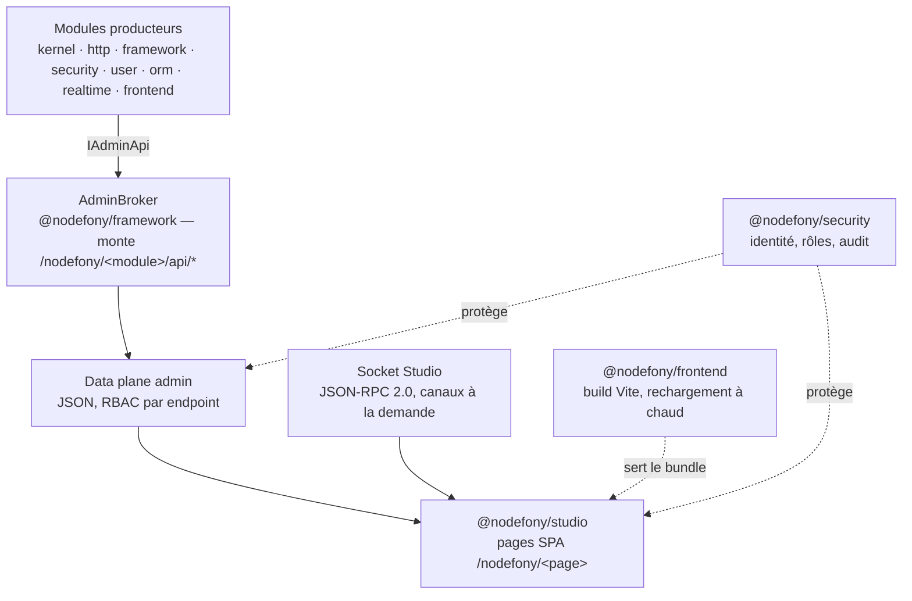

# @nodefony/studio — l'administration web du framework

> Une application web qui montre le serveur **en train de tourner** : ses modules, ses routes, sa
> configuration, ses sessions, ses utilisateurs, ses journaux, ses canaux temps réel, ses bases de
> données et sa documentation. Studio ne porte **aucune logique métier** : il affiche ce que chaque
> module publie de lui-même sur le **data plane d'administration**. C'est aussi une pièce
> **facultative** — le framework démarre sans elle, et les données restent interrogeables sans écran.

📍 [Documentation](../../../../../docs/index.md) › **@nodefony/studio**

## 🧭 Par où commencer

Trois parcours selon ce que tu viens faire. L'ordre compte : chaque étape suppose la précédente.

**Je découvre Studio** — voir l'intérieur du serveur avant de configurer quoi que ce soit.

1. [Démarrage rapide](#-démarrage-rapide) — déclarer le module, ouvrir la page, se connecter.
2. [Accéder à Studio](#-accéder-à-studio) — l'authentification passe par le pare-feu réel : il faut
   une identité qui existe vraiment, et les rôles décident de ce que tu vois.
3. Le catalogue d'écrans ci-dessous — repérer la famille qui répond à ta question.
4. [Mon bureau](./workspace.md) — composer ton propre tableau de bord à partir des sondes existantes.

**J'observe une application qui tourne** — la santé, la charge, ce qui vient de se passer.

1. [Le temps réel de Studio](#-le-temps-réel-de-studio) — une seule connexion, des canaux qu'on
   ouvre à la demande : c'est ce qui rend les écrans vivants sans marteler le serveur.
2. La famille **Observation** du catalogue — supervision, cluster, journaux, console temps réel.
3. [`@nodefony/realtime`](../../realtime/docs/index.md) — la couche qui porte ces canaux, et ce
   qu'elle devient quand l'application passe à plusieurs répliques.
4. [`@nodefony/security`](../../security/docs/index.md) — le journal d'audit et le pare-feu, que
   Studio se contente de rendre lisibles.

**Je publie mes propres écrans et données dans Studio** — un module qui veut être administrable.

1. **La partition du namespace `/nodefony`** (section plus bas) — la règle d'architecture à
   respecter **avant** d'écrire la moindre route d'administration.
2. [Publier ses écrans et ses données](#-publier-ses-écrans-et-ses-données) — le contrat `IAdminApi`,
   le courtier qui monte les routes, et le catalogue qui rend ton module découvrable.
3. [`@nodefony/framework`](../../framework/docs/index.md) — le courtier vit là, avec le routeur.
4. [`@nodefony/frontend`](../../frontend/docs/index.md) — si ton module apporte aussi sa propre
   interface : Studio en est le premier consommateur.

## 🗂️ Ce que Studio montre

Le tableau pour trouver la bonne famille en cinq secondes ; les cards en dessous pour savoir ce
qu'on y trouve, et à qui c'est ouvert. La navigation réelle est déclarée d'un seul tenant
(`NAV_GROUPS`, `navConfig.ts:106`) — ajouter un écran, c'est ajouter une ligne.

| Famille               | Ce qu'on y voit                                          | Ouvert à                     |
| --------------------- | -------------------------------------------------------- | ---------------------------- |
| **Mon espace**        | son bureau, son profil, ses sessions, ses clés d'API     | tout compte authentifié      |
| **Observation**       | santé du processus, cluster, journaux, canaux temps réel | développeur · exploitant     |
| **Système & données** | modules, configuration, routes, ORM, schéma, magasins    | développeur                  |
| **Sécurité**          | audit, pare-feu, utilisateurs, rôles, webhooks           | administrateur de plateforme |
| **IA**                | console de conversation et surfaces de gouvernance       | développeur · administrateur |
| **Documentation**     | ces pages, rendues depuis le dépôt                       | développeur · exploitant     |

```nodefony-cards
[
  { "icon": "👤", "title": "mon-espace", "href": "workspace.md",
    "desc": "Le seul groupe visible de tout compte authentifié : le bureau composable, le profil (mot de passe compris), la liste de ses propres sessions et de ses clés d'API. Sessions et Clés d'API sont à double audience — le mode administration n'apparaît que si le compte porte le rôle qui va avec, et c'est le serveur qui tranche, pas l'affichage.",
    "meta": "commence par Mon bureau : il explique comment les tuiles se composent" },
  { "icon": "🔭", "title": "observation",
    "desc": "La carte du serveur animée par l'activité réelle, la supervision (processeur, mémoire, boucle d'événements), le cluster agrégé sur tous les travailleurs d'un pod avec forage par identifiant de processus, le runtime, la console temps réel (canaux vivants, abonnés, débit, connexions en retard) et les journaux — filtrables, avec le suivi d'une requête depuis son identifiant de corrélation.",
    "meta": "six écrans — développeur · exploitant" },
  { "icon": "🧰", "title": "systeme-et-donnees",
    "desc": "Le tiroir du développeur : les modules chargés et le détail de chacun (documentation, symboles, routes, services, configuration, couverture), la configuration effective après fusion, la table de routage réelle, l'ORM, le schéma et les magasins.",
    "meta": "le playground d'appel de contrôleurs et le générateur de code ne sont montés qu'en développement" },
  { "icon": "🛡️", "title": "securite", "href": "../../security/docs/index.md",
    "desc": "Journal d'audit, état du pare-feu tel qu'il tourne (zones, authentificateurs, décisions), utilisateurs et leur profil administrateur, rôles, webhooks. Studio n'implémente rien de tout cela : il rend visible ce que le module de sécurité publie sur son data plane, avec la même politique de rôles.",
    "meta": "administrateur de plateforme" },
  { "icon": "🤖", "title": "ia",
    "desc": "La console de conversation avec les modèles, et les surfaces de gouvernance qui l'encadrent.",
    "meta": "plusieurs de ces écrans portent encore le drapeau « en travaux »" },
  { "icon": "📘", "title": "documentation", "href": "../../documentation/docs/index.md",
    "desc": "L'écran qui rend les pages Markdown du dépôt — celle que tu lis comprise. Le contenu et son data plane vivent dans le module de documentation ; Studio n'en fournit que la surface.",
    "meta": "ces pages mêmes" }
]
```

> [!NOTE]
> **La barre latérale montre plus que ce qui est monté.** Une entrée de navigation peut porter le
> drapeau `wip` : la barre la relègue alors en fin de groupe et l'atténue, et l'écran affiche une
> page d'attente au lieu de données. Une entrée `devOnly` disparaît hors développement, parce que
> son data plane n'y est pas monté. Dans les deux cas c'est du **confort d'affichage** : la vraie
> garde reste le serveur, qui refuse l'appel.

## 🧠 Ce que Studio apporte

Trois propriétés, toutes vérifiables dans le code — c'est ce qui distingue Studio d'un tableau de
bord de plus.

**Il n'invente aucune donnée.** Chaque chiffre affiché vient d'un endpoint qu'un module a publié
lui-même, sous `/nodefony/<module>/api/*`. Studio découvre ces producteurs par le catalogue
`/nodefony/framework/api/admin` (`FrameworkAdminApi.ts:203`) et construit sa navigation avec.
Conséquence pratique : tout ce que montre l'écran est aussi lisible en `curl`, en script, ou depuis
un agent — l'interface n'est pas un passage obligé.

**Il est facultatif, et le framework le sait.** Le module se déclare non critique
(`Studio.critical`, `index.ts:45`) : un échec de son démarrage n'emporte jamais le processus. S'il
n'est pas chargé du tout, ce sont **les pages** qui disparaissent — le data plane de chaque module,
lui, reste monté et servi. On perd la vue, jamais la donnée.

**Il se protège avec le pare-feu de l'application.** Studio n'a pas d'authentification à lui : la
connexion passe par `@nodefony/security` (session serveur, cookie opaque), et chaque endpoint
d'administration porte un rôle minimum appliqué par le courtier (`IAdminEndpoint.role`,
`IAdminApi.ts:152`). Un administrateur de plateforme voit tout ; un développeur voit
l'introspection ; un simple compte ne voit que son espace.

## 🏛️ Place dans le framework



Studio est le **premier consommateur** de `@nodefony/frontend` et du data plane admin. La flèche ne
part jamais dans l'autre sens : aucun module ne dépend de Studio pour fonctionner.

## 🚀 Démarrage rapide

Vu depuis une application créée par `nodefony create app`. Studio se déclare comme n'importe quel
module, et n'a besoin de rien d'autre que du pare-feu pour être utile.

```ts
// nodefony.config.ts — l'orchestrateur de l'application
export default defineConfig(() => ({
  modules: [
    "@nodefony/http",
    "@nodefony/framework",
    // Sans pare-feu, aucune identité à présenter : Studio serait inaccessible.
    "@nodefony/security",
    // `auto` : l'interface vient des fichiers pré-construits livrés dans le paquet
    // npm — ni Vite ni @nodefony/frontend requis. Dans le dépôt du framework, le
    // même réglage bascule sur Vite (rechargement à chaud) parce que les sources
    // sont là.
    use("@nodefony/studio", { ui: "auto" }),
  ],
}));
```

Ce qu'on observe ensuite :

1. Au démarrage, le module annonce le mode retenu et **la raison** de ce choix dans les journaux
   (`Studio.onKernelBoot()`, `index.ts:66`) — c'est le premier endroit à regarder si la page reste
   blanche.
2. `https://127.0.0.1:5152/nodefony` sert la page ; toute URL à un segment sous `/nodefony` renvoie
   la même page React (`StudioController.renderStudio()`, `StudioController.ts:53`), pour que le
   rechargement d'un lien profond ne tombe pas sur une erreur.
3. `curl https://127.0.0.1:5152/nodefony/studio/api/health` répond sans authentification :
   c'est la sonde de vie, volontairement placée hors du pare-feu et réduite à l'état, la durée de
   fonctionnement et l'identifiant de processus (`StudioController.apiHealth()`,
   `StudioController.ts:159`).

## 🔐 Accéder à Studio

Il n'y a pas de compte de démonstration ni de connexion simulée : **l'authentification est celle de
l'application**. Le formulaire de connexion appelle le flux de session de `@nodefony/security`, qui
pose un cookie opaque ; le navigateur ne détient jamais de jeton exploitable.

Ce qu'il faut réunir pour entrer :

1. Le module `@nodefony/security` chargé, avec une zone qui couvre `/nodefony` et un
   authentificateur de session.
2. Un **utilisateur qui existe** dans le magasin d'identités — donc une source d'utilisateurs
   branchée (voir [`@nodefony/user`](../../user/docs/index.md)).
3. Les **rôles** qui correspondent à ce qu'on veut voir. Ils ne changent pas seulement le menu :
   ils changent les réponses du serveur.

| Le compte porte…       | Ce qu'il obtient                                                     |
| ---------------------- | -------------------------------------------------------------------- |
| une session valide     | son espace personnel : bureau, profil, ses sessions, ses clés d'API  |
| un rôle développeur    | modules, configuration, routes, ORM, schéma, magasins, documentation |
| un rôle d'exploitation | supervision, cluster, et les sondes de processus                     |
| l'administration       | tout, dont sécurité, utilisateurs, rôles, audit et catalogue d'API   |

> [!IMPORTANT]
> **Cacher un menu n'est pas une protection.** Le filtrage par rôle dans la barre latérale ne sert
> qu'à ne pas proposer une porte fermée. La décision réelle est prise par le serveur : le courtier
> refuse l'appel si le rôle minimum de l'endpoint n'est pas là, et le pare-feu refuse la requête
> avant même le routage. Un écran vide dans Studio est donc, presque toujours, un refus légitime.

## 🏗️ La partition du namespace `/nodefony`

`/nodefony` est **réservé au framework** : aucune application n'y monte ses propres routes. C'est ce
qui permet d'y loger l'administration sans jamais entrer en collision avec le métier — un `/studio`
ordinaire, lui, aurait fini par se heurter à une route applicative.

À l'intérieur de ce préfixe, deux espaces séparés **par la profondeur** :

| Espace             | Forme                                         | Porté par        | Existe sans Studio |
| ------------------ | --------------------------------------------- | ---------------- | ------------------ |
| Interface humaine  | `/nodefony` et `/nodefony/<page>` (1 segment) | le module Studio | non                |
| Data plane machine | `/nodefony/<module>/api/*` (≥ 3 segments)     | chaque module    | oui                |

La règle qui en découle vaut pour **tout** module, pas seulement pour Studio :

- ✅ `/nodefony/security/api/sessions` — trois segments, marqueur `/api/`, jamais ambigu.
- ❌ `/nodefony/security` — un seul segment : entre en collision avec une page de l'interface.

Cette asymétrie est ce qui rend l'interface jetable. Le repli des liens profonds suit la même
prudence : chaque page à deux segments ou plus déclare son **préfixe littéral**
(`modules/{name}`, `cluster/{pid}`, `users/{id}`…). Un repli générique du type `/{section}/{page}`
masquerait les vraies routes que d'autres modules montent sous `/nodefony/<x>/<y>`.

## 🧩 Publier ses écrans et ses données

Un module devient administrable en publiant un objet `IAdminApi` (`IAdminApi.ts:212`) — un
**producteur de données**, qui ne connaît ni le routeur, ni le contexte HTTP, ni la sérialisation.

```ts ignore
import type { IAdminApi, IAdminRegistry } from "nodefony";

const inventoryAdminApi: IAdminApi = {
  // Devient /nodefony/inventory/api/* — segment stable, les liens en dépendent.
  adminNamespace: "inventory",
  // Ce que la navigation de Studio affichera pour ce producteur.
  adminDescriptor: () => ({ label: "Inventaire", icon: "box", order: 50 }),
  adminEndpoints: () => [
    {
      path: "health",
      summary: "État du magasin et âge du dernier inventaire",
      // Rôle minimum appliqué par le courtier ; défaut : administrateur.
      role: "ROLE_SUPERVISOR",
      // Entrée → sortie. Le handler lit des données et rend des données.
      handler: (request) => ({ ok: true, roles: request.roles }),
    },
  ],
};

// Dans onKernelBoot : le courtier monte les routes plus tard, à onKernelReady.
const registry = this.kernel?.container?.get("adminBroker") as IAdminRegistry;
registry.register(inventoryAdminApi);
```

Ce que le framework fait ensuite, sans que le module s'en occupe :

1. `AdminBroker.register()` (`AdminBroker.ts:45`) mémorise le producteur et refuse un espace de nom
   déjà pris, ou un enregistrement arrivé après le montage.
2. Au montage, chaque endpoint devient une vraie route `/nodefony/<namespace>/api/<path>`, avec son
   contrôle de rôle appliqué **avant** l'appel du handler.
3. Le producteur apparaît dans le catalogue `/nodefony/framework/api/admin`, d'où Studio construit
   automatiquement un groupe de navigation — sans une ligne de code frontend.

> [!TIP]
> Le contrat vit dans le **cœur** (`nodefony`), pas dans le framework, exactement pour qu'un module
> bas niveau — un adaptateur de base de données, un service — puisse se rendre administrable sans
> dépendre du routeur. Le module ne déclare que **quoi** il expose ; le transport ne le regarde pas.

## ⚙️ Configuration

Studio n'a presque rien à régler. La seule molette qui compte décide **d'où vient l'interface** :

| Valeur   | Ce qui se passe                                                     | Quand                                         |
| -------- | ------------------------------------------------------------------- | --------------------------------------------- |
| `auto`   | Vite si tout est réuni, sinon les fichiers pré-construits du paquet | défaut — ne rien décider                      |
| `static` | force les fichiers pré-construits livrés avec le paquet npm         | production, ou toute app installée depuis npm |
| `vite`   | force le serveur de développement et le rechargement à chaud        | contribution au framework lui-même            |

En mode statique, l'administration fonctionne **sans Vite ni `@nodefony/frontend`** : c'est ce qui
la rend disponible d'emblée dans une application installée. En mode Vite, l'ordre de chargement
compte — Studio doit venir **après** `@nodefony/frontend`, dont le service doit exister au moment
où le module s'enregistre.

## 📡 Le temps réel de Studio

Une seule connexion WebSocket permanente porte tout ce qui bouge : `WS
/nodefony/studio/api/realtime`, en JSON-RPC 2.0. Elle ne pousse **rien** tant que personne ne
demande — le client s'abonne à un canal, le producteur démarre ; il se désabonne, le producteur
s'arrête, et la connexion reste ouverte.

Les canaux sont déclarés d'un seul endroit (`CHANNELS`, `providers.ts:98`) : flux des journaux,
sondes de processus pour la supervision et pour la barre de débogage, santé et flux de l'ORM, santé
de la socket elle-même. Beaucoup acceptent un **suffixe de cadence** (`nodefony:orm:flow:5000`) : c'est le
lecteur qui choisit sa granularité, dans des bornes que le serveur impose.

Deux autres formes de trafic circulent sur la même connexion :

- des **actions** en aller-retour (`StudioRealtimeController.realtimeActions()`,
  `StudioRealtimeController.ts:112`) — mesurer la latence, déclencher un ramasse-miettes, piloter le
  générateur de code ;
- le **pont d'API** (`StudioRealtimeController.realtimeApiRequest()`,
  `StudioRealtimeController.ts:202`), qui permet d'appeler un endpoint du data plane **par la
  socket** plutôt qu'en HTTP, avec exactement la même réponse.

> [!WARNING]
> **Les sondes de processus décrivent un processus, pas un pod.** En multi-travailleurs, la socket
> tombe sur un seul d'entre eux : ce qu'affiche la supervision est alors la vue de **ce** travailleur.
> Pour un verdict à l'échelle du pod, la source légitime est le canal de santé agrégé par le maître,
> pas un endpoint tiré au sort. C'est un modèle assumé, cohérent avec le cloud : chaque instance se
> rapporte, l'agrégation se fait au-dessus.

## 🧪 Tests & couverture

Les compteurs sont régénérés depuis vitest, jamais figés dans cette prose. Ce qui mérite d'être dit
ici, c'est **ce que les suites prouvent** — et la frontière volontaire de ce qu'elles ne couvrent pas.

| Type                   | Où                                                  | Ce qui est prouvé                                           |
| ---------------------- | --------------------------------------------------- | ----------------------------------------------------------- |
| Producteurs temps réel | `nodefony/tests/unit/providers.test.ts`             | agrégation des journaux en lots, cadence, arrêt propre      |
| Agrégation cluster     | `nodefony/tests/unit/clusterSupervision.test.ts`    | fusion des vues de plusieurs travailleurs en un verdict     |
| Pont d'API             | `nodefony/tests/unit/apiClientSocketBridge.test.ts` | appeler le data plane par la socket rend la même réponse    |
| Rendu et disposition   | `nodefony/tests/unit/{grid,jsonFormat}.test.ts`     | grille du bureau composable, mise en forme des charges JSON |

La frontière est délibérée : le **point d'entrée WebSocket** relève de l'intégration sur serveur
vivant (il vit dans la suite WebSocket de [`@nodefony/http`](../../http/docs/index.md)), et les
composants React ne sont pas instrumentés ici. Les tests portent sur la **logique pure** —
producteurs, agrégation, disposition — qui est là où les régressions se cachent.

```bash
cd src/packages/@nodefony/studio
npm test          # suite unitaire, sans serveur
npm run coverage  # + rapport lisible dans l'onglet Couverture de Studio
```

## 🔗 Pour aller plus loin

- ⬆️ **Remonter** : [Toute la documentation](../../../../../docs/index.md)
- 📄 **La page du module** : [Mon bureau — le tableau de bord composable](./workspace.md)
- 🧭 **Modules voisins** : [`@nodefony/frontend`](../../frontend/docs/index.md) (le build Vite qui
  sert cette interface) · [`@nodefony/framework`](../../framework/docs/index.md) (le courtier et le
  routeur) · [`@nodefony/security`](../../security/docs/index.md) (identité, rôles, audit) ·
  [`@nodefony/realtime`](../../realtime/docs/index.md) (les canaux) ·
  [`@nodefony/documentation`](../../documentation/docs/index.md) (le portail qui rend ces pages)
- 🏛️ **Transverse** : [vue d'ensemble du framework](../../../../../docs/architecture/vue-ensemble.md) ·
  [pipeline de requête](../../../../../docs/architecture/pipeline-requete.md) ·
  [configuration](../../../../../docs/architecture/configuration.md)
- 📖 [Lexique général](../../../../../docs/lexique.md) du framework.
