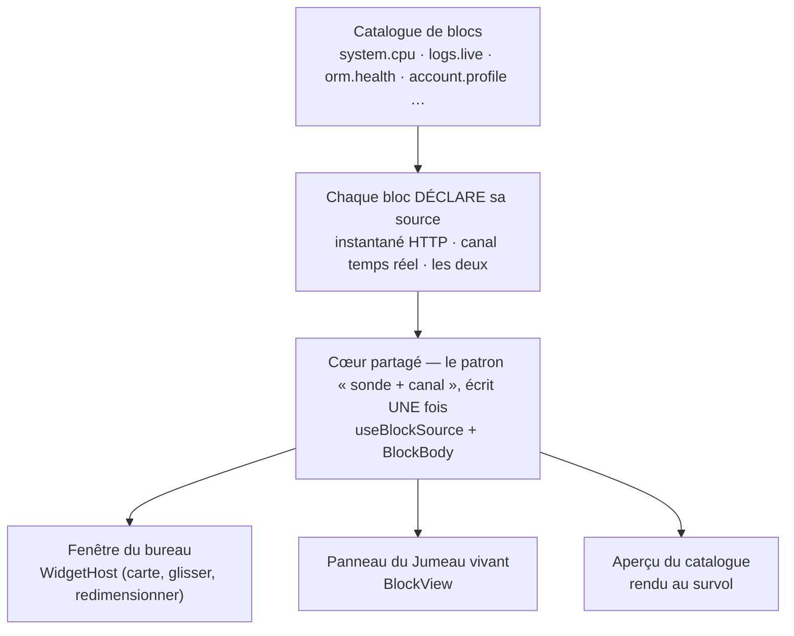

# Mon bureau — le tableau de bord composable

> Studio ne t'impose pas un tableau de bord : il te donne un **catalogue de sondes** et un bureau où
> les poser. Chaque sonde déjà écrite — processeur, mémoire, boucle d'événements, santé, journaux,
> base de données, canaux temps réel, ton propre profil — est un **bloc** réutilisable. Tu ouvres le
> catalogue, tu poses les blocs qui te concernent, tu les déplaces, tu les redimensionnes ; le bureau
> se souvient. Un développeur, un exploitant et un simple utilisateur regardent la même application
> par trois fenêtres différentes, sans qu'une ligne de code ait été écrite pour cela.

📍 [Documentation](../../../../../docs/index.md) › [@nodefony/studio](index.md) › **Mon bureau**

## 🧠 Le modèle mental — un bloc, plusieurs contenants

La bonne façon de se représenter le bureau : ce n'est pas une page qui contient des graphiques,
c'est un **contenant parmi d'autres** pour un contenu écrit une seule fois.



Un bloc ne sait **ni** comment il est affiché, **ni** comment ses données arrivent. Il déclare ce
qu'il lui faut (`IWidgetDef`, `types.ts:123`) et rend une donnée qu'on lui tend. C'est ce qui permet
au même bloc d'apparaître comme fenêtre de bureau, comme panneau du Jumeau vivant, ou comme
vignette d'aperçu — sans une ligne dupliquée.

## 📖 Lexique

| Terme                | Sens                                                                                        |
| -------------------- | ------------------------------------------------------------------------------------------- |
| Bloc (widget)        | Une sonde rendue réutilisable : un titre, une source de données, un composant d'affichage.  |
| Bureau               | Un espace nommé qui porte un ensemble de fenêtres. On en a plusieurs, on bascule.           |
| Fenêtre              | Un bloc **posé** sur un bureau, avec sa position, sa taille et son rang de profondeur.      |
| Catalogue            | Le magasin de tous les blocs disponibles, filtré par les rôles du compte.                   |
| Modèle (preset)      | Un bureau prêt à l'emploi (Développeur, Supervision, Mémoire…) proposé à la création.       |
| Instantané           | Une lecture HTTP unique, au premier affichage. Le bloc a tout de suite quelque chose.       |
| Canal                | Un flux temps réel auquel le bloc s'abonne pour se mettre à jour tout seul.                 |
| Hybride              | Les deux : instantané pour le premier affichage, canal pour la suite. Le patron courant.    |
| Rang de profondeur   | L'ordre d'empilement des fenêtres qui se chevauchent — cliquer met au premier plan.         |
| Aimantation          | L'arrondi discret appliqué au relâché, pour que les fenêtres s'alignent sans grille rigide. |
| Pavage (« Ranger »)  | Le rangement automatique de gauche à droite, avec retour à la ligne.                        |
| Jumeau vivant        | La carte animée du serveur ; ses panneaux montent les mêmes blocs que le bureau.            |
| Travailleur (worker) | Un processus Node parmi ceux d'un même pod, en mode multi-processus.                        |
| Pod                  | L'ensemble des travailleurs d'une même réplique — le verdict qui intéresse l'exploitant.    |

## Qu'est-ce qu'un bureau composable ?

Le tableau de bord classique est **écrit par quelqu'un d'autre** : un développeur décide une bonne
fois pour toutes que la page « supervision » montre le processeur, la mémoire et la boucle
d'événements, dans cet ordre. Ça marche jusqu'au jour où on cherche autre chose.

Un bureau composable inverse la charge. L'application publie des sondes ; l'**utilisateur** décide
lesquelles il regarde et comment elles sont disposées. L'analogie est celle d'une tablette : le
système fournit des applications, chacun pose sur son écran d'accueil celles dont il se sert.

Concrètement, dans Studio :

1. Le bureau vit sur `/nodefony/workspace`, dans le groupe **Mon espace** — accessible à **tout
   compte authentifié**, sans rôle particulier (`Workspace`, `Workspace.tsx:26`).
2. Le bouton **Ajouter** ouvre le catalogue ; les blocs qu'on n'a pas le droit de voir n'y
   apparaissent pas.
3. On glisse les fenêtres par leur en-tête, on les redimensionne par le coin. Le bureau retient.
4. On peut avoir **plusieurs bureaux** — un pour la mise au point, un pour la surveillance — et
   basculer de l'un à l'autre par le bandeau de vignettes.

## La vision Nodefony — chaque sonde devient une brique

Nodefony avait déjà tout ce qu'il faut : des endpoints d'administration publiés par chaque module,
et des canaux temps réel sur une socket unique. Ce qui manquait, c'était de reconnaître que **toute
sonde est déjà un bloc** — il suffisait d'arrêter de recopier, écran après écran, le même mécanisme
« je lis un instantané, puis je m'abonne à un canal ».

Ce mécanisme est désormais écrit **une seule fois** (`useBlockSource()`, `useBlockSource.tsx:51`), et
un bloc se réduit à trois lignes de déclaration plus un composant d'affichage pur. Trois
conséquences directes :

**L'abonnement temps réel n'est monté que s'il sert.** Le flux n'est branché que quand l'interrupteur
« Temps réel » est actif — le composant d'abonnement est alors monté, et démonté sinon
(`BlockLiveFeed`, `useBlockSource.tsx:28`). Un bureau ouvert avec le temps réel coupé ne coûte au
serveur que ses lectures d'instantané.

**Le bloc ne connaît pas la topologie.** Qu'il y ait un processus ou huit, un bloc reçoit une donnée
déjà normalisée et un contexte qui dit s'il est en cluster (`useWidgetRuntime()`,
`useWidgetRuntime.ts:13`). Il n'a **pas** à écrire deux rendus.

**Les capacités sont dérivées, jamais déclarées.** Qu'un bloc soit « temps réel » ou « prêt pour le
cluster » se **calcule** depuis sa définition (`widgetCapabilities()`, `tags.ts:99`) et s'affiche
comme étiquette dans le catalogue. On ne peut donc pas mentir dans une étiquette : il n'y a rien à
saisir.

## 🚀 Démarrage rapide

Vu depuis une application créée par `nodefony create app`. Le bureau n'a **aucune configuration à
lui** : il apparaît dès que Studio est chargé. Ce qui se règle, c'est ce qu'il aura à montrer et
**qui** verra quoi.

```ts
// nodefony.config.ts — l'orchestrateur de l'application
export default defineConfig(() => ({
  modules: [
    "@nodefony/http",
    "@nodefony/framework",
    // Sans pare-feu, pas d'identité : ni bureau, ni blocs (tout est authentifié).
    use("@nodefony/security", {
      areas: {
        studio: { pattern: "^/nodefony", authenticators: ["session"] },
      },
      // Les MODÈLES de bureau sont filtrés par rôle : sans hiérarchie déclarée,
      // un compte administrateur ne « couvre » pas les rôles développeur et
      // exploitant, et ne voit donc que les bureaux ouverts à tous.
      roleHierarchy: {
        ROLE_NODEFONY_ADMIN: ["ROLE_ADMIN", "ROLE_SUPERVISOR", "ROLE_DEV"],
        ROLE_ADMIN: ["ROLE_USER"],
      },
    }),
    // Les blocs système lisent la santé AGRÉGÉE : c'est ce module qui la publie.
    "@nodefony/realtime",
    use("@nodefony/studio", { ui: "auto" }),
  ],
}));
```

Ce qu'on observe ensuite :

1. Ouvrir `https://127.0.0.1:5152/nodefony/workspace` après connexion. Au **tout premier
   affichage**, les modèles sont semés et le bureau actif est **« Mon compte »**
   (`DEFAULT_WORKSPACE_ID`, `presets.ts:164`) : profil, clés d'API, sessions — trois blocs qu'un
   simple utilisateur a le droit de voir.
2. Cliquer **Ajouter** : le catalogue s'ouvre. Survoler une carte affiche un **aperçu en direct** du
   vrai bloc, pas une image (`WidgetPreview`, `WidgetCatalogDrawer.tsx:60`). Cliquer la pose sur le
   bureau, sous le contenu existant.
3. Glisser une fenêtre par son en-tête, la redimensionner par son coin bas-droit, puis **recharger la
   page** : tout est à sa place.
4. Basculer l'interrupteur **Temps réel** : les blocs alimentés par un canal prennent une pastille
   verte et se mettent à jour d'eux-mêmes. Coupé, ils retombent sur leur dernier instantané.
5. Les données affichées restent lisibles sans interface — chaque bloc n'appelle qu'un endpoint
   publié du data plane. Par exemple :

```bash
# La source des blocs système : santé agrégée de toutes les instances du pod.
curl -s -b /tmp/jar https://127.0.0.1:5152/nodefony/realtime/api/health | head -c 300
```

## ⚙️ Composer, agencer, persister

### Les gestes disponibles

| Geste                   | Ce qui se passe                                                                |
| ----------------------- | ------------------------------------------------------------------------------ |
| **Ajouter** un bloc     | Posé **sous** les fenêtres existantes, au premier plan (`addWidget()`, `:125`) |
| Glisser l'en-tête       | Suivi du curseur ; une **seule** écriture au relâché (`moveTo()`, `:152`)      |
| Tirer le coin bas-droit | Redimensionne largeur **et** hauteur, bornes appliquées au relâché             |
| Cliquer une fenêtre     | Elle passe au premier plan (`bringToFront()`, `:175`)                          |
| **Ranger**              | Pavage automatique de gauche à droite, tailles conservées (`tidy()`, `:189`)   |
| **Réinitialiser**       | Rend au bureau son modèle d'origine — sans effet sur un bureau créé à la main  |
| Menu ⋮ d'une fenêtre    | La retire du bureau                                                            |
| Bandeau de vignettes    | Créer, renommer, dupliquer, réordonner et supprimer des bureaux                |

Les ancrages ci-dessus pointent tous `WorkspaceStore.ts` (`WorkspaceStore`, `WorkspaceStore.ts:83`),
l'unique détenteur de l'état du bureau.

### Un bureau libre, pas une grille

Le choix assumé est celui du **bureau libre** : les fenêtres flottent, peuvent se **chevaucher**, et
s'empilent selon un rang de profondeur. Il n'y a pas de colonnes imposées.

Les coordonnées sont **mixtes**, et c'est délibéré (`WidgetInstance`, `types.ts:156`) :

- **X et largeur en fraction** de la largeur du bureau (0 à 1) → le bureau **s'adapte** à la taille
  de l'écran sans casser la disposition ;
- **Y et hauteur en pixels** → le bureau **défile** verticalement, sans limite de hauteur.

Rien n'est complètement libre pour autant : au relâché seulement, la position et la taille passent
par une **aimantation douce** (`snap()`, `grid.ts:13`) et par des bornes minimales — un sixième de
largeur, 96 pixels de haut (`MIN_W`, `types.ts:25`). Assez pour que les fenêtres s'alignent
naturellement, pas assez pour contraindre.

> [!TIP]
> « Ranger » n'est pas un retour en arrière : le pavage (`autoTile()`, `grid.ts:45`) **conserve les
> tailles** et l'ordre de lecture courant. C'est l'équivalent du « ranger les icônes » d'un système
> de bureau — on récupère un alignement propre sans perdre son travail.

### Où vit un bureau

La disposition est enregistrée dans le **stockage local du navigateur**
(`LAYOUTS_KEY`, `WorkspaceStore.ts:11`). Deux conséquences à connaître :

- Un bureau est **lié à l'appareil**, pas au compte. Le même utilisateur sur deux machines a deux
  bureaux différents.
- Comme le stockage n'est pas lié à l'identité, un changement de compte sur le même navigateur
  **purge et ressème** les bureaux (`resetForIdentity()`, `WorkspaceStore.ts:321`) — sinon la
  disposition d'un administrateur resterait affichée au compte suivant.

Une fois des bureaux enregistrés, ce sont **eux** qui font foi : les modèles ne sont semés qu'au tout
premier lancement, puis ils ne servent plus qu'à la création d'un nouveau bureau
(`load()`, `WorkspaceStore.ts:334`). Une création, un renommage ou une suppression ne sera jamais
écrasé par un modèle.

## 🗂️ Le catalogue de blocs

Le catalogue est peuplé au chargement de la page : chaque bloc s'y inscrit lui-même
(`registerWidget()`, `workspace/registry.ts:33`). Il n'y a **aucune liste centrale** à tenir à jour —
d'où le fait qu'un bloc oublié dans un bureau enregistré disparaisse sans casser quoi que ce soit.

| Famille                 | Ce qu'on y trouve                                               | Ouvert à                  |
| ----------------------- | --------------------------------------------------------------- | ------------------------- |
| **Mon compte**          | profil et rôles, mes clés d'API, mes sessions                   | tout compte authentifié   |
| **Runtime & lancement** | mode de démarrage, modes disponibles, état de Vite              | développeur · exploitant  |
| **Système & santé**     | processeur, mémoire, boucle d'événements, durée, version, dépôt | développeur · exploitant  |
| **Logs**                | flux en direct, fond de panier des journaux                     | développeur · exploitant  |
| **Temps réel**          | santé du hub, canaux et abonnés                                 | développeur · exploitant  |
| **Cluster**             | grille des travailleurs du pod                                  | exploitant                |
| **Données / ORM**       | santé des connecteurs, débit des requêtes                       | développeur               |
| **Sécurité**            | derniers événements d'audit                                     | administrateur plateforme |

### Trouver un bloc

Le catalogue n'est pas une simple liste : il se **filtre à facettes** (`WIDGET_TAGS`, `tags.ts:27`),
sur deux axes saisis dans la définition du bloc et un axe calculé.

- **Domaine** — le thème observé, hiérarchique : `système` se décline en processeur, mémoire,
  ramasse-miettes, ressources actives… ; `orm` en débit et connecteurs.
- **Nature** — le type de bloc : valeur unique, courbe, indice composite, liste, panneau.
- **Capacités** — _jamais saisies_, dérivées : « temps réel » si le bloc a un canal, « prêt pour le
  cluster » s'il sait rendre une vue de pod.

La recherche est **insensible aux accents** : « memoire » trouve « Mémoire ». Et le survol d'une
carte monte le bloc **pour de vrai**, avec ses données du moment — un abonnement à la fois, libéré
quand on quitte la carte.

## 🏗️ Architecture interne

Trois fichiers portent l'essentiel, et il est utile de savoir lequel fait quoi avant de chercher un
comportement.

### Ce qu'un bloc déclare

Un bloc est une **structure de données** plus un composant d'affichage (`IWidgetDef`,
`types.ts:123`) : identifiant, titre, description, famille, icône, étiquettes, taille par défaut,
et surtout sa **source**.

La source est l'élément central, en trois formes (`WidgetSource`, `types.ts:83`) :

| Forme          | Ce que le bloc reçoit              | À employer quand…                                    |
| -------------- | ---------------------------------- | ---------------------------------------------------- |
| **`snapshot`** | une lecture HTTP unique            | la donnée bouge peu (identité, configuration, dépôt) |
| **`live`**     | un canal temps réel seul           | le flux **est** la donnée (journaux en direct)       |
| **`hybrid`**   | une lecture HTTP **puis** le canal | le cas courant : affichage immédiat, puis vivant     |

Une source `live` pure est le seul cas où un bloc peut n'avoir **rien** à montrer : le temps réel
coupé, il affiche « Active le temps réel pour ce bloc » plutôt qu'un vide inexpliqué.

### Comment la donnée arrive

Le cœur partagé fait exactement quatre choses (`useBlockSource()`, `useBlockSource.tsx:51`) : lire
l'instantané, monter l'abonnement **si et seulement si** le temps réel est actif, préférer la donnée
du flux quand elle existe, et exposer un drapeau qui dit d'où vient ce qu'on regarde — c'est lui qui
allume la pastille verte de l'en-tête.

Le rendu commun (`BlockBody`, `useBlockSource.tsx:89`) enveloppe le composant du bloc dans la gestion
des trois états ordinaires : chargement, erreur avec bouton de reprise, donnée absente. Un auteur de
bloc n'écrit donc **jamais** de gestion d'erreur : il reçoit une donnée non nulle ou n'est pas rendu.

### Comment la fenêtre bouge

Le déplacement et le redimensionnement sont pris en charge par la surface du bureau
(`WidgetGrid`, `WidgetGrid.tsx:53`), pas par la fenêtre. La raison est de performance : pendant le
geste, la fenêtre est déplacée **directement** par transformation graphique, sans que l'état de
l'application soit touché ; le magasin ne reçoit **qu'une écriture**, au relâché. Un déplacement de
deux secondes ne provoque donc pas deux secondes de recalculs.

Deux détails qui évitent des bugs visuels réels : le geste est suivi par capture du pointeur, donc
aucun mouvement n'est perdu même si le curseur sort de la fenêtre ; et la surface du bureau isole ses
rangs de profondeur, pour qu'une fenêtre passée au premier plan ne remonte jamais **au-dessus** du
bandeau ou de la barre supérieure.

### Le même bloc ailleurs

Le registre de blocs et le registre de widgets sont **le même objet**, ré-exposé sous un vocabulaire
neutre pour les contenants autres que le bureau. Monter un bloc n'importe où tient en un composant
(`BlockView`, `BlockView.tsx:25`) — c'est ce dont se sert le Jumeau vivant, dont deux panneaux
affichent exactement les blocs « santé du hub » et « fond de panier des journaux » du bureau.

## 📡 Le bureau en cluster

C'est le point qui distingue ce bureau d'un tableau de bord ordinaire, et il mérite d'être compris
avant de lire un chiffre de travers.

**Le problème.** Quand une application tourne en multi-processus, la socket temps réel n'atterrit que
sur **un** travailleur. Un endpoint interrogé au hasard répond donc pour **ce** processus-là — et
présenté comme l'état du pod, il **ment**.

**La règle appliquée.** Les blocs concernés lisent tous une **source unique agrégée par le maître**,
`/nodefony/realtime/api/health`, qui rend la liste de toutes les instances **et** leurs totaux. Un
état normalisé ramène le mono-processus et le cluster au même modèle : une instance ou huit, la forme
de la donnée est identique, le bloc a **un seul** code.

**Le rendu.** Une brique d'affichage partagée décide de la présentation (`ClusterView`,
`ClusterView.tsx:33`) :

| Topologie               | Ce que montre la fenêtre                                                       |
| ----------------------- | ------------------------------------------------------------------------------ |
| **Un seul processus**   | la valeur, directement. **Aucun** vocabulaire de cluster, aucun bruit.         |
| **Plusieurs processus** | le **verdict du pod** par défaut, plus une grille par travailleur au dépliage. |

Le résumé du pod n'est pas une moyenne systématique : l'agrégation est **adaptée à la métrique** —
moyenne pour le processeur, somme pour la mémoire, **pire travailleur** pour la santé (un pod dont un
travailleur est en souffrance n'est pas un pod « à moitié en bonne santé »). Chaque travailleur de la
grille peut renvoyer vers son propre écran de forage.

> [!WARNING]
> Tous les blocs ne sont pas concernés. Un bloc porte la mention « prêt pour le cluster » seulement
> s'il lit la source agrégée ; les autres — journaux du processus courant, routes, modules, dépôt —
> décrivent **le processus qui répond**, et c'est légitime. En cas de doute, l'étiquette du catalogue
> est la réponse : elle est calculée depuis le code, pas saisie.

## 🔐 Rôles et visibilité

Deux filtres distincts s'appliquent, et il faut les distinguer pour ne pas s'étonner d'un bureau
absent.

**Les blocs du catalogue.** La visibilité d'un bloc est décidée par une politique **par famille**
(`CATEGORY_ROLES`, `workspace/registry.ts:17`), qu'un bloc peut surcharger individuellement. Les
blocs « Mon compte » ne demandent rien : ils sont en libre-service, et le serveur les restreint de
toute façon aux données du demandeur. Les blocs de sécurité, à l'opposé, sont réservés à
l'administrateur de plateforme.

**Les modèles de bureau.** Un modèle porte lui aussi ses rôles (`isWorkspaceVisible()`,
`presets.ts:159`). Sans cela, un simple utilisateur se retrouverait devant un bureau « Développeur »
rempli de blocs qui lui répondraient tous par un refus. Et si le bureau actif cesse d'être
accessible — un changement de compte, une révocation de rôle — la page bascule d'elle-même sur le
premier bureau visible, au lieu d'afficher une page morte.

Les deux filtres partagent **la même fonction** (`isVisibleForRoles()`, `roles.ts:101`) et les mêmes
paquets de rôles que la barre latérale (`VIEW_ROLES`, `roles.ts:117`) : c'est ce qui garantit qu'un
menu, une route et un catalogue ne divergent pas.

> [!IMPORTANT]
> **Ce filtrage est du confort, pas une protection.** Cacher un bloc n'empêche personne d'appeler
> l'endpoint qu'il lit. La défense réelle est le contrôle de rôle appliqué **par le serveur** sur
> chaque endpoint du data plane — voir [le pare-feu](../../security/docs/firewall.md) et
> [l'autorisation](../../security/docs/authorization.md). Ne jamais compter sur l'absence d'une
> tuile pour protéger une donnée.

## 🧩 Ajouter son propre bloc

Il faut être direct sur le périmètre : le catalogue est **interne au bundle de Studio**. Une
application installée depuis npm ne peut pas y injecter un bloc — l'inscription se fait à la
compilation du frontend, et le paquet n'expose pas ce registre.

Le chemin qui **est** ouvert à une application, et qui est le bon, c'est de rendre ses données
observables :

1. **Publier un endpoint d'administration** via le contrat `IAdminApi` — il devient
   `/nodefony/<module>/api/*`, protégé par un rôle minimum. La recette est dans le
   [hub du module](index.md).
2. **Publier un canal temps réel** si la donnée bouge, via
   [`@nodefony/realtime`](../../realtime/docs/index.md).

Un bloc n'est ensuite qu'une déclaration de quelques lignes — source, taille, famille, étiquettes —
plus un composant qui reçoit une donnée déjà chargée. Pour contribuer un bloc au framework lui-même,
c'est un appel à `registerWidget()` dans le dossier des blocs, et le catalogue se peuple tout seul :
il n'y a **aucune** liste centrale à mettre à jour, et aucun rôle à recopier tant que la politique de
famille convient.

## ⚡ Performance & mémoire

Les choix de conception visent tous le même risque : un bureau, c'est **N sondes vivantes affichées
en même temps**. Cinq garde-fous, tous vérifiables dans le code.

- **L'abonnement n'existe que s'il sert.** Le composant d'abonnement n'est monté que temps réel
  actif ; le démontage libère la souscription, qui est comptée par référence — deux blocs sur le même
  canal ne provoquent pas deux flux.
- **Le contexte transverse est calculé une fois** pour tout le bureau, pas par fenêtre : la topologie
  ne change pas en cours de session, un instantané suffit (`useWidgetRuntime()`,
  `useWidgetRuntime.ts:13`).
- **Un geste = une écriture.** Déplacer ou redimensionner ne touche l'état qu'au relâché ; pendant le
  geste, tout se joue en transformation graphique, à zéro rendu par image.
- **Chaque fenêtre est confinée** : son contenu ne peut pas provoquer de recalcul de mise en page à
  l'échelle du bureau.
- **L'aperçu du catalogue est paresseux** : le bloc survolé n'est monté qu'au survol, un seul à la
  fois.

## ⚠️ Pièges

| Symptôme                                              | Cause                                                                     | Correction                                                          |
| ----------------------------------------------------- | ------------------------------------------------------------------------- | ------------------------------------------------------------------- |
| Mon bureau a disparu après une reconnexion            | Changement de compte → purge volontaire du stockage local                 | Normal : recomposer, ou repartir d'un modèle                        |
| Mon bureau n'est pas le même sur une autre machine    | La disposition est **liée à l'appareil**, pas au compte                   | Recomposer sur place ; repartir du même modèle donne le même départ |
| Une fenêtre a disparu du bureau                       | Son bloc n'existe plus dans le catalogue → ignoré au rendu, sans plantage | Poser un bloc équivalent depuis le catalogue                        |
| Les blocs ne bougent pas, pas de pastille verte       | L'interrupteur **Temps réel** est coupé                                   | L'activer dans l'en-tête du bureau                                  |
| Un bloc affiche « Active le temps réel pour ce bloc » | Source `live` pure : sans canal, il n'a **rien** à montrer                | L'activer, ou choisir un bloc à source hybride                      |
| Un chiffre ne décrit qu'un processus en cluster       | Le bloc n'est **pas** « prêt pour le cluster »                            | Préférer un bloc portant l'étiquette, ou l'écran Cluster            |
| Le bureau « Développeur » manque au sélecteur         | Modèle filtré par rôle, ou hiérarchie de rôles non déclarée               | Vérifier les rôles du compte et `roleHierarchy`                     |
| « Réinitialiser » ne fait rien                        | Le bureau courant a été **créé**, il ne dérive d'aucun modèle             | Créer un bureau depuis le modèle voulu                              |
| Des fenêtres se chevauchent                           | C'est le comportement voulu (bureau libre, pas grille)                    | **Ranger** réaligne tout en conservant les tailles                  |

## 🧪 Tests & couverture

Les compteurs exacts sont régénérés depuis vitest et vivent dans la carte de l'aperçu — jamais figés
dans cette prose. Ce qui compte ici, c'est **ce qui est prouvé** et la frontière assumée.

| Type                | Où                                                  | Ce qui est prouvé                                                   |
| ------------------- | --------------------------------------------------- | ------------------------------------------------------------------- |
| Unitaire — bureau   | `nodefony/tests/unit/grid.test.ts`                  | aimantation, bornes, pavage : ordre conservé, retour à la ligne     |
| Unitaire — cluster  | `nodefony/tests/unit/clusterSupervision.test.ts`    | fusion de plusieurs travailleurs en un verdict de pod               |
| Unitaire — canaux   | `nodefony/tests/unit/providers.test.ts`             | regroupement des journaux en lots, cadence, arrêt propre            |
| Unitaire — pont API | `nodefony/tests/unit/apiClientSocketBridge.test.ts` | appeler le data plane par la socket rend la même réponse qu'en HTTP |

La géométrie du bureau est testée parce qu'elle est **pure et déterministe** — c'est là que les
régressions se cachent. Ce qui n'est **pas** couvert ici est délibéré : les composants React ne sont
pas instrumentés, et le point d'entrée WebSocket relève de l'intégration sur serveur vivant, dans la
suite de [`@nodefony/http`](../../http/docs/index.md). Il n'y a **pas** de banc de charge propre au
bureau : la charge qu'il induit est celle des canaux, mesurée côté
[`@nodefony/realtime`](../../realtime/docs/index.md).

```bash
cd src/packages/@nodefony/studio
npm test          # suite unitaire, sans serveur
npm run coverage  # + rapport lisible dans l'onglet Couverture de Studio
```

## 🔗 Pour aller plus loin

- ⬆️ **Retour au hub** : [@nodefony/studio — vue d'ensemble](index.md) · [Toute la documentation](../../../../../docs/index.md)
- 🧭 **Pages sœurs du module** : le hub porte le catalogue complet des écrans — supervision, cluster,
  journaux, console temps réel — dont les blocs du bureau sont les versions posables.
- 🔐 **Ce qui décide vraiment de ce que tu vois** :
  [le pare-feu](../../security/docs/firewall.md) ·
  [l'autorisation](../../security/docs/authorization.md)
- 📡 **Ce qui alimente les blocs vivants** :
  [`@nodefony/realtime`](../../realtime/docs/index.md) (canaux, santé agrégée) ·
  [`@nodefony/framework`](../../framework/docs/index.md) (le courtier qui monte le data plane)
- 🎨 **Comment l'interface est servie** : [`@nodefony/frontend`](../../frontend/docs/index.md)
- 📖 [Lexique général](../../../../../docs/lexique.md) du framework.
