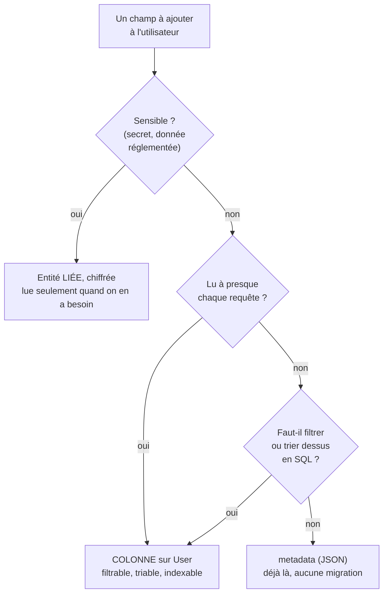

📍 [Documentation](../../../../../docs/README.md) › [@nodefony/user](index.md) › **Ajouter des champs**

# Ajouter tes champs à l'utilisateur

> La table des utilisateurs t'appartient : tu peux y ajouter ce que tu veux. Cette page dit **où**
> mettre chaque champ — sur la table, dans `metadata`, ou dans une entité liée — et pourquoi ce
> choix n'est pas une affaire de goût.

## Schéma général



## Lexique

| Terme                   | Ce que c'est                                                                                                                                    |
| ----------------------- | ----------------------------------------------------------------------------------------------------------------------------------------------- |
| **Contrat de colonnes** | La liste des colonnes que le framework LIT sur un utilisateur (`USER_COLUMNS`). Ton entité doit les porter ; tu ajoutes les tiennes par-dessus. |
| **Entité**              | La description, en TypeScript, d'une table. Celle de l'utilisateur vit dans TON application, sous `nodefony/entity/User.ts`.                    |
| **Migration**           | Un fichier SQL versionné qui fait passer la base d'un état au suivant. `orm:generate` l'écrit, `orm:migrate` l'applique.                        |
| **Dépôt** (repository)  | L'objet par lequel on lit et écrit des lignes. Il en existe deux ici : celui de l'identité (typé) et le générique (libre).                      |

## Qu'est-ce que c'est ?

Toute application finit par vouloir en dire plus sur ses utilisateurs que « qui es-tu et qu'as-tu le
droit de faire » : un service de rattachement, une langue préférée, un numéro de client, un
consentement daté. La question n'est jamais _est-ce possible_ — ça l'est toujours — mais **où** la
donnée doit vivre.

Le réflexe est d'ajouter une colonne à la table des utilisateurs. C'est souvent le bon geste, et
parfois le pire : cette table n'est pas une table comme les autres.

## La vision Nodefony

**La table des utilisateurs est relue à chaque requête portant une session authentifiée.** Ce n'est
pas un détail d'implémentation, c'est le cœur du modèle : une session ne transporte qu'un
identifiant, jamais l'utilisateur lui-même. À chaque requête, `SessionAuthenticator.authenticate()`
(`src/packages/@nodefony/security/nodefony/src/authenticator/SessionAuthenticator.ts:63`) redemande
l'identité vivante — `resolveSessionIdentity`
(`src/packages/@nodefony/security/nodefony/src/authenticator/SessionAuthenticator.ts:70`) — pour que
la désactivation d'un compte, un changement de rôle ou un verrouillage prennent effet
**immédiatement**, sans attendre l'expiration d'un jeton.

La conséquence est directe, et c'est elle qui décide de tout le reste : **toute colonne posée sur la
table des utilisateurs est ramenée en mémoire à chaque requête authentifiée.** Une colonne courte ne
se remarque pas. Un champ de texte libre, une pièce jointe encodée, un historique — si.

Et la même mécanique fait de cette table le pire endroit pour une donnée sensible : un numéro de
sécurité sociale posé là traverse le processus des milliers de fois par jour, apparaît dans les
vidages mémoire et les traces de débogage, sans qu'aucun de ces passages ait la moindre utilité.

## Les trois voies, et le critère qui les départage

| Voie                       | Quand la choisir                                                                          | Ce que ça coûte                                                        |
| -------------------------- | ----------------------------------------------------------------------------------------- | ---------------------------------------------------------------------- |
| **Une colonne sur `User`** | Le champ est court, non sensible, et tu veux **filtrer, trier ou indexer** dessus en SQL  | Relu à chaque requête authentifiée · une migration                     |
| **`metadata` (JSON)**      | Le champ est occasionnel, sans filtre ni tri SQL — une préférence d'affichage, un drapeau | Relu à chaque requête aussi · **aucune migration**, la colonne existe  |
| **Une entité liée**        | La donnée est **sensible**, volumineuse, historisée, ou lue seulement dans un écran dédié | Une table et une migration de plus · une jointure quand on en a besoin |

Le test qui tranche en une question : **cette donnée doit-elle être en mémoire à chaque requête ?**

- Un service de rattachement qui apparaît dans l'en-tête de toutes les pages : oui — **colonne**.
- Une préférence de thème sombre : elle voyage de toute façon, et rien ne la filtre — **`metadata`**.
- Un numéro de sécurité sociale, un IBAN, un document d'identité : **non**, et jamais — **entité
  liée**, et **chiffrée**.

### La donnée sensible ne se pose pas en clair

Quand une donnée réglementée doit vivre en base, le framework a son précédent : le secret d'un
second facteur est stocké **chiffré**, en blob opaque, jamais en clair — `totpSecretEntity`
(`src/packages/@nodefony/drizzle/nodefony/entity/totpSecretEntity.ts:41`). Reprends ce patron :
une entité dédiée, un blob chiffré, et une lecture qui n'a lieu qu'au moment où la donnée sert.

## Démarrage rapide (exemple minimal qui compile)

**Ne modifie pas `nodefony/entity/User.ts` à la main** : relance la commande avec tes champs, elle
réécrit l'entité avec les colonnes du contrat en clair, plus les tiennes.

```bash
npx nodefony create entity User department:string(100)? locale:string=fr
npx nodefony orm:generate --name champs_utilisateur
npx nodefony orm:migrate
```

Un champ **obligatoire** doit avoir une valeur par défaut (`locale:string=fr`) ou être **facultatif**
(`department:string(100)?`). Le framework crée des utilisateurs sans rien savoir de tes champs — au
semis d'un administrateur, à la première connexion par un fournisseur externe — et ces créations
échoueraient sur un champ obligatoire sans défaut.

Ensuite, dans un controller :

```typescript
import { Controller, controller, Get } from "@nodefony/framework";
import type { Context } from "@nodefony/http";
import type { IOrm, IRepository } from "@nodefony/orm-core";

interface IUserRow {
  id: string;
  identifier: string;
  department?: string | null;
  locale?: string;
}

@controller("/profil")
export default class ProfilController extends Controller {
  @Get("/")
  async profil(): Promise<Record<string, unknown>> {
    // `get` rend `null` quand le service n'est pas là : le dire, plutôt que
    // laisser une erreur de propriété sur `null` remonter à l'utilisateur.
    const orm = this.get<IOrm>("orm");
    if (!orm) {
      throw new Error("service « orm » absent du conteneur");
    }
    const users = orm.getRepository<IUserRow>("User");
    const moi = await users.findOne({
      identifier: String(this.context?.user ?? ""),
    });
    return { department: moi?.department ?? null, locale: moi?.locale ?? "fr" };
  }
}
```

## Lire et écrire tes champs — la porte

Il y a **deux** dépôts, et c'est volontaire.

- **En LECTURE, il n'y a rien à faire.** Le dépôt d'identité reporte sur l'utilisateur toute colonne
  qu'il ne connaît pas — `attachExtraColumns`
  (`src/packages/@nodefony/user/nodefony/src/userContract.ts:288`). Un champ ajouté à la table arrive
  donc sur l'objet utilisateur sans une ligne de code.
- **En ÉCRITURE, `IUserRepository` les refuse**, et c'est une garde, pas un manque : il est typé sur
  le contrat d'identité, et laisser écrire n'importe quoi par cette porte reviendrait à laisser un
  code d'authentification modifier des données métier. La porte des champs métier est le **dépôt
  générique** : `orm.getRepository("User")`.

## Pièges

| Symptôme                                                                | Cause                                                                                                      | Correction                                                                                           |
| ----------------------------------------------------------------------- | ---------------------------------------------------------------------------------------------------------- | ---------------------------------------------------------------------------------------------------- |
| Le démarrage refuse : « ne porte pas une colonne que le framework LIT » | Une colonne du contrat a disparu de ton entité — souvent en la réécrivant à la main                        | Relancer `nodefony create entity User …` avec tes champs : elle réécrit le contrat en entier         |
| `npx nodefony orm:migrate` échoue sur « contains null values »          | Un champ obligatoire sans défaut, sur une table qui porte déjà des comptes                                 | Lui donner un défaut (`role:string=membre`) ou le déclarer facultatif (`role:string?`)               |
| Sur MySQL, le même champ passe… et ne contient que du vide              | MySQL/MariaDB accepte `NOT NULL` sans défaut et remplit les lignes existantes de `''`, mode strict compris | Même correction : un défaut, ou facultatif. Ne jamais se fier au fait que « ça passe » sur un moteur |
| Ton champ est bien en base mais `IUserRepository` refuse de l'écrire    | C'est la garde de typage, pas un défaut                                                                    | Passer par `orm.getRepository("User")` — cf « la porte » ci-dessus                                   |
| La latence monte après l'ajout d'un champ                               | La colonne est ramenée en mémoire à chaque requête authentifiée                                            | La déplacer dans une entité liée, lue seulement quand elle sert                                      |

## Tests

Ce que le dépôt éprouve autour de ces gestes :

- **Contrat de colonnes** — `src/packages/@nodefony/drizzle/tests/unit/userContractParity.test.ts` et
  `src/packages/@nodefony/mongoose/tests/unit/userContractParity.test.ts` : la table produite rend le
  contrat en entier, sur les trois dialectes SQL et en document.
- **Refus au démarrage** — `src/packages/@nodefony/drizzle/tests/integration/user-contrat-colonnes.test.ts` :
  une entité d'application à qui manque une colonne fait échouer le démarrage, en nommant la colonne
  et son lecteur.
- **Évolutions sur base peuplée** — `src/packages/@nodefony/drizzle/tests/integration/user-migrations.e2e.test.ts` :
  ajout facultatif, ajout à valeur par défaut, ajout obligatoire sans défaut et retrait d'un champ,
  sur sqlite, PostgreSQL et MySQL, avec des comptes réels en base. Derrière `NF_RUN_CLI_BOOT=1`.
- **Champs métier de bout en bout** — `src/packages/@nodefony/mongoose/tests/integration/user-champs-metier.test.ts`.

## Pour aller plus loin

- ⬆️ **Retour au hub** : [@nodefony/user](index.md)
- [Le module `@nodefony/user`](index.md) — l'identité, ses contrats et son cycle de vie.
- [Les migrations de schéma](../../drizzle/docs/migrations.md) — écrire, éprouver et appliquer une
  migration.
