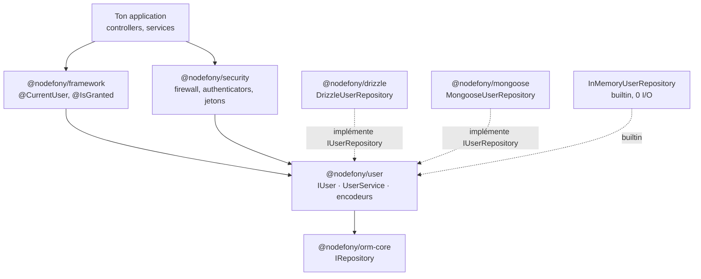
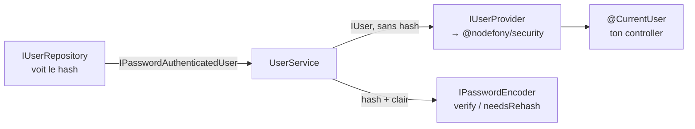
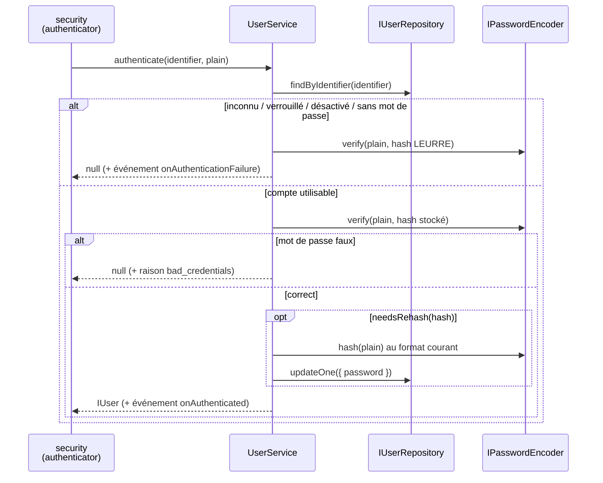
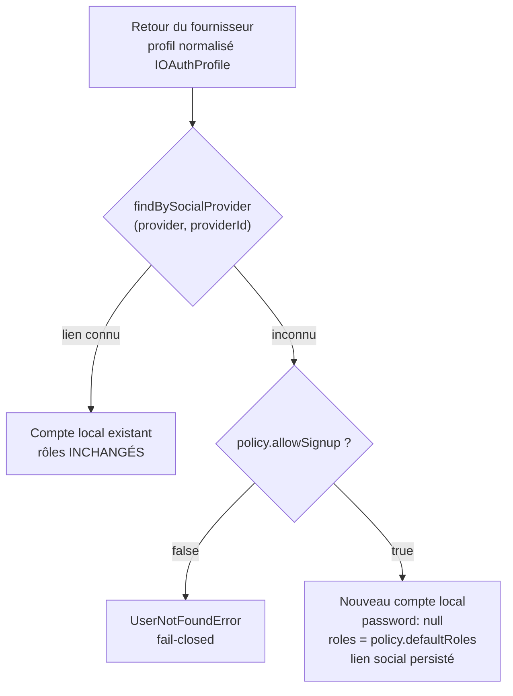

# @nodefony/user — l'identité, socle de toute la sécurité

> **Qui est cette personne, et comment son secret est-il rangé ?** Ce module répond à ces deux
> questions — et à rien d'autre. Il porte le contrat `IUser`, les classes de base, les encodeurs de
> mot de passe (Argon2id, bcrypt, encodeur migrant), le dépôt d'utilisateurs et le `UserService`.
> **Décider si on te laisse entrer** est le travail de [`@nodefony/security`](../../security/docs/index.md),
> qui consomme ce module — jamais l'inverse. Bibliothèque pure, sans ORM, sans serveur : elle
> s'importe et se teste sans démarrer quoi que ce soit.

📍 [Documentation](../../../../../docs/index.md) › **Identité (`@nodefony/user`)**

## 🧠 Schéma général — la place de l'identité

Le sens de lecture est celui des **dépendances** : chaque flèche va du consommateur vers ce qu'il
consomme. `@nodefony/user` est tout en bas — c'est ce qui lui permet d'être importé partout sans
tirer la couche web.



Deux conséquences pratiques :

1. Un module qui a seulement besoin **du type d'un utilisateur** (`framework`, `studio`, un adapter
   ORM, un futur module d'agents) importe `@nodefony/user` — un paquet léger, sans firewall.
2. `@nodefony/user` **ne peut pas** importer `http`, `framework` ou `security` : ce serait une
   inversion de dépendance, et le module deviendrait inutilisable seul.

## 📖 Lexique

| Terme                      | Sens                                                                                                  |
| -------------------------- | ----------------------------------------------------------------------------------------------------- |
| Identité                   | Qui est l'appelant (identifiant, rôles, état du compte). Ce module.                                   |
| Authentification (authn)   | Prouver cette identité (mot de passe, cookie, jeton). → `@nodefony/security`.                         |
| Autorisation (authz)       | Décider de ses droits une fois prouvée. → `@nodefony/security`.                                       |
| Credential                 | Le secret d'un compte. Ici : un **hash** de mot de passe, jamais le clair.                            |
| Hash / PHC                 | Empreinte à sens unique. Format PHC = `$argon2id$v=19$m=…,t=…,p=…$sel$empreinte`.                     |
| Argon2id                   | Fonction de dérivation **à mémoire dure** (RFC 9106) — recommandation OWASP/NIST courante.            |
| bcrypt                     | Fonction historique, toujours acceptée (limite de 72 octets, pas de coût mémoire).                    |
| Re-hash (`needsRehash`)    | Recalcul du hash au prochain login réussi quand ses paramètres sont dépassés.                         |
| Encodeur migrant           | Composite qui **lit** l'ancien format et **écrit** le nouveau → migration sans coupure.               |
| Repository                 | Le dépôt qui lit/écrit les utilisateurs. Seul composant qui voit le hash.                             |
| Provider (`IUserProvider`) | La source d'identité vue par la sécurité : « donne-moi l'utilisateur X » (lecture seule).             |
| Shadow User                | Ligne locale créée à la volée au premier login externe (OAuth) — l'identité reste chez toi.           |
| JIT                        | _Just-In-Time_ : provisionné au moment où on en a besoin, pas importé à l'avance.                     |
| OIDC                       | OpenID Connect — couche d'identité au-dessus d'OAuth 2 ; source des « claims » standard.              |
| Claim                      | Une information d'identité fournie par un tiers (`email`, `given_name`, `picture`…).                  |
| IDOR                       | _Insecure Direct Object Reference_ : viser l'objet d'autrui en changeant un identifiant dans l'URL.   |
| Énumération de comptes     | Déduire l'existence d'un compte par la différence de réponse (message, ou **temps**).                 |
| DTO                        | _Data Transfer Object_ : la projection publique d'une entité (ici, redactée par allowlist).           |
| Allowlist                  | Liste **fermée** de ce qui est permis (l'inverse d'une liste de blocage) — le défaut sûr.             |
| ALS                        | `AsyncLocalStorage` : le contexte de requête porté par le serveur, source de l'identité côté serveur. |
| Data plane                 | L'API JSON d'administration d'un module, sous `/nodefony/<module>/api/*`.                             |

## 🧭 Par où commencer

Trois parcours selon ce que tu viens faire. L'ordre compte : chaque étape suppose la précédente.

**Je monte l'authentification de mon app** — le chemin nominal, 15 minutes.

1. [Démarrage rapide](#-démarrage-rapide) — déclarer le service `users`, choisir l'encodeur, seeder
   un compte. C'est **ton application** qui décide où vivent ses utilisateurs, pas le framework.
2. [Firewall](../../security/docs/firewall.md) — déclarer les zones qui exigent une identité.
3. [Authenticators](../../security/docs/authenticators.md) — la session BFF web, et le fait que le
   **login est déjà fourni** (aucun `LoginController` à écrire).
4. [Autorisation](../../security/docs/authorization.md) — passer de « qui » à « a-t-il le droit ».

**Je fais migrer une base existante** — comptes déjà en bcrypt, ou venus d'un autre framework.

1. [Les encodeurs](#-les-briques-du-module) — comprendre `supports` / `hash` / `verify` / `needsRehash`.
2. [Configuration](#-configuration--choisir-et-faire-migrer-lencodeur) — déclarer la chaîne
   `argon2id` **puis** `bcrypt` : le nouveau format s'écrit, l'ancien se lit encore.
3. [Persistance](#entités-de-persistance-et-dialectes) — la forme attendue de la table/collection.
4. [Pièges](#-pièges-symptôme--cause--correction) — le piège de la migration inversée.

**J'ouvre un login social (« se connecter avec … »)** — et je ne veux pas offrir un compte admin.

1. [Le Shadow User](#-loauth-et-le-shadow-user--lidentité-reste-chez-toi) — pourquoi une ligne
   locale est créée même en authentification 100 % externe.
2. [OAuth2](../../security/docs/oauth2.md) — le protocole, les fournisseurs, la config côté sécurité.
3. [Sécurité](#-sécurité--ce-que-le-module-défend-vraiment) — les trois attaques prouvées par les
   bancs `oauth.attack.test.ts`.
4. [Profil](#le-profil-daffichage--des-claims-oidc-sous-allowlist) — pré-remplir nom/avatar depuis
   les claims du fournisseur, sans jamais laisser un tiers écrire tes rôles.

## 🗂️ Les briques du module

Le tableau pour choisir en cinq secondes ; les cards en dessous pour le détail.

| Brique                                       | Ce qu'elle résout                                            | Tu la touches quand…                               |
| -------------------------------------------- | ------------------------------------------------------------ | -------------------------------------------------- |
| `IUser`                                      | le contrat minimal d'un utilisateur (identité + rôles)       | tu typés un utilisateur, partout                   |
| `IPasswordAuthenticatedUser`                 | le même, **plus** le hash — contrat séparé                   | tu écris un authenticator ou un dépôt              |
| `BaseUser`                                   | l'implémentation POJO de référence                           | tu construis un utilisateur en mémoire ou en test  |
| `AnonymousUser` / `anonymousUser`            | le visiteur non authentifié, sans `null`                     | tu gères une route publique                        |
| `Argon2idEncoder` / `BcryptEncoder`          | ranger un mot de passe de façon coûteuse à casser            | tu choisis ta politique de hachage                 |
| `MigratingEncoder` / `encoderFromConfig()`   | changer d'algorithme sans réinitialiser les mots de passe    | tu reprends une base existante                     |
| `IUserRepository` / `InMemoryUserRepository` | lire/écrire des utilisateurs, quel que soit le stockage      | tu branches Drizzle, Mongo, ou rien du tout        |
| `UserService`                                | le CRUD + `authenticate()` + les événements de cycle de vie  | c'est le service que ton app expose sous `"users"` |
| `IUserProvider`                              | la source d'identité vue par la sécurité                     | tu branches un annuaire externe (LDAP, SSO)        |
| `IOAuthUserProvisioner`                      | créer la ligne locale au premier login social (Shadow User)  | tu ouvres un « se connecter avec … »               |
| `IUserProfile` + helpers                     | nom/prénom/avatar sous allowlist, hors du contrat d'identité | tu affiches un profil, tu acceptes un avatar       |
| `UserAdminApi`                               | le data plane `/nodefony/user/api/*` (Studio)                | tu administres des comptes                         |

```nodefony-cards
[
  { "icon": "📇", "title": "IUser", "href": "#-larchitecture-interne--trois-couches-étanches",
    "desc": "Le contrat minimal — cinq membres, pas un de plus : id (UUID), identifier (email ou login), roles (tableau plat), hasRole(), isActive(), isLocked(). Aucun credential, aucun champ de persistance : c'est LE type que manipulent le framework, les décorateurs, Studio et les adapters ORM.",
    "meta": "volontairement pauvre : plus il est petit, moins il coûte à faire circuler et à remplacer" },
  { "icon": "🔒", "title": "IPasswordAuthenticatedUser", "href": "#le-split-credential--le-hash-ne-circule-pas",
    "desc": "Le contrat qui voit le hash : une extension à un seul champ, readonly password. C'est la pièce d'architecture centrale — les consommateurs qui n'ont aucune raison de voir un credential (affichage, autorisation, logs) ne reçoivent que IUser.",
    "meta": "un mot de passe null est une valeur normale : un compte 100 % externe" },
  { "icon": "🧱", "title": "BaseUser", "href": "#-larchitecture-interne--trois-couches-étanches",
    "desc": "Le POJO de référence : il implémente IPasswordAuthenticatedUser et ajoute les champs anti-migration — socialProviders en JSON (jamais de colonnes googleId/githubId), metadata typée (jamais any), currentRole. Les mutateurs sont chaînables et l'état de compte s'exprime par des verbes : enable(), disable(), lock(), unlock().",
    "meta": "enabled et locked sont protected : on ne bascule pas un compte par affectation" },
  { "icon": "🚶", "title": "AnonymousUser", "href": "#le-visiteur-anonyme--un-utilisateur-pas-un-null",
    "desc": "Le visiteur, pas un trou : un singleton gelé avec un tableau de rôles gelé et partagé, donc zéro allocation par requête non authentifiée.",
    "meta": "le contexte n'est jamais null — un visiteur EST un utilisateur, porteur de ROLE_ANONYMOUS" },
  { "icon": "🔐", "title": "Argon2idEncoder", "href": "#-configuration--choisir-et-faire-migrer-lencodeur",
    "desc": "Le défaut, à mémoire dure : chaque vérification exige de la RAM en plus du CPU (19 MiB par défaut), ce qui ruine les attaques massivement parallèles.",
    "meta": "binding natif chargé au premier usage : instancier l'encodeur ne charge rien" },
  { "icon": "🕰️", "title": "BcryptEncoder", "href": "#-configuration--choisir-et-faire-migrer-lencodeur",
    "desc": "L'historique, toujours accepté : coût 12 par défaut, bornes techniques [4, 31]. À garder en lecture quand tu reprends une base existante.",
    "meta": "à ne plus choisir comme algorithme principal pour une nouvelle application" },
  { "icon": "🔄", "title": "MigratingEncoder", "href": "#-configuration--choisir-et-faire-migrer-lencodeur",
    "desc": "Changer d'algorithme sans casse : hash() écrit toujours au format principal, verify() route vers le premier encodeur qui reconnaît le hash stocké, needsRehash() est vrai dès que le hash n'est pas au format principal.",
    "meta": "chaque login réussi convertit un compte — la base bascule d'elle-même" },
  { "icon": "🧠", "title": "InMemoryUserRepository", "href": "#entités-de-persistance-et-dialectes",
    "desc": "Le dépôt qui n'écrit nulle part : implémentation complète d'IUserRepository sur une Map, sans ORM ni I/O. Dépôt de secours réel, fixture déterministe, et socle des mesures de charge — aucune synchronisation disque ne pollue le chiffre.",
    "meta": "ce n'est pas un bouchon : il applique tout le patch d'updateOne, comme un backend réel" },
  { "icon": "🧰", "title": "UserService", "href": "#-lapi-publique",
    "desc": "Le service que ton application expose : une spécialisation d'AbstractCrudService qui hérite du CRUD générique et n'ajoute que le spécifique credential — hachage à la création, changement de mot de passe, authenticate().",
    "meta": "implémente aussi IUserProvider, IPasswordVerifier et IOAuthUserProvisioner : la même instance est la source d'identité de la sécurité" },
  { "icon": "🛠️", "title": "UserAdminApi", "href": "#-observabilité--studio-et-data-plane",
    "desc": "L'administration des comptes : producteur du data plane /nodefony/user/api/* — liste paginée nativement, détail, création, modification, mot de passe, suppression, plus trois routes self-service.",
    "meta": "DTO redacté par construction, mutations auditées, garde-fous anti-verrouillage" }
]
```

## Qu'est-ce que c'est ? — l'identité n'est pas l'authentification

Prends un immeuble de bureaux. Il y a **le registre du personnel** (qui travaille ici, quel service,
badge actif ou désactivé) et il y a **le poste de garde** (qui vérifie le badge à l'entrée et décide
qui monte au 4ᵉ étage). Ce sont deux métiers différents, tenus par deux équipes différentes.

- `@nodefony/user` = **le registre**. Il sait qui existe, quels rôles chacun porte, si le compte est
  actif ou verrouillé, et il range les secrets dans un coffre.
- `@nodefony/security` = **le poste de garde**. Il lit le badge (cookie, jeton, clé d'API), interroge
  le registre, et applique la politique d'accès.

Séparer les deux n'est pas une coquetterie : c'est ce qui permet à un module qui affiche un nom
d'utilisateur — ou à un futur module d'agents — d'importer un paquet de contrats et deux classes,
sans embarquer un pare-feu applicatif, un moteur de jetons et une pile OAuth.

> [!IMPORTANT]
> Tout ce qui relève du **firewall**, des **authenticators**, des **jetons**, du **CSRF** ou des
> **voters** vit dans [`@nodefony/security`](../../security/docs/index.md). Si tu cherches « comment
> protéger une route », tu es sur la mauvaise page.

## La vision Nodefony

### Trois couches étanches

L'utilisateur n'est pas UNE classe : c'est un contrat, une implémentation partagée, et des entités
par ORM. Chaque couche a le droit d'ignorer la suivante.

| Couche            | Quoi                            | Qui l'utilise                                        |
| ----------------- | ------------------------------- | ---------------------------------------------------- |
| ① Contrat strict  | `IUser` (`IUser.ts:31`)         | framework, décorateurs, Studio, agents — **partout** |
| ② POJO partagé    | `BaseUser` (`BaseUser.ts:44`)   | tests, fixtures, dépôt mémoire, mapping des adapters |
| ③ Entités par ORM | table Drizzle / schéma Mongoose | uniquement l'adapter concerné                        |

Un adapter ORM n'expose jamais sa classe à l'application : il rend du `BaseUser` (ou tout ce qui
satisfait le contrat). Changer de base de données ne change donc **rien** en amont.

### Le split credential — le hash ne circule pas

C'est la décision la plus structurante du module, et elle tient en une ligne : **le contrat de base
ne porte pas le mot de passe**.



- Le **repository** est la frontière de persistance : il lit et écrit le hash, par nature
  (`IUserRepository.ts:42`).
- L'**encodeur** est le seul autre composant à le manipuler (`IPasswordEncoder.ts:11`).
- Tout ce qui est **en aval** — provider, décorateurs, DTO, logs — reçoit `IUser`, sans credential
  (`IUserProvider.ts:14`).

Le bénéfice n'est pas théorique : `@nodefony/security` tape sur un contrat typé plutôt que de faire
un `as any` sur un objet dont il espère qu'il porte un champ `password`. Zéro downcast, zéro fuite
par distraction dans une sérialisation.

### Le visiteur anonyme — un utilisateur, pas un `null`

Sur une route publique, la question « qui appelle ? » a quand même une réponse : personne
d'identifié. Nodefony matérialise ce « personne » plutôt que de rendre `null`.

```ts ignore
// @CurrentUser() rend TOUJOURS un IUser — jamais null. Pas de `?.` défensif partout.
if (user.hasRole(ROLE_ANONYMOUS)) {
  return this.renderJson({ greeting: "Bonjour, visiteur" });
}
```

Le singleton est **gelé** et son tableau de rôles aussi, partagé entre toutes les requêtes
(`AnonymousUser.ts:8`) : sur une route publique très sollicitée, une requête anonyme n'alloue
strictement rien pour représenter son utilisateur.

## 🚀 Démarrage rapide

Objectif : dans une app générée par `nodefony create app`, déclarer d'où viennent les utilisateurs,
choisir comment leurs mots de passe sont rangés, créer un compte et le retrouver.

### 1. Choisir l'encodeur (`nodefony.config.ts`)

L'encodeur ne se configure pas dans ce module : il est **dérivé de la config sécurité**, parce que
c'est une politique de sécurité. Le firewall lit la section `encoders` et pose le service
`passwordEncoder` dans le container (`service/firewall.ts:344`).

```typescript
// nodefony.config.ts — extrait du manifeste `modules`
use("@nodefony/security", {
  // L'ORDRE fait tout : la 1re entrée est l'encodeur PRINCIPAL (elle écrit tous
  // les nouveaux hashs) ; les suivantes sont des formats LEGACY acceptés en
  // lecture seule. Un login réussi sur un hash legacy le réécrit au format
  // principal — la base migre d'elle-même, sans réinitialisation de mot de passe.
  encoders: {
    default: { type: "argon2id" }, // défauts OWASP : m=19 MiB, t=3, p=1
    legacy: { type: "bcrypt", rounds: 12 }, // à retirer quand plus aucun hash bcrypt
  },
});
```

> [!NOTE]
> Sans section `encoders`, le défaut du schéma Zod est **déjà** un Argon2id sûr
> (`security/nodefony/config/config.ts:892`). Tu ne déclares cette section que pour ajouter un format
> legacy, ou pour ajuster les coûts.

### 2. Déclarer le service `users` (`nodefony/security/provisionUsers.ts`)

`@nodefony/security` sait **authentifier** ; c'est ton application qui décide **qui** sont ses
utilisateurs et **où** ils vivent. Le scaffold écrit ce fichier pour toi — le voici en version
minimale, sans ORM.

```typescript
// nodefony/security/provisionUsers.ts — dépôt mémoire, zéro base de données
import type { Module } from "nodefony";
import { InMemoryUserRepository, UserService } from "@nodefony/user";
import type { IPasswordEncoder } from "@nodefony/user";

/** Identifiant du compte d'amorçage créé au premier démarrage. */
export const ADMIN_IDENTIFIER = "admin";

export async function provisionUsers(module: Module): Promise<void> {
  const container = module.container;
  // Idempotent : ne JAMAIS remplacer un annuaire déjà posé (double boot, tests).
  if (!container || container.has("users")) {
    return;
  }

  // L'encodeur vient du firewall (section `encoders` ci-dessus). Son absence
  // signifie que @nodefony/security n'est pas chargé → échec franc, jamais un
  // repli muet sur un hachage plus faible.
  const encoder = container.get<IPasswordEncoder>("passwordEncoder");
  if (!encoder) {
    throw new Error(
      `provisionUsers: service "passwordEncoder" absent — @nodefony/security ` +
        `est-il dans le manifeste modules de nodefony.config.ts ?`,
    );
  }

  // Le service exposé sous le nom "users" EST la source d'identité du firewall.
  const users = new UserService(new InMemoryUserRepository([]), encoder);
  container.set("users", users);

  // Seed idempotent : createUser hache le clair, jamais stocké tel quel.
  if (!(await users.findByIdentifier(ADMIN_IDENTIFIER))) {
    await users.createUser({
      identifier: ADMIN_IDENTIFIER,
      plainPassword: "change-me-now",
      roles: ["ROLE_ADMIN", "ROLE_NODEFONY_ADMIN"],
    });
  }
}
```

Le hook s'appelle depuis l'`index.ts` du module applicatif : `await provisionUsers(this)` dans
`onKernelReady`. Le scaffold pose ce câblage.

> [!WARNING]
> Ce dépôt mémoire est **volatil** : les comptes ne survivent pas au redémarrage. Pour une vraie
> base, remplace `new InMemoryUserRepository([])` par `DrizzleUserRepository.from(orm)` — le contrat
> est identique, rien d'autre ne bouge. Voir [Persistance](#entités-de-persistance-et-dialectes).

### 3. Lire et modifier l'identité depuis un controller

```typescript
// nodefony/controllers/AccountController.ts
import {
  Controller,
  controller,
  Get,
  Post,
  Body,
  CurrentUser,
} from "@nodefony/framework";
import type { ContextType } from "@nodefony/http";
import type { IUser, UserService } from "@nodefony/user";
import { nodefonyError } from "nodefony";

@controller("/api/account")
class AccountController extends Controller {
  private users: UserService | null = null;

  constructor(context: ContextType) {
    super("account", context);
  }

  async initialize(): Promise<this> {
    // Le service posé par provisionUsers, résolu depuis le container.
    this.users = this.get<UserService>("users");
    return this;
  }

  // @CurrentUser rend TOUJOURS un IUser (anonyme compris) — jamais null.
  @Get("/me")
  me(@CurrentUser() user: IUser) {
    return { identifier: user.identifier, roles: user.roles };
  }

  @Post("/password")
  async changePassword(
    @CurrentUser() user: IUser,
    @Body("current") current: string,
    @Body("next") next: string,
  ) {
    // Re-authentification OBLIGATOIRE : une session volée ne doit pas suffire
    // à changer le mot de passe (OWASP). authenticate() rend null sans dire
    // pourquoi — la raison fine part dans les événements, jamais au client.
    const authed = await this.users?.authenticate(user.identifier, current);
    if (!authed) {
      throw new nodefonyError("current password is incorrect", 403);
    }
    // La cible est l'id issu du re-auth, jamais un paramètre du client (anti-IDOR).
    await this.users?.changePassword(authed.id, next);
    return { ok: true };
  }
}

export default AccountController;
```

### Ce qu'on observe

```bash
# 1) Route publique : l'utilisateur anonyme est un utilisateur
curl -s http://localhost:5151/api/account/me
# {"identifier":"anon.","roles":["ROLE_ANONYMOUS"]}

# 2) Après login BFF (fourni par @nodefony/security) : l'identité réelle
curl -s -b /tmp/jar http://localhost:5151/api/account/me
# {"identifier":"admin","roles":["ROLE_ADMIN","ROLE_NODEFONY_ADMIN"]}

# 3) Mauvais mot de passe actuel → 403, sans indiquer pourquoi
curl -s -o /dev/null -w '%{http_code}\n' -b /tmp/jar \
  -H 'Content-Type: application/json' \
  -d '{"current":"nope","next":"un-mot-de-passe-long"}' \
  http://localhost:5151/api/account/password
# 403
```

## 🏗️ L'architecture interne — trois couches étanches

### Le parcours d'une authentification par mot de passe



Deux invariants s'y cachent. **Tous** les chemins d'échec consomment exactement une vérification de
hash, y compris ceux qui n'ont aucun hash réel à vérifier (`UserService.ts:198`) — c'est ce qui
interdit de deviner l'existence d'un compte au chronomètre
([détail](#-sécurité--ce-que-le-module-défend-vraiment)). Et le **re-hash est transparent** : il a
lieu au seul moment où le mot de passe en clair existe côté serveur, un login réussi.

### L'ordre des vérifications

`locked` → `disabled` → `no_password` → `bad_credentials`. Cet ordre est fixé
(`UserService.ts:212`), mais il n'est pas observable de l'extérieur : la valeur de retour est `null`
dans tous les cas, et la raison précise part dans l'événement `onAuthenticationFailure` — donc dans
l'audit serveur, jamais dans la réponse.

### Les événements du cycle de vie

| Événement                 | Émis quand                                    | Charge utile             |
| ------------------------- | --------------------------------------------- | ------------------------ |
| `onCreated`               | création (CRUD hérité)                        | l'utilisateur créé       |
| `onUpdated`               | mise à jour générique                         | l'utilisateur mis à jour |
| `onDeleted`               | suppression                                   | l'utilisateur supprimé   |
| `onPasswordChanged`       | `changePassword()` **ou** re-hash transparent | l'utilisateur            |
| `onAuthenticated`         | authentification réussie                      | l'utilisateur            |
| `onAuthenticationFailure` | tout échec                                    | identifiant + raison     |

`onPasswordChanged` est délibérément distinct d'`onUpdated` (`UserService.ts:168`) : un changement de
credential n'est pas une modification banale, et un abonné (audit, notification, invalidation de
sessions) doit pouvoir le traiter à part.

## 🧰 L'API publique

Les signatures exactes vivent dans le graphe généré — `jq '.symbols.UserService' .ai/symbols.json` —
et ne sont jamais recopiées ici (elles divergeraient). Ce tableau donne l'**usage**.

### Contrats

| Contrat                      | Ce qu'il promet                                               | Ancre                         |
| ---------------------------- | ------------------------------------------------------------- | ----------------------------- |
| `IUser`                      | identité + rôles plats, sans credential                       | `IUser.ts:31`                 |
| `IPasswordAuthenticatedUser` | idem + `password: string \| null`                             | `IUser.ts:72`                 |
| `ISocialProvider`            | un lien vers un compte externe (`provider`/`providerId`)      | `IUser.ts:9`                  |
| `IUserRepository`            | CRUD portable + finders métier + pagination native            | `IUserRepository.ts:42`       |
| `IUserListQuery`             | filtres de listing (`role`, `enabled`, `q`) + fenêtre de page | `IUserRepository.ts:19`       |
| `IUserProvider`              | source d'identité : **lève** si introuvable, jamais `null`    | `IUserProvider.ts:14`         |
| `IPasswordVerifier`          | valide un couple identifiant/mot de passe, rend un verdict    | `IPasswordVerifier.ts:15`     |
| `IPasswordEncoder`           | `supports`/`hash`/`verify`/`needsRehash`                      | `IPasswordEncoder.ts:11`      |
| `IPasswordBlocklist`         | point d'extension « ce mot de passe est-il compromis ? »      | `IPasswordBlocklist.ts:12`    |
| `IOAuthProfile`              | profil normalisé issu d'un fournisseur, **sans aucun jeton**  | `IOAuthUserProvisioner.ts:12` |
| `IOAuthProvisionPolicy`      | rôles par défaut + autorisation de création à la volée        | `IOAuthUserProvisioner.ts:37` |
| `IOAuthUserProvisioner`      | crée la ligne locale au premier login externe                 | `IOAuthUserProvisioner.ts:61` |
| `IUserProfile`               | claims OIDC d'affichage, sous allowlist                       | `IUserProfile.ts:15`          |

### Le repository — quatre méthodes qui comptent

`IUserRepository` étend `IRepository` d'[`@nodefony/orm-core`](../../orm-core/docs/index.md) et
ajoute quatre accès que le `Criteria` générique ne sait pas exprimer.

| Méthode                  | Rôle                                                            | Ancre                   |
| ------------------------ | --------------------------------------------------------------- | ----------------------- |
| `findByIdentifier()`     | retrouver par email/login — le chemin du login                  | `IUserRepository.ts:49` |
| `findBySocialProvider()` | retrouver par lien externe — le chemin OAuth                    | `IUserRepository.ts:60` |
| `listPage()`             | listing **paginé au store** (jamais un `find()` complet en RAM) | `IUserRepository.ts:78` |
| `countActiveAdmins()`    | `COUNT` natif — le garde-fou anti-verrouillage                  | `IUserRepository.ts:88` |

> [!IMPORTANT]
> `listPage()` n'est pas un confort : c'est la règle mémoire du framework appliquée aux utilisateurs.
> Les filtres `role` (appartenance dans un tableau JSON), `enabled` et `q` (sous-chaîne insensible à
> la casse) descendent **dans le backend**. Charger 200 000 comptes en RAM pour en afficher 50 est
> exactement ce que ce contrat interdit.

### Le service

| Appel                                | Ce qu'il fait                                                 | Ancre                |
| ------------------------------------ | ------------------------------------------------------------- | -------------------- |
| `createUser()`                       | hache le clair puis délègue au `create` générique             | `UserService.ts:106` |
| `findByIdentifier()`                 | lecture directe par identifiant fonctionnel                   | `UserService.ts:129` |
| `listPage()` / `countActiveAdmins()` | façades vers le dépôt (pagination et garde-fou)               | `UserService.ts:143` |
| `changePassword()`                   | hache et persiste, émet `onPasswordChanged`                   | `UserService.ts:168` |
| `authenticate()`                     | vérifie, nivelle le temps, re-hache si besoin                 | `UserService.ts:198` |
| `loadUserByIdentifier()`             | `IUserProvider` — **lève** `UserNotFoundError` si absent      | `UserService.ts:256` |
| `loadUserByOAuth()`                  | `IUserProvider` — lit un lien social, ne crée jamais          | `UserService.ts:271` |
| `refreshUser()`                      | recharge depuis la source (rôles frais, révocation immédiate) | `UserService.ts:285` |
| `provisionOAuthUser()`               | Shadow User : lit, ou crée si la politique l'autorise         | `UserService.ts:306` |
| `passwordBlocklist`                  | champ opt-in — branche ta liste de mots de passe compromis    | `UserService.ts:83`  |

**La distinction à retenir** : `loadUserByOAuth()` **lit** (et lève si le lien est inconnu) ;
`provisionOAuthUser()` **écrit** (et crée le compte). Deux contrats, deux responsabilités — c'est ce
qui permet de brancher un provisionnement maison sans réécrire la lecture.

### Les erreurs

| Erreur              | Code | Levée par                                                 | Ancre                     |
| ------------------- | ---- | --------------------------------------------------------- | ------------------------- |
| `UserNotFoundError` | 404  | les méthodes `IUserProvider`, et le provisionnement fermé | `UserNotFoundError.ts:13` |
| `WeakPasswordError` | 400  | `createUser`/`changePassword` si la blocklist refuse      | `WeakPasswordError.ts:10` |

`UserNotFoundError` porte un détail (`identifier "x"`, `social github:42`) destiné aux **logs
serveur**. Les authenticators de sécurité la convertissent en 401 générique : la distinction
« identifiant inconnu » / « mauvais mot de passe » ne doit jamais atteindre le client.

## ⚙️ Configuration — choisir et faire migrer l'encodeur

Un mot de passe ne se chiffre pas, il se **dérive** : on stocke une empreinte que l'on sait
recalculer mais pas inverser. Tout l'enjeu est de rendre ce calcul cher **pour l'attaquant** sans le
rendre insupportable pour ton serveur.

### Argon2id ou bcrypt ?

| Critère                     | `Argon2idEncoder` (défaut)             | `BcryptEncoder` (legacy)                |
| --------------------------- | -------------------------------------- | --------------------------------------- |
| Norme                       | RFC 9106                               | de facto                                |
| Coût mémoire                | **oui** — 19 MiB/hash par défaut       | non                                     |
| Résistance GPU/ASIC         | forte (la RAM est le goulot)           | moyenne                                 |
| Limite de longueur d'entrée | aucune                                 | **72 octets** (silencieusement tronqué) |
| Paramètres                  | `memoryKiB`, `timeCost`, `parallelism` | `rounds` (4–31)                         |
| Binding natif               | `@node-rs/argon2` (peer optionnelle)   | `@node-rs/bcrypt` (peer optionnelle)    |
| Détection du format         | préfixe PHC `$argon2id$`               | préfixe `$2a$`/`$2b$`/`$2y$`            |

Les deux bindings sont des **peer dependencies optionnelles** chargées par import dynamique au
premier `hash`/`verify` (`Argon2idEncoder.ts:10`) : une app qui n'authentifie que par OAuth ou par
jeton ne les charge jamais.

> [!TIP]
> **Pourquoi `DEFAULT_TIME_COST` vaut 3 et non le minimum OWASP `t=2`** (`Argon2idEncoder.ts:39`) : une passe
> de plus renchérit l'attaquant d'environ 50 % **sans augmenter la RAM par hash**. Or c'est la
> mémoire, multipliée par le nombre de hachages simultanés, qui est le vrai budget anti-déni de
> service. Durcir par `t` est l'ajustement le moins risqué.

### Migrer d'un algorithme à l'autre — le besoin vécu

Tu reprends une application dont les 40 000 mots de passe sont en bcrypt. Tu veux passer à Argon2id.
Tu ne peux pas convertir la base hors ligne : les hashs ne sont pas réversibles, et les mots de passe
en clair n'existent **qu'au moment d'un login**. Tu refuses de forcer 40 000 réinitialisations.

### La config qui y répond

```ts ignore
use("@nodefony/security", {
  encoders: {
    // 1re entrée = PRINCIPAL : tout nouveau hash sera de cette forme.
    modern: { type: "argon2id", memoryKiB: 19456, timeCost: 3, parallelism: 1 },
    // suivantes = LEGACY, acceptées en lecture seule.
    historique: { type: "bcrypt", rounds: 12 },
  },
});
```

`encoderFromConfig()` traduit cette liste ordonnée en encodeur exécutable
(`encoderFromConfig.ts:56`) : une seule entrée → l'encodeur seul ; plusieurs entrées → un
`MigratingEncoder` ; liste vide → un Argon2id aux défauts OWASP (repli sûr, jamais rien de plus
faible).

### Le comportement observable

| Le hash stocké commence par     | `verify()` | `needsRehash()` | Au prochain login réussi        |
| ------------------------------- | ---------- | --------------- | ------------------------------- |
| `$argon2id$` aux coûts courants | argon2id   | `false`         | rien                            |
| `$argon2id$` à coûts inférieurs | argon2id   | `true`          | ré-écrit aux coûts courants     |
| `$2b$12$`                       | bcrypt     | `true`          | **converti en argon2id**        |
| format inconnu de tous          | `false`    | `true`          | échec (credential invérifiable) |

Chaque connexion réussie convertit un compte. Le jour où plus aucun `$2b$` ne subsiste en base, tu
retires l'entrée `historique` — et c'est tout.

Le verdict de re-hachage se lit **dans le format PHC**, sans jamais avoir besoin du mot de passe en
clair (analyse synchrone et gratuite) : variante autre que `id`, version antérieure à `0x13` ou coûts
**inférieurs** aux coûts courants pour Argon2id (`Argon2idEncoder.ts:153`) ; coût inférieur pour
bcrypt (`BcryptEncoder.ts:90`) ; format non principal pour le composite (`MigratingEncoder.ts:83`).
Des coûts **supérieurs** ne déclenchent rien — on ne rétrograde jamais une politique déjà renforcée.

> [!CAUTION]
> **Le piège inverse.** Écrire `{ historique: { type: "bcrypt" }, modern: { type: "argon2id" } }`
> fait de bcrypt le principal : tes hashs Argon2id seront jugés « legacy » et **rétrogradés** en
> bcrypt à chaque login. La première entrée est toujours la cible, jamais l'origine.

### Le tableau des paramètres

Dérivé du schéma Zod de la section `encoders` (`security/nodefony/config/config.ts:35`) — la source
unique des bornes et des défauts.

| Option        | Type                     | Défaut     | Bornes    | Effet                                            |
| ------------- | ------------------------ | ---------- | --------- | ------------------------------------------------ |
| `type`        | `"argon2id" \| "bcrypt"` | `argon2id` | —         | l'algorithme                                     |
| `memoryKiB`   | entier                   | `19456`    | `≥ 19456` | Argon2id : RAM par hachage (19 MiB = min. OWASP) |
| `timeCost`    | entier                   | `3`        | `≥ 2`     | Argon2id : nombre de passes                      |
| `parallelism` | entier                   | `1`        | `≥ 1`     | Argon2id : lanes (chacune alloue `memoryKiB`)    |
| `rounds`      | entier                   | `12`       | `10..15`  | bcrypt : coût. Ignoré par Argon2id               |

Le schéma **empêche** de descendre sous les minimums OWASP au boot : une config trop faible est
rejetée avant que le serveur n'accepte la moindre requête. Les encodeurs, eux, ne valident que les
bornes techniques de l'algorithme (`Argon2idEncoder.ts:76`) — c'est ce qui permet aux tests
d'utiliser des coûts bas et rapides sans affaiblir la politique de production.

## 🔐 L'OAuth et le Shadow User — l'identité reste chez toi

### Le besoin vécu

Tu ajoutes « se connecter avec GitHub ». La tentation est de faire confiance à GitHub pour tout :
l'identité, l'email… et les droits. C'est l'erreur.

**OAuth authentifie, il n'autorise pas.** Le fournisseur atteste que la personne contrôle un compte
chez lui. Ce qu'elle a le droit de faire **chez toi** ne se décide que chez toi.

### La réponse Nodefony : une ligne locale, toujours



Le compte local est le **Shadow User** : ton application garde sa propre ligne, avec ses propres
rôles, son propre état actif/verrouillé. Le fournisseur n'est qu'une façon de prouver qu'on est bien
la personne rattachée à cette ligne (`UserService.ts:306`).

### Trois invariants, et pourquoi ils existent

1. **Aucune liaison automatique par email.** Un compte externe non lié donne **toujours** un nouvel
   utilisateur, même si son email est identique à celui d'un compte local. Un email non vérifié — ou
   vérifié chez un fournisseur laxiste — serait sinon un vecteur direct de prise de contrôle : je
   crée un compte GitHub avec l'email de ton admin, je me connecte, j'hérite de ses droits. Le
   rattachement d'un compte externe à un compte existant se fait explicitement, **utilisateur déjà
   connecté**.
2. **Les rôles ne sont écrits qu'à la création.** Un re-login ne réapplique jamais
   `policy.defaultRoles` : si tu as retiré un rôle à quelqu'un, se reconnecter ne le lui rend pas
   (`IOAuthUserProvisioner.ts:58`).
3. **Les comptes sont séparés par fournisseur.** `google:777` et `github:777` sont deux identités
   distinctes — la recherche porte sur la **paire** `(provider, providerId)`.

Ces trois points ne sont pas des intentions : ils sont **prouvés** par le banc d'attaque
`oauth.attack.test.ts:69` (`A1` collision d'email, `A2` élévation par re-login, `A3` collision
d'identifiant entre fournisseurs).

### L'identifiant du Shadow User

`profile.email` s'il existe, sinon la clé stable `provider:providerId` (`UserService.ts:325`). Un
fournisseur qui n'expose pas d'email ne bloque donc pas la connexion, et deux fournisseurs ne peuvent
pas produire le même identifiant fonctionnel.

### Le profil d'affichage — des claims OIDC sous allowlist

Nom, prénom, avatar, locale : ce sont des données d'**affichage**, pas d'identité. Elles vivent dans
`metadata.profile`, jamais dans des colonnes dédiées (`IUserProfile.ts:15`), et six clés seulement
sont reconnues (`userProfile.ts:11`).

Au provisionnement, ces champs sont pré-remplis depuis les claims du fournisseur — **une seule fois,
à la création** : un login ultérieur n'écrase jamais ce que l'utilisateur a édité depuis.
`profileFromClaims()` valide **champ par champ** (`userProfile.ts:192`) : un claim mal formé est
ignoré sans faire échouer la connexion, ni jeter les autres champs.

> [!WARNING]
> **Un avatar est du contenu hostile.** `picture` accepte une URL `http(s)` ou une data URL image,
> mais uniquement `png`/`jpeg`/`webp` en base64 strict, plafonnée à 128 Ko
> (`userProfile.ts:51`). **Le SVG est exclu par construction** : un SVG embarque du script, donc
> afficher l'avatar d'un inconnu exécuterait son code (XSS). Le GIF est exclu pour le poids et
> l'animation.

## 🧩 Extension — brancher ses propres pièces

Le module fournit des points d'extension plutôt que des configurations. Chacun est un contrat que tu
implémentes ; rien à déclarer ailleurs.

### Son propre dépôt

Implémente `IUserRepository` et passe-le au `UserService`. Les adapters livrés
(`DrizzleUserRepository`, `MongooseUserRepository`) ne sont rien d'autre que cela — et
`InMemoryUserRepository` est l'implémentation de référence à lire pour comprendre le contrat
(`InMemoryUserRepository.ts:35`).

**Trois pièges à ne pas reproduire**, appris en écrivant le dépôt mémoire :

- `updateOne` doit appliquer **tous** les champs du patch, pas seulement ceux qui t'arrangent —
  c'est le rôle de `#apply()` (`InMemoryUserRepository.ts:130`). N'en honorer qu'une partie fait un
  dépôt qui ment : un `{ enabled: false }` semble réussir sans rien désactiver.
- `create` doit persister `socialProviders`, `enabled` et `locked` — sinon le second login OAuth ne
  retrouve pas le compte et crée un doublon.
- `listPage` doit filtrer **au store**, avec un tri déterministe par défaut (`identifier ASC`) :
  sans ordre stable, la pagination par décalage saute et répète des lignes.

Un **banc de contrat unique** (`tests/support/userPaginationContract.ts:54`) valide ces invariants
sur n'importe quel backend : importe-le depuis ton paquet et branche ton harnais. Un écart entre
deux stores devient un échec de test, pas une surprise en production.

### Sa propre source d'identité

Un annuaire LDAP, un SSO maison ? Implémente `IUserProvider` (`IUserProvider.ts:14`) : la sécurité ne
connaît que ce contrat. Sémantique à respecter — **lever**, jamais rendre `null` : l'absence
d'identité est un échec explicite, pas une valeur.

Si tu veux seulement valider un couple identifiant/mot de passe contre un système externe, le contrat
plus étroit `IPasswordVerifier` suffit (`IPasswordVerifier.ts:15`).

### Sa liste de mots de passe compromis

Le NIST (SP 800-63B §5.1.1.2) recommande de refuser les mots de passe connus des fuites. Le framework
fournit le **point d'extension**, pas la liste : la source (top 10 000 embarqué, fichier
d'exploitation, API k-anonymity) est une décision de déploiement.

```ts ignore
users.passwordBlocklist = {
  async isBlocked(plain) {
    return TOP_10K.has(plain.toLowerCase());
  },
};
```

Consultée à la **création** et au **changement**, jamais au login (`UserService.ts:359`) : au login,
le clair n'est plus jugeable contre une politique, et refuser une connexion existante enfermerait
l'utilisateur dehors. Un refus lève `WeakPasswordError` (400), avec un message générique.

### Son propre provisionnement OAuth

Implémente `IOAuthUserProvisioner` (`IOAuthUserProvisioner.ts:61`). La capability est **duck-typée**
par `@nodefony/security` : si tu poses la tienne, elle est utilisée ; sinon, celle de `UserService`
s'applique. C'est là qu'on branche une politique métier (rôles déduits d'un domaine d'email,
rattachement à un tenant, refus d'un fournisseur pour certains comptes).

## Entités de persistance et dialectes

Le module ne persiste **rien** par lui-même : il définit la forme, les adapters la déclinent.

### Les colonnes attendues

| Champ             | Type logique     | Drizzle (SQL)         | Mongoose                 | Rôle                                |
| ----------------- | ---------------- | --------------------- | ------------------------ | ----------------------------------- |
| `id`              | UUID (`string`)  | `text` clé primaire   | `_id` + virtuel `id`     | identifiant interne                 |
| `identifier`      | `string`         | `text` unique         | `String` unique+index    | email ou login                      |
| `password`        | `string \| null` | `text` nullable       | `String` défaut `null`   | hash — `null` = compte externe      |
| `roles`           | `string[]`       | `json` non nul        | `[String]`               | rôles **plats**                     |
| `enabled`         | `boolean`        | `bool` non nul        | `Boolean` défaut `true`  | `isActive()`                        |
| `locked`          | `boolean`        | `bool` non nul        | `Boolean` défaut `false` | `isLocked()`                        |
| `currentRole`     | `string \| null` | `text` nullable       | `String` défaut `null`   | profil de rôle actif en session     |
| `socialProviders` | tableau JSON     | `json` non nul        | `Array`                  | liens externes — **anti-migration** |
| `metadata`        | objet JSON       | `json` non nul        | `Object`                 | extras applicatifs + `profile`      |
| `createdAt`       | date             | `dateMs` non nul      | `timestamps: true`       | création                            |
| `updatedAt`       | date             | `dateMs` + `onUpdate` | `timestamps: true`       | dernière modification               |

Sources : `USER_TABLE_SPEC` (`drizzle/nodefony/entity/userTable.ts:32`) et `userSchema`
(`mongoose/nodefony/entity/userEntity.ts:19`).

> [!TIP]
> **Pourquoi `socialProviders` est du JSON et non des colonnes `googleId`, `githubId`…** Parce
> qu'ajouter un fournisseur ne doit demander **aucune migration de schéma**. Le prix à payer est une
> recherche par appartenance (`$elemMatch` en Mongo, containment JSON en SQL) : c'est exactement ce
> que `findBySocialProvider()` encapsule.

### Les backends pris en charge

| Backend                                              | Dépôt                    | Statut                                        |
| ---------------------------------------------------- | ------------------------ | --------------------------------------------- |
| Mémoire                                              | `InMemoryUserRepository` | **builtin** — toujours disponible, volatil    |
| SQL via [Drizzle](../../drizzle/docs/index.md)       | `DrizzleUserRepository`  | référence — sqlite, PostgreSQL, MySQL/MariaDB |
| MongoDB via [Mongoose](../../mongoose/docs/index.md) | `MongooseUserRepository` | pris en charge                                |

Il n'y a **pas** de dépôt utilisateur Redis : Redis est un magasin de sessions et de jetons, pas un
annuaire d'identités interrogeable par rôle et par sous-chaîne.

Le choix du backend n'est pas résolu automatiquement — contrairement aux stores de session ou de
jetons. C'est **l'application** qui construit son dépôt (voir le
[Démarrage rapide](#-démarrage-rapide)). Un registre déclaratif énumère ce qui est branchable pour
l'écran Studio « Stores » (`userStoreRegistry.ts:23`), sans jamais rien sélectionner.

## 🧑‍⚖️ Rôles — deux échelles, et où s'arrête ce module

Nodefony distingue deux familles de rôles, et c'est une distinction de **surface d'attaque**, pas de
nommage.

| Préfixe           | Portée                                    | Exemple                   |
| ----------------- | ----------------------------------------- | ------------------------- |
| `ROLE_NODEFONY_*` | la **plateforme** — console Studio, admin | `ROLE_NODEFONY_ADMIN`     |
| `ROLE_*`          | l'**applicatif** — ton métier, ton tenant | `ROLE_ADMIN`, `ROLE_USER` |

`ROLE_NODEFONY_ADMIN` est le rôle qui ouvre le data plane d'administration ; c'est celui que
protègent les garde-fous anti-verrouillage (`UserAdminApi.ts:25`). Un `ROLE_ADMIN` applicatif
n'ouvre **pas** la console : il administre ton domaine métier, pas le framework.

Ce module s'arrête à la **liste plate** : `IUser.roles` n'a aucune hiérarchie résolue
(`IUser.ts:39`) et `hasRole()` compare de façon **exacte** (`BaseUser.ts:71`) — c'est ce qui rend la
lecture des rôles bon marché à chaque requête et les logs non ambigus. Trois choses n'y sont donc
pas, par conception :

- **la hiérarchie** (`ROLE_ADMIN` implique `ROLE_USER`) → déclarée et résolue dans
  [`@nodefony/security`](../../security/docs/authorization.md) ;
- **les scopes** (axe API des jetons et clés) → [jetons](../../security/docs/tokens.md) ;
- **les voters** métier → [autorisation](../../security/docs/authorization.md).

C'est aussi pourquoi la validation des rôles côté data plane est un simple contrôle de **format** :
`@nodefony/user` ne peut pas importer la hiérarchie sans inverser la dépendance. Un rôle invalide y
est donc **inerte** — il ne donne aucun droit, puisque c'est le contrôle d'accès qui tranche.

## 🔐 Sécurité — ce que le module défend vraiment

### Anti-énumération de comptes par le temps

**L'attaque.** Une API de login renvoie toujours « identifiants invalides », donc l'attaquant ne peut
rien lire dans le message. Mais si un identifiant inconnu répond en 2 ms (aucun hash à vérifier) et
un identifiant connu en 60 ms (un vrai Argon2id), le **chronomètre** trahit ce que le message tait.
En quelques milliers de requêtes, l'attaquant reconstitue la liste des comptes.

**La défense.** Tous les chemins d'échec consomment exactement une vérification de hash — y compris
« identifiant inconnu », « compte verrouillé », « compte désactivé » et « compte sans mot de passe »
(`UserService.ts:198`). Les trois derniers sont particulièrement traîtres : ils sont détectables
**avant** toute vérification, donc les traiter naïvement crée un oracle plus rapide encore que
l'identifiant inconnu.

Le leurre vérifie le mot de passe **réellement saisi** contre un hash factice (`UserService.ts:374`),
et non une constante : le temps de calcul suit ainsi la taille de l'entrée, comme dans le cas réel.

**La preuve.** Le banc `userServiceTiming.attack.test.ts:131` compte les appels à `verify` sur chaque
branche et vérifie qu'ils sont **égaux**, plutôt que de mesurer des durées (une mesure de temps est
instable en intégration continue ; un compteur ne l'est pas).

### Anti-prise de contrôle par login social

Détaillée plus haut : [aucune liaison automatique par email, pas de réécriture des rôles au
re-login, séparation par fournisseur](#-loauth-et-le-shadow-user--lidentité-reste-chez-toi).
Prouvée par `oauth.attack.test.ts:71`.

### Le hash ne fuite pas

Trois barrières, indépendantes :

1. **Au type** : le contrat de base `IUser` n'a pas de champ `password` (`IUser.ts:31`).
2. **Au DTO** : `toUserSummary()` construit sa sortie par **allowlist** (`UserAdminApi.ts:85`). Il
   n'expose ni `password`, ni `metadata` (qui peut contenir du sensible), ni le moindre jeton dans
   les liens sociaux — seulement `provider`, `providerId` et une date. Le champ `hasPassword` dit
   qu'un mot de passe local **existe**, sans rien en révéler.
3. **Au message** : le détail d'un `UserNotFoundError` ne quitte jamais le serveur.

### Anti-verrouillage de l'administration

Une erreur d'administration ne doit pas fermer la porte définitivement. Cinq garde-fous, tous dans
`UserAdminApi.ts:345` :

| Tentative                                      | Réponse                                     |
| ---------------------------------------------- | ------------------------------------------- |
| retirer son propre `ROLE_NODEFONY_ADMIN`       | 409 — « cannot remove your own admin role » |
| désactiver ou verrouiller son propre compte    | 409                                         |
| supprimer son propre compte                    | 409                                         |
| déchoir le **dernier** admin actif             | 409                                         |
| supprimer ou désactiver le dernier admin actif | 409                                         |

Le comptage passe par `countActiveAdmins()`, un `COUNT` natif au store — jamais un chargement complet
en mémoire (`UserService.ts:154`).

### Cascade de révocation

Supprimer, désactiver ou verrouiller un compte émet l'événement kernel `onUserRevoked`
(`UserAdminApi.ts:238`). `@nodefony/security` s'y abonne pour éjecter **immédiatement** sessions et
jetons.

Ce n'est **pas** ce qui neutralise l'accès — c'était déjà fait, puisque les authenticators
rechargent l'utilisateur à chaque requête et rejettent un compte disparu, inactif ou verrouillé.
C'est de la défense en profondeur et de la propreté : on ne laisse pas traîner des sessions
orphelines en attendant leur expiration. C'est aussi un **point d'extension** : un module qui possède
des artefacts liés à un utilisateur s'abonne et nettoie les siens, sans modifier une ligne ici.

### Self-service : anti-IDOR par construction

Les trois routes « moi » (`me`, `me/password`, `me/profile`) ne prennent **jamais** d'identifiant en
paramètre. La cible est lue dans le contexte de requête serveur, posé au login par le firewall
(`UserAdminApi.ts:197`). Viser le compte d'autrui est donc impossible — pas « interdit par un
contrôle », mais inexprimable.

`me/password` exige en plus le mot de passe **actuel** (`UserAdminApi.ts:702`) : une session volée ne
suffit pas à verrouiller un compte. Et comme cette re-vérification passe par `authenticate()`, qui ne
déclenche aucun verrouillage dur, un attaquant ne peut pas non plus s'en servir pour enfermer le
propriétaire légitime dehors.

## 📜 Normes appliquées

| Domaine                 | Norme                    | Ce que le code en fait                                      |
| ----------------------- | ------------------------ | ----------------------------------------------------------- |
| Hachage de mot de passe | RFC 9106 (Argon2)        | variante `id`, version `0x13`, format PHC lu et écrit       |
| Politique de hachage    | OWASP Password Storage   | minimums `m=19 MiB, t≥2, p=1` imposés au boot par le schéma |
| Mots de passe           | NIST SP 800-63B §5.1.1.2 | point d'extension blocklist, consulté hors login            |
| Longueur minimale       | OWASP ASVS V2.1.1        | plancher de 8 caractères sur le changement self-service     |
| Ré-authentification     | OWASP Authentication     | mot de passe actuel exigé avant changement                  |
| Énumération de comptes  | OWASP                    | message uniforme **et** temps de réponse nivelé             |
| Identité fédérée        | OpenID Connect §5.1      | claims standard mappés vers `IUserProfile`, en camelCase    |
| Emails                  | RFC 5321 §4.5.3.1.3      | longueur maximale de 254 caractères sur le profil           |
| Langues                 | BCP 47                   | validation de la forme du champ `locale`                    |

## ⚡ Performance et mémoire

Le module vit majoritairement **hors du chemin chaud** : un `BaseUser` est instancié à
l'authentification, pas à chaque requête. Les points qui comptent :

| Point               | Décision                                                       | Ancre                     |
| ------------------- | -------------------------------------------------------------- | ------------------------- |
| Utilisateur anonyme | singleton gelé + rôles partagés gelés → 0 allocation/requête   | `AnonymousUser.ts:44`     |
| Bindings natifs     | import dynamique au 1er usage → 0 chargement si non utilisés   | `BcryptEncoder.ts:10`     |
| Hash leurre         | calculé **paresseusement** au 1er échec, puis mis en cache     | `UserService.ts:374`      |
| Blocklist           | `null` par défaut → aucun coût tant qu'elle n'est pas branchée | `UserService.ts:83`       |
| Listing             | pagination **native au store**, jamais de `find()` complet     | `IUserRepository.ts:78`   |
| Garde-fou admin     | `COUNT` natif, pas un chargement de tous les comptes           | `IUserRepository.ts:88`   |
| Registre de stores  | `Set` allouée au premier enregistrement                        | `userStoreRegistry.ts:16` |

**Le vrai budget, c'est la mémoire du hachage.** Avec les défauts Argon2id, chaque vérification
mobilise 19 MiB. Vingt logins simultanés, c'est ~380 MiB transitoires. Dimensionne en conséquence, et
préfère augmenter `timeCost` plutôt que `memoryKiB` pour durcir la politique. Le module fournit un
banc de débit dédié (`npm run test:load` dans le paquet).

## 📡 Observabilité — Studio et data plane

### Les écrans

| Écran Studio          | Ce qu'il montre                                                 |
| --------------------- | --------------------------------------------------------------- |
| `/nodefony/users`     | la liste paginée, filtrable par rôle, état et sous-chaîne       |
| `/nodefony/users/:id` | la fiche d'un compte : rôles, état, liens sociaux, profil       |
| `/nodefony/profile`   | mon propre compte (self-service : profil, avatar, mot de passe) |
| `/nodefony/stores`    | le backend d'identité résolu, parmi les backends disponibles    |

### Le data plane

Le producteur est **défini** ici (le domaine lui appartient) mais **enregistré** par
`@nodefony/security` au démarrage (`UserAdminApi.ts:894`) : `@nodefony/user` est une bibliothèque
pure, pas un module bootable. Le cœur prévoit explicitement ce cas.

| Méthode  | Route                                    | Rôle requis           | Effet                                          |
| -------- | ---------------------------------------- | --------------------- | ---------------------------------------------- |
| `GET`    | `/nodefony/user/api/users`               | `ROLE_NODEFONY_ADMIN` | liste paginée — `?role&enabled&q&limit&offset` |
| `GET`    | `/nodefony/user/api/users/status`        | `ROLE_NODEFONY_ADMIN` | backend résolu, backends disponibles, effectif |
| `GET`    | `/nodefony/user/api/users/{id}`          | `ROLE_NODEFONY_ADMIN` | détail redacté (404 sinon)                     |
| `POST`   | `/nodefony/user/api/users`               | `ROLE_NODEFONY_ADMIN` | création (409 si l'identifiant existe)         |
| `PATCH`  | `/nodefony/user/api/users/{id}`          | `ROLE_NODEFONY_ADMIN` | `roles`/`enabled`/`locked`/`profile`           |
| `POST`   | `/nodefony/user/api/users/{id}/password` | `ROLE_NODEFONY_ADMIN` | changement de mot de passe                     |
| `DELETE` | `/nodefony/user/api/users/{id}`          | `ROLE_NODEFONY_ADMIN` | suppression + cascade de révocation            |
| `GET`    | `/nodefony/user/api/me`                  | authentifié           | mon profil (DTO redacté)                       |
| `POST`   | `/nodefony/user/api/me/password`         | authentifié           | mon mot de passe (re-auth exigée)              |
| `POST`   | `/nodefony/user/api/me/profile`          | authentifié           | mon profil d'affichage                         |

Les bornes de pagination sont dures : 50 par défaut, **200 maximum** (`UserAdminApi.ts:26`). Les
mutations d'administration sont auditées dans la catégorie `authz` ; les actions self-service dans
`authn`, **succès et échecs** — un échec de ré-authentification est un signal de sécurité.

### La ligne de commande

`npx nodefony security:user:add <identifier> [--admin]` crée un compte sans interface. La commande
vit dans `@nodefony/security` (elle a besoin d'un kernel bootable) mais opère sur le service `users`
posé par ton application.

## ⚠️ Pièges (symptôme → cause → correction)

| Symptôme                                                          | Cause                                                                      | Correction                                                            |
| ----------------------------------------------------------------- | -------------------------------------------------------------------------- | --------------------------------------------------------------------- |
| Au boot : `service "passwordEncoder" absent`                      | `@nodefony/security` absent du manifeste `modules`                         | l'ajouter dans `nodefony.config.ts` — c'est lui qui dérive l'encodeur |
| L'authentification échoue toujours, sans erreur                   | aucun service `users` posé au container                                    | appeler `provisionUsers` au `onKernelReady` de ton module applicatif  |
| Les comptes disparaissent à chaque redémarrage                    | dépôt mémoire actif (repli annoncé quand l'ORM est absent)                 | brancher `DrizzleUserRepository` / `MongooseUserRepository`           |
| Après migration, les hashs **redeviennent** bcrypt                | ordre inversé dans `encoders` : bcrypt est en 1ʳᵉ position, donc principal | mettre `argon2id` **en premier**                                      |
| Les mots de passe de plus de 72 caractères se valident tous       | limite intrinsèque de bcrypt (troncature silencieuse)                      | passer à `argon2id`, qui n'a pas cette limite                         |
| `Cannot find module '@node-rs/argon2'`                            | peer dependency **optionnelle** non installée                              | l'installer, ou choisir un encodeur dont le binding est présent       |
| `hasRole("ROLE_USER")` est faux alors que l'utilisateur est admin | `IUser.hasRole()` est **exact** — la hiérarchie n'est pas dans le modèle   | déclarer `roleHierarchy` côté sécurité et passer par `@IsGranted`     |
| Un `PATCH` de compte renvoie 400 « no modifiable fields »         | corps vide ou mal typé — un `UPDATE` vide ferait planter le SQL            | envoyer au moins `roles`, `enabled`, `locked` ou `profile`            |
| Le dernier administrateur ne peut plus être modifié               | garde-fou anti-verrouillage volontaire                                     | créer un second compte administrateur d'abord                         |
| Un avatar SVG est refusé                                          | rejet **par construction** — un SVG peut embarquer du script (XSS)         | convertir en `png`/`jpeg`/`webp` côté client                          |
| Après un `updateOne({ enabled: false })`, le compte reste actif   | dépôt maison qui n'applique qu'une partie du patch                         | appliquer **tout** le patch et faire tourner le banc de contrat       |
| La liste d'utilisateurs est lente ou fait gonfler la mémoire      | usage de `find()` là où `listPage()` est prévu                             | passer par `listPage()` — filtres et fenêtre descendent au store      |
| Le 2ᵉ login OAuth crée un **doublon**                             | dépôt qui ne persiste pas `socialProviders` à la création                  | persister le champ dans `create` (voir le dépôt mémoire)              |

## 🧪 Tests et couverture

Les chiffres exacts vivent dans la carte de l'aperçu, régénérée depuis vitest — jamais figés ici.

**Ce qui est couvert :**

- **unitaires** — le contrat (`BaseUser`, `AnonymousUser`), les quatre encodeurs
  (`Argon2idEncoder`, `BcryptEncoder`, `MigratingEncoder`, `encoderFromConfig`), le dépôt mémoire
  (CRUD **et** pagination), le service (`UserService`), le provider (`userProvider`), le
  provisionnement (`oauthProvisioner`), la logique pure du profil (`userProfile`) et le data plane
  (`UserAdminApi`) ;
- **banc de contrat** — `runUserPaginationContract()` (`userPaginationContract.ts:54`), importé
  **cross-paquet** par les adapters :
  le même seed déterministe et les mêmes assertions tournent sur mémoire, Drizzle (sqlite,
  PostgreSQL, MySQL/MariaDB) et Mongoose. Un écart entre backends est un échec, par construction ;
- **tests d'attaque** — `oauth.attack.test.ts` (provisionnement Shadow User, sur le **vrai** dépôt et
  non un bouchon) et `userServiceTiming.attack.test.ts` (anti-énumération par le temps) ;
- **charge** — un banc de débit de hachage (`npm run test:load`), utile pour dimensionner le coût
  Argon2id d'un pod.

**Ce qui manque, et c'est dit :** il n'y a pas de test d'intégration HTTP **dans ce paquet** — c'est
cohérent, le module est une bibliothèque sans serveur. Le data plane est exercé unitairement ici, et
de bout en bout depuis `@nodefony/security` et Studio.

> [!WARNING]
> **Un compteur vert ne prouve pas une capacité.** Les bancs qui exigent une base réelle
> (PostgreSQL, MySQL, MongoDB) se **sautent** quand leurs variables d'infrastructure sont absentes —
> et un test sauté compte comme réussi. Lis le bloc de portes affiché en fin d'exécution avant de
> conclure qu'un dialecte est prouvé.

Couverture : `npm run coverage` dans `@nodefony/user`. Les skills de vérification associés :
`nodefony-security-review` (revue et campagne d'attaque), `nodefony-load-test` (charge et
dimensionnement).

## 🔗 Pour aller plus loin

- ⬆️ **Retour au hub** : [Toute la documentation](../../../../../docs/index.md) ·
  [Démarrer avec Nodefony](../../../../../docs/demarrer.md)
- 🧭 **Le module qui consomme celui-ci** : [`@nodefony/security`](../../security/docs/index.md) —
  [firewall](../../security/docs/firewall.md) (les zones) ·
  [authenticators](../../security/docs/authenticators.md) (prouver l'identité) ·
  [autorisation](../../security/docs/authorization.md) (rôles, scopes, voters) ·
  [OAuth2](../../security/docs/oauth2.md) (le login social) ·
  [jetons](../../security/docs/tokens.md) · [journal d'audit](../../security/docs/audit.md)
- 🗄️ **La persistance** : [`@nodefony/orm-core`](../../orm-core/docs/index.md) (le contrat
  `IRepository`) · [`@nodefony/drizzle`](../../drizzle/docs/index.md) (SQL, par défaut) ·
  [`@nodefony/mongoose`](../../mongoose/docs/index.md) (MongoDB) ·
  [écrire une entité](../../orm-core/docs/tutorial-entity.md)
- 🧰 **Consommer l'identité dans ton code** :
  [décorateurs du framework](../../framework/docs/decorateurs.md) (`@CurrentUser`, `@IsGranted`) ·
  [pipeline de requête](../../../../../docs/architecture/pipeline-requete.md) (où l'identité est
  résolue)
- 📡 **L'administrer** : [`@nodefony/studio`](../../studio/docs/index.md)
- 📖 [Lexique général](../../../../../docs/lexique.md) du framework
